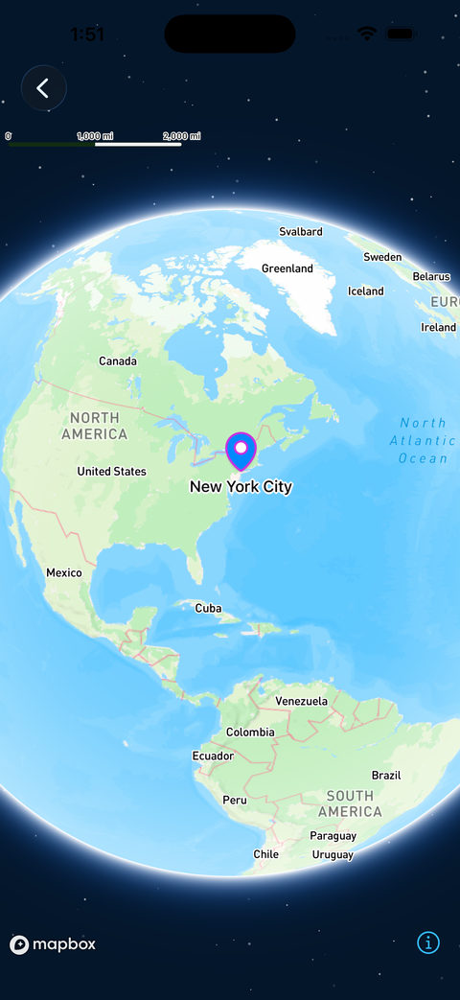

# Swift로 이해하는 Mapbox 기본 마커

> **면접 답변 한 줄 요약:** Marker는 SwiftUI에서 이미지 파일을 직접 준비하지 않고 좌표에 기본 핀을 표시하는 간편 API이며, 현재 실험적 기능이라는 제약을 함께 고려해야 해요.

공식 [Markers](https://docs.mapbox.com/ios/maps/guides/add-your-data/markers/)에 대응해요. “오늘 픽업할 매장 하나를 표시한다”는 작은 화면으로 시작해요.

## 먼저 알아둘 용어

| 용어       | 쉬운 뜻                                                                                            |
| ---------- | -------------------------------------------------------------------------------------------------- |
| Marker     | 기본 디자인을 제공하는 지도 핀이에요.                                                              |
| SwiftUI    | 상태에 맞춰 화면을 선언하는 Apple 프레임워크예요.                                                  |
| SPI        | 일반 공개 API와 구분되는 인터페이스예요. 여기서는 실험적 기능을 사용하기 위해 명시적으로 가져와요. |
| MapContent | Mapbox 지도 안에 선언할 수 있는 콘텐츠의 규약이에요.                                               |

## 버전 조건부터 확인해요

확인한 [공식 가이드](https://docs.mapbox.com/ios/maps/guides/add-your-data/markers/)는 `@_spi(Experimental) import MapboxMaps`를 요구해요. SwiftUI 전용이며 UIKit용 기본 Marker API로 설명하지 않아요.

실험적 API를 채택하면 SDK 업데이트 때 다시 검토해야 해요. 이 예제는 Mapbox SDK 11.29.1 기준의 학습 코드이며, 일반 공개 API만 허용하는 프로젝트라면 [Annotation](./annotations.md)을 먼저 검토해요.

## 이미지 없이 픽업 장소를 표시해요

다음은 상태로 마커 표시를 제어하는 작성 예제예요. 토큰 설정과 SDK 설치는 [설치](../install.md)를 먼저 마쳐야 해요.

```swift
import CoreLocation
import SwiftUI
@_spi(Experimental) import MapboxMaps

struct PickupMarkerMap: View {
    @State private var showPickup = true

    private let pickup = CLLocationCoordinate2D(
        latitude: 37.5665,
        longitude: 126.9780
    )

    var body: some View {
        VStack {
            Map(initialViewport: .camera(center: pickup, zoom: 14)) {
                if showPickup {
                    Marker(coordinate: pickup)
                        .color(.orange)
                        .innerColor(.white)
                        .stroke(nil)
                        .text("픽업")
                }
            }

            Toggle("픽업 장소 표시", isOn: $showPickup)
                .padding()
        }
    }
}
```

`showPickup`을 끄면 선언에서 마커가 빠져요. 토글할 때마다 새 지도 화면을 만드는 대신, 화면 상태가 무엇을 표시할지 결정하게 했어요.

## 커스터마이징 범위를 좁게 이해해요

색, 테두리, 내부 색과 텍스트를 바꿀 수 있어요. 이미지 자산을 요구하지 않는 편리함이 장점이지만, 복잡한 카드 레이아웃까지 제공하는 기능은 아니에요. [Markers 가이드](https://docs.mapbox.com/ios/maps/guides/add-your-data/markers/)



_Marker 하나에서도 외부 색·내부 색·테두리·텍스트를 조합할 수 있지만, 사진과 버튼이 있는 카드가 되는 것은 아니에요. [공식 Markers에서 커스터마이징 이미지 보기](https://docs.mapbox.com/ios/maps/guides/add-your-data/markers/)_

여러 마커는 `ForEvery`로 구성할 수 있어요. 이때 매장 ID는 데이터가 갱신되어도 같은 매장을 가리켜야 해요. 화면을 다시 계산할 때마다 `UUID()`를 생성하는 방식은 피하는 편이 좋아요.

## 요구 사항이 늘어나면 책임을 나눠요

다음은 선택을 위한 설계 제안이에요.

- 브랜드 전용 이미지가 필요해지면 Point Annotation을 검토해요.
- 카드에 예약 버튼을 넣으려면 선택한 매장만 View Annotation으로 보여줘요.
- 수많은 지점의 색과 크기를 공통 규칙으로 바꾸려면 Style Layer를 검토해요.

공식 문서는 많은 Marker가 성능에 부담을 줄 수 있다고 안내해요. 특정 개수를 절대 한계로 외우기보다 실제 기기에서 밀집 지역과 업데이트 상황을 측정해요.

## 적용 체크리스트

- [ ] 실험적 API 채택이 프로젝트 정책에 맞나요?
- [ ] MapKit의 같은 이름 타입과 혼동하지 않나요?
- [ ] 표시 상태를 바꿔도 지도 자체를 다시 만들지 않나요?
- [ ] 긴 텍스트와 겹치는 좌표를 확인했나요?
- [ ] 데이터가 늘어날 때 비교할 대안을 정했나요?

## 면접에서 이어질 수 있는 질문

### PointAnnotation과 가장 큰 차이는 무엇인가요?

Marker는 기본 핀 디자인을 바로 쓸 수 있어요. 직접 준비한 이미지와 세밀한 표시 요구가 생기면 PointAnnotation이 더 적합할 수 있어요.

### SPI를 import하면 안정성이 보장되나요?

아니요. 접근할 수 있게 만드는 것과 장기적인 API 안정성은 다른 문제예요. 버전을 고정하고 변경 사항을 검토해야 해요.

### 표시 여부를 별도 제거 명령으로 관리해야 하나요?

이 SwiftUI 예제에서는 조건부 선언으로 관리해요. 표시 상태와 실제 화면이 따로 움직이지 않도록 한곳에서 결정하는 것이 목적이에요.

## 참고 자료

- [Mapbox — Markers](https://docs.mapbox.com/ios/maps/guides/add-your-data/markers/)
