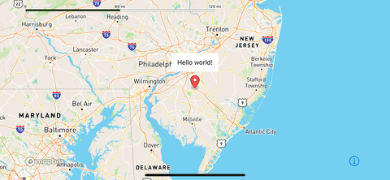
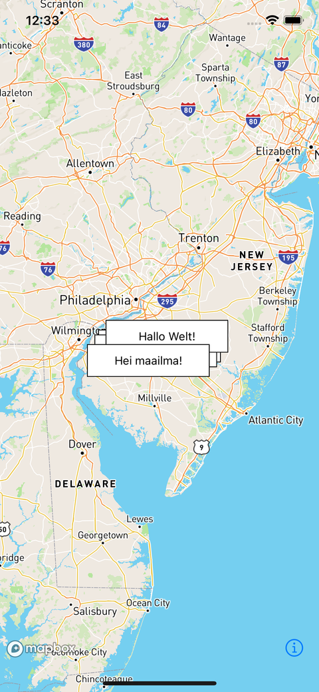
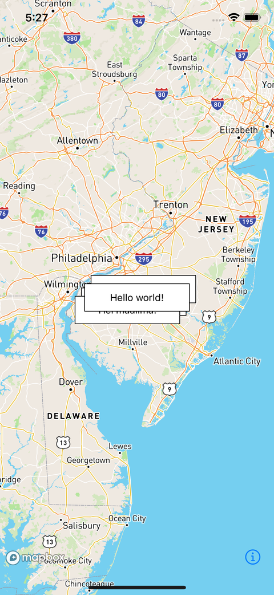

# Swift로 이해하는 Mapbox 뷰 어노테이션

> **면접 답변 한 줄 요약:** View Annotation은 실제 SwiftUI·UIKit 뷰를 지도 위치에 연결해 상세 카드나 버튼을 보여주는 기능이며, 지도 데이터와 화면 뷰의 수명을 따로 관리해야 해요.

공식 [View annotations](https://docs.mapbox.com/ios/maps/guides/add-your-data/view-annotations/)에 대응해요. 선택한 매장의 픽업 안내 카드 하나를 만드는 예제로 읽어봐요.

## 먼저 알아둘 용어

| 용어             | 쉬운 뜻                                           |
| ---------------- | ------------------------------------------------- |
| View Annotation  | 지도 위에 배치하는 실제 화면 뷰예요.              |
| Anchor           | 좌표에 뷰의 어느 쪽을 맞출지 정하는 기준점이에요. |
| Priority         | 뷰들이 겹칠 때 표시 순서에 사용하는 우선순위예요. |
| AnnotatedFeature | 뷰를 연결할 지도 Feature를 지정하는 값이에요.     |

## 모든 매장을 카드로 만들 필요는 없어요

작성 예제에서는 매장 목록은 지도 데이터로 두고, 선택된 매장만 카드로 보여줘요. 선택 해제는 카드 제거를 뜻하고, 전체 매장 데이터 삭제를 뜻하지 않아요.

이 구조는 카드의 버튼·문구 변경이 전체 매장 표시 방식에 영향을 주지 않도록 하기 위한 설계 제안이에요.



_지도 내부의 Point Annotation은 위치 표시를, 실제 뷰인 View Annotation은 팝업 내용을 맡을 수 있어요. [공식 View annotations에서 연결 예시 보기](https://docs.mapbox.com/ios/maps/guides/add-your-data/view-annotations/)_

## SwiftUI 카드에 버튼을 넣어요

`MapViewAnnotation`의 콘텐츠는 일반 SwiftUI 뷰예요. 다음 화면은 카드 버튼으로 상세 정보를 여는 동작을 연습해요. 반투명 배경 표현을 위해 iOS 15 이상을 사용해요.

```swift
import CoreLocation
import MapboxMaps
import SwiftUI

@available(iOS 15.0, *)
struct PickupCardMap: View {
    @State private var showDetails = false

    private let pickup = CLLocationCoordinate2D(
        latitude: 37.5665,
        longitude: 126.9780
    )

    var body: some View {
        Map(initialViewport: .camera(center: pickup, zoom: 15)) {
            MapViewAnnotation(coordinate: pickup) {
                Button {
                    showDetails = true
                } label: {
                    VStack(alignment: .leading) {
                        Text("시청점 픽업")
                            .font(.headline)
                        Text("준비 완료 · 상세 보기")
                            .font(.caption)
                    }
                    .padding(12)
                    .background(.regularMaterial, in: RoundedRectangle(cornerRadius: 12))
                }
            }
            .priority(10)
            .variableAnchors([
                ViewAnnotationAnchorConfig(anchor: .bottom),
                ViewAnnotationAnchorConfig(anchor: .top)
            ])
        }
        .sheet(isPresented: $showDetails) {
            Text("픽업 주문 상세")
                .padding()
        }
    }
}
```

카드의 선택 동작은 SwiftUI 상태를 바꿔요. 좌표를 지도 화면의 고정된 픽셀 위치로 직접 환산하지 않아요.

## UIKit에서는 뷰와 Annotation을 함께 관리해요

다음은 UILabel 기반 카드를 추가하는 작성 예제예요. 반환한 Annotation을 화면 소유자가 보관하고, 이후 숨김·제거에 사용해요.

```swift
import CoreLocation
import MapboxMaps
import UIKit

/// 픽업 안내 라벨을 지도 좌표에 연결해요.
/// - Parameters:
///   - mapView: 카드를 올릴 지도예요.
///   - coordinate: 카드를 연결할 위치예요.
/// - Returns: 표시 상태와 수명을 관리할 뷰 어노테이션이에요.
@MainActor
func addPickupCard(
    to mapView: MapView,
    coordinate: CLLocationCoordinate2D
) -> ViewAnnotation {
    let label = UILabel()
    label.text = "시청점 · 픽업 준비 완료"
    label.numberOfLines = 0
    label.backgroundColor = .secondarySystemBackground
    label.sizeToFit()

    let annotation = ViewAnnotation(coordinate: coordinate, view: label)
    annotation.priority = 10
    mapView.viewAnnotations.add(annotation)
    return annotation
}
```

텍스트 길이가 바뀌면 `setNeedsUpdateSize()`로 배치 크기 갱신을 요청해요. 숨길 때는 뷰의 `isHidden`을 직접 바꾸지 않고 Annotation의 `visible`을 사용해요. [크기와 가시성 규칙](https://docs.mapbox.com/ios/maps/guides/add-your-data/view-annotations/#handle-content-size-updates)

## 배치와 데이터 선택은 별개의 규칙이에요

공식 가이드는 높은 `priority`가 앞에 표시되고, 같은 값이면 추가 순서를 따른다고 설명해요. 여러 앵커를 주면 적절한 위치를 선택할 수 있어요. 뷰 자체는 지도와 함께 회전·기울기·확대되지 않아요. [배치 규칙](https://docs.mapbox.com/ios/maps/guides/add-your-data/view-annotations/#customize-the-appearance)

| 같은 우선순위에서 추가 순서 사용                                                       | 선택 항목을 위로 표시                                                                     |
| -------------------------------------------------------------------------------------- | ----------------------------------------------------------------------------------------- |
|  |  |

_겹침을 없애는 것과 어떤 뷰를 앞에 둘지는 다른 문제예요. 선택 상태와 `priority`를 화면 정책에 맞게 연결해요. [공식 배치 규칙에서 비교 이미지 보기](https://docs.mapbox.com/ios/maps/guides/add-your-data/view-annotations/#customize-the-appearance)_

Feature에 연결하면 해당 표시와 가시성을 연동할 수 있지만, 예약 상태나 선택 해제 같은 앱의 업무 규칙까지 자동으로 처리하는 것은 아니에요.

## 적용 체크리스트

- [ ] 카드가 필요한 선택 항목만 뷰로 만들었나요?
- [ ] 화면 가장자리와 큰 글자 설정에서 카드가 읽히나요?
- [ ] 긴 문구로 바뀐 후 크기를 갱신했나요?
- [ ] 카드 버튼과 지도 제스처가 충돌하지 않나요?
- [ ] 화면 종료 시 카드와 비동기 작업을 함께 정리하나요?

## 면접에서 이어질 수 있는 질문

### 클러스터링이 자동으로 적용되나요?

아니요. View Annotation에는 기본 클러스터링이 없어요. 많은 지점과 선택된 카드의 표시 책임을 나누는 방법을 검토해요.

### 우선순위를 높이면 어떤 위치에서도 보이나요?

아니요. 순서와 가시성은 달라요. 화면 경계, 충돌, 연결한 Feature의 표시 상태도 함께 살펴야 해요.

### UILabel을 숨기기만 하면 왜 부족한가요?

SDK의 배치 계산과 뷰 상태가 달라질 수 있어요. 제공하는 Annotation 가시성 API로 같은 상태를 유지해요.

## 참고 자료

- [Mapbox — View annotations](https://docs.mapbox.com/ios/maps/guides/add-your-data/view-annotations/)
