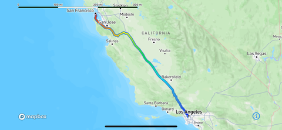

# Swift로 이해하는 Mapbox Viewport

> **면접 답변 한 줄 요약:** Viewport는 사용자 추적이나 경로 전체 보기 같은 카메라의 목표를 상태로 표현하고, 그 상태 사이의 전환과 카메라 제어권을 관리해요.

공식 [Viewport](https://docs.mapbox.com/ios/maps/guides/camera-and-animation/viewport/)에 대응해요. 아래에서는 걷기 화면의 “내 위치”와 “지도 직접 탐색”을 구분하는 학습 예제를 만들어요.

## 먼저 알아둘 용어

| 용어   | 쉬운 뜻                                                       |
| ------ | ------------------------------------------------------------- |
| Puck   | 지도에 사용자 위치를 그리는 표시예요.                         |
| 상태   | 카메라가 지금 수행할 동작 목표예요.                           |
| 전환   | 기존 상태를 끝내고 새 상태를 적용하는 과정이에요.             |
| idle   | Viewport가 카메라를 자동으로 갱신하지 않는 상태예요.          |
| 바인딩 | 화면과 지도 양쪽에서 상태 변경을 주고받는 SwiftUI 연결이에요. |

`ViewportManager`는 추적과 geometry 전체 보기 상태를 제공해요. 상태는 실행 중·전환 중·idle로 구분하며 다른 카메라 API를 사용할 때는 idle로 제어권을 넘기는 편이 좋아요. 즉시 전환과 기본 애니메이션 전환도 제공해요. [공식 가이드](https://docs.mapbox.com/ios/maps/guides/camera-and-animation/viewport/)



_Idle은 자동 카메라 갱신을 멈춘 상태이고, Overview와 FollowPuck은 각각 전체 보기와 위치 추적이라는 목표를 가져요. [공식 Viewport에서 상태 도식 보기](https://docs.mapbox.com/ios/maps/guides/camera-and-animation/viewport/)_

## 위치마다 직접 이동하면 사용자와 경쟁해요

사용자가 주변 골목을 살펴보려고 지도를 드래그했는데 다음 위치 갱신이 지도를 다시 본인에게 옮긴다고 생각해 보세요. 센서 데이터가 맞더라도 화면은 불편해요.

이 학습 화면은 다음 정책을 사용해요.

- 처음에는 일반 탐색 상태로 시작해요.
- 사용자가 “내 위치 따라가기”를 눌렀을 때 추적해요.
- 사용자가 탐색을 시작하면 자동으로 되돌리지 않아요.
- 추적 재시작은 다시 누른 버튼을 기준으로 해요.

## SwiftUI에서 추적 의도를 상태로 표현해요

위치 권한과 `Info.plist` 설정은 [사용자 위치](../user-location.md)를 먼저 확인하세요. 이 예제는 권한 거부 안내를 포함한 완성 앱이 아니라 추적 상태의 연결에 집중해요.

```swift
import MapboxMaps
import SwiftUI

struct WalkingViewportMap: View {
    @State private var viewport: Viewport = .styleDefault

    var body: some View {
        VStack {
            Map(viewport: $viewport) {
                Puck2D(bearing: .heading)
            }
            HStack {
                Button("내 위치 따라가기") {
                    withViewportAnimation(.default(maxDuration: 1)) {
                        viewport = .followPuck(zoom: 15, bearing: .heading)
                    }
                }
                Button("직접 탐색") {
                    viewport = .idle
                }
            }
        }
    }
}
```

SwiftUI 지도에서는 사용자의 드래그가 바인딩된 Viewport를 idle로 바꿔요. 따라서 버튼을 누른 사실만 별도 Boolean으로 영구 저장해 “추적 중”이라고 표시하지 않아요. 실제 상태를 함께 반영하는 UI가 필요해요. [SwiftUI 가이드](https://docs.mapbox.com/ios/maps/guides/swift-ui/)

## UIKit에서는 추적 상태와 전환을 따로 만들어요

다음 함수는 이미 표시 중인 지도에서 호출해요. 위치 표시와 권한 설정은 호출 전에 준비되어 있어야 해요.

```swift
import MapboxMaps
import UIKit

/// 사용자가 요청했을 때 위치 추적을 시작해요.
/// - Parameter mapView: 위치 접근과 Puck 설정을 마친 지도예요.
@MainActor
func beginWalkingFollow(
    on mapView: MapView
) {
    let follow = mapView.viewport.makeFollowPuckViewportState(
        options: FollowPuckViewportStateOptions(
            zoom: 15,
            bearing: .heading,
            pitch: 0
        )
    )
    mapView.viewport.transition(to: follow)
}

/// 자동 갱신을 멈추고 사용자 탐색에 제어권을 넘겨요.
/// - Parameter mapView: 추적을 끝낼 지도예요.
@MainActor
func stopWalkingFollow(
    on mapView: MapView
) {
    mapView.viewport.idle()
}
```

앱이 경로 전체 보기 버튼도 제공한다면 목표 geometry를 가진 overview 상태를 사용해요. 상태의 이름을 버튼 이름처럼 늘리기보다 “좌표 고정·추적·전체 보기 중 어떤 카메라 동작이 필요한가?”로 분류해 보세요.

## 관찰자와 데이터 공급원의 수명을 정해요

Viewport의 상태 관찰자는 manager가 강하게 보관하므로 사용이 끝나면 제거해야 해요. 알림은 메인 큐에 비동기로 전달되므로 수신 시점에는 상태가 더 바뀌었을 수 있어요. 사용자 정의 상태는 불필요한 데이터 공급원을 오래 살려 두지 않아요. [공식 가이드](https://docs.mapbox.com/ios/maps/guides/camera-and-animation/viewport/)

설계할 때에는 “화면이 사라졌지만 위치 공급원이나 관찰자가 여전히 동작하는가?”를 확인하세요. 특히 관찰자 → 화면 → 지도 → 관찰자 관계가 생기지 않는지 점검해요. 이 예제는 관찰자를 등록하지 않으므로 별도 등록 해제 코드도 없어요.

## 적용 순서를 정리해요

1. 추적을 시작하는 명시적인 사용자 행동을 정해요.
2. 권한 거부와 위치 대기 상태의 대체 화면을 준비해요.
3. 현재 값 설정과 지속 추적을 구분해요.
4. 직접 카메라를 설정하기 전에 자동 제어를 멈춰요.
5. 화면 종료 시 관찰자와 사용자 정의 공급원의 수명을 확인해요.

## 면접에서 이어질 수 있는 질문

### Puck을 표시하면 자동으로 따라가나요?

아니요. 사용자 위치 표현과 카메라 추적은 서로 다른 기능이에요. 추적 상태를 별도로 선택해요.

### idle이면 지도를 움직일 수 없나요?

아니요. Viewport의 자동 갱신이 멈춘 것이에요. 사용자 탐색이나 다른 카메라 제어가 가능해요.

### 상태 알림 값이 곧 현재 상태인가요?

알림이 전달되는 동안 상태가 바뀔 수 있어요. 후속 작업을 시작하기 전 현재 요구와 일치하는지 확인하는 설계가 필요해요.

## 참고 자료

- [Mapbox Viewport](https://docs.mapbox.com/ios/maps/guides/camera-and-animation/viewport/)
- [Mapbox SwiftUI](https://docs.mapbox.com/ios/maps/guides/swift-ui/)
