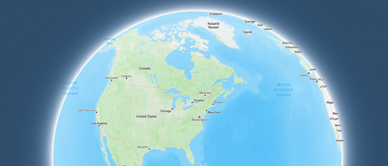
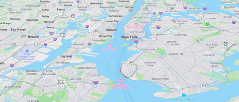
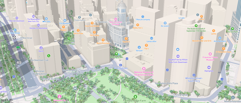

# Mapbox 렌더링 성능 통계

> **면접 답변 한 줄 요약:** PerformanceStatistics는 지도 렌더링의 시간과 자원 지표를 모아 변경 전후를 비교하는 실험용 API이며, 앱 전체 성능이나 제공되지 않는 값을 대신 설명하지는 않아요.

라벨을 추가한 뒤 지도가 무거워졌다면 “메모리가 좀 늘었다”보다 어느 렌더링 작업이 얼마나 변했는지 확인하는 편이 좋아요. 이 페이지는 통계를 켜는 방법과 숫자를 과하게 해석하지 않는 기준을 다뤄요.

## 먼저 알아둘 용어

| 용어       | 쉬운 뜻                                            |
| ---------- | -------------------------------------------------- |
| Frame      | 화면을 한 번 그리는 단위예요.                      |
| Sampler    | 어떤 종류의 측정값을 모을지 정하는 설정이에요.     |
| Median     | 값들을 순서대로 놓았을 때 가운데에 있는 값이에요.  |
| Cumulative | 수집 구간의 자원 상태 등을 표현하는 통계 종류예요. |
| Metal      | Apple 플랫폼에서 그래픽을 처리하는 API예요.        |

## 설정 시간과 결과 시간을 구분해요

공식 가이드는 `.perFrame`과 `.cumulative` 수집을 제공하며, 모니터링이 오버헤드를 만들 수 있다고 설명해요. 호출 옵션의 `samplingDurationMillis`는 수집 간격 설정이고, 결과의 `collectionDurationMillis`는 실제 수집 구간을 설명하는 값이에요. 두 이름을 바꿔 쓰지 마세요. [공식 성능 통계](https://docs.mapbox.com/ios/maps/guides/debugging-and-profiling/performance-stats/)

`11.29.1` 소스는 수집 간격 0이면 매 프레임 수집하고, 음수는 유효하지 않다고 명시해요. 처음에는 몇 초 단위의 구간으로 시작해 필요한 범위만 줄이는 편이 좋아요. [통계 옵션 구현](https://github.com/mapbox/mapbox-maps-ios/blob/11.29.1/Sources/MapboxMaps/Foundation/PerformanceStatisticsOptions.swift)

## UIKit 지도에서 수집 수명을 소유해요

아래는 5초 구간 통계를 받는 개발용 도구예요. 실험용 인터페이스를 사용하므로 `@_spi(Experimental)` import가 필요해요.

```swift
@_spi(Experimental) import MapboxMaps

@MainActor
final class MapPerformanceProbe {
    private var observation: AnyCancelable?

    /// 기존 지도의 렌더링 통계를 5초 구간으로 수집합니다.
    /// - Parameter map: 측정할 지도 객체입니다.
    func start(
        map: MapboxMap
    ) {
        stop()
        let options = PerformanceStatisticsOptions(
            [.perFrame, .cumulative],
            samplingDurationMillis: 5_000
        )
        observation = map.collectPerformanceStatistics(options) { value in
            print("지도 렌더링 시간:", value.mapRenderDurationStatistics)
        }
    }

    func stop() {
        observation?.cancel()
        observation = nil
    }
}
```

개발 도구의 소유 객체가 `MapPerformanceProbe`를 보관하고, 측정 종료 때 `stop()`을 호출해요. 반환 핸들의 취소는 수집을 중단하는 API 계약이에요. 로그 출력을 실제 측정 파일 저장으로 바꿀 때도 매 프레임 UI 갱신은 피하세요. [수집 API 구현](https://github.com/mapbox/mapbox-maps-ios/blob/11.29.1/Sources/MapboxMaps/Foundation/MapboxMap.swift)

## 제공되지 않은 값은 0이 아니에요

오래된 가이드 예제에는 `textureBytes`와 `vertexBytes` 숫자가 나오지만, `11.29.1` 구현 주석은 **Metal 렌더러에서는 두 값이 nil**이라고 명시해요. nil을 0으로 바꾸면 “GPU 자원 사용이 없다”는 잘못된 차트를 만들어요. [현행 지표 정의](https://github.com/mapbox/mapbox-maps-ios/blob/11.29.1/Sources/MapboxMaps/Foundation/PerformanceStatisticsOptions.swift)

아래는 통계 화면의 표시 정책을 검증하는 독립적인 Swift 예제예요.

```swift
/// 지원하지 않는 메모리 지표를 0과 구분해 표시합니다.
/// - Parameter bytes: SDK가 제공한 바이트 값이며 nil이면 값이 제공되지 않았습니다.
/// - Returns: 화면에 표시할 측정값 또는 미제공 안내입니다.
func memoryMetricText(
    bytes: UInt?
) -> String {
    guard let bytes else { return "측정값 미제공" }
    return "\(bytes) bytes"
}

assert(memoryMetricText(bytes: nil) != memoryMetricText(bytes: 0))
```

`.cumulative`를 켰다고 모든 환경에서 모든 자원값이 채워지는 것은 아니에요. 앱 전체 메모리 조사는 별도 도구와 함께 해야 해요.

## 같은 카메라에서 변경 전후를 비교해요

다음은 작성자 실험 설계예요. 예시 숫자는 실제 Mapbox 벤치마크 결과가 아니에요.

| 실험 | 고정할 조건                       | 바꿀 조건                         |
| ---- | --------------------------------- | --------------------------------- |
| 기준 | 같은 기기·카메라 이동·스타일 기반 | 매장 라벨이 없는 상태예요.        |
| 변경 | 기준과 같은 입력·수집 구간        | 매장 라벨만 추가해요.             |
| 개선 | 같은 입력과 라벨 데이터           | 특정 확대에서만 라벨을 보여 줘요. |

| 낮은 Feature 밀도                                                             | 도시 전경                                                               | 3D 객체가 많은 거리                                                                |
| ----------------------------------------------------------------------------- | ----------------------------------------------------------------------- | ---------------------------------------------------------------------------------- |
|  |  |  |

_공식 가이드는 장면 복잡도가 다른 세 카메라를 예시로 들어 수집 결과의 맥락을 보여 줘요. 비교할 때는 장면뿐 아니라 기기·스타일·캐시·수집 구간도 고정하세요. [공식 Performance Statistics에서 비교 장면 보기](https://docs.mapbox.com/ios/maps/guides/debugging-and-profiling/performance-stats/)_

중앙값이 줄어도 최악의 지연은 늘 수 있어요. 최댓값과 반복 실행의 분포도 함께 보세요. 지도 렌더링 구간의 역수만으로 사용자가 보는 실제 FPS를 확정하지 마세요. 앱의 다른 작업과 화면 표시 일정까지 모두 측정한 값이 아니에요.

## 적용 체크리스트

- [ ] 실험용 API와 SDK 버전을 기록했나요?
- [ ] 수집 간격을 0으로 설정할 필요가 정말 있나요?
- [ ] nil과 실제 0을 구분해서 표시하나요?
- [ ] 기기·카메라·캐시·수집 구간을 맞췄나요?
- [ ] 중앙값뿐 아니라 지연이 튀는 구간도 확인했나요?
- [ ] 종료 때 수집 핸들을 취소하고 최종 빌드에서 다시 확인했나요?

## 면접에서 이어질 수 있는 질문

### 수집 간격이 길면 프레임 정보가 없어지나요?

여러 프레임을 포함한 집계로 해석해야 해요. 한 프레임을 세밀하게 조사할지 일정 구간을 비교할지에 따라 수집 조건을 정해요.

### textureBytes가 nil이면 무엇을 뜻하나요?

해당 값이 제공되지 않았다는 뜻이에요. 특히 현행 Metal 구현의 제한을 확인하고 메모리 사용량 0으로 표시하지 않아야 해요.

### 통계가 좋아졌으면 개선이 끝났나요?

아니에요. 표시할 라벨을 지나치게 줄여 기능이 나빠졌을 수도 있어요. 측정값과 실제 지도 사용성을 함께 확인해야 해요.

## 참고 자료

- [Mapbox: Performance Statistics](https://docs.mapbox.com/ios/maps/guides/debugging-and-profiling/performance-stats/)
- [Mapbox 11.29.1: PerformanceStatisticsOptions](https://github.com/mapbox/mapbox-maps-ios/blob/11.29.1/Sources/MapboxMaps/Foundation/PerformanceStatisticsOptions.swift)
- [Mapbox 11.29.1: MapboxMap](https://github.com/mapbox/mapbox-maps-ios/blob/11.29.1/Sources/MapboxMaps/Foundation/MapboxMap.swift)
