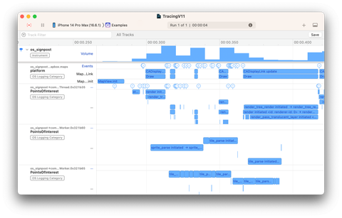

# Mapbox Tracing과 Instruments 분석

> **면접 답변 한 줄 요약:** Mapbox Tracing은 지도 엔진과 화면 상호작용의 사건을 signpost로 남겨, Instruments 시간축에서 느린 구간과 겹친 작업을 조사하게 해요.

“화면이 뜨는 데 2초”라는 값은 시작과 끝 사이에서 무엇이 일어났는지 설명하지 않아요. Tracing은 타일 처리, 렌더링과 상호작용의 순서를 살피는 도구예요.

## 먼저 알아둘 용어

| 용어        | 쉬운 뜻                                                |
| ----------- | ------------------------------------------------------ |
| Instruments | Apple의 실행 시간·자원 사용 분석 앱이에요.             |
| Signpost    | 사건이나 구간을 시간축에서 찾도록 남기는 표식이에요.   |
| core        | MapView·Snapshotter 등의 렌더링 엔진 쪽 추적 범위예요. |
| platform    | 제스처·애니메이션·뷰 주석 등 SDK의 플랫폼 쪽 범위예요. |
| Scheme      | Xcode에서 실행·테스트·프로파일 환경을 묶은 설정이에요. |

## 조사 목적에 맞게 추적을 켜요

공식 API는 `Tracing.status = .enabled`로 전체 추적을, `.platform`으로 해당 범위의 추적을 켜요. 환경 변수 `MAPBOX_MAPS_SIGNPOSTS_ENABLED`도 사용할 수 있으며, **코드 설정이 환경 변수보다 우선**해요. [공식 Tracing 가이드](https://docs.mapbox.com/ios/maps/guides/debugging-and-profiling/tracing/)

다음은 진단 빌드에서만 호출할 작은 설정 함수예요. 여러 화면이 전역 설정을 제각각 덮어쓰지 않도록 앱의 진단 진입점 한 곳에서 호출하는 편이 좋아요.

```swift
import MapboxMaps

@MainActor
func enableMapInteractionTracing() {
    Tracing.status = .platform
}

@MainActor
func disableMapTracing() {
    Tracing.status = .disabled
}
```

함수를 만들었다고 자동 실행되지는 않아요. 진단 실행의 시작·종료 지점에서 명시적으로 호출하세요. 지도 초기 로딩을 조사한다면 지도 생성 전에 켜야 필요한 시작 구간을 놓치지 않아요.

## 코드를 바꾸지 않고 Profile 환경을 설정할 수도 있어요

Scheme의 **Profile** 동작에 전달되는 환경 변수를 확인해 다음 값을 설정해요. Xcode 버전에 따라 Run 설정을 상속하는지, Profile에 직접 설정하는지 UI가 다를 수 있어요.

```text
이름: MAPBOX_MAPS_SIGNPOSTS_ENABLED
값: core,platform
```

`1`은 전체 활성화, `0` 또는 `disabled`는 비활성화예요. `DEBUG` 조건 안에만 코드 설정을 넣으면 Release 기반 Profile 실행에서 빠질 수 있으므로, 실제 프로파일 프로세스에 설정이 전달되는지 확인하세요. [Tracing 설정 구현](https://github.com/mapbox/mapbox-maps-ios/blob/11.29.1/Sources/MapboxMaps/Foundation/Tracing.swift)

## Instruments에서 짧은 재현 구간을 기록해요

공식 가이드의 기본 흐름은 Xcode **Product → Profile** 실행 후 빈 템플릿에 `os_signpost` 도구를 추가하는 방식이에요. 도구 명칭과 UI 배치는 Xcode 버전에 따라 확인하세요. 사건이 많을 때는 원문이 권하는 **Last N seconds** 같은 시간 창 기록 모드를 검토해요. [공식 기록 절차](https://docs.mapbox.com/ios/maps/guides/debugging-and-profiling/tracing/)

다음은 산책 지도 진입 지연을 조사하는 작성자 절차예요.

1. 지도 화면이 없는 앱 시작 지점에서 기록을 시작해요.
2. 지도 화면에 진입하고 정해 둔 이동 한 번을 실행해요.
3. 기록을 멈추고 해당 시간 구간을 확대해요.
4. 지도 로딩·렌더링 표식과 앱 작업이 겹치는지 살펴봐요.
5. 같은 입력을 다시 실행해 특정 구간이 반복되는지 확인해요.

관련 표식이 없으면 곧바로 “SDK에서 작업하지 않았다”고 판단하지 마세요. 설정 대상 프로세스, 추적 범위, 기록 시작 시점과 이벤트 누락 가능성을 먼저 확인해야 해요.



_각 행의 구간은 core·platform 사건이 언제 시작되고 끝났는지 보여 줘요. 겹친 구간을 단순 합산하기보다 같은 시간대의 관계를 살펴봐요. [공식 Tracing에서 Instruments 캡처와 기록 절차 보기](https://docs.mapbox.com/ios/maps/guides/debugging-and-profiling/tracing/)_

## 합계와 시간축은 서로 다른 질문에 답해요

```text
0ms           100ms             200ms
앱 준비       [---------]
스타일 요청       [------------------]
화면 갱신                 [------]
```

이 도식은 실제 Mapbox 기록이 아닌 설명용 예시예요. 겹치는 구간의 길이를 모두 더하면 사용자가 기다린 전체 시간보다 커질 수 있어요. 각 표식이 같은 스레드인지, 어떤 작업의 시작·끝인지 확인한 뒤 해석하세요.

Tracing은 사건의 위치를 찾는 출발점이지, CPU 사용률이나 모든 네트워크 대기 원인을 자동으로 확정하는 도구는 아니에요. 필요한 경우 [성능 통계](./performance-stats.md)와 앱의 다른 Instruments 측정을 연결해요.

## 적용 체크리스트

- [ ] 앱 진입 전에 필요한 추적 설정이 적용됐나요?
- [ ] Run과 Profile 환경을 혼동하지 않았나요?
- [ ] 환경 변수를 코드가 덮어쓰지 않나요?
- [ ] 필요한 core·platform 범위만 선택했나요?
- [ ] 표식이 없을 때 수집 누락부터 확인했나요?
- [ ] 종료 후 진단 설정을 끄고 최종 구성을 검증했나요?

## 면접에서 이어질 수 있는 질문

### PerformanceStatistics와 무엇이 다른가요?

통계는 일정 구간의 비용 비교에, Tracing은 사건의 시간상 위치와 겹침 분석에 유용해요. 비용이 늘어난 구간을 통계로 찾고 시간축으로 좁힐 수 있어요.

### 환경 변수를 켰는데 왜 표식이 없을 수 있나요?

다른 실행 동작에만 변수를 설정했거나 코드가 설정을 덮어썼을 수 있어요. 추적 대상과 시작 시점도 점검해야 해요.

### 표식 시간을 모두 더하면 사용자 대기 시간인가요?

아니에요. 비동기로 겹치는 구간을 합산하면 중복 계산할 수 있어요. 관찰하려는 시작·끝과 작업 관계를 먼저 정해야 해요.

## 참고 자료

- [Mapbox: Tracing](https://docs.mapbox.com/ios/maps/guides/debugging-and-profiling/tracing/)
- [Mapbox 11.29.1: Tracing 구현](https://github.com/mapbox/mapbox-maps-ios/blob/11.29.1/Sources/MapboxMaps/Foundation/Tracing.swift)
