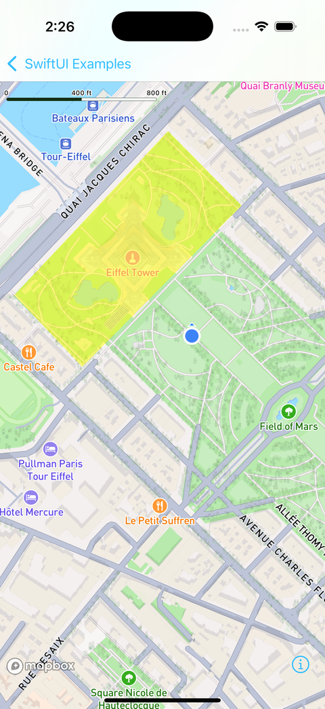
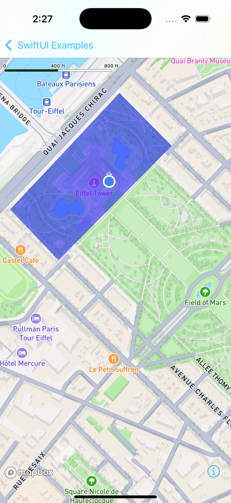
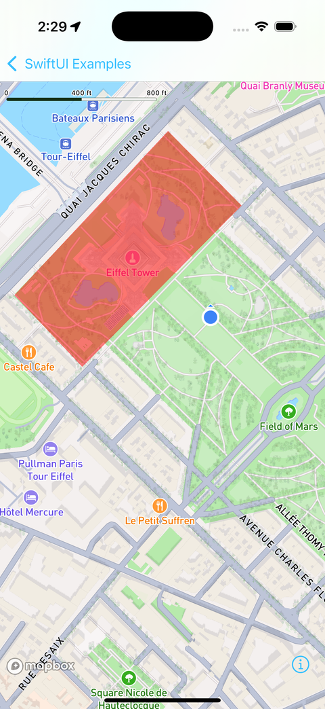

# Mapbox 지오펜싱과 영역 이벤트

> **면접 답변 한 줄 요약:** 지오펜싱은 지도 위의 가상 경계를 기준으로 기기의 진입·이탈·체류를 관찰해 앱이 후속 동작을 결정하게 하는 기능이에요.

공식 [Geofencing](https://docs.mapbox.com/ios/maps/guides/geofencing/)에 대응해요. 위치 관찰을 시작하기 전에 목적, 사용자 동의와 서비스 이용 조건을 확인해요.

## 먼저 알아둘 용어

| 용어            | 쉬운 뜻                                                  |
| --------------- | -------------------------------------------------------- |
| Geofence        | 관찰 대상이 되는 지리적 영역이에요.                      |
| GeoJSON Feature | 좌표·도형, 속성과 식별자를 가진 지도 데이터 한 건이에요. |
| Dwell           | 영역에 정해진 시간 동안 머무르는 상황이에요.             |
| Observer        | 서비스의 변화를 전달받는 객체예요.                       |

| 바깥                                                                 | 진입                                                                  | 이탈                                                                    |
| -------------------------------------------------------------------- | --------------------------------------------------------------------- | ----------------------------------------------------------------------- |
|  |  |  |
| 경계 밖에서 시작해요.                                                | 안으로 이동하면 진입 이벤트를 판단해요.                               | 다시 밖으로 나가면 이탈 이벤트를 판단해요.                              |

_세 이미지는 같은 영역을 기준으로 위치가 바뀌는 과정을 보여 줘요. 경계 근처의 오차와 반복 이벤트를 고려해 앱의 후속 정책을 따로 설계해야 해요. [공식 Geofencing에서 상태 이미지 보기](https://docs.mapbox.com/ios/maps/guides/geofencing/)_

## 영역 등록과 알림 발송을 구분해요

`GeofencingFactory.getOrCreate()`로 서비스를 얻고 구성·관찰자를 연결해요. `GeofencingObserver`는 진입·이탈·체류, 오류와 동의 변경을 받아요. 백그라운드 이벤트가 필요하면 그 용도에 맞는 위치 권한과 장기적인 관찰자 수명을 준비해야 해요.

이벤트를 받았다고 곧바로 할인 쿠폰이나 알림을 반복 발송하면 제품 문제가 생길 수 있어요. SDK는 영역 이벤트를 전달하고, 중복 방지·사용자 설정·알림 승인 확인은 앱 정책으로 분리하는 편이 좋아요.

## 영역은 안정적인 식별자로 관리해요

지원 도형은 Point·Polygon·MultiPolygon이에요. Point에는 반경 속성이 필요하고, 체류 이벤트에는 분 단위 체류 시간 속성이 필요해요. Feature에는 고유 문자열 ID를 두세요.

아래는 박물관 주변을 사각형으로 만든 학습용 데이터예요. GeoJSON 좌표 순서는 **경도, 위도**예요. 실제 경계나 출입 가능 구역을 의미하지 않아요.

```json
{
  "type": "Feature",
  "id": "museum-arrival",
  "properties": { "MBX_GEOFENCE_DWELL_TIME": 5 },
  "geometry": {
    "type": "Polygon",
    "coordinates": [
      [
        [126.97, 37.57],
        [126.98, 37.57],
        [126.98, 37.58],
        [126.97, 37.58],
        [126.97, 37.57]
      ]
    ]
  }
}
```

다음 등록 함수는 **이미 권한·서비스 구성·관찰자 연결을 마친 경우**를 전제로 해요. Swift 등록 API가 받는 `Turf.Feature`를 모듈 이름으로 구분했어요. 같은 이름인 `MapboxCommon.Feature`를 JSONDecoder로 디코딩하는 예제가 아니에요.

```swift
import Foundation
import MapboxCommon
import Turf

/// GeoJSON 데이터 한 건을 지오펜싱 서비스에 등록해요.
/// - Parameter data: 고유 문자열 ID가 있는 Feature의 UTF-8 JSON 데이터예요.
/// - Throws: JSON이 Feature 형식으로 디코딩되지 않을 때 발생해요.
func registerMuseumFence(
    data: Data
) throws {
    let feature = try JSONDecoder().decode(Turf.Feature.self, from: data)
    let service = GeofencingFactory.getOrCreate()
    service.addFeature(feature: feature) { result in
        switch result {
        case .success:
            print("영역 등록 완료")
        case .failure(let error):
            print("영역 등록 실패: \(error)")
        }
    }
}
```

`throws`는 동기 디코딩 실패만 전달해요. 서비스의 등록 성공은 콜백에서 확인해야 해요. 이 함수는 사용자 알림을 만들거나 관찰자의 수명을 관리하는 완성 앱이 아니에요.

## 추가·수정·제거의 의미를 나눠요

| 작업      | 서비스 API      | 앱이 확인할 점                           |
| --------- | --------------- | ---------------------------------------- |
| 등록·수정 | `addFeature`    | 같은 ID는 같은 영역의 갱신으로 취급해요. |
| 조회      | `getFeature`    | 화면의 로컬 상태와 등록 결과를 구분해요. |
| 제거      | `removeFeature` | 지정한 ID의 제거 결과를 확인해요.        |
| 전체 제거 | `clearFeatures` | 특정 화면 종료에 무심코 연결하지 않아요. |

화면을 닫는 일, 관찰을 중단하는 일과 모든 영역을 지우는 일은 서로 다른 사용자 의도예요. 공용 서비스라면 다른 화면이 관리하는 영역까지 지우지 않도록 소유 범위를 정하세요.

## 적용 체크리스트

- [ ] 위치 권한 거부와 동의 철회를 시험했나요?
- [ ] 경계 왕복 시 업무 처리가 중복되지 않나요?
- [ ] 체류 시간의 단위를 분으로 적용했나요?
- [ ] 백그라운드 동작과 재시작을 실기기에서 확인했나요?
- [ ] 원본 위치와 이벤트를 불필요하게 로그에 남기지 않나요?

## 면접에서 이어질 수 있는 질문

### 지도에 원을 그리면 지오펜싱이 되나요

아니에요. 지도 표현과 영역 이벤트 등록은 별개예요.

### 등록 함수가 반환되면 등록이 완료됐나요

아니에요. 비동기 콜백의 성공을 확인해야 해요.

### 진입 이벤트만으로 출석을 확정해도 되나요

그것은 앱의 정책 판단이에요. 오차와 권한 상태, 중복 이벤트를 고려하고 중요한 판정에는 추가 검증을 설계하세요.

## 참고 자료

- [Geofencing](https://docs.mapbox.com/ios/maps/guides/geofencing/)
- [GeofencingService](https://docs.mapbox.com/ios/maps/api/latest/documentation/mapboxcommon/geofencingservice/)
- [사용자 위치와 권한](./user-location.md)
