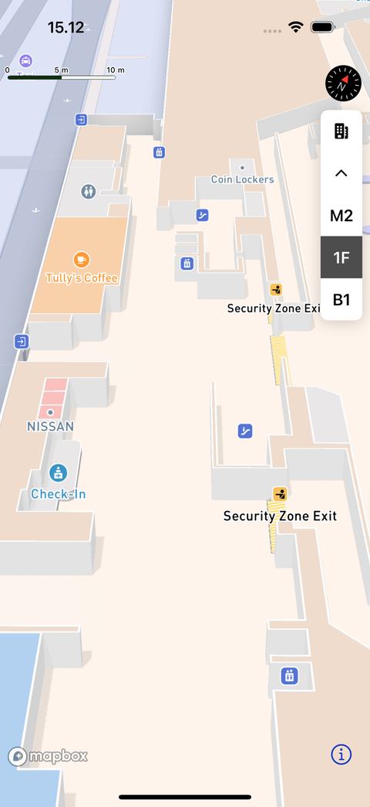

# Mapbox 실내 지도와 층 선택

> **면접 답변 한 줄 요약:** 실내 지도는 건물 내부의 층별 데이터를 표시하는 기능이며, 지도 설정과 층 선택 UI를 함께 구성해 사용자가 원하는 층을 탐색하게 해요.

공식 [Indoor mapping](https://docs.mapbox.com/ios/maps/guides/indoor/)에 대응해요.

:::warning 실험 API
확인일 기준 실내 지도 API는 Experimental이에요. `@_spi(Experimental)` import와 SDK 버전 고정, 업데이트 시 회귀 검토가 필요해요.
:::

## 먼저 알아둘 용어

| 용어        | 쉬운 뜻                                                  |
| ----------- | -------------------------------------------------------- |
| 실내 데이터 | 건물 안의 공간과 층 구성을 표현한 지도 자료예요.         |
| Ornament    | 지도 위에 배치되는 나침반·축척·층 선택 같은 보조 UI예요. |
| Signal      | 값이 바뀔 때 구독자에게 알려 주는 SDK 이벤트 통로예요.   |

## 데이터 표시와 층 선택은 별도 설정이에요

Standard의 실내 표현은 기본적으로 꺼져 있어요. `showIndoor`를 켜면 지원 데이터가 있는 건물과 적절한 확대 수준에서 표시돼요. 층 선택기는 `ornaments.options.indoorSelector`로 구성해요.



_지도 데이터가 제공되는 건물에서는 층별 공간과 층 선택기를 함께 보여 줄 수 있어요. 층 선택기가 보인다는 사실만으로 기기의 실제 층 위치가 확인되는 것은 아니에요. [공식 Indoor mapping에서 이미지와 조건 보기](https://docs.mapbox.com/ios/maps/guides/indoor/)_

다음 예제는 같은 스위치로 표현과 선택기를 함께 켜고 꺼요. 현재 앱의 카메라가 실내 데이터가 있는 지역을 바라보도록 하는 코드는 호출자가 담당해요.

```swift
import UIKit
@_spi(Experimental) import MapboxMaps

@MainActor
enum IndoorPresentation {
    /// Standard 실내 표현과 층 선택기의 표시를 함께 변경해요.
    /// - Parameters:
    ///   - enabled: 실내 지도와 층 선택을 사용할지 나타내요.
    ///   - map: 앱이 소유하는 지도 뷰예요.
    static func apply(
        enabled: Bool,
        to map: MapView
    ) {
        map.mapboxMap.mapStyle = .standard(showIndoor: enabled)
        map.ornaments.options.indoorSelector.visibility = enabled ? .visible : .hidden
        map.ornaments.options.indoorSelector.margins = CGPoint(x: 12, y: 72)
    }
}
```

이 코드는 Standard 스타일을 선택하는 예제예요. 기존 커스텀 스타일에 적용하는 범용 유틸리티로 사용하면 안 돼요. 커스텀 스타일은 어떤 import가 실내 설정을 제공하는지 먼저 확인하세요.

SwiftUI에서는 `Map().mapStyle(.standard(showIndoor: true))`처럼 표현을 선언하고, 앱의 `OrnamentOptions`도 함께 설정해요. UIKit과 SwiftUI 중 어느 방식이든 “실내 표현만 끔”과 “UI까지 숨김”을 구분해야 해요.

## 층 상태는 이벤트로 관찰해요

`mapboxMap.indoor.onIndoorUpdated`에서 층 목록과 `selectedFloorId`를 읽을 수 있어요. 구독 토큰은 관찰이 필요한 동안 보관하고 종료 시 해제해요. 층 ID를 화면에 복사한다면 건물이 바뀌어 이전 선택이 무효가 되는 경우도 처리하세요.

학습용 상태 모델은 다음처럼 생각할 수 있어요.

```text
표시할 실내 데이터 없음 → 선택기 비어 있음
지원 건물 진입 → 새 층 목록 확인
층 선택 → 선택 ID와 화면 표시 갱신
다른 건물로 이동 → 이전 층 선택의 유효성 재검토
```

이 흐름은 화면 상태를 설계하기 위한 예시이지 SDK 이벤트 순서를 보장하는 명세는 아니에요.

## 실내 지도와 실내 위치 측위는 달라요

도면이 보인다고 사용자가 현재 몇 층에 있는지 자동으로 확정되는 것은 아니에요. 지도 자료, 층 선택, 기기 위치 측정은 서로 다른 입력으로 다뤄야 해요. “사용자가 선택한 층”을 “실제 위치의 층”으로 저장하지 않는 편이 안전해요.

## 적용 체크리스트

- [ ] 대상 건물에 실내 데이터가 있는지 확인했나요?
- [ ] 확대 수준과 스타일 설정을 함께 시험했나요?
- [ ] 기능을 끌 때 선택 UI도 숨기나요?
- [ ] SDK 업그레이드에서 SPI 변경을 확인하나요?

## 면접에서 이어질 수 있는 질문

### 설정을 켰는데 모든 건물에 층이 생기나요

아니에요. 표현 옵션은 없는 지도 데이터를 만들어 주지 않아요.

### 층 선택은 위치 권한과 같은가요

아니에요. 하나는 지도 탐색 상태이고 다른 하나는 기기 위치 접근 허용이에요.

### 실험 API를 제품에 써도 되나요

기능의 변경 가능성을 감당할 수 있는지 판단해야 해요. 기능 플래그, 버전 고정과 대체 화면을 준비하는 방법을 검토하세요.

## 참고 자료

- [Indoor mapping](https://docs.mapbox.com/ios/maps/guides/indoor/)
- [11.29.1 실내 지도 예제](https://github.com/mapbox/mapbox-maps-ios/blob/11.29.1/Sources/Examples/All%20Examples/Lab/IndoorExample.swift)
- [11.29.1 OrnamentOptions](https://github.com/mapbox/mapbox-maps-ios/blob/11.29.1/Sources/MapboxMaps/Ornaments/OrnamentOptions.swift)
