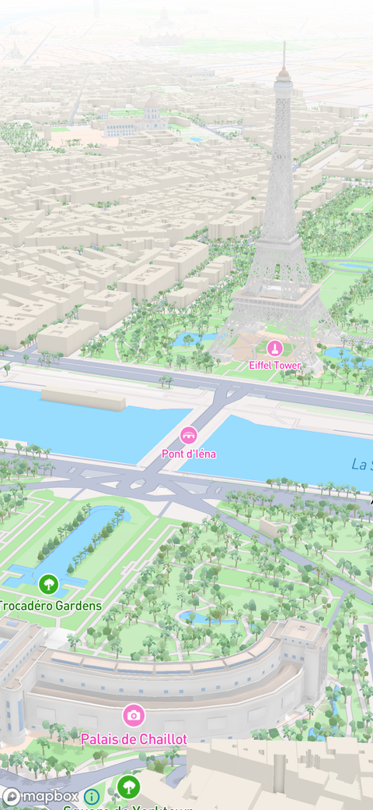
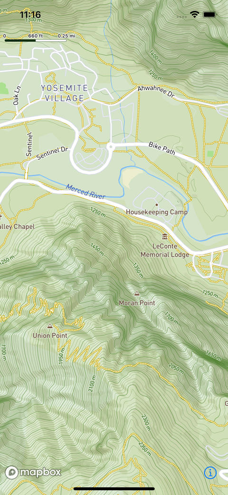
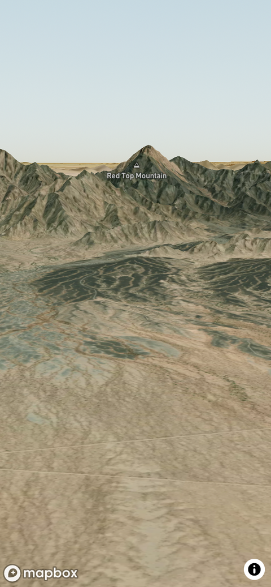

# Swift로 이해하는 Mapbox 스타일 설정

> **면접 답변 한 줄 요약:** 스타일 설정은 지도를 그릴 설계도를 선택하는 작업이며, 배경 지도를 교체하는 일과 현재 스타일의 설정값만 바꾸는 일을 구분해야 해요.

공식 [Set a style](https://docs.mapbox.com/ios/maps/guides/styles/set-a-style/)에 대응해요. 낮·밤 표시를 바꿀 때 지도 데이터를 다시 만들지 않는 예제로 시작해요.

## 먼저 알아둘 용어

| 용어     | 쉬운 뜻                                         |
| -------- | ----------------------------------------------- |
| StyleURI | 사용할 스타일 문서의 위치를 나타내는 값이에요.  |
| MapStyle | 스타일 위치 또는 JSON과 설정을 묶는 값이에요.   |
| Standard | 기본으로 제공되는 Mapbox 지도 스타일이에요.     |
| Preset   | 조명처럼 자주 쓰는 설정 조합에 붙인 이름이에요. |

## 기본 지도 선택과 설정 변경을 나눠요

[공식 가이드](https://docs.mapbox.com/ios/maps/guides/styles/set-a-style/)는 기본 Standard, Standard Satellite, 사용자 정의 URI와 JSON 로딩을 설명해요. Standard에는 공개된 조명·라벨 등의 설정을 사용해요. 배경 지도의 내부 Layer ID를 임의로 찾아 수정하는 방식과 구분해요.

| 입력                 | 쓰임                      |
| -------------------- | ------------------------- |
| `.standard`          | 일반 기본 지도            |
| `.standardSatellite` | 위성 영상 기반 기본 지도  |
| `MapStyle(uri:)`     | 게시한 사용자 정의 스타일 |
| `MapStyle(json:)`    | 직접 구성한 스타일 JSON   |

SDK가 제공하는 다른 상수 스타일에는 Streets, Outdoors, Light, Dark, Satellite, Satellite Streets가 있어요. 새 앱의 기본 출발점은 Standard·Standard Satellite를 우선 검토하고, 기존 상수와 사용자 정의 스타일은 제품의 디자인·데이터 요구에 따라 선택해요.

| Standard                                                                                | Outdoors                                                                   | 3D Terrain                                                                         |
| --------------------------------------------------------------------------------------- | -------------------------------------------------------------------------- | ---------------------------------------------------------------------------------- |
|  |  |  |
| 일반적인 장소 탐색의 출발점이에요.                                                      | 등고선·지형 정보를 강조해요.                                               | 높낮이를 입체로 표현해요.                                                          |

_스타일은 단순한 배경색이 아니라 어떤 지리 정보를 어떤 우선순위로 보여 줄지 정하는 설계예요. [공식 Set a style에서 스타일 이미지와 선택지 보기](https://docs.mapbox.com/ios/maps/guides/styles/set-a-style/)_

## SwiftUI 상태로 야간 조명을 전환해요

다음은 스타일 선택이 아니라 같은 Standard의 조명 설정을 바꾸는 작성 예제예요.

```swift
import MapboxMaps
import SwiftUI

struct StoreBasemapScreen: View {
    @State private var nightLighting = false

    var body: some View {
        VStack {
            Map()
                .mapStyle(.standard(
                    lightPreset: nightLighting ? .night : .day,
                    showPointOfInterestLabels: false
                ))

            Toggle("야간 조명", isOn: $nightLighting)
                .padding()
        }
    }
}
```

앱이 직접 표시할 매장과 기본 지도의 관심 지점 라벨이 겹치는 상황을 가정했어요. 이 설정은 앱이 추가한 매장 Source의 데이터를 삭제하지 않아요.

## UIKit에서도 같은 설정 값을 전달할 수 있어요

화면 소유자가 토글 상태를 받았을 때 호출하는 작성 예제예요.

```swift
import MapboxMaps

/// 매장 지도의 기본 조명과 관심 지점 라벨을 설정해요.
/// - Parameters:
///   - mapView: 설정을 적용할 지도예요.
///   - isNight: 야간 조명을 적용하려면 true예요.
@MainActor
func applyStoreBasemap(
    to mapView: MapView,
    isNight: Bool
) {
    mapView.mapboxMap.mapStyle = .standard(
        lightPreset: isNight ? .night : .day,
        showPointOfInterestLabels: false
    )
}
```

이 함수가 앱의 야간 상태를 저장하지는 않아요. 사용자 설정의 저장과 지도 반영을 분리하면 지도 화면을 닫았다가 다시 열어도 같은 설정을 적용하기 쉬워요.

## 스타일 URL이 유효해도 로딩 성공은 별개예요

URI 생성 성공은 실제 리소스 접근 성공을 보장하지 않아요. 토큰 권한, 게시 여부, 네트워크와 로딩 오류를 별도로 확인해요.

처음부터 로딩을 미루려면 빈 스타일을 사용할 수 있어요. 다만 “빈 지도”, “로딩 중”, “로딩 실패”를 같은 화면으로 처리하지 않는 편이 좋아요. [스타일 로딩 선택지](https://docs.mapbox.com/ios/maps/guides/styles/set-a-style/#load-a-style)

`MapInitOptions`에 스타일을 넣으면 지도 생성과 함께 로딩하고, 지도를 먼저 만든 뒤 `mapStyle`을 설정하면 로딩 시점을 늦출 수 있어요. 사용자 정의 스타일은 다음 세 입력을 구분해요.

- Mapbox Studio에서 게시한 스타일은 `mapbox://styles/{username}/{style_id}` 형식의 URI를 사용해요.
- SDK가 제공하는 스타일 상수는 오타를 줄이고 지원되는 기본 스타일을 명시해요.
- Style Specification JSON은 앱 번들·서버 등 원본과 오류 처리 책임을 앱이 가져요.

## 스타일 종류에 맞는 설정 API를 사용해요

Standard·Standard Satellite는 `lightPreset`, POI·교통·도로·3D 객체 표시처럼 공개된 import 설정을 사용해요. SwiftUI는 `.mapStyle(.standard(...))`, UIKit은 `MapStyle.standard(...)` 값을 `mapStyle`에 대입해 같은 의도를 표현해요.

사용자 정의 스타일은 Layer·Source·Terrain·Light 같은 Style Specification 항목을 직접 구성할 수 있지만, 존재하지 않는 Layer ID나 타입이 다른 속성을 수정하면 오류가 나요. Style Studio에서 만든 설계와 런타임 코드가 같은 리소스 ID 계약을 사용하도록 관리해요.

스타일을 다른 값으로 바꾸는 작업은 비동기 리소스 로딩을 다시 시작해요. style loaded 이벤트 전에는 새 스타일의 Layer를 찾을 수 없고, 이전 스타일에만 명령형으로 추가한 리소스는 사라질 수 있어요. 화면에 이전 지도와 새 지도가 잠시 섞인다고 가정하지 말고 성공·실패·복원 순서를 정의해요.

## 스타일 교체 후 복원할 내용을 정해요

명령형으로 추가한 일반 Layer는 스타일 교체 뒤 재추가가 필요할 수 있어요. `addPersistentLayer` 또는 [선언적 스타일링](./declarative-map-styling.md)도 검토하되, “스타일을 바꿔도 앱의 모든 상태가 자동 복원된다”로 일반화하지 않아요.

설계 연습으로 배경을 바꾼 뒤 다음을 확인해요: 선택 매장, 즐겨찾기 표시, 카드, 카메라 위치, 필터 상태. 어떤 값이 앱 상태이고 어떤 값이 렌더링 결과인지 적어보면 복원 책임이 분명해져요.

## 적용 체크리스트

- [ ] 스타일 교체와 설정 변경을 구분했나요?
- [ ] 설치 SDK에서 지원하는 설정을 사용하나요?
- [ ] 로딩 실패를 사용자에게 설명하나요?
- [ ] 다시 추가할 리소스의 소유자를 정했나요?
- [ ] 야간 조명에서도 앱의 표시가 읽히나요?

## 면접에서 이어질 수 있는 질문

### Standard의 모든 배경 Layer를 수정할 수 있나요?

그 전제로 설계하지 않아요. 공개된 설정과 앱이 추가한 Layer의 수정 범위를 구분해야 해요.

### 지도 색을 바꾸려면 데이터를 다시 받아야 하나요?

항상 그렇지는 않아요. 표현 설정만 바뀐 상황이면 먼저 스타일 설정이나 Layer 속성 변경으로 해결할 수 있는지 확인해요.

### 사용자 정의 스타일은 무엇을 테스트하나요?

접근 가능성뿐 아니라 앱의 추가 데이터와 함께 읽히는지 확인해요. 라벨, 선택 표시, 야간 화면처럼 실제 사용 상황을 포함해요.

## 참고 자료

- [Mapbox — Set a style](https://docs.mapbox.com/ios/maps/guides/styles/set-a-style/)
- [Mapbox Maps SDK 11.31.0 — Standard 설정 API](https://github.com/mapbox/mapbox-maps-ios/blob/11.31.0/Sources/MapboxMaps/Style/Generated/MapStyle%2BStandard.swift)
