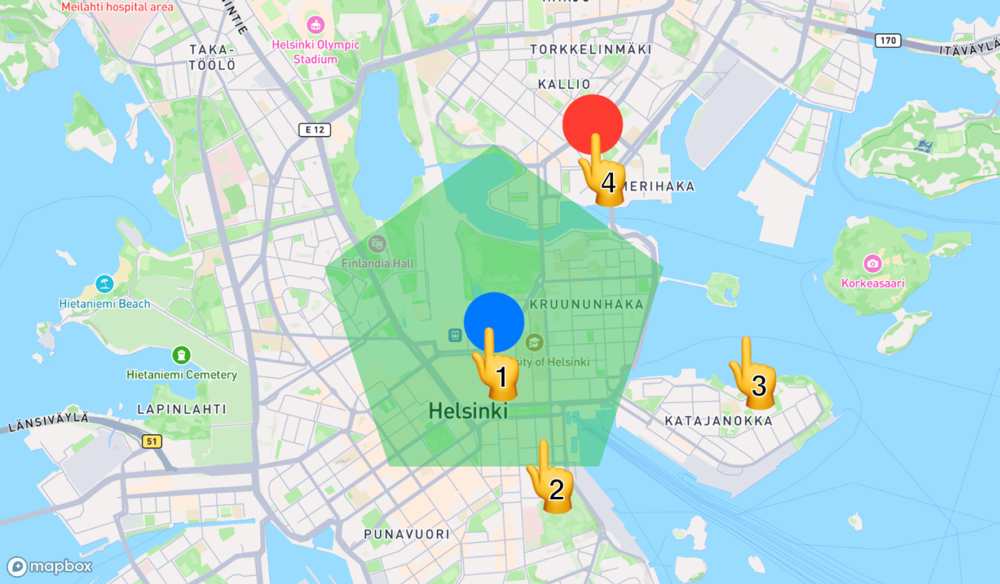

# Swift로 이해하는 Mapbox 지도 콘텐츠 제스처

> **면접 답변 한 줄 요약:** 지도 콘텐츠 제스처는 네이티브 뷰와 지도 내부 객체의 입력 경로를 구분하고, 위쪽 대상이 처리한 입력이 아래로 중복 전달되지 않도록 제어해요.

공식 [Map Content Gestures](https://docs.mapbox.com/ios/maps/guides/user-interaction/map-content-gestures/)에 대응해요. 원문의 전체 코드를 복제하지 않고 첫 탭만 처리하는 학습용 정책으로 전파 규칙을 살펴봐요.

## 먼저 알아둘 용어

| 용어               | 쉬운 뜻                                                    |
| ------------------ | ---------------------------------------------------------- |
| View Annotation    | 지도 위 좌표에 붙어 있는 실제 UIKit·SwiftUI 뷰예요.        |
| Layer Annotation   | 지도 내부에 그려지는 점·원·선·도형 등의 주석이에요.        |
| 클러스터           | 가까운 여러 점을 묶어 보여주는 표시예요.                   |
| InteractionContext | 입력이 발생한 화면 위치와 지리 좌표 등을 담는 값이에요.    |
| 전파               | 입력을 처리하지 않은 경우 다음 대상으로 넘기는 과정이에요. |

View Annotation은 네이티브 뷰의 제스처를 사용하고, Layer Annotation은 SDK의 탭·길게 누르기 처리를 사용해요. 지도 내부에서는 위쪽 객체부터 기회를 받고 `true`로 처리하면 전파를 끝내요. [공식 가이드](https://docs.mapbox.com/ios/maps/guides/user-interaction/map-content-gestures/)



_숫자는 겹친 위치에서 입력을 받을 우선순위를 나타내요. View Annotation 같은 화면 뷰가 먼저 처리하고, 소비되지 않은 입력이 Annotation·Layer·Map으로 이어져요. [공식 Map Content Gestures에서 처리 순서 보기](https://docs.mapbox.com/ios/maps/guides/user-interaction/map-content-gestures/)_

## 같은 탭이 두 기능을 실행하지 않게 해요

“첫 번째 탭은 도움말을 보여주고 다음부터 지도에 전달한다”라는 화면 정책을 생각해 보세요. 상태를 true로 바꾼 뒤 그 상태를 매번 반환하면 두 번째 탭도 계속 소비하는 실수가 생겨요.

먼저 지도와 독립된 작은 값 타입으로 정책을 표현해요.

```swift
struct FirstTapGate {
    private var hasHandledTap = false

    mutating func consumeIfFirst() -> Bool {
        guard !hasHandledTap else { return false }
        hasHandledTap = true
        return true
    }
}
```

`consumeIfFirst()`를 세 번 호출한 결과는 `true, false, false`여야 해요. 이미 처리했는지와 **이번 입력을 처리했는지**를 구분한 것이 핵심이에요.

## 주석의 탭 결과를 지도 전파와 연결해요

다음은 위 타입과 함께 사용하는 SwiftUI 예제예요. 설치와 토큰 설정은 완료되어 있어야 해요.

```swift
import MapboxMaps
import SwiftUI

struct FirstTapHelpMap: View {
    @State private var gate = FirstTapGate()
    @State private var message = "원을 눌러 도움말을 확인해 보세요."
    private let store = CLLocationCoordinate2D(latitude: 37.566, longitude: 126.978)

    var body: some View {
        VStack {
            Map(initialViewport: .camera(center: store, zoom: 15)) {
                CircleAnnotation(centerCoordinate: store)
                    .circleRadius(20)
                    .circleColor(StyleColor(.systemOrange))
                    .onTapGesture { _ in
                        guard gate.consumeIfFirst() else { return false }
                        message = "이 원은 선택 가능한 매장 표시예요."
                        return true
                    }
                TapInteraction { _ in
                    message = "지도가 탭을 받았어요."
                    return true
                }
            }
            Text(message)
        }
    }
}
```

원 안의 첫 탭은 도움말을 표시하고 멈춰요. 같은 원을 다시 누르면 주석이 `false`를 반환하므로 지도가 입력을 받아요. 지도 밖의 일반 UI 버튼은 이 지도 객체 전파 규칙과 같은 대상으로 취급하지 않아요.

이 정책은 교육용 예시예요. 실제 서비스에서는 같은 매장을 두 번 누를 때 갑자기 다른 동작이 생기는 것이 적절한지 UX를 검토해야 해요.

## 콘텐츠 종류마다 알맞은 입력 경로를 골라요

| 콘텐츠                      | 입력을 연결하는 방법                   | 앱에서 먼저 정할 것               |
| --------------------------- | -------------------------------------- | --------------------------------- |
| View Annotation             | 내부 Button 또는 네이티브 제스처       | 작은 카드의 버튼과 카드 선택 구분 |
| Layer Annotation            | 주석의 onTapGesture·onLongPressGesture | 입력 소비 또는 전파 정책          |
| Point Annotation 클러스터   | 그룹의 클러스터 제스처                 | 확대할지 목록을 열지              |
| 커스텀 레이어·Standard 객체 | TapInteraction·LongPressInteraction    | 선택 대상과 선택 해제 정책        |

주석 클러스터링은 Point Annotation에서 지원하며 클러스터 입력에는 좌표와 확대에 사용할 `expansionZoom`이 제공돼요. 이는 지도 주석 그룹의 기능이고 임의의 UIKit 뷰 묶음이 자동으로 클러스터링되는 뜻은 아니에요. [공식 가이드](https://docs.mapbox.com/ios/maps/guides/user-interaction/map-content-gestures/)

클러스터를 눌렀을 때 해당 좌표로 확대하는 방법과 목록을 여는 방법 중 제품에 맞는 쪽을 골라요. 정확히 같은 좌표의 매장이 여러 개라면 확대만 반복해도 선택 문제가 풀리지 않을 수 있어요. 그런 경우 목록 선택이라는 대안을 따로 설계해요.

## 기존 제스처 예제와 새 API를 연결해요

공식 가이드에는 `onMapTapGesture`·`onLayerTapGesture`와 UIKit `onMapTap`·`onLayerTap` 예제가 남아 있어요. 11.29.1 코드에는 이 API들의 deprecated 표시가 있으므로 새 코드는 [Interactions API](./interactions.md)로 연결해요. 주석 자체의 `onTapGesture`는 별도 API예요. [SDK 구현](https://github.com/mapbox/mapbox-maps-ios/blob/11.29.1/Sources/MapboxMaps/SwiftUI/Map+Gestures.swift)

UIKit에서 기존 Signal 기반 예제를 유지한다면 취소 토큰을 화면에서 보관하고 종료해야 해요. Interactions 등록의 지도 수명 유지 규칙을 모든 Signal 구독에 똑같이 적용하지 않도록 주의하세요.

## 적용 순서를 정리해요

1. 표시 대상이 네이티브 뷰인지 지도 내부 객체인지 확인해요.
2. 각 대상의 탭·길게 누르기 의미를 적어요.
3. 전파 반환값을 “이번 입력을 처리했는가?”로 결정해요.
4. 겹친 대상·반복 탭·빈 지도 입력을 테스트해요.
5. 클러스터 확대만으로 선택할 수 없는 경우 대안을 제공해요.

## 면접에서 이어질 수 있는 질문

### 주석에 일반 SwiftUI onTapGesture만 붙이면 되나요?

주석이 실제 View인지 지도 내부 렌더링 객체인지 먼저 구분해요. 각 타입이 제공하는 입력 경로를 사용해야 해요.

### false는 이벤트 처리 실패인가요?

이 전파 규칙에서는 아래 대상으로 넘기겠다는 뜻이에요. 서버 요청 성공 여부와는 다른 판단이에요.

### 클러스터를 누르면 무조건 확대하면 되나요?

같은 위치의 여러 대상을 구분해야 한다면 확대만으로 부족할 수 있어요. 목록 선택 등 앱의 대체 동작도 검토해요.

## 참고 자료

- [Mapbox Map Content Gestures](https://docs.mapbox.com/ios/maps/guides/user-interaction/map-content-gestures/)
- [Mapbox SwiftUI 제스처 구현 · 11.29.1](https://github.com/mapbox/mapbox-maps-ios/blob/11.29.1/Sources/MapboxMaps/SwiftUI/Map+Gestures.swift)
