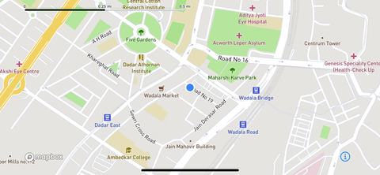

# Swift로 이해하는 Mapbox 사용자 위치

> **면접 답변 한 줄 요약:** 사용자 위치 기능은 접근 권한, 위치 데이터 공급, Puck 표시, 카메라 추적을 연결하는 기능이며, 정확도와 데이터의 최신성까지 따로 판단해야 해요.

공식 [User Location](https://docs.mapbox.com/ios/maps/guides/user-location/)에 대응해요. 아래에서는 주변 매장 찾기의 위치 버튼과 검색 정책을 학습용으로 설계해요.

## 먼저 알아둘 용어

| 용어              | 쉬운 뜻                                                  |
| ----------------- | -------------------------------------------------------- |
| Core Location     | Apple 기기의 위치와 위치 권한을 다루는 프레임워크예요.   |
| Location provider | 지도에 위치 데이터를 공급하는 객체예요.                  |
| Puck              | 지도에 표시하는 사용자 위치 표시예요.                    |
| heading / course  | 각각 기기가 향한 방향과 실제 이동 방향이에요.            |
| reduced accuracy  | 사용자가 정확한 위치 대신 대략적 위치를 허용한 상태예요. |

기본 `AppleLocationProvider`가 위치를 공급하고 `LocationManager`가 지도 표현과 추적에 연결해요. Puck 추가와 카메라의 follow-puck 설정은 별개예요. 2D·3D 표시와 사용자 정의 위치·heading 공급원도 지원해요. [공식 가이드](https://docs.mapbox.com/ios/maps/guides/user-location/)

## 권한이 없어도 기본 지도는 유용해야 해요

주변 매장 앱에서 위치 권한을 거부했다고 모든 화면을 막을 필요는 없어요. 이 예제의 제품 정책은 주소 검색과 직접 지도 탐색을 항상 제공하고, “내 위치”만 권한을 사용하는 거예요.

앱 Target의 `Info.plist`에 실제 기능을 설명하는 문구를 추가해요.

```xml
<key>NSLocationWhenInUseUsageDescription</key>
<string>현재 위치 주변의 매장을 지도에서 찾기 위해 위치를 사용해요.</string>
```

권한 요청 이유를 기능과 연결하면 “왜 지금 요청하는가?”를 사용자가 이해하기 쉬워요. 목적이 주변 탐색인 예제에 백그라운드 상시 위치 수집을 끼워 넣지 않아요.

## 사용자의 요청에 맞춰 위치 표시를 시작해요

다음 SwiftUI 화면은 위치 사용을 요청하는 시점을 보여주는 작은 예제예요. SDK 설치와 토큰 설정은 완료된 상태예요.

```swift
import MapboxMaps
import SwiftUI

struct NearbyStoreLocationMap: View {
    @State private var requestsLocation = false
    @State private var viewport = Viewport.camera(
        center: CLLocationCoordinate2D(latitude: 37.566, longitude: 126.978),
        zoom: 12
    )

    var body: some View {
        VStack {
            Map(viewport: $viewport) {
                if requestsLocation {
                    Puck2D(bearing: .heading)
                        .showsAccuracyRing(true)
                }
            }
            Button("내 위치 보기") {
                requestsLocation = true
                viewport = .followPuck(zoom: 15, bearing: .heading)
            }
            Text("위치를 허용하지 않아도 지도를 직접 탐색할 수 있어요.")
                .font(.caption)
        }
    }
}
```

`requestsLocation`은 **앱이 위치 기능을 요청했다는 값**이지 권한 승인 여부가 아니에요. 완성 앱에서는 승인·거부·제한·위치 대기 상태에 따라 버튼과 안내를 조정해야 해요. 이 Boolean만 보고 “현재 위치 확인 완료”를 표시하면 안 돼요.



_파란 Puck은 지도상의 사용자 위치 표현이에요. Puck 표시와 위치 권한 상태, 카메라 추적은 각각 따로 관리해야 해요. [공식 User Location에서 이미지와 설정 보기](https://docs.mapbox.com/ios/maps/guides/user-location/)_

## 표시용 위치와 검색 실행 기준을 나눠요

Puck이 보이는 것과 “이 위치로 서버를 검색해도 된다”는 서로 다른 판단이에요. 사용자가 앱으로 돌아왔을 때 오래된 위치가 남아 있거나 오차가 클 수 있어요.

다음은 지도 SDK와 독립적으로 테스트할 수 있는 **학습용 검색 정책**이에요. 30초·1km는 예제의 제품 기준이지 Mapbox나 Apple의 권장값이 아니에요.

```swift
import CoreLocation

/// 주변 매장 검색에 사용할 수 있는 위치 측정인지 판단해요.
/// - Parameters:
///   - location: 시스템에서 받은 위치 측정값이에요.
///   - now: 판단 시각이에요. 테스트에서는 고정된 값을 전달해요.
/// - Returns: 예제의 최신성·정확도 조건을 충족하면 true예요.
func canSearchNearby(
    location: CLLocation,
    now: Date
) -> Bool {
    let age = now.timeIntervalSince(location.timestamp)
    return age >= 0 && age <= 30
        && location.horizontalAccuracy >= 0
        && location.horizontalAccuracy <= 1_000
}
```

실제 프로젝트에서는 위치 공급원이 만든 측정값을 앱 모델에 전달한 뒤 이 정책을 적용해요. 조건을 통과하지 못했다고 위치 권한을 다시 요청하지는 않아요. 데이터 대기와 권한 문제는 다른 원인이기 때문이에요.

`horizontalAccuracy`는 미터 단위의 오차 반경이며 음수이면 좌표가 유효하지 않다는 뜻이에요. 측정 시각은 `timestamp`로 확인해요. [Apple 정확도 설명](https://developer.apple.com/documentation/corelocation/cllocation/horizontalaccuracy), [측정 시각](https://developer.apple.com/documentation/corelocation/cllocation/timestamp)

이 함수는 “방금 받은 유효 위치”, “1분 전 위치”, “정확도 값이 유효하지 않은 위치”, “허용 범위보다 큰 오차”를 고정된 시각으로 테스트할 수 있어요. 위치 이벤트마다 서버를 호출할지 여부에는 거리·시간 간격 정책도 별도로 필요해요.

## 정확도 권한과 공급원 교체를 구분해요

대략적인 위치를 지원하고 특정 기능에만 정밀 위치가 필요하다면 임시 정확도 요청을 검토해요. 사용자 정의 purpose key는 `NSLocationTemporaryUsageDescriptionDictionary`의 키와 일치해야 해요. `AppleLocationProviderDelegate`로 정확도 변경을 관찰하거나 provider를 교체할 수 있어요. [공식 위치 가이드](https://docs.mapbox.com/ios/maps/guides/user-location/)

원문에서 자동 요청에 쓰이는 키와 직접 요청하는 사용자 정의 키는 같은 정책이 아니에요. 앱이 언제 요청할지 직접 결정하려면 자동 요청 설정을 그대로 복사하지 말고 원문의 정확도 처리 절을 확인하세요.

테스트 위치 공급원으로 바꿀 때도 데이터 생산을 시작·중단하는 주체를 정해요. 실제 기기 위치를 직접 수집하는 custom provider라면 권한 책임이 없어지는 것은 아니에요. 시뮬레이터 재생 경로와 실기기의 권한·정확도 전환은 서로 다른 테스트예요.

### 임시 정밀 위치 요청을 구성해요

iOS 14 이상에서는 사용자가 reduced accuracy를 선택할 수 있어요. 길 안내처럼 특정 기능에만 정밀 위치가 필요하면 `NSLocationTemporaryUsageDescriptionDictionary`에 목적별 key를 두고 같은 key로 임시 권한을 요청해요.

```xml
<key>NSLocationTemporaryUsageDescriptionDictionary</key>
<dict>
    <key>NearbyStoreAccuracy</key>
    <string>가까운 매장까지의 정확한 거리와 방향을 계산하기 위해 정밀 위치가 필요해요.</string>
</dict>
```

```swift
let provider = AppleLocationProvider()
provider.requestTemporaryFullAccuracyAuthorization(
    withPurposeKey: "NearbyStoreAccuracy"
)
```

`withPurposeKey`는 plist의 key와 정확히 일치해야 해요. 권한 변경을 직접 처리하기 위해 custom key를 쓴다면 공식 가이드가 자동 prompt에 사용하는 `LocationAccuracyAuthorizationDescription`과 중복되지 않게 설계하세요. 항상 허용이 실제 요구라면 `NSLocationAlwaysAndWhenInUseUsageDescription`과 백그라운드 정책을 별도로 검토해야 해요.

### LocationManager가 다루는 두 입력을 구분해요

`LocationManager`는 지리 위치를 나타내는 `Location` update와 기기 방향을 나타내는 선택적 `Heading` update를 다뤄요. 기본값은 `AppleLocationProvider`지만 활동 유형 같은 Core Location 설정을 바꾸거나 provider 전체를 교체할 수 있어요.

```swift
let provider = AppleLocationProvider()
provider.options.activityType = .automotiveNavigation
mapView.location.override(provider: provider)
```

완전한 custom source는 `LocationProvider`와 `HeadingProvider`를 각각 구현해 전달해요. SwiftUI에서는 `MapReader`에서 위치 manager에 접근하고 Combine publisher를 Mapbox 내부 `Signal`로 바꿔 공급할 수 있어요. custom provider가 데이터를 만든다고 해도 사용자 권한을 요청하고 중단 시 수집을 끝내는 책임은 앱에 남아요.

## Puck 모양과 방향 원천을 선택해요

| 선택                        | 의미                                    | 대표 용도         |
| --------------------------- | --------------------------------------- | ----------------- |
| `Puck2D()`                  | 위치만 표시하고 방향은 기본으로 숨겨요. | 일반 주변 탐색    |
| `Puck2D(bearing: .heading)` | 기기가 향한 compass 방향을 표시해요.    | 보행 방향 안내    |
| course 기반 bearing         | 실제 이동 경로 방향을 사용해요.         | 이동 중 경로 화면 |
| 3D Puck                     | 사용자 정의 3D 모델로 위치를 표현해요.  | 3D 브랜드 경험    |

UIKit에서는 `Puck2DConfiguration.makeDefault(showBearing:)`으로 기본 2D Puck의 방향 표시를 구성하고 `mapView.location.options.puckType`에 넣어요. `LocationOptions`에서는 Puck image·scale·accuracy ring과 bearing source를 더 조정할 수 있어요.

Puck을 보인다고 카메라가 자동으로 따라가지는 않아요. 표시와 카메라 추적을 별도 요구사항으로 다뤄야 사용자가 지도를 드래그할 때 앱이 곧바로 원래 위치로 되돌리는 충돌을 피할 수 있어요.

## 위치 추적 Viewport 상태와 전환을 구분해요

공식 SDK는 UIKit에서 `MapView.viewport`, SwiftUI에서 `Viewport` binding으로 추적 의도를 표현해요.

| Viewport 상태 | 카메라 규칙                                        |
| ------------- | -------------------------------------------------- |
| Follow Puck   | Puck 위치와 선택한 bearing·zoom·pitch를 따라가요.  |
| Overview      | 지정한 geometry 전체가 padding 안에 들어오게 해요. |
| 사용자 정의   | 앱의 동적 데이터로 카메라 update를 만들어요.       |

| 전환                 | 동작                                       |
| -------------------- | ------------------------------------------ |
| Default transition   | 목표 상태까지 애니메이션으로 이동해요.     |
| Immediate transition | 애니메이션 없이 즉시 목표 상태를 적용해요. |

SwiftUI에서는 `withViewportAnimation`으로 follow-puck 전환을 애니메이션하고, overview 값을 직접 할당하면 즉시 바꿀 수 있어요. UIKit에서는 `makeFollowPuckViewportState`, `makeOverviewViewportState`, `makeDefaultViewportTransition`, `makeImmediateViewportTransition`을 조합해요. 자세한 상태 수명과 idle 의미는 [Viewport 문서](./camera-and-animation/viewport.md)에서 이어서 설명해요.

시뮬레이터에서 Puck이 보이지 않으면 Xcode의 **Debug → Simulate Location**에서 위치를 선택하고, 이미 거부한 권한은 Simulator의 **Settings → Privacy & Security → Location Services**에서 다시 확인하세요.

## 적용 순서를 정리해요

1. 위치 없이 가능한 수동 탐색 경로를 만들어요.
2. 위치를 사용하는 이유를 `Info.plist`에 적어요.
3. 사용자 행동에 맞춰 Puck과 추적을 연결해요.
4. 요청했다는 값과 실제 권한 상태를 구분해요.
5. 대략적 위치·오래된 측정·위치 대기를 테스트해요.
6. 화면 종료와 provider 교체 시 데이터 공급 수명을 확인해요.

## 면접에서 이어질 수 있는 질문

### 위치 권한을 받으면 정확한 현재 위치가 있나요?

아니요. 권한, 정확도 허용 수준, 측정값 도착과 최신성은 따로 확인해야 해요.

### heading과 course는 언제 구분하나요?

주변 방향 탐색처럼 기기가 향한 방향과 이동 경로가 중요한 화면은 요구가 달라요. 정지 상태의 이동 방향을 항상 유효하다고 가정하지 않아요.

### 테스트 provider를 쓰면 모든 위치 검증을 대체하나요?

아니요. 앱 정책과 데이터 흐름은 안정적으로 테스트할 수 있지만 실기기의 권한 화면과 센서 품질은 별도 확인이 필요해요.

## 참고 자료

- [Mapbox User Location](https://docs.mapbox.com/ios/maps/guides/user-location/)
- [Apple reduced accuracy 위치 권한](https://developer.apple.com/documentation/corelocation/claccuracyauthorization)
- [Apple CLLocation](https://developer.apple.com/documentation/corelocation/cllocation)
- [Apple horizontalAccuracy](https://developer.apple.com/documentation/corelocation/cllocation/horizontalaccuracy)
- [Apple timestamp](https://developer.apple.com/documentation/corelocation/cllocation/timestamp)
