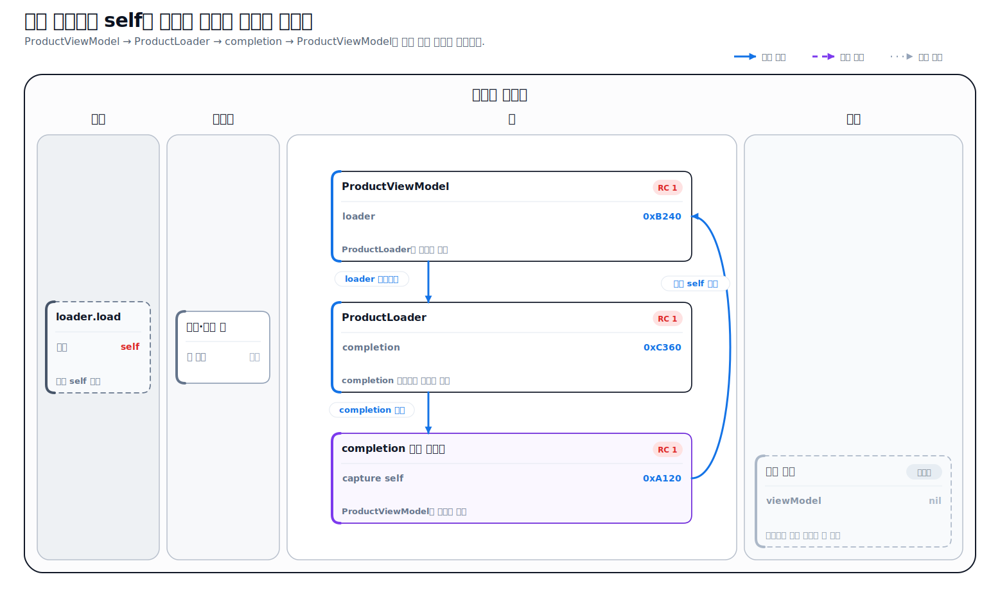
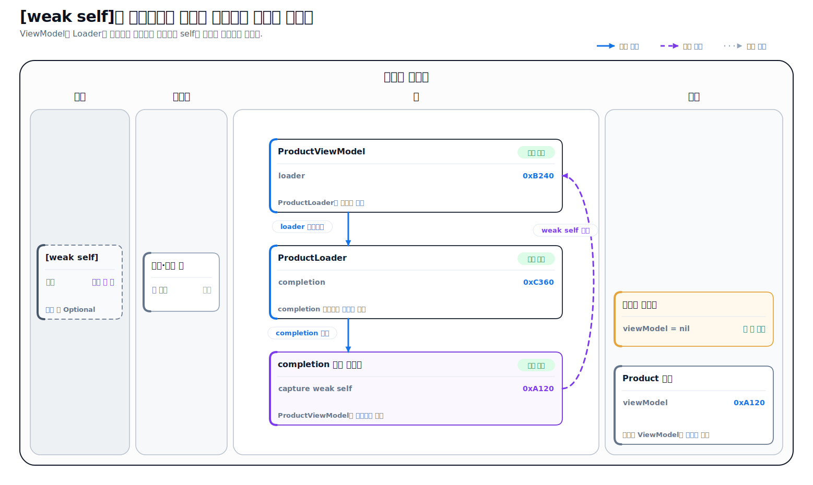

# Swift로 이해하는 클로저

> **면접 답변 한 줄 요약:** 클로저는 실행할 코드를 함수 타입의 값으로 만들어 전달하거나 저장하고, 정의된 주변 값을 캡처해 나중에도 사용할 수 있게 하는 Swift의 기능이에요.

Swift에서 정렬 기준을 전달하거나, 작업이 끝난 뒤 실행할 코드를 등록하거나, 화면마다 다른 동작을 주입할 때 클로저를 자주 사용해요. 문법을 가장 짧게 줄이는 방법만 외우면 `$0`, `@escaping`, `[weak self]`가 한꺼번에 등장했을 때 코드의 실행 시점과 소유 관계를 놓치기 쉬워요.

이 문서에서는 이름 있는 함수에서 출발해 클로저 표현식의 구조를 살펴보고, 값 캡처와 escaping 클로저가 메모리 관리에 어떤 영향을 주는지 단계적으로 설명해요.

## 먼저 알아둘 클로저 용어

| 용어               | 쉬운 뜻                                                                                                                            |
| ------------------ | ---------------------------------------------------------------------------------------------------------------------------------- |
| 함수 타입          | 함수가 받는 값과 돌려주는 값의 형태를 나타내는 타입이에요. 예를 들어 `(Int) -> String`은 `Int` 하나를 받아 `String`을 돌려줘요.    |
| 일급 값            | 변수에 저장하고, 함수에 전달하고, 함수에서 반환할 수 있는 값이에요. Swift에서는 함수와 클로저를 이런 값처럼 다룰 수 있어요.        |
| 클로저             | 함께 실행할 코드를 하나의 값으로 묶은 것이에요. 주변의 상수와 변수를 기억할 수도 있어요.                                           |
| 클로저 표현식      | `func`와 이름 없이 `{ ... }`로 클로저를 직접 작성하는 문법이에요.                                                                  |
| 고차 함수          | 다른 함수를 매개변수로 받거나 반환하는 함수예요. `map`, `filter`, `sorted`가 대표적이에요.                                         |
| 캡처               | 클로저가 정의된 바깥 범위의 상수나 변수를 클로저 안에서 사용할 수 있도록 기억하는 동작이에요.                                      |
| 캡처 리스트        | 클로저 시작 부분의 `[...]`에서 캡처할 값과 `weak`, `unowned` 같은 소유 방식을 명시하는 문법이에요.                                 |
| nonescaping 클로저 | 매개변수로 받은 함수의 실행이 끝나기 전에 사용을 마치는 클로저예요. Swift의 클로저 매개변수는 기본적으로 nonescaping이에요.        |
| escaping 클로저    | 매개변수로 받은 함수가 반환된 뒤에도 저장되거나 호출될 수 있는 클로저예요. 함수 타입 앞에 `@escaping`을 적어요.                    |
| trailing closure   | 함수의 마지막 클로저 인자를 소괄호 밖에 작성하는 호출 문법이에요. 클로저의 동작이나 실행 시점을 바꾸는 기능은 아니에요.            |
| `@autoclosure`     | 호출부의 표현식을 인자 없는 클로저로 자동 감싸 평가를 미루는 매개변수 속성이에요.                                                  |
| ARC                | Automatic Reference Counting의 줄임말로, 클래스 인스턴스를 붙잡는 강한 참조를 세어 수명을 관리하는 Swift의 메모리 관리 방식이에요. |

이 문서에서는 다음 내용을 설명해요.

- 함수 타입을 읽고 함수와 클로저를 값처럼 전달하는 방법
- 클로저 표현식의 기본 구조와 단계별 축약 문법
- 클로저가 바깥 값을 캡처하고 유지하는 방식
- nonescaping과 escaping 클로저의 차이
- trailing closure와 `@autoclosure`가 바꾸는 것
- `self` 캡처와 강한 참조 순환을 판단하는 기준
- 읽기 쉬운 클로저 API를 설계하고 사용하는 순서

## 함수도 함수 타입의 값이에요

클로저 문법을 보기 전에 이름 있는 함수부터 값으로 다뤄 볼게요.

```swift
struct Product {
  let name: String
  let price: Int
}

func isCheaper(_ lhs: Product, than rhs: Product) -> Bool {
  lhs.price < rhs.price
}

let products = [
  Product(name: "키보드", price: 120_000),
  Product(name: "마우스", price: 50_000),
]

let comparison: (Product, Product) -> Bool = isCheaper
let sortedProducts = products.sorted(by: comparison)
```

`isCheaper(_:than:)`에는 이름과 인자 레이블이 있지만, 이를 변수에 저장할 때의 함수 타입은 `(Product, Product) -> Bool`이에요. 함수 타입에는 매개변수의 **타입**과 반환 타입이 들어가며 호출부의 인자 레이블은 들어가지 않아요.

자주 보는 함수 타입을 읽어 보면 다음과 같아요.

| 함수 타입                    | 의미                                            |
| ---------------------------- | ----------------------------------------------- |
| `() -> Void`                 | 입력과 반환값이 없어요.                         |
| `(Product) -> String`        | `Product`를 받아 `String`을 돌려줘요.           |
| `(Product, Product) -> Bool` | `Product` 두 개를 받아 `Bool`을 돌려줘요.       |
| `([Product]) -> [Product]`   | 상품 배열을 받아 새 상품 배열을 돌려줘요.       |
| `((Product) -> Void)?`       | 클로저가 없을 수도 있는 옵셔널 함수 타입이에요. |

마지막 타입은 괄호의 위치가 중요해요. `(Product) -> Void?`는 옵셔널 값을 반환하는 함수이고, `((Product) -> Void)?`는 함수 자체가 없을 수 있다는 뜻이에요.

Swift 공식 [Functions](https://docs.swift.org/swift-book/documentation/the-swift-programming-language/functions/) 문서는 모든 함수가 매개변수 타입과 반환 타입으로 구성된 함수 타입을 가지며, 함수를 다른 함수에 전달하거나 반환할 수 있다고 설명해요.

## 클로저 표현식은 이름 없는 함수를 바로 적는 문법이에요

앞의 비교 함수를 클로저 표현식으로 바꾸면 다음과 같아요.

```swift
let cheaperFirst: (Product, Product) -> Bool = {
  (lhs: Product, rhs: Product) -> Bool in
  return lhs.price < rhs.price
}
```

클로저 표현식의 기본 구조는 다음 순서로 읽어요.

```swift
{ (매개변수) -> 반환타입 in
  실행할 코드
}
```

- 중괄호 `{ ... }`가 클로저 전체를 감싸요.
- `lhs`와 `rhs`는 클로저가 받을 매개변수예요.
- `-> Bool`은 반환 타입이에요.
- `in`은 선언부와 실행할 코드를 구분해요.
- 클로저는 `cheaperFirst` 상수에 저장되며 `cheaperFirst(productA, productB)`처럼 호출할 수 있어요.

이 문법은 [The Swift Programming Language의 Closures](https://docs.swift.org/swift-book/documentation/the-swift-programming-language/closures/)에서 설명하는 기본 형태와 같아요. 이름 있는 전역 함수와 중첩 함수도 클로저의 한 형태이고, `{ ... }`로 작성하는 표현식을 특별히 **클로저 표현식**이라고 불러요.

## 문맥이 충분하면 단계적으로 줄일 수 있어요

Swift는 `sorted(by:)`가 `(Product, Product) -> Bool` 타입을 요구한다는 사실을 알고 있어요. 이 문맥을 이용하면 같은 코드를 단계적으로 줄일 수 있어요.

먼저 모든 타입과 `return`을 적은 형태예요.

```swift
let sortedProducts = products.sorted(
  by: { (lhs: Product, rhs: Product) -> Bool in
    return lhs.price < rhs.price
  }
)
```

매개변수와 반환 타입을 추론하게 하고, 표현식이 하나뿐인 본문에서 `return`을 생략할 수 있어요.

```swift
let sortedProducts = products.sorted(
  by: { lhs, rhs in
    lhs.price < rhs.price
  }
)
```

마지막 클로저 인자를 소괄호 밖으로 옮기는 trailing closure 문법을 적용할 수 있어요.

```swift
let sortedProducts = products.sorted { lhs, rhs in
  lhs.price < rhs.price
}
```

매개변수 역할이 명확하고 본문이 짧다면 축약 인자 이름인 `$0`, `$1`도 사용할 수 있어요.

```swift
let sortedProducts = products.sorted {
  $0.price < $1.price
}
```

가장 짧은 형태가 항상 가장 읽기 좋은 것은 아니에요. 클로저가 여러 줄이거나 같은 타입의 인자가 셋 이상이면 `product`, `index`, `result`처럼 의미가 드러나는 이름을 붙이는 편이 좋아요.

## 클로저를 매개변수와 반환값으로 전달해요

함수 타입을 매개변수로 받으면 호출하는 쪽이 일부 동작을 결정할 수 있어요. 다음 함수는 할인 규칙을 직접 정하지 않고 클로저로 받아요.

```swift
func discountedPrice(
  for product: Product,
  using rule: (Product) -> Int
) -> Int {
  rule(product)
}

let keyboard = Product(name: "키보드", price: 120_000)

let eventPrice = discountedPrice(for: keyboard) { product in
  product.price * 80 / 100
}

let memberPrice = discountedPrice(for: keyboard) { product in
  product.price - 10_000
}
```

`discountedPrice(for:using:)`는 가격 계산의 흐름을 담당하고, 실제 할인 정책은 호출부의 클로저가 담당해요. 하나의 동작만 교체하면 될 때 클로저가 간단한 전략 역할을 할 수 있어요. 동작이 여러 개이거나 독립된 상태와 수명 관리가 필요하면 [Strategy 패턴](../design-patterns/strategy)을 함께 검토할 수 있어요.

함수가 클로저를 만들어 반환할 수도 있어요.

```swift
func makePriceLabel(prefix: String) -> (Product) -> String {
  { product in
    "\(prefix) \(product.price)원"
  }
}

let koreanPriceLabel = makePriceLabel(prefix: "가격:")
print(koreanPriceLabel(keyboard))
// 가격: 120000원
```

`makePriceLabel(prefix:)`가 끝난 뒤에도 반환된 클로저는 `prefix`를 기억해요. 이것이 다음에 살펴볼 캡처예요.

## 클로저는 정의된 주변 값을 캡처해요

다음 함수는 호출될 때마다 횟수를 하나씩 올리는 클로저를 만들어요.

```swift
func makePurchaseCounter() -> (String) -> Int {
  var count = 0

  return { productName in
    count += 1
    print("\(productName) 구매 \(count)회")
    return count
  }
}

let countPurchase = makePurchaseCounter()
countPurchase("키보드")
// 키보드 구매 1회
countPurchase("마우스")
// 마우스 구매 2회
```

`makePurchaseCounter()`의 실행은 끝났지만 반환된 클로저는 `count`를 계속 읽고 바꿀 수 있어요. Swift가 클로저와 함께 캡처된 저장 공간을 유지하기 때문이에요.

새로운 카운터를 만들면 별도의 캡처 저장 공간이 생겨요.

```swift
let anotherCounter = makePurchaseCounter()
anotherCounter("모니터")
// 모니터 구매 1회
```

반대로 기존 클로저를 다른 상수에 대입하면 같은 클로저와 캡처 상태를 가리켜요. Swift의 함수와 클로저는 참조 타입이기 때문이에요.

```swift
let sameCounter = countPurchase
sameCounter("트랙패드")
// 트랙패드 구매 3회
```

기본 캡처를 “클로저를 만든 순간의 값이 무조건 복사된다”라고 이해하면 안 돼요. 위 예제처럼 클로저는 캡처한 변수의 상태를 계속 공유하고 변경할 수 있어요.

## 캡처 리스트는 캡처할 값과 소유 방식을 명시해요

클로저 시작 부분의 `[...]`가 캡처 리스트예요. 값 타입을 캡처 리스트에 적으면 클로저가 만들어지는 시점의 값을 별도 상수로 캡처할 수 있어요.

```swift
var basePrice = 100_000

let originalPriceLabel = { [basePrice] in
  "기준 가격: \(basePrice)원"
}

basePrice = 80_000

print(originalPriceLabel())
// 기준 가격: 100000원
```

캡처 리스트의 `basePrice`는 클로저가 만들어질 때 평가됐기 때문에 바깥 변수를 나중에 바꿔도 `100_000`을 유지해요.

하지만 클래스 인스턴스를 캡처 리스트에 넣는다고 객체 전체가 깊은 복사되는 것은 아니에요.

```swift
final class PriceStore {
  var price = 100_000
}

let store = PriceStore()
let currentPriceLabel = { [store] in
  "현재 가격: \(store.price)원"
}

store.price = 80_000

print(currentPriceLabel())
// 현재 가격: 80000원
```

`[store]`는 같은 `PriceStore` 인스턴스를 가리키는 참조를 캡처해요. 아무 속성도 붙이지 않으면 기본적으로 강한 참조이므로 인스턴스의 수명을 유지해요. 값의 스냅샷이 필요하다면 `[price = store.price]`처럼 필요한 값을 캡처해야 해요.

```swift
let fixedPriceLabel = { [price = store.price] in
  "고정 가격: \(price)원"
}
```

## nonescaping과 escaping은 클로저의 수명 계약이에요

함수 매개변수의 클로저는 기본적으로 nonescaping이에요. 함수 밖에 보관하지 않으며, 함수가 반환된 뒤에는 사용할 수 없다는 뜻이에요.

```swift
func applyDiscount(
  to product: Product,
  using rule: (Product) -> Int
) -> Product {
  Product(
    name: product.name,
    price: rule(product)
  )
}
```

반대로 매개변수로 받은 클로저를 프로퍼티에 저장해 함수가 반환된 뒤 호출하려면 `@escaping`이 필요해요.

```swift
enum ProductLoadError: Error {
  case notFound
}

final class ProductLoader {
  typealias Completion =
    (Result<Product, ProductLoadError>) -> Void

  private var completion: Completion?

  func load(completion: @escaping Completion) {
    self.completion = completion
  }

  func finish(
    with result: Result<Product, ProductLoadError>
  ) {
    completion?(result)
    completion = nil
  }
}
```

`load(completion:)`이 끝나도 `ProductLoader`의 프로퍼티가 클로저를 보관해요. 나중에 `finish(with:)`가 실행되면 저장해 둔 클로저를 호출하고 `nil`로 만들어 더 이상 필요하지 않은 클로저를 놓아줘요.

`Result<Success, Failure>`는 성공 값과 실패 값을 한 타입으로 표현하는 Swift 표준 열거형이에요. 이 예제의 성공 값은 `Product`, 실패 값은 `Error` 프로토콜을 따르는 `ProductLoadError`예요.

두 종류를 비교하면 다음과 같아요.

| 기준                 | nonescaping 클로저                      | escaping 클로저                                    |
| -------------------- | --------------------------------------- | -------------------------------------------------- |
| 함수 반환 뒤 사용    | 허용하지 않아요.                        | 허용해요.                                          |
| 외부 프로퍼티에 저장 | 할 수 없어요.                           | 할 수 있어요.                                      |
| 매개변수 선언        | 별도 속성을 붙이지 않아요.              | 함수 타입 앞에 `@escaping`을 붙여요.               |
| 대표 사례            | `map`, `filter`, `sorted`의 즉시 연산   | 완료 핸들러, 이벤트 콜백, 저장된 작업              |
| `self` 사용          | 문맥상 암시적으로 사용할 수 있어요.     | 클래스에서는 캡처 의도를 드러내도록 명시해야 해요. |
| 확인할 메모리 문제   | 호출 범위가 제한돼 상대적으로 단순해요. | 오래 저장되거나 `self`로 돌아오는 순환을 확인해요. |

`@escaping`은 **비동기로 실행한다**는 뜻이 아니에요. 함수가 반환된 뒤에도 클로저가 살아남을 수 있다는 허용을 표시할 뿐이에요. escaping 클로저를 함수 안에서 즉시 호출할 수도 있고, 비동기 API가 클로저를 사용하더라도 구현에 따라 호출 시점과 횟수는 달라질 수 있어요.

## 클로저 API는 호출 시점과 횟수까지 확인해요

클로저를 전달할 때는 타입만으로 알 수 없는 실행 계약을 API 문서에서 확인해야 해요. Apple의 [Preventing Timing Problems When Using Closures](https://developer.apple.com/documentation/swift/preventing-timing-problems-when-using-closures)는 클로저가 동기 또는 비동기로 호출될 수 있고, 한 번·여러 번·전혀 호출되지 않을 수도 있다고 설명해요.

다음 질문을 확인하면 예상하지 못한 상태 변경을 줄일 수 있어요.

1. 클로저는 함수를 반환하기 전에 호출되나요, 나중에 호출되나요?
2. 정확히 한 번 호출되나요, 여러 번 호출될 수 있나요?
3. 실패나 취소 상황에도 호출되나요?
4. 어느 스레드나 actor에서 호출되나요?
5. 누가 클로저를 저장하고 언제 해제하나요?
6. 호출이 끝난 뒤 저장된 클로저를 `nil`로 만들거나 등록을 해제해야 하나요?

콜백 이름이 `completion`이라고 해서 반드시 한 번 호출되거나 메인 스레드에서 실행된다고 가정하면 안 돼요. API를 만드는 쪽이라면 이런 계약을 함수 이름, 타입, 문서로 명확하게 남겨야 해요.

## trailing closure는 호출부의 배치만 바꿔요

마지막 인자가 클로저라면 소괄호 밖으로 옮겨 읽기 쉽게 만들 수 있어요.

```swift
let discountedProducts = products.map { product in
  Product(
    name: product.name,
    price: product.price * 90 / 100
  )
}
```

함수가 여러 클로저를 받으면 첫 trailing closure의 레이블은 생략하고, 그다음 클로저부터 레이블을 적어요.

```swift
func requestProduct(
  id: Int,
  completion: (Product) -> Void,
  onFailure: (ProductLoadError) -> Void
) {
  if id == 1 {
    completion(
      Product(name: "키보드", price: 120_000)
    )
  } else {
    onFailure(.notFound)
  }
}

requestProduct(id: 1) { product in
  print(product.name)
} onFailure: { error in
  print(error)
}
```

trailing closure는 클로저의 저장 방식이나 실행 시점을 바꾸지 않아요. `requestProduct(id:completion:onFailure:)`의 마지막 인자들을 호출부에서 보기 좋게 배치하는 문법일 뿐이에요.

## self를 강하게 캡처하면 순환 참조가 생길 수 있어요

escaping 클로저에서 클래스의 프로퍼티나 메서드를 사용하면 `self`를 명시적으로 적어 캡처한다는 사실을 드러내야 해요. 아무 캡처 속성도 붙이지 않으면 클로저는 `self`를 강하게 참조해 수명을 유지해요.

앞에서 만든 `ProductLoader`는 `completion` 클로저를 프로퍼티에 저장해요. `ProductViewModel`이 이 loader를 소유하고 completion이 다시 `self`를 강하게 캡처하면 다음과 같은 고리가 생겨요.

```swift
final class ProductViewModel {
  private let loader = ProductLoader()
  private(set) var title = "상품"

  func refresh() {
    loader.load { result in
      switch result {
      case let .success(product):
        self.title = product.name
      case .failure:
        self.title = "상품을 불러오지 못했어요"
      }
    }
  }

  deinit {
    print("ProductViewModel 해제")
  }
}

var viewModel: ProductViewModel? = ProductViewModel()
viewModel?.refresh()
viewModel = nil
```

<div className="memory-diagram">



</div>

_파란 실선 화살표는 강한 참조예요. 세 화살표가 원래 객체로 돌아오는 닫힌 고리를 만들기 때문에 외부 변수를 `nil`로 만들어도 객체들이 서로의 수명을 유지해요._

참조 관계를 순서대로 따라가면 다음과 같아요.

1. `ProductViewModel`은 `loader` 프로퍼티로 `ProductLoader`를 강하게 참조해요.
2. `ProductLoader`는 `completion` 프로퍼티로 전달받은 클로저를 강하게 저장해요.
3. completion 클로저는 본문에서 사용한 `self`, 즉 `ProductViewModel`을 강하게 캡처해요.
4. 외부의 `viewModel` 변수를 `nil`로 만들어도 세 객체 사이의 강한 참조가 남아 ARC의 참조 수가 0이 되지 않아요.

앞의 `ProductLoader.finish(with:)`처럼 작업 완료 후 `completion = nil`을 반드시 실행하면 이 고리는 끊어져요. 하지만 작업이 끝나지 않거나 실패·취소 경로에서 정리 코드를 놓치면 `ProductViewModel`이 계속 남을 수 있어요. 그림의 주소와 참조 수는 실제 디버거 값이 아니라 소유 관계를 설명하기 위한 개념 값이에요.

### weak self로 객체를 소유하지 않고 캡처해요

클로저가 `ProductViewModel`의 수명을 유지할 필요가 없다면 캡처 리스트에 `[weak self]`를 적어 되돌아오는 참조를 약하게 만들 수 있어요.

```swift
final class ProductViewModel {
  private let loader = ProductLoader()
  private(set) var title = "상품"

  func refresh() {
    loader.load { [weak self] result in
      guard let self else {
        return
      }

      switch result {
      case let .success(product):
        self.title = product.name
      case .failure:
        self.title = "상품을 불러오지 못했어요"
      }
    }
  }
}
```

<div className="memory-diagram">



</div>

_보라색 점선 화살표는 약한 참조예요. completion 클로저가 `self`의 수명을 유지하지 않으므로 화면이 `ProductViewModel`을 놓으면 ViewModel, loader, 클로저를 차례로 정리할 수 있어요._

`weak self`는 대상 객체가 먼저 해제되면 자동으로 `nil`이 돼요. 따라서 클로저가 실행되는 시점에 `guard let self`로 객체가 남아 있는지 확인했어요.

하지만 모든 클로저에 `[weak self]`를 붙이는 것은 올바른 규칙이 아니에요. 클로저가 저장되지 않거나, `self`가 클로저를 보관하는 객체를 소유하지 않거나, 작업이 끝날 때 클로저가 확실히 해제된다면 강한 캡처가 필요한 수명을 보장할 수도 있어요.

강한 참조, `weak`, `unowned`의 선택과 메모리 그림은 [메모리와 참조 관리](./memory-management)에서 자세히 설명해요. 핵심은 escaping 여부만 보는 것이 아니라 **누가 클로저를 보관하고 클로저가 누구를 캡처하는지** 참조 고리를 따라가는 것이에요.

## @autoclosure는 표현식의 평가를 미뤄요

`@autoclosure`를 사용하면 호출부가 중괄호를 쓰지 않아도 Swift가 표현식을 인자 없는 클로저로 감싸요.

```swift
func debugLog(
  _ message: @autoclosure () -> String,
  enabled: Bool
) {
  guard enabled else {
    return
  }

  print(message())
}

func makeDetailedDescription() -> String {
  print("설명 생성")
  return "상품의 자세한 설명"
}

debugLog(
  makeDetailedDescription(),
  enabled: false
)
```

`enabled`가 `false`이므로 `message()`를 호출하지 않고, `makeDetailedDescription()`도 실행되지 않아요. 호출부에는 일반 표현식처럼 보이지만 실제 매개변수 타입은 `() -> String`이에요.

`@autoclosure`는 `assert`처럼 조건에 따라 값 계산을 미루는 API에서 유용하지만, 직접 만드는 경우는 많지 않아요. 호출부만 보고 즉시 평가되는지 알기 어려울 수 있으므로 함수 이름과 문맥에서 지연 평가가 분명할 때만 사용해요. 자동 생성된 클로저까지 함수 밖에 저장해야 한다면 `@autoclosure @escaping`을 함께 표시해야 해요.

## async, throws, @Sendable도 함수 타입의 일부예요

실제 Swift API에서는 기본 함수 타입에 오류 처리와 동시성 계약이 더해질 수 있어요.

여기서 actor는 동시에 실행되는 코드가 같은 변경 가능한 상태에 함부로 접근하지 못하도록 격리하는 Swift 동시성 기능이에요. main actor는 화면 상태처럼 주 실행 영역에서 다뤄야 하는 작업을 격리해요.

| 함수 타입                       | 의미                                                   |
| ------------------------------- | ------------------------------------------------------ |
| `(Product) throws -> String`    | 상품을 받아 문자열을 만들며 오류를 던질 수 있어요.     |
| `(Int) async -> Product`        | 정수 식별자를 받아 비동기로 상품을 돌려줘요.           |
| `(Int) async throws -> Product` | 비동기로 실행하며 오류를 던질 수 있어요.               |
| `@Sendable (Product) -> String` | 동시성 경계를 안전하게 건널 수 있어야 하는 클로저예요. |
| `@MainActor (Product) -> Void`  | 메인 actor에서 실행되어야 하는 클로저예요.             |

`async`와 `throws`는 호출 방법을 바꾸고 함수 타입에도 포함돼요. `@Sendable`은 동시 실행 영역 사이에 전달되는 클로저가 안전한 값을 캡처하도록 컴파일러가 검사할 수 있게 하는 계약이에요. `@MainActor`는 UI 상태처럼 메인 actor에서 다뤄야 할 작업의 실행 영역을 표시해요.

처음에는 `() -> Void`처럼 단순한 타입부터 정확히 읽고, 사용하는 API의 시그니처에 `async`, `throws`, `@Sendable`, actor 격리가 붙어 있다면 각각의 계약을 추가로 확인하면 돼요.

## 함수, 클로저, 메서드는 이름과 사용 위치로 선택해요

세 가지 모두 함수 타입으로 다룰 수 있지만 코드를 설명하는 역할은 달라요.

| 형태               | 적합한 상황                                                     | 주의할 점                                                 |
| ------------------ | --------------------------------------------------------------- | --------------------------------------------------------- |
| 전역·중첩 함수     | 이름을 붙여 재사용하거나 독립적으로 테스트할 동작이에요.        | 너무 많은 전역 함수는 관련 코드를 찾기 어렵게 만들어요.   |
| 클로저 표현식      | 특정 호출부에서만 쓰는 짧은 정책이나 완료 동작이에요.           | 길어지거나 중첩되면 흐름과 캡처 관계를 읽기 어려워져요.   |
| 인스턴스 메서드    | 타입의 상태와 책임에 속하는 동작이에요.                         | 메서드를 클로저로 전달하면 인스턴스를 캡처할 수 있어요.   |
| 별도 타입·프로토콜 | 여러 동작과 상태, 독립된 수명, 테스트 대역이 필요한 역할이에요. | 짧은 동작 하나에도 타입을 만들면 구조가 과해질 수 있어요. |

한 번만 쓰는 두세 줄의 정렬 기준은 클로저가 자연스럽고, 여러 화면에서 공유하는 가격 정책은 이름 있는 함수나 별도 타입이 더 잘 설명할 수 있어요.

## 언제 사용해야 하나요

다음 상황에서는 클로저가 잘 맞아요.

- `map`, `filter`, `reduce`, `sorted`에 짧은 변환이나 판단 기준을 전달해요.
- 작업이 끝났을 때 실행할 완료 동작이나 이벤트 반응을 등록해요.
- 함수 안에서 한 가지 정책만 호출부가 바꾸게 만들어요.
- 실행을 나중으로 미루거나 여러 동작을 배열과 프로퍼티에 저장해요.
- 주변의 작은 값을 캡처해 문맥이 있는 동작을 만들어요.

다음 상황에서는 다른 표현도 검토해요.

- 클로저가 길고 중첩돼 전체 실행 순서를 따라가기 어려워요.
- 성공과 실패 콜백이 여러 단계로 이어진다면 `async`/`await`가 더 선형적인 흐름을 만들 수 있어요.
- 여러 메서드와 상태를 함께 교체해야 한다면 프로토콜이나 별도 타입이 역할을 더 잘 드러낼 수 있어요.
- 등록한 클로저의 해제 시점과 취소 방법을 설명하기 어렵다면 수명 관리 구조를 먼저 정리해요.
- `$0`, `$1` 같은 축약 때문에 각 값의 역할을 추측해야 한다면 이름 있는 매개변수를 사용해요.

## 클로저를 작성하고 검토하는 순서

1. 필요한 입력과 출력을 함수 타입으로 먼저 적어요.
2. 재사용할 동작이면 이름 있는 함수, 호출부에만 필요한 짧은 동작이면 클로저를 선택해요.
3. 타입 추론을 이용하되, 매개변수 역할이 흐려지면 이름과 타입을 다시 적어요.
4. 바깥 상수나 변수를 사용한다면 무엇을 캡처하는지 확인해요.
5. 함수가 반환된 뒤에도 저장하거나 호출해야 한다면 `@escaping`을 표시해요.
6. 클로저의 호출 시점, 횟수, 실패·취소 동작, 실행 영역을 API 계약으로 확인해요.
7. 저장되는 클로저가 `self`를 캡처하면 소유 관계를 따라 순환 참조 가능성을 확인해요.
8. 지연 평가를 호출부에서 자연스럽게 예상할 수 있을 때만 `@autoclosure`를 사용해요.
9. 예제와 실제 코드를 실행해 반환값, 호출 횟수, 객체 해제 시점이 예상과 같은지 검증해요.

## 흔한 오해를 정리해요

### 클로저는 이름 없는 함수만 뜻하나요?

Swift 공식 문서에서는 전역 함수, 중첩 함수, 클로저 표현식을 모두 클로저의 형태로 설명해요. 일상적인 Swift 코드에서 “클로저를 작성한다”라고 말할 때는 주로 `{ ... }` 형태의 이름 없는 클로저 표현식을 가리켜요.

### @escaping을 붙이면 자동으로 비동기 실행되나요?

아니요. `@escaping`은 함수가 반환된 뒤에도 클로저를 저장하거나 호출할 수 있다는 수명 규칙이에요. 실제 실행이 동기인지 비동기인지는 해당 API의 구현과 문서를 확인해야 해요.

### 캡처는 항상 클로저 생성 시점의 값을 복사하나요?

아니요. 기본 캡처는 바깥 변수의 저장 상태를 공유할 수 있어요. 캡처 리스트에 값 타입을 적으면 생성 시점의 값을 별도로 캡처하지만, 클래스 인스턴스를 적으면 기본적으로 같은 객체를 가리키는 강한 참조를 캡처해요.

### escaping 클로저에는 항상 weak self를 써야 하나요?

아니요. 강한 참조 순환이 생기거나 클로저가 객체의 수명을 소유하면 안 될 때 `weak`를 사용해요. 작업이 끝날 때까지 객체가 반드시 살아 있어야 하고 참조 고리가 없다면 강한 캡처가 의도에 맞을 수 있어요.

### trailing closure를 쓰면 마지막에 실행되나요?

아니요. trailing은 함수 호출에서 마지막 클로저 인자를 소괄호 밖에 배치한다는 뜻이에요. 실제 호출 시점은 함수 구현과 API 계약이 결정해요.

### 함수 타입의 Void와 빈 괄호는 무엇이 다른가요?

`Void`는 빈 튜플 `()`의 타입 별칭이에요. `() -> Void`는 인자를 받지 않고 의미 있는 값을 반환하지 않는 함수 타입이고, `(Void) -> Void`는 빈 튜플 값 하나를 인자로 받는 다른 형태예요.

## 면접에서 이어질 수 있는 질문

### 함수와 클로저는 어떤 관계인가요?

Swift의 함수와 클로저는 모두 함수 타입의 값으로 전달하고 반환할 수 있어요. 전역 함수와 중첩 함수는 이름이 있는 클로저의 형태이고, 클로저 표현식은 이름 없이 `{ ... }`로 작성하는 형태예요.

### 클로저의 캡처란 무엇인가요?

클로저가 정의된 바깥 범위의 상수나 변수를 기억해 클로저 안에서 계속 사용하는 동작이에요. 캡처된 값은 클로저의 수명과 함께 유지될 수 있으므로 값의 변경 방식과 객체의 소유 관계를 확인해야 해요.

### nonescaping과 escaping 클로저의 차이는 무엇인가요?

nonescaping 클로저는 매개변수로 받은 함수가 반환되기 전에 사용을 마쳐야 하고, escaping 클로저는 반환 뒤에도 저장하거나 호출할 수 있어요. escaping이 필요하면 함수 타입 앞에 `@escaping`을 붙이며, 오래 저장되는 클로저의 캡처와 해제 시점도 함께 확인해야 해요.

### 캡처 리스트는 왜 사용하나요?

값 타입을 생성 시점의 값으로 캡처하거나, 클래스 인스턴스를 `weak` 또는 `unowned`로 캡처하는 규칙을 명시하기 위해 사용해요. 단순한 복사 문법이 아니라 클로저가 기억할 값과 소유 방식을 표현하는 문법이에요.

### @autoclosure는 무엇인가요?

호출부의 표현식을 인자 없는 클로저로 자동 감싸 실제 평가 시점을 늦추는 매개변수 속성이에요. 호출부만 보고 지연 평가를 예상하기 어려울 수 있으므로 의도가 분명한 API에서 제한적으로 사용해요.

### 클로저 사용 시 메모리 누수는 언제 생기나요?

객체가 클로저를 오래 보관하고 그 클로저가 같은 객체를 강하게 캡처해 참조 고리를 만들면 생길 수 있어요. 클로저가 escaping인지 여부만으로 판단하지 말고 보관 주체와 캡처 대상을 함께 추적해야 해요.

## 참고 자료

- [The Swift Programming Language — Closures](https://docs.swift.org/swift-book/documentation/the-swift-programming-language/closures/)
- [The Swift Programming Language — Functions](https://docs.swift.org/swift-book/documentation/the-swift-programming-language/functions/)
- [The Swift Programming Language — Types](https://docs.swift.org/swift-book/documentation/the-swift-programming-language/types/)
- [The Swift Programming Language — Automatic Reference Counting](https://docs.swift.org/swift-book/documentation/the-swift-programming-language/automaticreferencecounting/)
- [The Swift Programming Language — Concurrency](https://docs.swift.org/swift-book/documentation/the-swift-programming-language/concurrency/)
- [Apple Developer — Preventing Timing Problems When Using Closures](https://developer.apple.com/documentation/swift/preventing-timing-problems-when-using-closures)
