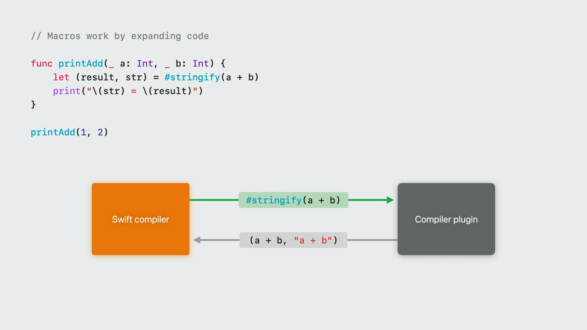

# Swift로 이해하는 매크로

> **면접 답변 한 줄 요약:** Swift 매크로는 소스 코드를 컴파일하는 동안 입력 구문을 다른 Swift 코드로 펼쳐, 반복 코드를 직접 작성하지 않고도 타입 검사를 받는 코드를 만들게 하는 기능이에요.

앱에서 같은 형태의 프로퍼티나 메서드를 여러 타입에 반복해서 작성하다 보면 복사한 코드를 빠뜨리거나 서로 다르게 고치기 쉬워요. 함수와 제네릭으로 실행 로직을 재사용할 수 있지만, 작성된 표현식 자체를 읽거나 선언에 새 멤버를 추가해야 하는 문제는 함수만으로 해결하기 어려워요.

Swift 매크로는 이런 반복을 **컴파일 시점의 소스 코드 변환**으로 다뤄요. 이 문서에서는 매크로를 사용하는 입장에서 확장 결과를 읽는 방법부터 시작해, Swift Package Manager로 작은 매크로를 만들고 테스트하는 과정까지 설명해요.

## 먼저 알아둘 매크로 용어

| 용어                   | 쉬운 뜻                                                                                                                                                           |
| ---------------------- | ----------------------------------------------------------------------------------------------------------------------------------------------------------------- |
| 컴파일 시점            | Swift 소스 코드를 앱이나 라이브러리로 만드는 때예요. 문법과 타입을 검사하고 실행 가능한 결과를 준비해요.                                                          |
| 런타임                 | 빌드가 끝난 프로그램을 실제로 실행하는 때예요. 사용자 입력, 네트워크 응답처럼 실행 중에만 알 수 있는 값은 런타임에 다뤄요.                                        |
| 반복 코드(boilerplate) | 규칙은 같지만 타입이나 이름이 달라 여러 곳에 되풀이해서 작성하는 코드예요.                                                                                        |
| 구문(syntax)           | 코드가 작성된 구조예요. `price * count`가 어떤 연산자와 피연산자로 이루어졌는지처럼 소스의 모양을 나타내요.                                                       |
| 구문 트리(syntax tree) | 소스 코드를 선언, 표현식, 토큰 같은 부모·자식 관계로 나타낸 트리예요. SwiftSyntax 트리는 원래 소스의 모양도 보존해요.                                             |
| 컴파일러 AST           | Abstract Syntax Tree의 줄임말이에요. 컴파일러가 이름과 타입의 의미를 분석하는 내부 트리예요. SwiftSyntax의 source-accurate 구문 트리와 같은 자료 구조는 아니에요. |
| 토큰(token)            | 식별자, 키워드, 연산자, 리터럴처럼 구문 트리의 가장 작은 소스 단위예요. `let total = 42`에는 `let`, `total`, `=`, `42` 토큰이 있어요.                             |
| trivia                 | 토큰 앞뒤의 공백, 줄바꿈, 주석처럼 문법의 핵심 구조는 아니지만 원본 소스를 복원하는 데 필요한 정보예요.                                                           |
| 매크로 호출            | `#stringify(price * count)`나 `@AddTypeName`처럼 매크로 사용을 요청하는 코드예요.                                                                                 |
| 매크로 확장            | 매크로 호출을 매크로가 생성한 Swift 코드로 펼치는 과정이에요. 생성된 결과도 다시 문법과 타입 검사를 받아요.                                                       |
| freestanding 매크로    | 다른 선언에 붙지 않고 `#`으로 독립적으로 호출하는 매크로예요. 표현식이나 선언을 만들 수 있어요.                                                                   |
| attached 매크로        | 타입, 프로퍼티, 함수 같은 선언에 `@`으로 붙이는 매크로예요. 붙은 위치에 멤버, 접근자, 확장 등을 추가할 수 있어요.                                                 |
| 매크로 역할(role)      | 매크로가 어디에서 사용되고 어떤 종류의 코드를 만들 수 있는지 정한 범위예요. `expression`, `member`, `peer` 등이 있어요.                                           |
| SwiftSyntax            | Swift 소스 코드를 구조화된 구문 트리로 읽고 만드는 공식 라이브러리예요. 사용자 정의 매크로 구현은 SwiftSyntax가 제공하는 타입을 이용해 입력과 출력을 다뤄요.      |
| 컴파일러 플러그인      | 컴파일러가 빌드 도중 실행해 매크로 확장을 요청하는 별도 프로그램이에요. 매크로 구현 타입을 등록해 컴파일러와 연결해요.                                            |
| 호스트(host)           | Xcode나 Swift 컴파일러가 실행되어 앱을 빌드하는 환경이에요. 매크로 플러그인은 이 환경에서 실행돼요.                                                               |
| 타깃(target)           | 빌드 결과인 앱이나 라이브러리가 실행될 환경이에요. iPhone용 앱을 Mac에서 빌드한다면 Mac은 호스트이고 iPhone은 타깃이에요.                                         |
| 진단(diagnostic)       | 컴파일러가 코드의 문제를 알려 주는 오류, 경고, 수정 제안이에요. 매크로도 잘못된 사용 위치에 직접 진단을 만들 수 있어요.                                           |

이 문서에서는 다음 내용을 설명해요.

- 함수와 매크로가 해결하는 문제의 차이
- 매크로 호출이 일반 Swift 코드로 확장되는 과정
- 컴파일러와 별도 플러그인 프로세스가 확장을 주고받는 빌드 과정
- SwiftSyntax의 노드·토큰·trivia 구조와 구문을 탐색·생성하는 방법
- freestanding 매크로와 attached 매크로의 역할
- 매크로 선언, 구현, 컴파일러 플러그인을 나누는 이유
- SwiftSyntax로 `#stringify`와 `@AddTypeName`을 구현하는 방법
- 확장 결과와 잘못된 입력을 테스트하는 방법
- 매크로를 적용할 때 얻는 이점과 감수해야 할 비용

## 함수는 값의 계산을 재사용하지만 소스의 모양은 알 수 없어요

상품 가격과 수량을 계산하면서 어떤 계산식이 사용됐는지 함께 기록한다고 가정해 볼게요.

```swift
let price = 12_000
let count = 3

let total = price * count
let log = "price * count = \(total)"
```

이 코드는 값과 계산식 문자열을 따로 작성해요. 계산을 `price * count + deliveryFee`로 바꾸고 문자열은 그대로 두면 기록이 실제 코드와 달라져요.

함수로 묶으면 계산 결과를 재사용할 수 있지만 호출부에 작성된 표현식의 모양까지 얻을 수는 없어요.

```swift
func record<T>(
  value: T,
  expression: String
) -> (value: T, expression: String) {
  (value, expression)
}

let recorded = record(
  value: price * count,
  expression: "price * count"
)
```

`record(value:expression:)`이 받는 것은 계산이 끝난 값과 별도로 작성한 문자열이에요. 함수가 `price * count`라는 원래 소스 구문을 되찾을 수는 없어요.

매크로는 컴파일러가 읽은 구문을 입력으로 받기 때문에 값의 계산식과 소스 표현을 한 호출에서 만들 수 있어요.

```swift
let recorded = #stringify(price * count)

print(recorded.0)
// 36000

print(recorded.1)
// price * count
```

`#stringify`는 런타임에 표현식을 분석하는 함수가 아니에요. 컴파일할 때 다음과 비슷한 일반 Swift 코드로 확장돼요.

```swift
let recorded = (price * count, "price * count")
```

계산식은 한 번만 작성하므로 값과 설명이 서로 달라질 가능성이 줄어요. 매크로가 생성한 튜플 표현식도 다른 Swift 코드처럼 문법과 타입 검사를 받아요.

## 매크로는 구문을 받아 Swift 코드로 펼쳐요

Swift 공식 [Macros 문서](https://docs.swift.org/swift-book/documentation/the-swift-programming-language/macros/)가 설명하는 확장 흐름을 단순하게 정리하면 다음과 같아요.

```text
Swift 소스
   │
   ▼
컴파일러가 구문 트리를 만듦
   │
   ▼
매크로 구현이 필요한 구문을 입력받음
   │
   ▼
새 Swift 구문을 만들어 반환함
   │
   ▼
컴파일러가 확장 결과의 문법과 타입을 검사함
   │
   ▼
일반 Swift 코드와 함께 빌드함
```

이 과정에서 구분해야 할 점이 두 가지 있어요.

첫째, **매크로 구현이 실행되는 시점**과 **생성된 코드가 실행되는 시점**은 달라요. 매크로 구현은 컴파일 중에 구문을 만들고, 생성된 코드의 실제 동작은 앱을 실행할 때 일어나요.

```swift
let result = #stringify(loadProduct())
```

컴파일 중에는 `loadProduct()`를 호출하지 않아요. 매크로는 호출 구문을 다음과 비슷하게 펼칠 뿐이에요.

```swift
let result = (loadProduct(), "loadProduct()")
```

`loadProduct()`는 완성된 프로그램이 이 줄을 실행할 때 호출돼요.

둘째, 매크로는 역할이 허용한 범위의 코드만 만들 수 있어요. 표현식 매크로는 표현식을 반환하고, 멤버 매크로는 타입 안에 멤버를 추가해요. 매크로 선언에 역할과 생성할 이름을 적기 때문에 호출부에서 어떤 종류의 변화가 생길지 제한할 수 있어요.

## 실제 빌드에서는 컴파일러와 플러그인이 분리돼요

Apple은 WWDC23의 [Expand on Swift macros](https://developer.apple.com/videos/play/wwdc2023/10167/)에서 `#stringify(a + b)`가 확장되는 과정을 다음처럼 설명해요.



_출처: Apple, [Expand on Swift macros의 매크로 변환 모델 장면(5:19)](https://developer.apple.com/videos/play/wwdc2023/10167/?time=319)_

화면의 초록색 화살표는 컴파일러가 매크로 사용 구문을 플러그인으로 보내는 요청이고, 회색 화살표는 플러그인이 `(a + b, "a + b")`라는 확장 구문을 돌려주는 응답이에요. 핵심은 **앱을 컴파일하는 프로그램**과 **매크로 구현을 실행하는 프로그램**이 같은 프로세스가 아니라는 점이에요.

전체 과정을 `#stringify(a + b)`로 따라가 볼게요.

### 1. 빌드 도구가 매크로 플러그인을 호스트용으로 준비해요

Xcode나 Swift Package Manager는 앱 타깃만 바로 컴파일하지 않아요. 먼저 의존 관계를 확인하고 `.macro` 타깃과 그 타깃이 의존하는 SwiftSyntax 모듈을 빌드해, 현재 **빌드 호스트**에서 실행할 수 있는 컴파일러 플러그인을 준비해요. Swift Evolution의 [SE-0394 Package Manager Support for Custom Macros](https://github.com/swiftlang/swift-evolution/blob/main/proposals/0394-swiftpm-expression-macros.md)도 매크로 플러그인이 컴파일러가 실행되는 호스트용 실행 파일로 빌드된다고 명시해요.

예를 들어 Apple Silicon Mac에서 iPhone 앱을 빌드해도 매크로 구현은 iPhone 안에서 실행되지 않아요. Mac에서 실행되어 iPhone용 소스를 생성해요. 따라서 매크로 구현 타깃은 앱의 런타임 의존성이 아니라 **빌드 도구 의존성**에 가까워요.

```text
Mac 빌드 호스트
├─ 매크로 구현 타깃 → 호스트에서 실행할 컴파일러 플러그인
└─ 앱 타깃 소스     → iPhone에서 실행할 앱 바이너리
```

매크로를 제공하는 패키지를 처음 빌드하거나 도구 모음을 바꾸면 플러그인과 SwiftSyntax 의존성도 다시 준비해야 하므로 초기 빌드 시간이 늘 수 있어요. 반대로 완성된 앱이 실행될 때 플러그인을 다시 실행하지는 않아요.

### 2. 컴파일러가 호출을 읽고 공개 선언부터 검사해요

컴파일러는 소스를 구문 구조로 읽고 `#stringify(a + b)`가 매크로 호출임을 발견해요. 이때 바로 구현을 실행하기보다 먼저 공개된 매크로 선언을 확인해요.

```swift
@freestanding(expression)
public macro stringify<T>(
  _ value: T
) -> (T, String) = #externalMacro(
  module: "LearningMacrosMacros",
  type: "StringifyMacro"
)
```

이 선언에는 다음 계약이 들어 있어요.

- `expression` 역할이므로 호출 위치를 하나의 표현식으로 대체해야 해요.
- 인자 `a + b`는 어떤 타입 `T`로 성립해야 해요.
- 매크로 결과는 `(T, String)`이 필요한 주변 문맥과 맞아야 해요.
- `#externalMacro`는 구현 플러그인 모듈과 구현 타입을 가리켜요.

SwiftSyntax의 공식 [Swift Macros 문서](https://github.com/swiftlang/swift-syntax/blob/main/Sources/SwiftSyntaxMacros/SwiftSyntaxMacros.docc/SwiftSyntaxMacros.md)는 인자나 결과 타입이 이 계약을 만족하지 않으면 확장을 적용하지 않고 컴파일 오류를 낸다고 설명해요. C 전처리 매크로처럼 타입 검사 전에 텍스트를 단순 치환하는 모델과 다른 지점이에요.

### 3. 컴파일러가 필요한 구문만 플러그인에 보내요

선언 검사를 통과하면 컴파일러는 `#externalMacro`가 가리키는 플러그인을 별도 프로세스로 실행하고, 매크로 사용 부분을 **소스의 표현을 보존하는 SwiftSyntax 트리**로 전달해요.

```text
MacroExpansionExprSyntax
├─ macroName: stringify
└─ arguments
   └─ InfixOperatorExprSyntax
      ├─ leftOperand: a
      ├─ operator: +
      └─ rightOperand: b
```

플러그인이 받는 핵심 입력은 타입 전체의 의미 정보가 아니라 매크로 역할에 필요한 구문 노드예요. 예를 들어 표현식 매크로는 호출 표현식을 받고, 멤버 매크로는 속성과 매크로가 붙은 선언을 받아요. 주변 프로젝트 전체를 자유롭게 탐색하는 일반 코드 생성기와는 입력 범위가 달라요.

Apple의 설명처럼 플러그인은 **보안 샌드박스의 별도 프로세스**에서 실행돼요. 파일을 읽거나 네트워크에 접근할 수 없으므로 원격 스키마나 로컬 설정 파일의 현재 내용에 의존하는 생성 작업에는 적합하지 않아요. 컴파일러와 플러그인이 구문 요청과 확장 응답을 주고받는 흐름은 프로세스 간 메시지 교환으로 이해할 수 있어요.

### 4. 플러그인이 SwiftSyntax로 확장 구문과 진단을 만들어요

플러그인은 등록된 `StringifyMacro.expansion(of:in:)`을 호출해 입력 구문을 검사하고 새 구문 노드를 만들어요.

```swift
public struct StringifyMacro: ExpressionMacro {
  public static func expansion(
    of node: some FreestandingMacroExpansionSyntax,
    in context: some MacroExpansionContext
  ) throws -> ExprSyntax {
    guard let argument = node.arguments.first?.expression else {
      throw MacroExpansionErrorMessage(
        "#stringify에는 표현식 하나가 필요해요."
      )
    }

    return "(\(argument), \(literal: argument.description))"
  }
}
```

반환값은 단순 문자열이 아니라 Swift 표현식을 나타내는 `ExprSyntax`예요. 문자열 리터럴 문법을 사용하더라도 SwiftSyntaxBuilder가 이를 파싱해 구문 트리로 만들어요. 잘못된 입력이라면 오류를 던지거나 `MacroExpansionContext`에 오류·경고·수정 제안을 기록할 수 있어요.

```text
요청: #stringify(a + b)의 SwiftSyntax 트리
  │
  ▼
StringifyMacro.expansion(of:in:)
  │
  ├─ 성공 → (a + b, "a + b") 구문 트리
  └─ 실패 → 오류·경고·Fix-It 진단
```

매크로 구현은 같은 프로세스에서 이전에 무엇을 확장했는지, 현재 시각이 무엇인지에 따라 결과를 바꾸면 안 돼요. Swift 공식 [Expressions 문서](https://docs.swift.org/swift-book/documentation/the-swift-programming-language/expressions/)에 따르면 성능 최적화를 위해 하나의 외부 프로세스를 여러 매크로 확장에 재사용할 수 있기 때문이에요. 같은 입력은 같은 결과를 만든다는 전제로 작성해야 증분 빌드와 진단 결과를 예측할 수 있어요.

### 5. 컴파일러가 확장을 원래 프로그램에 더하고 다시 검사해요

플러그인이 돌려준 `(a + b, "a + b")`는 컴파일러가 다루는 원래 프로그램의 알맞은 위치에 추가돼요. Swift 매크로 확장은 기존 코드를 임의로 지우거나 고치는 방식이 아니라 역할이 허용한 위치에 새 코드를 **더하는(additive)** 방식이에요.

```swift
let recorded: (Int, String) = #stringify(a + b)
```

개념적으로 확장 뒤에는 다음 코드와 함께 컴파일이 계속돼요.

```swift
let recorded: (Int, String) = (a + b, "a + b")
```

여기서 두 번째 안전망이 작동해요. 컴파일러는 생성된 구문이 올바른 Swift 문법인지, 새 표현식과 선언의 타입이 주변 코드와 맞는지 다시 검사해요. 따라서 “매크로가 만들었으니 타입 검사를 건너뛴다”는 의미가 아니에요.

| 검사 시점         | 주로 확인하는 내용                                                 | 실패하면 일어나는 일                  |
| ----------------- | ------------------------------------------------------------------ | ------------------------------------- |
| 확장 요청 전      | 매크로 선언의 역할, 인자 타입, 결과 타입과 주변 문맥               | 구현을 호출하지 않고 컴파일 오류      |
| 확장 구현 중      | 구현이 요구하는 구문 모양과 자체 제약                              | 매크로가 만든 진단으로 컴파일 오류    |
| 확장 결과 삽입 후 | 생성된 Swift 문법, 이름 해석, 타입과 접근 제어 등 일반 컴파일 규칙 | 생성 코드 또는 호출부에서 컴파일 오류 |

이후에는 타입 검사를 마친 일반 Swift 코드와 같은 컴파일 경로를 따라 중간 표현, 최적화, 목적 파일 생성과 링크 과정을 거쳐요. 앱 바이너리에는 매크로 호출을 처리하는 플러그인이 아니라 **확장으로 생긴 코드의 동작**이 반영돼요.

### 6. 중첩 매크로와 여러 역할은 확장을 반복해요

한 줄에 매크로가 여러 개 있으면 한꺼번에 섞어 처리하지 않고 각각 확장해요. 중첩된 freestanding 매크로는 바깥쪽부터 안쪽 순서로 펼쳐져요.

```swift
#outerMacro(12, #innerMacro(34))
```

먼저 `outerMacro`가 아직 펼쳐지지 않은 `#innerMacro(34)` 구문을 포함한 입력을 받고, 그 결과에 남은 안쪽 매크로를 다음 단계에서 확장해요.

attached 매크로가 `member`와 `extension`처럼 여러 역할을 가지면 역할마다 별도로 확장돼요. 각 확장은 다른 역할의 결과가 섞이지 않은 **같은 원본 구문**을 입력으로 받고, 컴파일러가 여러 결과를 역할에 맞는 위치에 모아요. 그러므로 한 역할의 확장이 먼저 실행되어 다른 역할이 그 결과를 볼 것이라고 가정하면 안 돼요.

### 7. 빌드 비용과 실패 지점을 함께 관리해요

매크로는 반복 코드를 줄이는 대신 빌드 과정에 플러그인 준비, 별도 프로세스 실행, 구문 생성, 확장 결과 검사를 추가해요. 다음 기준으로 비용과 문제를 줄일 수 있어요.

- `names:`에는 가능하면 `arbitrary` 대신 생성할 이름이나 접두사·접미사를 정확히 선언해요. 컴파일러가 존재하지 않는 멤버를 찾기 위해 불필요하게 매크로를 확장하는 일을 줄일 수 있어요.
- 호출 하나에서 지나치게 큰 구문 트리를 만들지 않아요. 생성 코드가 커질수록 파싱, 타입 검사, 최적화와 바이너리 크기의 비용도 커질 수 있어요.
- 현재 시각, 난수, 이전 확장의 전역 상태처럼 외부 상태에 기대지 않아요. 플러그인 프로세스 재사용 여부와 무관하게 결과가 같아야 해요.
- Swift 도구 모음을 올릴 때 SwiftSyntax 호환 버전과 매크로 패키지를 함께 확인해요. 플러그인을 로드하지 못하거나 구현 타입을 찾지 못하면 앱 실행 전 빌드 단계에서 실패해요.
- 확장 문자열 단위 테스트와 실제 클라이언트 타깃 빌드를 함께 실행해요. 전자는 변환 규칙을 빠르게 확인하고, 후자는 생성 코드가 주변 타입과 함께 성립하는지 확인해요.

테스트할 때는 실행 경계도 달라져요. `assertMacroExpansion`을 사용하는 테스트 타깃은 매크로 구현을 테스트 프로세스에 직접 연결하므로 `expansion` 함수에 중단점을 걸 수 있어요. 실제 앱 빌드에서는 구현이 샌드박스의 플러그인 프로세스에서 실행된다는 차이를 기억하세요.

## SwiftSyntax는 소스의 모양을 보존하는 구문 트리 도구예요

[SwiftSyntax 공식 저장소](https://github.com/swiftlang/swift-syntax)는 SwiftSyntax를 Swift 소스를 파싱하고, 검사하고, 생성하고, 변환하는 라이브러리 모음으로 설명해요. 그 중심에는 **source-accurate syntax tree**, 즉 원본 소스의 표현을 정확히 보존하는 구문 트리가 있어요.

SwiftSyntax는 매크로만을 위한 라이브러리가 아니에요. 포매터, 린터, 리팩터링 도구, 코드 생성기처럼 Swift 소스의 구조를 읽거나 바꾸는 도구에도 사용할 수 있어요. 매크로에서는 컴파일러가 입력과 출력 구문을 SwiftSyntax 노드로 주고받기 때문에 이 트리가 확장 구현의 공통 언어가 돼요.

### 문자열 대신 부모와 자식이 있는 트리로 코드를 읽어요

다음 매크로 호출을 문자열로만 보면 `#`, 괄호, 쉼표의 위치를 직접 계산해야 해요.

```swift
#stringify(price * count)
```

SwiftSyntax에서는 대략 다음과 같은 구조로 읽을 수 있어요.

```text
MacroExpansionExprSyntax
├─ pound: TokenSyntax("#")
├─ macroName: TokenSyntax("stringify")
├─ leftParen: TokenSyntax("(")
├─ arguments: LabeledExprListSyntax
│  └─ LabeledExprSyntax
│     └─ expression: InfixOperatorExprSyntax
│        ├─ leftOperand: DeclReferenceExprSyntax("price")
│        ├─ operator: BinaryOperatorExprSyntax("*")
│        └─ rightOperand: DeclReferenceExprSyntax("count")
└─ rightParen: TokenSyntax(")")
```

이름에 붙은 접미사를 먼저 읽으면 역할을 예상하기 쉬워요.

| 접미사·타입      | 나타내는 것                                                    | 예시                                              |
| ---------------- | -------------------------------------------------------------- | ------------------------------------------------- |
| `Syntax`         | 하나의 구문 노드                                               | `StructDeclSyntax`, `FunctionCallExprSyntax`      |
| `ExprSyntax`     | 여러 구체 표현식 노드를 담을 수 있는 표현식 기본 노드          | 함수 호출, 연산식, 리터럴                         |
| `DeclSyntax`     | 여러 구체 선언 노드를 담을 수 있는 선언 기본 노드              | 구조체, 함수, 변수 선언                           |
| `...ListSyntax`  | 같은 위치에 반복되는 노드의 목록                               | 인자 목록인 `LabeledExprListSyntax`               |
| `TokenSyntax`    | 식별자, 키워드, 연산자 같은 말단 토큰                          | `stringify`, `struct`, `*`                        |
| `Trivia`         | 토큰 앞뒤의 공백, 줄바꿈, 일반 주석과 문서 주석                | `.spaces(2)`, `.newlines(1)`, `.lineComment(...)` |
| `SyntaxProtocol` | 모든 형식화된 SwiftSyntax 노드가 공통으로 제공하는 기능의 계약 | 자식·토큰 탐색, 위치 확인, 노드 종류 변환         |

`ExprSyntax`와 `DeclSyntax`는 구체적인 문법 하나를 뜻하지 않아요. 여러 종류의 표현식이나 선언을 한 타입으로 전달하기 위한 기본 노드예요. 실제 구조를 읽으려면 `FunctionCallExprSyntax`, `VariableDeclSyntax` 같은 구체 노드로 안전하게 변환해야 해요.

### 토큰과 trivia가 있어 원본 소스를 다시 만들 수 있어요

구문 노드는 코드의 문법 구조를 나타내고, `TokenSyntax`는 실제 소스 글자를 담아요. 토큰의 `leadingTrivia`와 `trailingTrivia`에는 공백, 줄바꿈, 주석이 들어가요.

```swift
// 상품 금액을 계산해요.
let total = price * count
```

위 코드에서 `let`, `total`, `=`, `price`, `*`, `count`는 토큰이에요. 주석과 각 토큰 사이의 공백·줄바꿈은 인접한 토큰의 trivia로 보존돼요. 그래서 트리를 수정하지 않고 다시 출력하면 원본의 주석과 서식을 유지할 수 있어요.

```swift
let nameToken: TokenSyntax = structDecl.name

print(nameToken.text)
// Product

print(nameToken.leadingTrivia)
print(nameToken.trailingTrivia)
```

식별자 이름만 비교할 때는 공백과 주석까지 포함할 수 있는 `description`보다 `TokenSyntax.text`를 사용하세요. 반대로 노드 전체를 소스로 출력할 때는 `description`이 원본 표현을 보존하는 데 유용해요.

새 주석이나 공백도 명시적으로 붙일 수 있어요.

```swift
let documentation: Trivia = [
  .docLineComment("/// 매크로가 생성한 타입 이름이에요."),
  .newlines(1),
]

let documentedProperty = property.with(
  \.leadingTrivia,
  documentation
)
```

trivia를 직접 조립하면 출력 모양을 세밀하게 제어할 수 있지만, 모든 공백을 손으로 관리하면 구현이 복잡해져요. 구조를 먼저 정확히 만들고 필요한 주석만 보존한 뒤 `formatted()`나 프로젝트 포매터로 일반 서식을 맞추는 편이 단순해요.

### SwiftSyntax 트리와 컴파일러 AST는 목적이 달라요

SwiftSyntax 트리를 설명할 때 편의상 AST라고 부르는 자료도 있지만, 둘을 같은 것으로 생각하면 매크로가 알 수 있는 범위를 오해하기 쉬워요. SwiftSyntax는 원본 표현에 가까운 **구문 구조**이고, 컴파일러 AST는 이름 조회와 타입 검사 같은 **의미 분석**에 사용하는 내부 표현이에요.

| 비교 기준          | 원본 문자열                        | SwiftSyntax 트리                           | 컴파일러의 의미 AST                          |
| ------------------ | ---------------------------------- | ------------------------------------------ | -------------------------------------------- |
| 주된 질문          | 어떤 글자가 적혀 있는가            | 어떤 문법 요소가 어떻게 배치됐는가         | 이 이름과 표현식이 실제로 무엇을 뜻하는가    |
| 구조               | 별도 구조가 없는 문자 나열         | 선언·표현식·토큰의 부모와 자식 트리        | 이름 조회와 타입 정보가 연결된 컴파일러 구조 |
| 공백·주석 보존     | 그대로 포함                        | trivia로 구조와 함께 보존                  | 의미 분석에 필요하지 않은 표현은 핵심이 아님 |
| 타입 추론 결과     | 없음                               | 기본적으로 없음                            | 있음                                         |
| 매크로 구현의 입력 | 직접 다루지 않음                   | 역할에 해당하는 구문 하위 트리             | 일반 매크로 API로 직접 전달되지 않음         |
| 잘 맞는 작업       | 단순 출력이나 정확히 알려진 템플릿 | 매크로, 포매터, 린터, 리팩터링과 코드 생성 | 컴파일, 타입 검사와 최적화                   |

예를 들어 다음 코드에서 SwiftSyntax는 `makeProduct()`가 함수 호출이라는 모양과 이름을 알 수 있어요.

```swift
let product = makeProduct()
```

하지만 오버로드 중 어떤 함수가 선택됐는지, 반환 타입이 `Product`인지, `product`가 어떤 프로토콜을 준수하는지는 구문만 보고 확정할 수 없어요. 매크로 선언을 기준으로 호출의 인자와 결과 타입은 컴파일러가 검사하지만, 그 타입 검사 결과 전체가 매크로 구현의 SwiftSyntax 노드에 들어오는 것은 아니에요.

따라서 매크로의 생성 규칙은 가능하면 다음처럼 **소스에 명시된 구문**에서 결정하세요.

- 선언에 적힌 이름, 접근 수준, 속성과 제네릭 인자
- 구조체나 열거형 안에 직접 작성된 멤버와 `case`
- 매크로 호출에 직접 전달된 리터럴과 표현식의 모양
- `MacroExpansionContext`가 명시적으로 제공하는 고유 이름과 진단 기능

타입 추론 결과나 프로젝트 전체의 이름 조회가 꼭 필요하다면 매크로 하나로 해결할 수 있는지 먼저 검토해야 해요.

### 패키지의 모듈은 구문 처리 단계를 나눠 맡아요

`swift-syntax` 패키지는 하나의 거대한 모듈이 아니라 작업별 모듈을 제공해요. 매크로 템플릿이 여러 모듈을 가져오는 이유도 책임이 다르기 때문이에요.

| 모듈                           | 책임                                                               |
| ------------------------------ | ------------------------------------------------------------------ |
| `SwiftSyntax`                  | 구문 노드, 토큰, trivia와 트리 탐색 API                            |
| `SwiftParser`                  | Swift 소스 문자열을 `SourceFileSyntax` 같은 구문 트리로 파싱       |
| `SwiftSyntaxBuilder`           | 문자열 보간, result builder와 initializer로 새 구문 노드를 생성    |
| `SwiftSyntaxMacros`            | `ExpressionMacro`, `MemberMacro` 같은 매크로 역할과 확장 문맥 제공 |
| `SwiftDiagnostics`             | 오류, 경고, note와 Fix-It을 표현하는 진단 모델                     |
| `SwiftSyntaxMacrosTestSupport` | 입력 소스와 예상 매크로 확장을 비교하는 테스트 도우미              |

매크로의 `expansion` 함수는 컴파일러 플러그인이 이미 파싱한 노드를 받아요. 따라서 매크로 인자를 읽기 위해 `SwiftParser`로 같은 문자열을 다시 파싱할 필요가 없어요. `SwiftParser`는 독립적인 소스 분석 도구나 전체 파일을 다루는 테스트를 만들 때 유용해요.

### 구체 노드로 변환해 필요한 부분만 읽어요

모든 형식화된 노드는 `SyntaxProtocol`을 통해 `is`, `as`, `cast` 같은 변환 기능을 제공해요.

| API                 | 결과                             | 사용할 때                                               |
| ------------------- | -------------------------------- | ------------------------------------------------------- |
| `node.is(T.self)`   | 해당 타입인지 나타내는 `Bool`    | 종류만 확인하고 구체 프로퍼티는 읽지 않을 때            |
| `node.as(T.self)`   | 성공하면 `T`, 아니면 `nil`       | 입력 형태가 달라질 수 있는 일반적인 매크로 코드         |
| `node.cast(T.self)` | 성공하면 `T`, 실패하면 실행 중단 | 컴파일러와 코드가 보장하는 불변 조건이 정말 확실할 때만 |

attached 매크로가 구조체의 이름과 프로퍼티 이름을 읽는 과정을 살펴볼게요.

```swift
guard let structDecl = declaration.as(StructDeclSyntax.self) else {
  throw MacroExpansionErrorMessage(
    "이 매크로는 구조체에만 사용할 수 있어요."
  )
}

let typeName = structDecl.name.text

let propertyNames = structDecl.memberBlock.members.compactMap {
  member -> String? in
  guard
    let variable = member.decl.as(VariableDeclSyntax.self),
    let binding = variable.bindings.first,
    let identifier = binding.pattern.as(
      IdentifierPatternSyntax.self
    )
  else {
    return nil
  }

  return identifier.identifier.text
}
```

코드는 `StructDeclSyntax`에서 `memberBlock`, `members`, `VariableDeclSyntax`, `PatternBindingSyntax`, `IdentifierPatternSyntax` 순서로 트리를 내려가요. 문자열에서 `let`이나 콜론 위치를 찾지 않기 때문에 속성, 줄바꿈, 타입 표기가 추가돼도 문법 구조를 기준으로 읽을 수 있어요.

예시는 흐름을 보여 주기 위해 각 변수 선언의 첫 번째 바인딩만 읽어요. `let width = 10, height = 20`처럼 한 선언에 바인딩이 여러 개 있거나 계산 프로퍼티를 제외해야 하는 실제 매크로라면 `variable.bindings` 전체와 `accessorBlock`까지 확인해야 해요.

지원하지 않는 노드에서 `cast`로 강제 변환해 플러그인을 중단시키기보다 `as`로 검사하고 호출 위치에 진단을 내세요. 입력 형태가 잘못된 것은 사용자가 고칠 수 있는 컴파일 오류이지 매크로 프로세스가 중단돼야 하는 내부 오류가 아니에요.

### 전체 Swift 파일은 SwiftParser로 직접 파싱할 수 있어요

매크로 바깥에서 Swift 소스를 분석하는 도구라면 `SwiftParser`로 문자열을 `SourceFileSyntax`로 바꿀 수 있어요.

```swift
import SwiftParser
import SwiftSyntax

let source = """
struct Product {
  let name: String
}
"""

let sourceFile = Parser.parse(source: source)

precondition(
  !sourceFile.hasError,
  "파싱 오류가 포함된 소스예요."
)

for token in sourceFile.tokens(viewMode: .sourceAccurate) {
  print(token.tokenKind, token.text)
}
```

SwiftParser는 편집 중인 불완전한 코드도 가능한 만큼 구조화해요. 빠진 문법은 missing 노드나 토큰으로, 예상하지 못한 입력은 unexpected 노드로 트리에 나타낼 수 있어요. `hasError`로 이런 오류가 포함됐는지 확인할 수 있어요.

트리를 순회할 때는 목적에 맞는 `SyntaxTreeViewMode`를 골라요.

| 모드              | missing 노드 | unexpected 노드 | 잘 맞는 작업                                   |
| ----------------- | ------------ | --------------- | ---------------------------------------------- |
| `.sourceAccurate` | 제외         | 포함            | 원본을 그대로 재현해야 하는 포매팅과 변환      |
| `.fixedUp`        | 포함         | 제외            | 문법 오류가 보정됐다고 보고 수행하는 구조 분석 |
| `.all`            | 포함         | 포함            | 파서 오류와 복구 결과까지 모두 검사하는 도구   |

현재 노드의 직접 자식은 `children(viewMode:)`, 모든 토큰은 `tokens(viewMode:)`로 볼 수 있어요. 전체 트리에서 특정 노드를 반복해 찾는 읽기 작업은 `SyntaxVisitor`, 노드를 교체해 새 트리를 만드는 작업은 `SyntaxRewriter`가 적합해요. SwiftSyntax 공식 예제의 `AddOneToIntegerLiterals`도 `SyntaxRewriter`로 모든 정수 리터럴 토큰을 방문하고 바뀐 토큰을 반환해요.

### 새 구문은 세 가지 방식으로 만들어요

SwiftSyntax 공식 [Swift Macros 문서](https://github.com/swiftlang/swift-syntax/blob/main/Sources/SwiftSyntaxMacros/SwiftSyntaxMacros.docc/SwiftSyntaxMacros.md)는 새 노드를 만드는 핵심 방법을 문자열 리터럴, result builder initializer, memberwise initializer 세 가지로 나눠요.

#### 고정된 모양은 구문 문자열 보간이 간결해요

생성할 코드의 뼈대가 작고 일정하다면 구문 문자열 보간이 읽기 쉬워요.

```swift
let typeName = structDecl.name.text

let property: DeclSyntax = """
  static let typeName = \(literal: typeName)
  """
```

이 값의 타입은 `String`이 아니라 `DeclSyntax`예요. SwiftSyntaxBuilder가 문자열 리터럴을 파싱해 선언 구문 트리로 만들어요. `literal:` 보간은 `Product` 같은 값을 따옴표와 이스케이프가 올바른 Swift 문자열 리터럴로 바꿔요.

기존 `SyntaxProtocol` 노드를 `\(node)`로 보간하면 그 노드를 구문으로 삽입하고, `\(literal: value)`는 값을 안전한 리터럴로 만들어요. `\(raw: text)`는 문자열을 Swift 코드로 그대로 넣으므로, 외부 입력이나 검증하지 않은 이름에 사용하면 의도하지 않은 구문까지 생성할 수 있어요. 식별자는 유효성을 확인해 `TokenSyntax.identifier(...)`로 만들고 값은 가능한 한 `literal:`을 사용하세요.

#### 반복되는 자식은 result builder로 구성해요

입력 개수에 따라 멤버나 `case`가 반복된다면 result builder가 자연스러워요.

```swift
let propertyNames = ["name", "price"]

let metadata = StructDeclSyntax(name: "ProductMetadata") {
  for propertyName in propertyNames {
    let identifier = TokenSyntax.identifier(propertyName)

    DeclSyntax(
      "static let \(identifier) = \(literal: propertyName)"
    )
  }
}
```

`StructDeclSyntax`의 trailing closure는 멤버 목록을 만드는 result builder예요. 일반 Swift의 `for`와 `if`로 필요한 노드만 추가할 수 있어서 긴 문자열 하나에 줄을 이어 붙이는 방식보다 반복 구조가 분명해요.

#### 모든 자식을 제어할 때 memberwise initializer를 사용해요

토큰 종류, modifier, 타입 표기와 trivia를 정확히 지정해야 한다면 각 자식을 직접 전달할 수 있어요.

```swift
let property = VariableDeclSyntax(
  leadingTrivia: .newline,
  bindingSpecifier: .keyword(.let)
) {
  PatternBindingSyntax(
    pattern: PatternSyntax("typeName"),
    typeAnnotation: TypeAnnotationSyntax(
      type: TypeSyntax("String")
    )
  )
}
```

이 방식은 가장 세밀하지만 Swift 문법의 하위 노드를 많이 알아야 하고 코드도 길어요. 하나만 고집할 필요는 없어요. 바깥 구조는 result builder로 만들고, 고정된 작은 선언은 문자열 보간으로 만들며, 특별히 제어해야 하는 일부 토큰만 memberwise initializer로 구성할 수 있어요.

| 생성 방식              | 장점                                       | 비용·주의점                                     |
| ---------------------- | ------------------------------------------ | ----------------------------------------------- |
| 구문 문자열 보간       | 실제 Swift 코드처럼 읽히고 짧음            | 큰 동적 구조는 문자열 안에서 흐름을 보기 어려움 |
| result builder         | 반복·조건에 따라 자식 노드를 추가하기 쉬움 | 사용 가능한 builder 자식 타입을 알아야 함       |
| memberwise initializer | 토큰과 자식을 가장 정확하게 제어           | 가장 장황하고 SwiftSyntax API 변경의 영향이 큼  |

### 기존 노드는 값처럼 복사해 바꾼 결과를 반환해요

`SyntaxProtocol.with(_:_:)`은 지정한 자식만 바꾼 새 노드를 반환해요. 원래 노드를 공유하는 다른 코드가 몰래 바뀌는 방식이 아니에요.

```swift
let original = TokenSyntax.identifier("typeName")

let renamed = original.with(
  \.tokenKind,
  .identifier("displayName")
)

print(original.text)
// typeName

print(renamed.text)
// displayName
```

트리 전체를 체계적으로 바꿀 때는 `SyntaxRewriter`의 `visit` 메서드에서 바뀐 노드를 반환해요. 단순히 정보를 모으기만 한다면 새 노드를 만들지 않는 `SyntaxVisitor`가 의도를 더 잘 보여 줘요.

### Swift 도구 모음과 SwiftSyntax 버전을 맞춰요

Swift 문법에 새 기능이 추가되면 이를 표현하는 노드와 토큰 API도 함께 달라져요. 그래서 SwiftSyntax 릴리스는 Swift 언어·도구 모음 릴리스와 정렬돼요. 공식 저장소는 `509.x`가 Swift 5.9에 대응하는 예를 들어 이 관계를 설명해요.

| Swift 도구 모음 예시 | 대응하는 SwiftSyntax 주 버전 예시 |
| -------------------- | --------------------------------- |
| Swift 5.9            | `509.x`                           |
| Swift 5.10           | `510.x`                           |
| Swift 6.0            | `600.x`                           |
| Swift 6.1            | `601.x`                           |
| Swift 6.2            | `602.x`                           |
| Swift 6.3            | `603.x`                           |

무조건 가장 큰 버전 숫자를 선택하지 마세요. `swift package init --type macro`가 현재 도구 모음에 맞춰 만든 의존성이나 [SwiftSyntax 릴리스](https://github.com/swiftlang/swift-syntax/releases)를 기준으로 시작하고, Xcode 또는 Swift 도구 모음을 올릴 때 SwiftSyntax와 매크로 구현도 함께 빌드·테스트하세요.

버전에 따라 `argumentList`가 `arguments`로 바뀌는 것처럼 프로퍼티 이름이 이동하거나 deprecated API가 제거될 수 있어요. 인터넷 예제를 그대로 복사하기보다 그 예제가 대상으로 한 SwiftSyntax 버전을 먼저 확인해야 해요.

### 트리는 확장 테스트와 디버거에서 직접 확인해요

노드 이름을 추측하며 구현하기보다 실제 입력 트리를 확인하는 편이 빨라요. Apple의 [Write Swift macros](https://developer.apple.com/videos/play/wwdc2023/10166/)와 SwiftSyntax 공식 문서는 다음 흐름을 권장해요.

1. Xcode에서 매크로 호출을 우클릭하고 **Expand Macro**로 생성 결과를 확인해요.
2. `assertMacroExpansion` 테스트를 만들고 `expansion(of:in:)`에 중단점을 걸어요.
3. LLDB에서 `po node` 또는 `po node.debugDescription`으로 입력 트리와 구체 노드를 확인해요.
4. 예상 확장 문자열뿐 아니라 잘못된 입력의 진단 위치와 메시지도 테스트해요.
5. 마지막에는 클라이언트 타깃을 빌드해 생성 코드의 실제 타입 검사까지 확인해요.

[Swift AST Explorer](https://swift-ast-explorer.com/)는 코드를 붙여 넣어 SwiftSyntax 트리를 대화형으로 살펴볼 수 있는 커뮤니티 도구예요. 빠른 탐색에는 편리하지만, 실제 프로젝트가 사용하는 도구 모음과 노드 이름이 다를 수 있으므로 최종 구현은 현재 패키지의 테스트와 디버거에서 다시 확인하세요.

## freestanding과 attached는 호출 위치가 달라요

Swift 매크로는 호출 형태에 따라 크게 두 종류로 나뉘어요.

| 종류                | 호출 형태                    | 입력이 되는 코드                        | 대표적인 결과                                |
| ------------------- | ---------------------------- | --------------------------------------- | -------------------------------------------- |
| freestanding 매크로 | `#macroName(...)`            | 매크로 호출과 인자                      | 표현식, 선언, 컴파일 시점 진단               |
| attached 매크로     | `@MacroName` 또는 `@Macro()` | 매크로가 붙은 타입, 프로퍼티, 함수 선언 | 새 멤버, 접근자, 같은 범위의 선언, 타입 확장 |

freestanding 매크로는 코드 안에서 독립적으로 보여요. Swift가 기본으로 제공하는 `#function`은 현재 선언의 이름을 만들고, `#warning`은 컴파일 중 경고를 발생시켜요.

```swift
func loadProducts() {
  print("실행 중인 함수: \(#function)")
  #warning("실제 상품 API를 연결해야 해요.")
}
```

attached 매크로는 선언 바로 앞에 속성처럼 붙어요.

```swift
@AddTypeName
struct Product {
  let name: String
}
```

`@AddTypeName`이 멤버 역할을 가진 매크로라면 `Product` 안에 새 프로퍼티를 생성할 수 있어요. 호출 문법만 봐도 독립적으로 값을 만드는지, 특정 선언을 확장하는지 구분할 수 있어요.

## 역할은 매크로가 만들 수 있는 코드의 위치를 정해요

매크로 선언에는 `@freestanding` 또는 `@attached` 속성으로 역할을 표시해요. 자주 사용하는 역할을 먼저 살펴볼게요.

| 선언에 적는 역할             | 구현 프로토콜          | 생성할 수 있는 코드                                   |
| ---------------------------- | ---------------------- | ----------------------------------------------------- |
| `@freestanding(expression)`  | `ExpressionMacro`      | 호출 위치를 대신할 하나의 표현식                      |
| `@freestanding(declaration)` | `DeclarationMacro`     | 호출 위치에 놓일 하나 이상의 선언                     |
| `@attached(peer)`            | `PeerMacro`            | 붙은 선언과 같은 범위의 새 선언                       |
| `@attached(member)`          | `MemberMacro`          | 붙은 타입이나 확장 내부의 프로퍼티, 메서드, 중첩 타입 |
| `@attached(memberAttribute)` | `MemberAttributeMacro` | 붙은 타입 내부의 멤버에 적용할 속성                   |
| `@attached(accessor)`        | `AccessorMacro`        | 프로퍼티의 getter, setter 같은 접근자                 |
| `@attached(extension)`       | `ExtensionMacro`       | 타입의 확장, 프로토콜 준수, 확장 내부의 선언          |
| `@attached(body)`            | `BodyMacro`            | 함수나 접근자의 본문                                  |

예를 들어 비동기 함수 옆에 completion handler 버전의 함수를 만든다면 `peer`가 어울리고, 구조체 안에 프로퍼티를 추가한다면 `member`가 어울려요. 여러 위치를 함께 생성해야 하는 매크로는 역할을 여러 개 선언할 수도 있어요.

초기 매크로 자료에서는 프로토콜 준수를 `conformance` 역할로 설명하기도 해요. [SE-0402 Extension Macros](https://github.com/swiftlang/swift-evolution/blob/main/proposals/0402-extension-macros.md) 이후에는 새 매크로에서 더 일반적인 `extension` 역할과 `conformances:` 인자를 사용해 타입 확장과 프로토콜 준수를 표현해요.

모든 역할을 외우기보다 **생성하려는 코드가 문법적으로 어디에 놓여야 하는가**를 먼저 물어보세요. 그 답이 역할과 구현 프로토콜을 결정해요.

## 매크로 선언과 구현은 서로 다른 책임을 가져요

일반 함수는 선언과 본문을 한곳에 작성할 수 있지만, 사용자 정의 매크로는 세 부분으로 나뉘어요.

```text
매크로 라이브러리
  └─ public macro 선언
       │ 이름, 인자, 결과 타입, 역할을 공개
       ▼
매크로 구현 타깃
  └─ ExpressionMacro 같은 프로토콜 구현
       │ 입력 구문을 출력 구문으로 변환
       ▼
컴파일러 플러그인
  └─ 구현 타입을 컴파일러에 등록
```

매크로를 사용하는 앱이나 라이브러리는 공개된 매크로 선언을 가져와요. 컴파일러는 선언의 `#externalMacro(module:type:)` 정보를 따라 별도로 빌드된 구현 타입에 확장을 요청해요.

구현을 분리하는 이유는 매크로 구현이 매크로 사용 코드를 빌드하는 동안 컴파일러가 실행할 프로그램이기 때문이에요. 앱의 런타임 코드와 매크로 구현의 실행 환경은 같지 않아요.

## Swift Package Manager 템플릿으로 시작해요

Swift 5.9 이상 도구 모음에서는 다음 명령으로 실행 가능한 예제와 테스트가 포함된 매크로 패키지를 만들 수 있어요.

```sh
mkdir LearningMacros
cd LearningMacros
swift package init --type macro
```

현재 도구 모음의 템플릿은 대체로 다음과 같은 구조를 만들어요. 실제 이름은 패키지 이름에 따라 달라져요.

```text
LearningMacros/
├─ Package.swift
├─ Sources/
│  ├─ LearningMacros/
│  │  └─ LearningMacros.swift
│  ├─ LearningMacrosMacros/
│  │  └─ LearningMacrosMacro.swift
│  └─ LearningMacrosClient/
│     └─ main.swift
└─ Tests/
   └─ LearningMacrosTests/
      └─ LearningMacrosTests.swift
```

각 폴더의 역할은 다음과 같아요.

| 위치                   | 책임                                                      |
| ---------------------- | --------------------------------------------------------- |
| `LearningMacros`       | 사용하는 코드에 공개할 `public macro` 선언                |
| `LearningMacrosMacros` | SwiftSyntax로 작성한 확장 구현과 컴파일러 플러그인 진입점 |
| `LearningMacrosClient` | 매크로를 실제로 호출해 보는 실행 예제                     |
| `LearningMacrosTests`  | 입력 소스와 예상 확장 결과를 비교하는 테스트              |

`Package.swift`에서는 `CompilerPluginSupport`를 가져오고 `.macro` 타깃을 선언해요. 아래 코드는 핵심 관계만 보여 주는 일부예요.

```swift
import PackageDescription
import CompilerPluginSupport

let package = Package(
  name: "LearningMacros",
  products: [
    .library(
      name: "LearningMacros",
      targets: ["LearningMacros"]
    ),
  ],
  dependencies: [
    .package(
      url: "https://github.com/swiftlang/swift-syntax.git",
      from: "<현재 Swift 도구 모음과 호환되는 버전>"
    ),
  ],
  targets: [
    .macro(
      name: "LearningMacrosMacros",
      dependencies: [
        .product(
          name: "SwiftSyntaxMacros",
          package: "swift-syntax"
        ),
        .product(
          name: "SwiftCompilerPlugin",
          package: "swift-syntax"
        ),
      ]
    ),
    .target(
      name: "LearningMacros",
      dependencies: ["LearningMacrosMacros"]
    ),
  ]
)
```

SwiftSyntax는 Swift 컴파일러의 구문과 함께 변하므로 임의의 최신 버전을 고르지 않는 편이 좋아요. `swift package init --type macro`가 현재 도구 모음에 맞춰 생성한 의존성 버전을 출발점으로 사용하고, 도구 모음을 올릴 때 함께 호환성을 확인하세요.

## freestanding 표현식 매크로를 선언해요

앞에서 사용한 `#stringify`를 만들어 볼게요. 먼저 `Sources/LearningMacros/LearningMacros.swift`에 사용하는 코드가 볼 공개 선언을 작성해요.

```swift
@freestanding(expression)
public macro stringify<T>(
  _ value: T
) -> (T, String) = #externalMacro(
  module: "LearningMacrosMacros",
  type: "StringifyMacro"
)
```

선언을 한 부분씩 읽어 보면 다음과 같아요.

- `@freestanding(expression)`은 `#stringify(...)`가 하나의 표현식으로 확장된다는 뜻이에요.
- `public macro stringify<T>`는 매크로의 이름과 제네릭 매개변수를 선언해요.
- `(_ value: T) -> (T, String)`은 호출 인자와 확장 결과의 타입 계약이에요.
- `#externalMacro`는 실제 구현이 있는 모듈과 타입을 컴파일러에 알려 줘요.

매크로 선언은 함수 시그니처와 비슷해요. 컴파일러는 이 정보를 이용해 호출 인자와 사용 위치의 타입을 검사할 수 있어요.

```swift
let result: (Int, String) = #stringify(20 + 22)
```

`20 + 22`와 확장 결과가 선언의 타입 계약을 만족해야 빌드가 계속돼요.

## SwiftSyntax로 표현식 확장을 구현해요

이제 `LearningMacrosMacros` 타깃에 `StringifyMacro` 구현을 작성해요.

```swift
import SwiftSyntax
import SwiftSyntaxBuilder
import SwiftSyntaxMacros

public struct StringifyMacro: ExpressionMacro {
  public static func expansion(
    of node: some FreestandingMacroExpansionSyntax,
    in context: some MacroExpansionContext
  ) throws -> ExprSyntax {
    guard let argument = node.arguments.first?.expression else {
      throw MacroExpansionErrorMessage(
        "#stringify에는 표현식 하나가 필요해요."
      )
    }

    return "(\(argument), \(literal: argument.description))"
  }
}
```

`ExpressionMacro`가 요구하는 `expansion(of:in:)`은 매크로 호출 구문을 받고 새 `ExprSyntax`를 반환해요.

```swift
#stringify(price * count)
```

위 호출에서 `node.arguments.first?.expression`은 `price * count` 구문이에요. 반환문의 두 보간은 역할이 달라요.

```swift
return "(\(argument), \(literal: argument.description))"
```

- `\(argument)`는 입력 구문을 코드로 삽입해요.
- `\(literal: argument.description)`은 입력 구문의 텍스트를 안전한 Swift 문자열 리터럴로 만들어요.

따라서 결과는 다음 표현식과 같아요.

```swift
(price * count, "price * count")
```

구문 노드를 무조건 일반 문자열로 조립하면 따옴표나 문자열 보간 같은 문자를 잘못 이스케이프할 수 있어요. 기존 구문은 구문 노드로, 새 문자열 값은 `literal:` 보간으로 구분하면 의도가 분명해져요.

## 컴파일러 플러그인에 구현 타입을 등록해요

구현 타입을 만들었더라도 컴파일러 플러그인의 목록에 등록하지 않으면 컴파일러가 찾을 수 없어요.

```swift
import SwiftCompilerPlugin
import SwiftSyntaxMacros

@main
struct LearningMacrosPlugin: CompilerPlugin {
  let providingMacros: [Macro.Type] = [
    StringifyMacro.self,
  ]
}
```

`providingMacros`에는 이 타깃이 제공하는 매크로 구현 타입을 모두 넣어요. 공개 선언의 `type: "StringifyMacro"`와 등록한 타입 이름이 일치해야 해요.

이제 클라이언트 타깃에서 라이브러리를 가져와 사용할 수 있어요.

```swift
import LearningMacros

let price = 12_000
let count = 3
let (total, expression) = #stringify(price * count)

print("\(expression) = \(total)")
// price * count = 36000
```

## attached 멤버 매크로는 타입 안에 코드를 추가해요

이번에는 타입 이름을 보여 주는 계산 프로퍼티를 추가하는 `@AddTypeName`을 만들어 볼게요. 실무 기능보다는 attached 매크로의 입력과 출력 위치를 확인하기 위한 작은 예제예요.

매크로 라이브러리에 공개 선언을 추가해요.

```swift
@attached(member, names: named(typeName))
public macro AddTypeName() = #externalMacro(
  module: "LearningMacrosMacros",
  type: "AddTypeNameMacro"
)
```

`@attached(member)`는 붙은 타입 안에 멤버를 생성한다는 뜻이에요. `names: named(typeName)`은 생성할 선언의 이름이 `typeName`이라고 컴파일러와 사용자에게 알려 줘요.

구현 타입은 `MemberMacro`를 따르고 `[DeclSyntax]`를 반환해요.

```swift
import SwiftSyntax
import SwiftSyntaxBuilder
import SwiftSyntaxMacros

public struct AddTypeNameMacro: MemberMacro {
  public static func expansion(
    of node: AttributeSyntax,
    providingMembersOf declaration: some DeclGroupSyntax,
    conformingTo protocols: [TypeSyntax],
    in context: some MacroExpansionContext
  ) throws -> [DeclSyntax] {
    guard declaration.is(StructDeclSyntax.self) else {
      throw MacroExpansionErrorMessage(
        "@AddTypeName은 구조체에만 사용할 수 있어요."
      )
    }

    return [
      """
      var typeName: String {
        String(describing: Self.self)
      }
      """,
    ]
  }
}
```

`declaration`에는 매크로가 붙은 선언의 구문이 들어와요. 이 예제는 구조체만 허용하고, 다른 선언에 붙으면 생성된 코드의 모호한 오류 대신 매크로가 직접 사용 방법을 알려 줘요.

플러그인 목록에도 새 구현을 등록해요.

```swift
@main
struct LearningMacrosPlugin: CompilerPlugin {
  let providingMacros: [Macro.Type] = [
    StringifyMacro.self,
    AddTypeNameMacro.self,
  ]
}
```

호출부는 다음처럼 작성해요.

```swift
@AddTypeName
struct Product {
  let name: String
}

let product = Product(name: "키보드")
print(product.typeName)
// Product
```

개념적으로는 다음 코드가 추가된 것처럼 동작해요.

```swift
struct Product {
  let name: String

  var typeName: String {
    String(describing: Self.self)
  }
}
```

매크로가 생성한 코드는 숨겨진 특별한 런타임 기능이 아니에요. 확장 뒤에는 다른 프로퍼티와 같은 Swift 코드가 되고, 같은 접근 제어와 타입 검사 규칙을 따라요.

## names는 생성할 이름의 범위를 공개해요

`peer`, `member`처럼 선언을 생성하는 역할은 매크로 선언의 `names:` 인자로 생성 가능한 이름을 알려 줘요.

| 이름 지정 방식    | 사용할 때                                          |
| ----------------- | -------------------------------------------------- |
| `named(typeName)` | 생성할 이름이 정확히 `typeName`으로 정해져 있을 때 |
| `overloaded`      | 붙은 선언과 같은 이름의 오버로드를 만들 때         |
| `prefixed(fetch)` | 기존 이름 앞에 정해진 접두사를 붙일 때             |
| `suffixed(Async)` | 기존 이름 뒤에 정해진 접미사를 붙일 때             |
| `arbitrary`       | 입력을 읽기 전에는 생성할 이름을 알 수 없을 때     |

가능하면 `arbitrary`보다 정확한 이름이나 규칙을 선언하세요. 사용하는 사람은 매크로 구현을 열지 않고도 어떤 심벌이 생길지 예상할 수 있고, 컴파일러도 구현이 선언한 범위를 벗어난 이름을 만들지 검사할 수 있어요.

## 확장 실패는 호출 위치에 진단해야 해요

매크로는 구문을 입력받기 때문에 기대한 형태가 아닐 수 있어요. 이때 잘못된 코드를 억지로 생성하면 사용자는 확장 결과 안에서 발생한 낯선 컴파일 오류를 보게 돼요.

```swift
guard declaration.is(StructDeclSyntax.self) else {
  throw MacroExpansionErrorMessage(
    "@AddTypeName은 구조체에만 사용할 수 있어요."
  )
}
```

제약을 확인한 위치에서 오류를 던지면 매크로 호출부에 구체적인 진단이 표시돼요.

더 세밀한 안내가 필요하면 `MacroExpansionContext`의 `diagnose(_:)`를 이용해 다음 정보를 제공할 수 있어요.

- 무엇이 잘못됐는지 설명하는 오류나 경고
- 문제가 발생한 정확한 구문 위치
- 사용자가 적용할 수 있는 수정 제안

매크로 구현의 `fatalError`는 “선언의 타입 계약을 통과했다면 절대 생길 수 없는 컴파일러 또는 구현 내부 오류”처럼 정말 복구할 수 없는 경우로 제한하세요. 사용자가 잘못된 선언에 매크로를 붙인 상황은 진단 가능한 입력 오류예요.

## 확장 테스트는 입력과 생성 코드를 비교해요

매크로 테스트의 핵심은 특정 입력이 예상한 Swift 코드로 확장되는지 확인하는 거예요. Swift Package Manager의 매크로 템플릿은 `SwiftSyntaxMacrosTestSupport`를 이용한 테스트 예제를 만들어요.

`#stringify`의 정상 입력을 테스트해 볼게요.

```swift
import SwiftSyntax
import SwiftSyntaxMacros
import SwiftSyntaxMacrosTestSupport
import XCTest

#if canImport(LearningMacrosMacros)
import LearningMacrosMacros

let testMacros: [String: Macro.Type] = [
  "stringify": StringifyMacro.self,
  "AddTypeName": AddTypeNameMacro.self,
]
#endif

final class LearningMacrosTests: XCTestCase {
  func testStringify() throws {
    #if canImport(LearningMacrosMacros)
    assertMacroExpansion(
      """
      #stringify(price * count)
      """,
      expandedSource: """
      (price * count, "price * count")
      """,
      macros: testMacros
    )
    #else
    throw XCTSkip(
      "매크로 구현은 호스트 플랫폼에서만 테스트할 수 있어요."
    )
    #endif
  }
}
```

매크로 구현은 빌드를 수행하는 호스트용 프로그램이에요. 다른 플랫폼으로 교차 컴파일할 때 구현 모듈을 테스트 프로세스에서 가져올 수 없을 수 있으므로 템플릿은 `#if canImport(...)` 조건을 사용해요.

attached 매크로도 같은 방식으로 확장 전체를 비교할 수 있어요.

```swift
final class AddTypeNameMacroTests: XCTestCase {
  func testAddTypeName() throws {
    #if canImport(LearningMacrosMacros)
    assertMacroExpansion(
      """
      @AddTypeName
      struct Product {
        let name: String
      }
      """,
      expandedSource: """
      struct Product {
        let name: String

        var typeName: String {
          String(describing: Self.self)
        }
      }
      """,
      macros: testMacros,
      indentationWidth: .spaces(2)
    )
    #else
    throw XCTSkip(
      "매크로 구현은 호스트 플랫폼에서만 테스트할 수 있어요."
    )
    #endif
  }
}
```

정상 확장만 확인하면 중요한 경계가 빠져요. 실제 매크로에서는 다음 테스트도 함께 작성하세요.

- 인자가 없거나 개수가 잘못된 호출
- 지원하지 않는 선언에 attached 매크로를 붙인 경우
- 빈 타입, 제네릭 타입, 중첩 타입처럼 구조가 달라지는 입력
- 문자열 리터럴, 주석, 줄바꿈처럼 구문 표현이 달라지는 입력
- 예상한 오류 메시지와 오류 위치

매크로는 입력 구문에서 출력 구문을 만드는 변환이므로 런타임 상태 없이 작은 단위로 검증하기 좋아요. 다만 확장 문자열 테스트만으로 실제 타입 검사가 성공한다고 보장할 수는 없어요. 공개 예제나 클라이언트 타깃도 빌드해 생성된 코드가 주변 코드와 함께 컴파일되는지 확인하세요.

## Xcode에서 확장 결과를 먼저 확인해요

매크로를 사용할 때는 이름만 보고 동작을 추측하지 말고 생성 코드를 확인하세요. Xcode의 **Expand Macro** 기능은 호출 위치에 생성되는 Swift 코드를 편집기에서 보여 줘요. Apple의 [What’s new in Swift](https://developer.apple.com/videos/play/wwdc2023/10164/)도 확장 코드를 확인하고 디버거로 들어갈 수 있다고 설명해요.

확장 결과에서는 다음을 살펴보세요.

1. 어떤 프로퍼티, 메서드, 확장이 추가되는지 확인해요.
2. 생성된 선언의 접근 수준과 격리 속성을 확인해요.
3. 원래 선언과 이름이 충돌하지 않는지 확인해요.
4. 입력 표현식이 한 번만 평가되는지 확인해요.
5. 오류가 생성 코드가 아니라 매크로 호출부에서 이해하기 쉽게 표시되는지 확인해요.

특히 매크로가 입력 표현식을 여러 번 삽입하면 부수 효과도 여러 번 발생할 수 있어요.

```swift
let result = #someMacro(loadProduct())
```

확장 결과가 다음과 같다면 `loadProduct()`는 두 번 호출돼요.

```swift
(loadProduct(), loadProduct())
```

호출 횟수가 중요한 매크로는 임시 값을 만들어 입력을 한 번만 평가하도록 확장을 설계해야 해요. 사용하는 입장에서도 확장 결과를 확인해야 이런 비용을 알 수 있어요.

## 함수, 프로퍼티 래퍼, 매크로는 해결 위치가 달라요

프로퍼티 래퍼는 `@propertyWrapper`로 선언한 타입을 프로퍼티에 붙여 저장과 접근 규칙을 재사용하는 Swift 기능이에요. 매크로와 같은 `@` 문법을 사용할 수 있지만 해결하는 문제와 작동 방식은 달라요.

| 도구             | 주로 작동하는 시점    | 입력으로 다루는 것                  | 잘 맞는 문제                                                |
| ---------------- | --------------------- | ----------------------------------- | ----------------------------------------------------------- |
| 함수와 제네릭    | 런타임                | 타입이 있는 값                      | 계산과 동작 재사용                                          |
| 프로퍼티 래퍼    | 컴파일·런타임         | 프로퍼티의 저장과 접근 규칙         | 값 검증, 저장소 위임, 접근 시 공통 동작                     |
| 매크로           | 컴파일 시점           | 작성된 Swift 구문                   | 선언에서 파생되는 반복 코드와 컴파일 시점 진단              |
| 외부 코드 생성기 | 빌드 전후의 별도 단계 | 파일, 스키마, 네트워크 등 외부 입력 | API 스키마처럼 Swift 파일 바깥의 큰 입력으로 여러 파일 생성 |

값만 받으면 해결되는 문제에는 함수를 먼저 고려하세요. 프로퍼티 하나의 저장과 접근 정책을 타입으로 표현할 수 있다면 프로퍼티 래퍼가 더 단순할 수 있어요. 매크로는 작성된 선언이나 표현식의 구문을 읽어야 하고, 그 구조에서 코드를 파생해야 할 때 의미가 있어요.

매크로 구현은 제한된 환경에서 실행되므로 네트워크나 파일 시스템의 현재 상태를 읽는 코드 생성 작업에는 맞지 않아요. 외부 스키마나 리소스가 입력이라면 명시적인 빌드 도구나 코드 생성기를 검토하세요.

## 언제 사용해야 하나요

다음 조건이 겹칠수록 매크로가 잘 맞아요.

- 여러 타입에서 같은 규칙으로 프로퍼티, 메서드, 프로토콜 준수를 반복하고 있어요.
- 생성할 코드가 붙은 선언이나 호출 표현식의 구문에서 결정돼요.
- 잘못된 사용을 컴파일 시점에 발견하고 구체적인 진단을 제공하고 싶어요.
- 매크로 이름과 확장 결과가 수동으로 작성한 코드보다 의도를 더 잘 보여 줘요.
- 확장 결과와 진단을 테스트할 수 있을 만큼 생성 규칙이 명확해요.

다음 상황에서는 매크로를 도입하지 않아도 돼요.

- 짧은 함수나 제네릭으로 중복을 충분히 제거할 수 있어요.
- 실행 중의 값이나 외부 시스템 상태에 따라 동작을 바꿔야 해요.
- 반복 코드가 적고 자주 바뀌어 매크로 API를 유지하는 비용이 더 커요.
- 생성되는 코드가 너무 많거나 예측하기 어려워 호출부만 보고 동작을 이해하기 힘들어요.
- 팀이 SwiftSyntax 버전 호환성, 진단, 확장 테스트를 관리할 여력이 없어요.

매크로는 런타임 리플렉션 비용을 자동으로 만드는 기능은 아니에요. 확장 뒤에는 일반 Swift 코드가 되므로 런타임 성능은 생성된 코드가 무엇을 하는지에 달려 있어요. 반면 매크로 플러그인 실행과 생성 코드의 타입 검사는 빌드 시간에 영향을 줄 수 있고, 같은 큰 코드를 여러 곳에 만들면 바이너리 크기와 탐색 비용도 늘 수 있어요.

## 매크로를 도입하는 순서를 정리해요

1. 반복되는 코드를 모아 입력 선언에서 기계적으로 파생되는 부분인지 확인해요.
2. 값의 재사용이면 함수, 저장과 접근 정책이면 프로퍼티 래퍼로 먼저 해결할 수 있는지 검토해요.
3. 생성 코드가 놓일 위치를 기준으로 freestanding 또는 attached 역할을 선택해요.
4. 호출부에서 보일 매크로 이름, 인자, 결과 타입과 생성 이름을 먼저 선언해요.
5. 가장 작은 정상 입력 하나를 SwiftSyntax로 확장하고, Xcode에서 생성 결과를 확인해요.
6. 지원하지 않는 입력에는 호출 위치를 가리키는 진단을 추가해요.
7. 정상 확장, 경계 입력, 오류 진단을 테스트하고 실제 클라이언트 빌드도 확인해요.

매크로 구현부터 크게 만들기보다 **호출부와 예상 확장 코드를 먼저 나란히 작성하는 방식**이 좋아요. 생성 규칙이 한 문장으로 설명되지 않는다면 매크로 하나가 너무 많은 책임을 맡고 있을 수 있어요.

## 흔한 오해를 정리해요

### 매크로는 실행 속도가 더 빠른 함수인가요?

아니에요. 함수는 런타임에 값을 받아 동작하고, 매크로 구현은 컴파일 시점에 구문을 받아 Swift 코드를 만들어요. 매크로가 생성한 코드의 런타임 성능은 그 코드의 내용에 따라 달라져요.

### 매크로 안에서 앱의 네트워크 요청을 미리 실행하나요?

아니에요. 매크로는 입력 구문을 변환할 뿐이고, 생성된 함수 호출은 앱이 해당 코드를 실행할 때 일어나요. 매크로 구현도 현재 파일 시스템이나 네트워크 상태에 의존하지 않도록 제한된 환경에서 실행돼요.

### `@`으로 시작하면 모두 attached 매크로인가요?

아니에요. `@MainActor` 같은 선언 속성과 `@State` 같은 프로퍼티 래퍼도 `@` 문법을 사용해요. 정의로 이동하거나 확장 결과를 확인해 어떤 언어 기능인지 구분해야 해요.

### 매크로가 생성한 코드는 타입 검사를 피하나요?

아니에요. 입력과 확장 결과 모두 문법과 타입 검사를 받아요. 매크로 구현에 문제가 있으면 생성된 코드에서 컴파일 오류가 발생할 수 있으므로 확장 테스트와 실제 클라이언트 빌드가 필요해요.

### 반복 코드는 모두 매크로로 없애야 하나요?

아니에요. 매크로는 별도 타깃, SwiftSyntax 의존성, 빌드 시간, 디버깅 비용을 추가해요. 반복이 작거나 함수로 의도가 더 잘 드러난다면 직접 작성한 코드가 더 단순해요.

## 면접에서 이어질 수 있는 질문

### freestanding 매크로와 attached 매크로의 차이는 무엇인가요?

freestanding 매크로는 `#`으로 독립 호출해 표현식이나 선언을 만들고, attached 매크로는 `@`으로 특정 선언에 붙어 멤버, 접근자, 확장처럼 그 선언과 관련된 코드를 만들어요. 생성 결과가 놓일 문법 위치가 가장 큰 차이예요.

### 매크로 선언과 구현을 왜 분리하나요?

선언은 사용하는 코드가 볼 이름, 인자, 결과 타입, 역할을 공개하고 구현은 컴파일 도중 별도 프로그램으로 실행되어 구문을 변환해요. 컴파일러가 매크로를 사용하는 모듈을 빌드하면서 구현 플러그인을 실행해야 하므로 두 부분을 별도 타깃으로 구성해요.

### SwiftSyntax는 매크로에서 어떤 역할을 하나요?

SwiftSyntax는 Swift 소스를 문자열 덩어리가 아닌 선언·표현식·토큰의 source-accurate 구문 트리로 다루게 해요. 매크로 구현은 역할에 해당하는 노드로 입력을 검사하고 새 구문 노드를 컴파일러에 반환해요. 공백과 주석은 trivia로 보존하지만 이름 조회나 추론된 타입 같은 컴파일러 의미 정보 전체를 제공하는 AST는 아니에요.

### 매크로 구현에서 오류를 어떻게 전달하나요?

지원하지 않는 입력을 발견한 위치에서 오류를 던지거나 `MacroExpansionContext`에 진단을 전달해요. 생성 코드가 나중에 실패하게 두기보다 매크로 호출 위치에 원인과 수정 방법을 보여 주는 편이 좋아요.

### 매크로의 단점은 무엇인가요?

생성 코드가 호출부에서 바로 보이지 않아 탐색과 디버깅이 어려울 수 있고, 플러그인 실행과 추가 타입 검사로 빌드 시간이 늘 수 있어요. SwiftSyntax와 도구 모음의 버전 호환성, 진단 품질, 확장 테스트도 계속 관리해야 해요.

## 참고 자료

- [The Swift Programming Language — Macros](https://docs.swift.org/swift-book/documentation/the-swift-programming-language/macros/)
- [The Swift Programming Language — Expressions](https://docs.swift.org/swift-book/documentation/the-swift-programming-language/expressions/)
- [The Swift Programming Language — Attributes](https://docs.swift.org/swift-book/documentation/the-swift-programming-language/attributes/)
- [Apple Developer — Write Swift macros](https://developer.apple.com/videos/play/wwdc2023/10166/)
- [Apple Developer — Expand on Swift macros](https://developer.apple.com/videos/play/wwdc2023/10167/)
- [SwiftSyntax 공식 저장소](https://github.com/swiftlang/swift-syntax)
- [SwiftSyntax 공식 예제](https://github.com/swiftlang/swift-syntax/tree/main/Examples)
- [SwiftSyntax API 문서](https://swiftpackageindex.com/swiftlang/swift-syntax/documentation/swiftsyntax)
- [SwiftParser API 문서](https://swiftpackageindex.com/swiftlang/swift-syntax/documentation/swiftparser)
- [Swift.org — Swift 5.8 Released: SwiftSyntax](https://www.swift.org/blog/swift-5.8-released/#swiftsyntax)
- [SwiftSyntax — Swift Macros](https://github.com/swiftlang/swift-syntax/blob/main/Sources/SwiftSyntaxMacros/SwiftSyntaxMacros.docc/SwiftSyntaxMacros.md)
- [SE-0382 Expression Macros](https://github.com/swiftlang/swift-evolution/blob/main/proposals/0382-expression-macros.md)
- [SE-0389 Attached Macros](https://github.com/swiftlang/swift-evolution/blob/main/proposals/0389-attached-macros.md)
- [SE-0394 Package Manager Support for Custom Macros](https://github.com/swiftlang/swift-evolution/blob/main/proposals/0394-swiftpm-expression-macros.md)
- [SE-0397 Freestanding Declaration Macros](https://github.com/swiftlang/swift-evolution/blob/main/proposals/0397-freestanding-declaration-macros.md)
- [SE-0402 Extension Macros](https://github.com/swiftlang/swift-evolution/blob/main/proposals/0402-extension-macros.md)
- [SE-0415 Function Body Macros](https://github.com/swiftlang/swift-evolution/blob/main/proposals/0415-function-body-macros.md)
