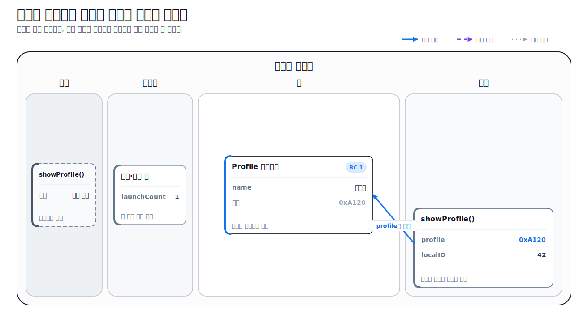
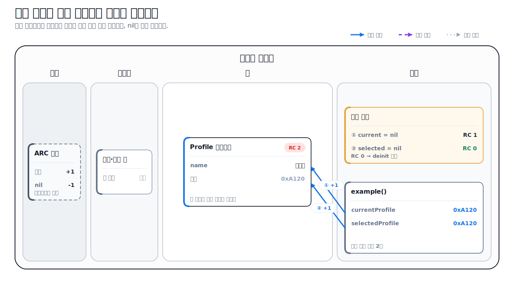
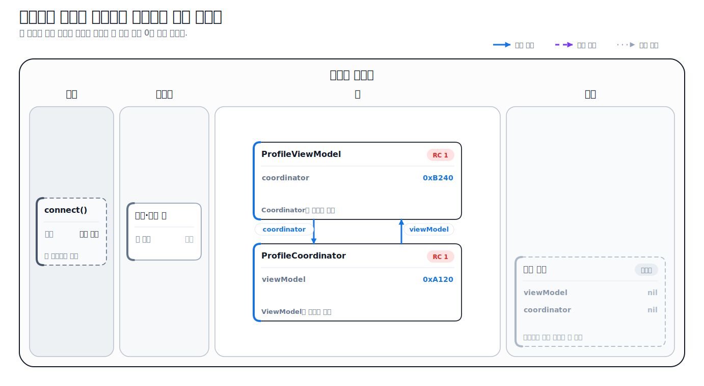
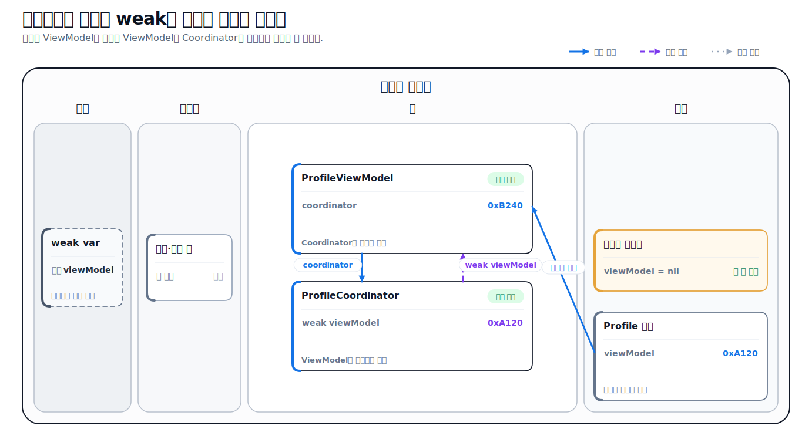
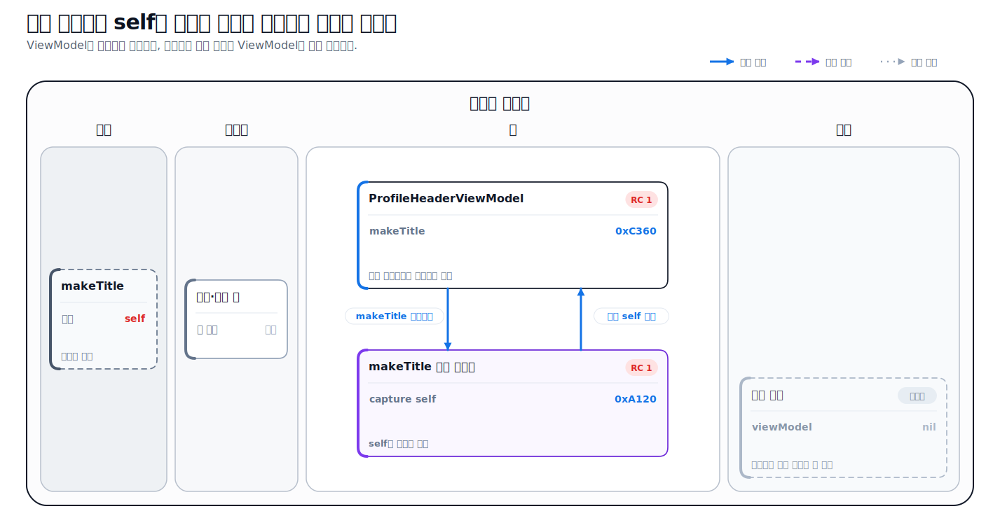
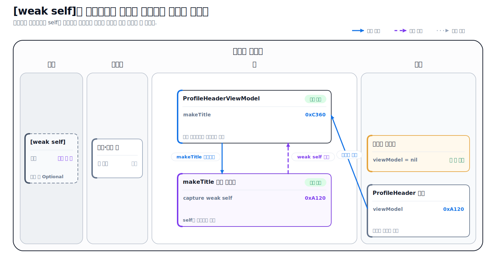

# Swift로 이해하는 메모리와 참조 관리

> **면접 답변 한 줄 요약:** Swift의 참조 관리는 클래스 객체를 붙잡는 관계의 수를 자동으로 세어 아무도 소유하지 않으면 메모리에서 없애고, 서로 붙잡는 고리가 생기지 않도록 소유하지 않는 관계를 구분하는 방식이에요.

Swift는 대부분의 메모리를 자동으로 관리하지만, 객체 사이의 관계까지 대신 설계해 주지는 않아요. 특히 두 객체가 서로를 붙잡거나 객체가 자신이 보관한 클로저에 다시 붙잡히면, 앱에서 더 이상 사용하지 않아도 메모리에 남을 수 있어요.

이 문서에서는 코드를 읽는 순서와 메모리 그림을 연결해 이 문제를 살펴봐요. 모든 그림에서 **강한 참조는 실선 화살표**, **약한 참조는 점선 화살표**로 표시해요.

## 먼저 알아둘 메모리 용어

| 용어        | 쉬운 뜻                                                                                                                                              |
| ----------- | ---------------------------------------------------------------------------------------------------------------------------------------------------- |
| 메모리      | 실행 중인 프로그램의 코드와 값을 보관하는 공간이에요. 각 위치는 주소로 구분해요.                                                                     |
| 프로세스    | 실행 중인 앱 하나를 운영체제가 관리하는 단위예요.                                                                                                    |
| 가상 메모리 | 운영체제가 각 프로세스에 독립된 메모리 공간이 있는 것처럼 보여 주고 실제 메모리와 연결하는 방식이에요.                                               |
| Mach-O      | Apple 플랫폼에서 앱과 프레임워크의 실행 코드와 데이터를 구성하는 파일 형식이에요.                                                                    |
| 코드 영역   | 컴파일된 기계어 명령처럼 실행할 내용을 주로 보관하는 읽기 전용 영역이에요. Apple 플랫폼의 Mach-O 파일에서는 대표적으로 `__TEXT` 세그먼트와 연결돼요. |
| 데이터 영역 | 전역 변수와 정적 데이터처럼 프로그램 수명과 함께 유지되는 값을 주로 보관하는 영역이에요. Mach-O의 `__DATA` 세그먼트가 한 예예요.                     |
| 스택(stack) | 함수가 호출될 때 필요한 지역 값과 반환 정보 등을 쌓았다가 함수가 끝나면 빠르게 정리하는 공간이에요.                                                  |
| 힙(heap)    | 실행 중에 크기와 수명이 달라지는 값을 동적으로 할당하는 공간이에요. 클래스 인스턴스를 이해할 때 주로 이 영역을 떠올려요.                             |
| 값 타입     | 값을 전달할 때 독립된 값처럼 다루는 타입이에요. Swift의 구조체와 열거형이 대표적이에요.                                                              |
| 참조 타입   | 값을 복사하는 대신 같은 객체를 가리키는 참조를 전달하는 타입이에요. Swift의 클래스와 클로저가 대표적이에요.                                          |

## 먼저 알아둘 Swift 참조 용어

| 용어           | 쉬운 뜻                                                                                                                        |
| -------------- | ------------------------------------------------------------------------------------------------------------------------------ |
| ARC            | Automatic Reference Counting의 줄임말이에요. 클래스 인스턴스를 붙잡는 참조를 세어 수명을 자동으로 관리하는 Swift의 방식이에요. |
| 강한 참조      | 대상 객체를 계속 메모리에 유지하는 기본 참조예요. 이 문서의 그림에서는 **실선 화살표**로 표시해요.                             |
| 약한 참조      | 대상 객체를 소유하지 않는 `weak` 참조예요. 대상이 사라지면 자동으로 `nil`이 되며, 그림에서는 **점선 화살표**로 표시해요.       |
| 미소유 참조    | 대상 객체를 소유하지 않는 `unowned` 참조예요. 대상이 먼저 사라지지 않는다고 확신할 때 사용해요.                                |
| 강한 참조 순환 | 객체들이 강한 참조로 서로를 붙잡아 외부에서 사용하지 않아도 참조 수가 0이 되지 않는 상태예요.                                  |
| 메모리 누수    | 더 이상 필요하지 않은 메모리를 해제하지 못해 계속 차지하는 문제예요. 강한 참조 순환이 원인 중 하나예요.                        |
| 클로저         | 실행할 코드를 값처럼 저장하고 전달할 수 있는 참조 타입이에요. 바깥 값을 기억하는 동작을 캡처라고 해요.                         |
| 캡처 리스트    | 클로저가 바깥 값을 강하게, 약하게, 미소유 방식 중 어떻게 기억할지 정하는 `[...]` 문법이에요.                                   |
| `deinit`       | 클래스 인스턴스가 해제되기 직전에 호출되는 종료 처리 코드예요. 객체가 실제로 해제되는지 확인할 때 사용할 수 있어요.            |

이 문서에서는 다음 내용을 설명해요.

- 코드·데이터·스택·힙 영역의 역할
- 지역 변수와 힙의 클래스 인스턴스가 연결되는 모습
- ARC가 강한 참조를 기준으로 객체를 해제하는 과정
- 두 클래스 인스턴스 사이의 강한 참조 순환
- 저장 클로저가 `self`를 캡처해 만드는 순환 참조
- `weak`, `unowned`, 강한 캡처를 선택하는 기준
- Xcode의 메모리 그래프로 문제를 확인하는 방법

## 메모리 그림은 관계를 이해하기 위한 개념 모델이에요

먼저 이 문서의 그림을 읽는 규칙을 정리할게요.

| 표현         | 의미                                                 |
| ------------ | ---------------------------------------------------- |
| `A ─────▶ B` | A가 B를 강하게 참조해 B의 수명을 유지해요.           |
| `A ┄ ┄ ┄▶ B` | A가 B를 약하게 참조하며 B의 수명을 유지하지 않아요.  |
| 회색 상자    | 값이나 객체가 놓인 메모리 영역을 단순화해 보여 줘요. |
| `nil`        | 더 이상 객체를 가리키지 않아요.                      |

실제 Swift 컴파일러는 값을 레지스터에 두거나, 코드를 최적화해 변수를 없애거나, 구조체 내부에서 힙 저장소를 사용할 수 있어요. 따라서 “모든 지역 변수는 반드시 스택”, “모든 값 타입은 절대로 힙을 사용하지 않는다”처럼 외우면 안 돼요.

Apple의 [Understanding Swift Performance](https://developer.apple.com/videos/play/wwdc2016/416/)도 스택과 힙 표현을 코드를 추론하기 좋은 단순화된 모델로 제시해요. 이 문서의 주소와 참조 수 역시 실제 디버거 값이 아니라 소유 관계를 설명하기 위한 표시예요.

## 실행 중인 앱은 여러 메모리 영역을 사용해요

다음 코드를 실행한다고 생각해 볼게요.

```swift
var launchCount = 0

final class Profile {
  let name: String

  init(name: String) {
    self.name = name
  }
}

func showProfile() {
  let localID = 7
  let profile = Profile(name: "Blob")

  print(localID, profile.name)
}
```

학습용 모델에서는 다음처럼 연결해서 볼 수 있어요.

<div className="memory-diagram">



</div>

_실선 화살표는 `profile` 지역 변수가 힙의 `Profile` 인스턴스를 강하게 참조한다는 뜻이에요._

### 코드·데이터·힙·스택에는 보통 무엇이 들어가나요

먼저 각 영역의 대표적인 내용을 한눈에 정리해 볼게요.

| 영역        | 보통 들어가는 것                                                                                | 이 예제에서 찾을 수 있는 것                    | 꼭 기억할 점                                                                   |
| ----------- | ----------------------------------------------------------------------------------------------- | ---------------------------------------------- | ------------------------------------------------------------------------------ |
| 코드 영역   | 컴파일된 함수·메서드·클로저 본문의 기계어 명령, 읽기 전용 상수와 문자열 리터럴                  | `showProfile()`과 `Profile.init`의 실행 코드   | 클로저의 **실행 코드**와 클로저가 **캡처한 값의 저장소**는 같은 것이 아니에요. |
| 데이터 영역 | 앱 실행 동안 유지되는 변경 가능한 전역 변수와 정적 저장 프로퍼티                                | 전역 변수 `launchCount`                        | 전역 `let`과 리터럴처럼 읽기 전용인 값은 다른 읽기 전용 영역에 놓일 수 있어요. |
| 스택        | 함수 호출 프레임, 매개변수, 작은 지역 값, 임시 값, 반환 정보, 힙 객체를 가리키는 지역 참조      | `localID` 값과 `profile` 참조                  | 스레드마다 스택이 있고, 함수가 반환되면 해당 호출 프레임을 빠르게 정리해요.    |
| 힙          | 클래스 인스턴스, 오래 저장되는 클로저의 캡처 저장소, 실행 중 크기와 수명이 달라지는 동적 저장소 | `Profile(name: "Blob")`으로 생성한 클래스 객체 | 마지막 강한 참조가 사라질 때 ARC가 클래스 인스턴스를 정리해요.                 |

Apple 플랫폼의 Mach-O 실행 파일에서는 `__TEXT,__text`에 컴파일된 기계어 명령이, `__TEXT,__cstring`에 문자열 리터럴이 들어갈 수 있어요. 변경 가능한 전역·정적 데이터는 `__DATA` 계열 영역과 연결해 이해할 수 있어요. 이 구분은 Apple의 [Overview of the Mach-O Executable Format](https://developer.apple.com/library/archive/documentation/Performance/Conceptual/CodeFootprint/Articles/MachOOverview.html)에서 확인할 수 있어요.

### Swift 선언을 메모리 위치와 연결해 봐요

같은 “변수”나 “인스턴스”라는 말도 선언 위치와 타입에 따라 봐야 할 부분이 달라요.

| Swift 표현                               | 입문 단계에서 이해할 대표 위치                 | 자세히 보면                                                                                                  |
| ---------------------------------------- | ---------------------------------------------- | ------------------------------------------------------------------------------------------------------------ |
| 함수 안의 `let localID = 7`              | 스택 프레임의 지역 값                          | 컴파일러가 레지스터에 두거나 값 자체를 없애도록 최적화할 수 있어요.                                          |
| 함수 안의 `let profile = Profile(...)`   | `profile` 참조는 스택, 클래스 객체는 힙        | 지역 변수에는 객체 전체가 아니라 힙 객체를 가리키는 참조가 있다고 생각하면 돼요.                             |
| 파일 범위의 `var launchCount = 0`        | 데이터 영역의 전역 저장소                      | 앱 실행 동안 유지되며 여러 코드에서 접근할 수 있어요. 정확한 섹션과 초기화 방식은 컴파일 결과에 따라 달라요. |
| 타입의 `static var sharedValue = 0`      | 데이터 영역과 연결되는 정적 저장소             | 특정 인스턴스가 아니라 타입과 수명을 함께해요. Swift 런타임이 초기화를 관리할 수도 있어요.                   |
| `Profile(...)` 같은 클래스 인스턴스      | 힙                                             | 클래스의 저장 프로퍼티도 인스턴스가 차지한 힙 저장소의 일부로 이해할 수 있어요.                              |
| 함수 안의 작은 구조체·열거형 인스턴스    | 값을 사용하는 위치, 지역 값이면 보통 스택      | 값 타입이라는 사실이 핵심이에요. 클래스 프로퍼티라면 힙 객체 안에, 전역 값이라면 전역 저장소에 포함돼요.     |
| escaping 클로저와 캡처한 지역 변수       | 클로저 코드는 코드 영역, 캡처 저장소는 힙 가능 | 바로 실행되는 클로저는 인라인되거나 별도 힙 할당 없이 최적화될 수 있어요.                                    |
| `String`, `Array` 같은 값 타입의 지역 값 | 바깥 값은 지역 저장 위치                       | 내부 데이터는 크기와 공유 방식에 따라 별도의 동적 저장소를 사용할 수 있어요.                                 |

Apple의 [Explore Swift performance](https://developer.apple.com/videos/play/wwdc2024/10217/)는 지역 변수를 스택에 두는 것을 기본 모델로 설명하면서도, 컴파일러가 값을 레지스터로 옮기거나 없앨 수 있다고 강조해요. Swift 공식 [Automatic Reference Counting](https://docs.swift.org/swift-book/documentation/the-swift-programming-language/automaticreferencecounting/) 문서는 클래스 인스턴스를 만들 때 필요한 메모리를 할당하고 강한 참조가 남아 있는 동안 유지한다고 설명해요.

따라서 “지역 변수는 스택”, “인스턴스는 힙”이라는 문장은 출발점일 뿐이에요. 더 정확하게는 **지역 변수에 저장된 것이 값 자체인지 힙 객체를 가리키는 참조인지**, 그리고 **인스턴스가 클래스인지 값 타입인지**를 함께 확인해야 해요.

Mach-O 문서는 오래된 성능 문서이므로 구체적인 Swift 저장 위치를 단정하는 근거가 아니라 코드와 데이터 세그먼트의 개념을 이해하는 참고 자료로 사용해요.

## 스택과 힙은 타입 이름만으로 단정할 수 없어요

입문 단계에서는 구조체는 스택, 클래스는 힙이라고 설명하는 경우가 많아요. 출발점으로는 도움이 되지만 항상 맞는 규칙은 아니에요.

| 코드의 모습                   | 기본적으로 이해할 모델              | 함께 기억할 예외                                                    |
| ----------------------------- | ----------------------------------- | ------------------------------------------------------------------- |
| 함수의 작은 지역 값           | 스택 프레임 안의 값                 | 최적화로 레지스터에 놓이거나 사라질 수 있어요.                      |
| 클래스 인스턴스               | 힙에 있는 객체와 이를 가리키는 참조 | 컴파일러가 전체 프로그램을 분석해 다른 방식으로 최적화할 수 있어요. |
| 작은 구조체                   | 값이 사용되는 위치에 직접 저장돼요. | 클로저에 캡처되거나 다른 저장소에 들어가면 배치가 달라질 수 있어요. |
| `String`, `Array` 같은 구조체 | 바깥 값은 값 타입이에요.            | 내부 데이터는 성능을 위해 힙 저장소를 공유할 수 있어요.             |

이 문서의 핵심은 정확한 물리 주소를 맞히는 것이 아니에요. **어떤 코드가 객체의 수명을 유지하는가**를 추적하는 것이 중요해요.

## ARC는 클래스 인스턴스를 붙잡는 강한 참조를 세어요

Swift는 클래스 인스턴스가 더 이상 필요하지 않을 때 메모리를 회수하기 위해 ARC를 사용해요. 상수, 변수, 프로퍼티에 클래스 인스턴스를 대입하면 기본적으로 강한 참조가 만들어져요.

```swift
final class Profile {
  let name: String

  init(name: String) {
    self.name = name
    print("\(name) 생성")
  }

  deinit {
    print("\(name) 해제")
  }
}

var currentProfile: Profile? = Profile(name: "Blob")
var selectedProfile = currentProfile

currentProfile = nil
selectedProfile = nil
// "Blob 해제" 출력
```

참조가 바뀔 때의 상태를 그림으로 따라가 볼게요.

<div className="memory-diagram">



</div>

_`currentProfile`과 `selectedProfile`은 같은 객체를 가리켜요. 마지막 강한 참조가 사라져야 ARC가 객체를 해제해요._

과정은 다음과 같아요.

1. `Profile(name:)`을 만들고 `currentProfile`에 대입하면 강한 참조가 하나 생겨요.
2. 같은 값을 `selectedProfile`에 대입하면 객체를 복사하지 않고 같은 인스턴스를 가리키는 강한 참조가 하나 더 생겨요.
3. `currentProfile = nil`만 실행하면 `selectedProfile`이 여전히 객체를 붙잡고 있어 해제되지 않아요.
4. `selectedProfile = nil`까지 실행하면 남은 강한 참조가 없어지고 `deinit`이 호출돼요.

Swift 공식 [Automatic Reference Counting](https://docs.swift.org/swift-book/documentation/the-swift-programming-language/automaticreferencecounting/) 문서도 ARC가 클래스 인스턴스에 대한 활성 참조를 추적하고, 강한 참조가 남아 있는 동안 인스턴스를 해제하지 않는다고 설명해요.

## ARC와 가비지 컬렉션은 정리 시점이 달라요

가비지 컬렉션은 실행 중인 프로그램이 도달할 수 없는 객체를 별도의 수집 과정에서 찾아 정리하는 방식이에요. Swift의 ARC는 컴파일러가 삽입한 참조 증가와 감소 동작을 바탕으로 마지막 강한 참조가 사라지는 시점에 객체를 해제해요.

| 기준               | ARC                                           | 가비지 컬렉션                                |
| ------------------ | --------------------------------------------- | -------------------------------------------- |
| 수명 판단          | 강한 참조 수를 추적해요.                      | 도달 가능한 객체인지 탐색해요.               |
| 일반적인 정리 시점 | 마지막 강한 참조가 사라질 때예요.             | 수집기가 실행될 때예요.                      |
| 순환 참조          | 강한 참조 수가 남아 자동으로 해결하지 못해요. | 도달 불가능한 순환은 수집할 수 있어요.       |
| 개발자가 할 일     | 객체 그래프에서 소유 관계를 설계해요.         | 불필요한 참조를 줄이고 수집 비용을 고려해요. |

ARC가 자동이라는 말은 메모리 관계를 신경 쓰지 않아도 된다는 뜻이 아니에요. 참조 수만으로는 “앱에서 더 이상 사용할 수 없는 객체끼리 서로 붙잡고 있는 상태”를 판단할 수 없어요.

## 두 객체가 서로 강하게 참조하면 순환이 생겨요

프로필 화면을 이동시키는 coordinator가 있다고 해 볼게요. coordinator는 여러 화면의 이동 흐름을 관리하는 객체예요.

```swift
final class ProfileViewModel {
  var coordinator: ProfileCoordinator?

  deinit {
    print("ProfileViewModel 해제")
  }
}

final class ProfileCoordinator {
  var viewModel: ProfileViewModel?

  deinit {
    print("ProfileCoordinator 해제")
  }
}

var viewModel: ProfileViewModel? = ProfileViewModel()
var coordinator: ProfileCoordinator? = ProfileCoordinator()

viewModel?.coordinator = coordinator
coordinator?.viewModel = viewModel

viewModel = nil
coordinator = nil
```

마지막 두 줄에서 외부 변수를 `nil`로 바꿨는데도 `deinit`은 호출되지 않아요.

<div className="memory-diagram">



</div>

_왼쪽의 외부 변수는 `nil`이지만, 힙의 두 객체 사이에는 실선 화살표 두 개가 남아 있어요._

ARC는 두 객체가 앱에서 다시 사용될 수 있는지 알지 못해요. 각 객체에 강한 참조가 하나씩 남았다는 사실만 보기 때문에 둘 다 해제하지 않아요. 이렇게 더 이상 접근할 수 없지만 메모리를 차지하는 상태가 메모리 누수예요.

## weak는 소유하지 않는 관계를 표현해 순환을 끊어요

화면 모델이 coordinator를 사용하지만 coordinator가 화면 모델의 수명까지 책임질 필요는 없다고 판단했다면, 되돌아오는 참조를 `weak`로 선언할 수 있어요.

```swift
final class ProfileCoordinator {
  weak var viewModel: ProfileViewModel?

  deinit {
    print("ProfileCoordinator 해제")
  }
}
```

`weak`로 바뀐 관계는 대상 객체의 강한 참조 수를 늘리지 않아요.

<div className="memory-diagram">



</div>

_실선은 강한 참조, 점선은 약한 참조예요. `ProfileViewModel`을 붙잡는 외부 강한 참조가 사라지면 객체를 해제할 수 있어요._

`weak` 참조의 특징은 다음과 같아요.

- 대상의 수명을 유지하지 않아요.
- 대상이 먼저 해제될 수 있으므로 항상 옵셔널이어야 해요.
- 대상이 해제되면 ARC가 약한 참조를 자동으로 `nil`로 바꿔요.
- 값이 바뀔 수 있어야 하므로 `let`이 아니라 `var`로 선언해요.
- 클래스 인스턴스 또는 클래스 전용 프로토콜처럼 참조 타입에 사용해요.

`weak`는 “메모리가 걱정될 때 붙이는 키워드”가 아니에요. **이 객체가 상대 객체의 수명을 소유하지 않는다**는 관계를 코드로 표현하는 도구예요.

## strong, weak, unowned는 수명 보장으로 선택해요

세 참조 방식은 대상 객체를 얼마나 오래 보장할 수 있는지에 따라 선택해요.

| 참조 방식 | 대상을 소유하나요? | 대상이 먼저 해제되면                   | 적합한 관계                                  |
| --------- | ------------------ | -------------------------------------- | -------------------------------------------- |
| 강한 참조 | 예                 | 참조가 남아 있는 동안 해제되지 않아요. | 소유자가 구성 요소의 수명을 책임져요.        |
| `weak`    | 아니요             | 자동으로 `nil`이 돼요.                 | 대상이 먼저 사라질 수 있어요.                |
| `unowned` | 아니요             | 이후 접근하면 런타임 오류가 발생해요.  | 대상이 참조보다 반드시 오래 산다고 보장해요. |

`unowned`는 옵셔널 처리 없이 접근할 수 있지만, 수명 보장이 틀리면 앱이 종료될 수 있어요.

```swift
final class ProfileSubscription {
  unowned let owner: ProfileViewModel

  init(owner: ProfileViewModel) {
    self.owner = owner
  }
}
```

이 예제는 `ProfileSubscription`이 존재하는 동안 `ProfileViewModel`도 반드시 살아 있다는 설계가 실제로 보장될 때만 안전해요. 확신하기 어렵다면 `weak`와 옵셔널 처리가 더 안전해요.

## 저장 클로저가 self를 잡으면 또 다른 순환이 생겨요

순환 참조는 클래스 인스턴스 두 개 사이에서만 생기지 않아요. 클로저도 참조 타입이고, 클로저 본문에서 바깥 객체를 사용하면 그 객체를 캡처할 수 있어요.

클로저의 함수 타입, 축약 문법, 캡처와 escaping 규칙을 먼저 살펴보고 싶다면 [클로저](./closures) 문서를 참고해요.

```swift
final class ProfileHeaderViewModel {
  let name: String

  lazy var makeTitle: () -> String = {
    "\(self.name)의 프로필"
  }

  init(name: String) {
    self.name = name
  }

  deinit {
    print("ProfileHeaderViewModel 해제")
  }
}

var header: ProfileHeaderViewModel? =
  ProfileHeaderViewModel(name: "Blob")

print(header?.makeTitle() ?? "")
header = nil
```

`header = nil`을 실행해도 `deinit`이 호출되지 않아요.

<div className="memory-diagram">



</div>

_객체는 `makeTitle` 클로저를 강하게 보관하고, 클로저는 본문에서 사용한 `self`를 강하게 캡처해 객체를 다시 붙잡아요._

`lazy`는 `self`의 초기화가 끝난 뒤 클로저를 만들기 위해 사용했어요. 순환의 원인은 `lazy` 자체가 아니라 다음 두 관계가 동시에 강하다는 점이에요.

1. `ProfileHeaderViewModel` 인스턴스가 프로퍼티로 클로저를 강하게 보관해요.
2. 그 클로저가 `self`를 강하게 캡처해요.

Swift 공식 ARC 문서는 클래스 인스턴스가 자신의 프로퍼티에 클로저를 저장하고 그 클로저가 `self`를 캡처할 때 강한 참조 순환이 생길 수 있다고 설명해요.

## 캡처 리스트의 weak self로 클로저 순환을 끊어요

클로저 시작 부분의 캡처 리스트에 `[weak self]`를 작성하면 `self`를 소유하지 않고 기억해요.

```swift
final class ProfileHeaderViewModel {
  let name: String

  lazy var makeTitle: () -> String = { [weak self] in
    guard let self else {
      return "프로필"
    }

    return "\(self.name)의 프로필"
  }

  init(name: String) {
    self.name = name
  }

  deinit {
    print("ProfileHeaderViewModel 해제")
  }
}
```

<div className="memory-diagram">



</div>

_클로저에서 객체로 돌아오는 점선 화살표는 `[weak self]`가 객체의 수명을 유지하지 않는다는 뜻이에요._

`weak self`는 옵셔널이므로 클로저가 실행될 때 객체가 이미 사라졌을 가능성을 처리해야 해요.

```swift
lazy var makeTitle: () -> String = { [weak self] in
  guard let self else {
    return "프로필"
  }

  return "\(self.name)의 프로필"
}
```

`guard let self`로 만든 강한 참조는 이 클로저 호출이 실행되는 동안 `self`를 유지해요. 호출이 끝난 뒤 계속 저장되지 않는다면 새로운 영구 순환을 만들지 않아요.

## 모든 클로저에 weak self가 필요한 것은 아니에요

“클로저에서는 항상 `[weak self]`를 쓴다”는 규칙은 정확하지 않아요. 강한 캡처가 순환을 만들려면 참조가 다시 원래 객체로 돌아오는 고리가 있어야 해요.

```swift
func makeGreeting(for name: String) -> () -> String {
  {
    "안녕하세요, \(name)"
  }
}
```

이 클로저는 `name`을 캡처하지만 자신을 소유한 객체를 다시 참조하지 않으므로 순환이 없어요.

네트워크 완료 처리처럼 다른 객체가 클로저를 잠시 보관했다가 실행 후 버리는 경우, 강한 `self` 캡처는 객체의 수명을 작업 완료까지 **연장**할 수는 있지만 반드시 영구적인 누수는 아니에요. 반대로 다음 구조에서는 순환 가능성을 확인해야 해요.

- 객체가 자신의 프로퍼티에 클로저를 저장하고 클로저가 `self`를 사용해요.
- 객체가 서비스의 콜백을 소유하고, 서비스도 그 객체가 소유해요.
- 화면보다 오래 사는 객체가 콜백을 계속 보관해요.
- 종료되지 않는 작업이나 구독이 클로저를 유지해요.

선택 기준을 정리하면 다음과 같아요.

| 캡처             | 선택 기준                                                    | 주의할 점                                     |
| ---------------- | ------------------------------------------------------------ | --------------------------------------------- |
| 강한 `self`      | 작업 동안 객체가 반드시 살아 있어야 하고 참조 고리가 없어요. | 객체 수명이 예상보다 길어질 수 있어요.        |
| `[weak self]`    | 객체가 먼저 사라질 수 있고 클로저가 수명을 소유하면 안 돼요. | `self`가 `nil`인 경우의 동작을 정해야 해요.   |
| `[unowned self]` | 클로저보다 객체가 반드시 오래 산다고 증명할 수 있어요.       | 보장이 깨지면 접근 시 런타임 오류가 발생해요. |

캡처 리스트는 습관적으로 붙이는 문법이 아니라 객체의 수명 계약을 표현하는 문법이에요.

## 값 타입에는 ARC가 직접 적용되지 않아요

Swift 공식 ARC 문서에서 참조 카운팅은 클래스 인스턴스에 적용된다고 설명해요. 구조체와 열거형은 값 타입이므로 값 자체를 클래스처럼 참조 카운팅하지 않아요.

```swift
struct ProfileSummary {
  var name: String
}

var original = ProfileSummary(name: "Blob")
var copied = original

copied.name = "Blob Jr."

original.name // "Blob"
copied.name // "Blob Jr."
```

두 변수는 독립된 값처럼 동작해요. 다만 “구조체에는 ARC 비용이 절대 없다”는 뜻은 아니에요. `String`, `Array`처럼 내부에서 힙 저장소를 사용하는 값이나 클래스 프로퍼티를 가진 구조체는 내부 참조의 수명을 관리할 수 있어요.

값 의미와 실제 메모리 배치를 구분해서 이해해야 해요.

- 값 의미는 복사한 값을 서로 독립적으로 다룰 수 있다는 프로그래밍 모델이에요.
- 메모리 배치는 컴파일러와 런타임이 값을 실제로 어디에 둘지 결정한 결과예요.

## 메모리 누수와 메모리 안전성은 다른 문제예요

Swift의 메모리 안전성은 초기화되지 않은 값, 해제된 객체, 배열 범위를 벗어난 위치처럼 유효하지 않은 메모리에 잘못 접근하지 않게 돕는 성질이에요.

강한 참조 순환으로 남은 객체는 아직 유효한 객체예요. 잘못된 주소에 접근한 것은 아니지만 더 이상 필요하지 않은 메모리를 계속 차지하므로 누수예요.

| 질문                                       | 다루는 개념               |
| ------------------------------------------ | ------------------------- |
| 이 값에 지금 안전하게 접근할 수 있나요?    | 메모리 안전성             |
| 이 객체가 언제까지 살아 있어야 하나요?     | 메모리 관리와 소유권      |
| 앱에서 더 이상 쓰지 않는데 왜 남아 있나요? | 메모리 누수와 참조 순환   |
| 동시에 같은 값에 접근해도 되나요?          | 메모리 접근 충돌과 동시성 |

Swift 공식 [Memory Safety](https://docs.swift.org/swift-book/documentation/the-swift-programming-language/memorysafety/) 문서는 유효한 수명과 겹치는 메모리 접근을 안전하게 관리하는 규칙을 별도로 설명해요.

## deinit과 Xcode 메모리 그래프로 확인해요

코드만 보고 모든 객체 그래프를 추적하기 어렵다면 도구로 실제 실행 상태를 확인할 수 있어요.

### deinit으로 기대한 해제 시점을 확인해요

```swift
final class TrackedProfile {
  let name: String

  init(name: String) {
    self.name = name
  }

  deinit {
    print("\(name) 해제")
  }
}
```

화면을 닫거나 작업을 끝낸 뒤에도 `deinit` 로그가 나오지 않는다면 객체가 예상보다 오래 유지되는지 살펴볼 수 있어요. 다만 로그만으로 원인을 알 수는 없으므로 메모리 그래프와 함께 확인하는 것이 좋아요.

### Debug Memory Graph에서 들어오는 참조를 따라가요

1. Xcode에서 앱을 실행하고 문제가 생기는 화면을 열었다가 닫아요.
2. 디버그 영역의 **Debug Memory Graph** 버튼을 눌러 앱을 멈추고 그래프를 만들어요.
3. 해제됐어야 할 타입의 인스턴스가 남아 있는지 찾아요.
4. 객체로 들어오는 강한 참조 화살표를 거꾸로 따라가요.
5. 서로 다시 가리키는 고리나 오래 사는 소유자를 찾고 관계를 수정해요.
6. 같은 동작을 반복해 인스턴스가 해제되는지 확인해요.

Apple의 [Gathering information about memory use](https://developer.apple.com/documentation/xcode/gathering-information-about-memory-use) 문서는 Xcode 메모리 그래프의 노드가 객체와 힙 할당 등을 나타내고, 화살표가 메모리 사이의 참조를 보여 준다고 설명해요. 메모리 사용량이 계속 증가한다면 Allocations와 Leaks Instruments도 함께 사용할 수 있어요.

## 테스트에서는 약한 상자로 해제를 관찰할 수 있어요

객체가 범위를 벗어난 뒤 해제되는지 작은 테스트로 확인할 수도 있어요. `WeakBox`는 대상을 소유하지 않고 관찰만 하는 테스트 도구예요.

`<Value: AnyObject>`는 여러 클래스 타입에 재사용할 수 있게 만드는 제네릭 선언이에요. `AnyObject` 제약은 `Value`가 약한 참조를 사용할 수 있는 클래스 인스턴스여야 한다는 뜻이에요.

```swift
import Testing

private final class WeakBox<Value: AnyObject> {
  weak var value: Value?
}

@Test
func profileIsReleasedAfterScopeEnds() {
  let box = WeakBox<Profile>()

  do {
    let profile = Profile(name: "Blob")
    box.value = profile

    #expect(box.value != nil)
  }

  #expect(box.value == nil)
}
```

`do` 블록이 끝나면 지역 상수 `profile`의 강한 참조가 사라져요. `WeakBox`는 약하게만 참조하므로 다른 강한 참조가 없다면 `value`가 `nil`이 돼요.

테스트가 통과한다고 앱 전체에서 누수가 없다는 뜻은 아니에요. 실제 화면 전환, 프레임워크 내부 참조, 비동기 작업까지 포함한 객체 그래프는 Xcode와 Instruments로 함께 확인해야 해요.

## 참조 관계를 설계하는 순서

메모리 누수를 만났거나 새 객체 관계를 만들 때 다음 순서로 살펴보세요.

1. 객체를 만드는 코드와 객체를 오래 보관하는 프로퍼티를 찾습니다.
2. 각 실선 화살표에 “누가 누구의 수명을 책임지는가?”라고 질문합니다.
3. 객체에서 출발해 강한 참조만 따라가 원래 객체로 돌아오는 고리가 있는지 확인합니다.
4. 되돌아오는 관계가 소유권이 아니라 관찰이나 연락 통로라면 `weak`를 검토합니다.
5. 대상이 더 오래 산다고 증명할 수 있을 때만 `unowned`를 검토합니다.
6. 저장되거나 오래 실행되는 클로저가 `self`를 어떻게 캡처하는지 확인합니다.
7. `deinit`, Debug Memory Graph, Instruments로 기대한 시점에 해제되는지 검증합니다.

## 흔한 오해를 정리해요

### weak를 많이 쓰면 메모리가 안전해지나요?

아니요. 필요한 강한 참조까지 약하게 바꾸면 객체가 너무 일찍 해제돼 기능이 동작하지 않을 수 있어요. `weak`는 최적화 도구가 아니라 소유하지 않는 관계를 표현하는 도구예요.

### nil을 대입하면 객체가 바로 해제되나요?

그 변수가 가진 강한 참조 하나만 제거돼요. 다른 변수, 프로퍼티, 클로저가 같은 객체를 강하게 참조한다면 객체는 계속 살아 있어요.

### 클로저를 사용하면 항상 순환 참조가 생기나요?

아니요. 클로저가 `self`를 강하게 캡처하고, 그 `self` 또는 `self`가 소유한 객체가 클로저를 다시 오래 보관해 참조 고리를 만들 때 문제가 돼요.

### 구조체는 항상 스택에 저장되나요?

아니요. 구조체는 값 타입이라는 의미가 중요하며 실제 저장 위치는 사용 방식과 최적화에 따라 달라질 수 있어요. 구조체 내부 저장소가 힙을 사용할 수도 있어요.

### ARC가 있으면 메모리 누수는 없나요?

아니요. ARC는 강한 참조 수가 0이 되면 잘 정리하지만, 강한 참조 순환처럼 참조 수가 계속 남는 관계는 자동으로 끊지 못해요.

## 면접에서 이어질 수 있는 질문

### ARC는 어떻게 객체의 수명을 관리하나요?

ARC는 클래스 인스턴스를 가리키는 강한 참조를 추적하고, 마지막 강한 참조가 사라지면 인스턴스를 해제해요. `weak`와 `unowned` 참조는 대상의 수명을 유지하지 않아요.

### weak와 unowned의 차이는 무엇인가요?

둘 다 대상을 소유하지 않지만 `weak`는 대상이 사라지면 자동으로 `nil`이 되는 옵셔널이에요. `unowned`는 대상이 항상 살아 있다고 가정하므로 옵셔널 처리 없이 접근하지만, 대상이 먼저 해제되면 접근 시 런타임 오류가 발생해요.

### 강한 참조 순환은 왜 ARC가 해결하지 못하나요?

ARC는 객체가 앱에서 다시 사용될 수 있는지 분석하지 않고 강한 참조가 남아 있는지만 세어요. 순환 안의 객체들이 서로를 강하게 붙잡으면 외부 참조가 없어져도 각 객체의 참조 수가 0이 되지 않아요.

### 클로저에서 weak self는 언제 사용하나요?

클로저가 저장되거나 오래 유지되고, 클로저를 소유한 객체를 다시 캡처해 참조 고리를 만들 수 있을 때 사용해요. 모든 클로저에 기계적으로 적용하지 말고 클로저의 보관 주체와 실행 수명을 먼저 확인해야 해요.

### 스택과 힙의 가장 큰 차이는 무엇인가요?

스택은 함수 호출과 함께 생기고 사라지는 저장 공간을 빠르게 관리하는 데 적합하고, 힙은 실행 중에 크기와 수명이 달라지는 객체를 동적으로 관리해요. 다만 실제 Swift 값의 배치는 컴파일러 최적화와 내부 구현에 따라 달라질 수 있어요.

## 참고 자료

- [The Swift Programming Language — Automatic Reference Counting](https://docs.swift.org/swift-book/documentation/the-swift-programming-language/automaticreferencecounting/)
- [The Swift Programming Language — Closures](https://docs.swift.org/swift-book/documentation/the-swift-programming-language/closures/)
- [The Swift Programming Language — Memory Safety](https://docs.swift.org/swift-book/documentation/the-swift-programming-language/memorysafety/)
- [Apple Developer — Understanding Swift Performance](https://developer.apple.com/videos/play/wwdc2016/416/)
- [Apple Developer — Explore Swift performance](https://developer.apple.com/videos/play/wwdc2024/10217/)
- [Apple Developer — Gathering information about memory use](https://developer.apple.com/documentation/xcode/gathering-information-about-memory-use)
- [Apple Documentation Archive — Overview of the Mach-O Executable Format](https://developer.apple.com/library/archive/documentation/Performance/Conceptual/CodeFootprint/Articles/MachOOverview.html)
