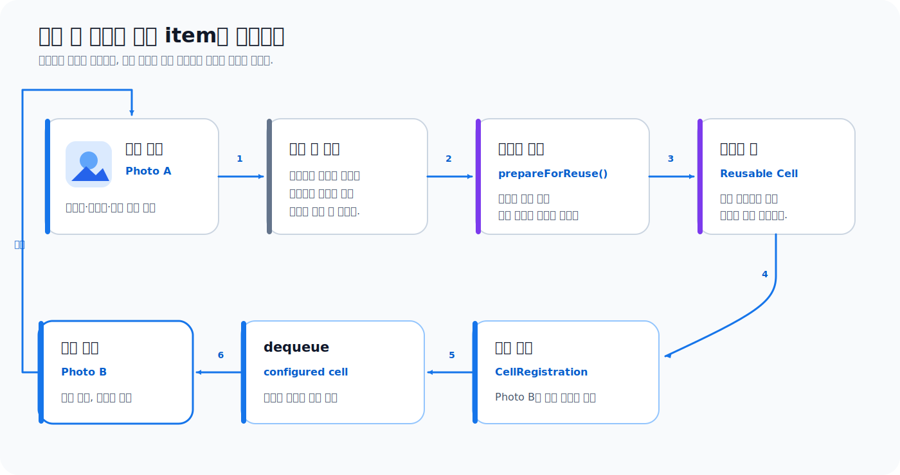

# Collection View 셀과 재사용 뷰

> **면접 답변 한 줄 요약:** Collection View는 화면에 필요한 수만큼 셀을 만들고 다시 사용하므로, 셀은 item 데이터를 소유하지 않고 현재 전달받은 모델과 상태로 매번 완전히 구성되어야 해요.

수천 장의 사진을 보여 준다고 셀 객체를 수천 개 만들 필요는 없어요. Collection View는 현재 보이는 범위와 곧 보일 범위에 필요한 셀만 준비하고, 사라진 셀을 다른 item에 다시 사용해요. 메모리 사용량을 줄이는 대신, 셀이 이전 item의 상태를 남기지 않도록 구성해야 해요.

## 먼저 알아둘 재사용 용어

| 용어                     | 쉬운 뜻                                                                                                          |
| ------------------------ | ---------------------------------------------------------------------------------------------------------------- |
| 재사용(reuse)            | 화면 밖으로 나간 뷰 객체를 버리지 않고 다른 item을 표시하는 데 다시 쓰는 방식이에요.                             |
| reuse identifier         | 같은 종류의 재사용 뷰를 구분하는 문자열이에요. registration API가 이 연결을 안전하게 관리해 줄 수도 있어요.      |
| dequeue                  | 재사용 가능한 뷰를 꺼내고, 없다면 등록된 타입으로 새로 만드는 과정이에요.                                        |
| registration             | 사용할 셀 타입과 구성 closure를 하나로 묶는 객체예요. `CellRegistration`과 `SupplementaryRegistration`이 있어요. |
| content configuration    | 셀 안에 표시할 텍스트, 이미지 같은 내용을 값으로 표현하는 객체예요.                                              |
| background configuration | 기본, 선택, 강조 상태에 맞는 셀 배경을 값으로 표현하는 객체예요.                                                 |
| supplementary view       | header, footer, badge처럼 item이나 section 정보를 보조하는 재사용 뷰예요.                                        |

## 셀은 모델이 아니라 화면 표현이에요

다음 코드는 셀 안에 현재 사진을 저장해요.

```swift
final class PhotoCell: UICollectionViewCell {
  var photo: Photo?

  func configure(with photo: Photo) {
    self.photo = photo
    titleLabel.text = photo.title
    imageView.image = photo.thumbnail
  }
}
```

코드가 단순해 보이지만 `photo`가 셀의 정체성처럼 사용되기 시작하면 문제가 생겨요. 셀은 스크롤 후 다른 사진에 재사용될 수 있고 화면 밖에 있는 item에는 셀이 없을 수도 있어요. 선택, 즐겨찾기, 다운로드 진행률처럼 유지해야 하는 상태는 모델 저장소에 두고 셀은 그 결과를 표현해야 해요.



재사용 흐름은 다음과 같아요.

1. Collection View가 index path에 필요한 셀을 data source에 요청해요.
2. 재사용 큐에서 맞는 셀을 dequeue하거나 새 셀을 만들어요.
3. cell provider가 현재 item의 데이터로 셀을 완전히 구성해요.
4. 셀이 화면에 표시돼요.
5. 화면 밖으로 나가면 재사용을 준비해요.
6. 같은 객체가 다른 item을 표시하도록 다시 구성돼요.

## `UICollectionReusableView`가 공통 기반이에요

Collection View의 cell과 supplementary view는 모두 `UICollectionReusableView`에서 시작해요.

```text
UICollectionReusableView
├── UICollectionViewCell
│   └── UICollectionViewListCell
└── 직접 만든 HeaderView, FooterView, BadgeView
```

`UICollectionReusableView`는 다음 재사용·레이아웃 지점을 제공해요.

- `reuseIdentifier`: 현재 뷰가 등록된 재사용 식별자예요.
- `prepareForReuse()`: 새 item에 사용되기 전에 임시 상태를 초기화할 지점이에요.
- `apply(_:)`: 새 layout attributes가 적용될 때 호출돼요.
- `preferredLayoutAttributesFitting(_:)`: self-sizing 뷰가 원하는 크기를 계산할 수 있어요.
- layout 전환 전후 메서드: 이전·새 layout 사이 상태를 조정해요.

일반적인 내용 구성은 registration closure에서 수행하고, 진행 중 애니메이션이나 취소 토큰처럼 구성만으로 덮어쓰기 어려운 임시 자원을 `prepareForReuse()`에서 정리해요.

## cell registration으로 타입과 구성을 묶어요

현대적인 registration API는 문자열 식별자와 강제 타입 변환을 직접 관리하는 코드를 줄여 줘요.

```swift
private lazy var photoCellRegistration =
  UICollectionView.CellRegistration<UICollectionViewCell, Photo> {
    cell,
    _,
    photo in

    var content = UIListContentConfiguration.cell()
    content.text = photo.title
    content.secondaryText = photo.isFavorite ? "즐겨찾기" : nil
    content.image = photo.thumbnail
    content.imageProperties.maximumSize = CGSize(width: 64, height: 64)

    cell.contentConfiguration = content
  }
```

data source에서는 등록 객체를 사용해 셀을 받아요.

```swift
return collectionView.dequeueConfiguredReusableCell(
  using: photoCellRegistration,
  for: indexPath,
  item: photo
)
```

Collection View가 셀 생성과 재사용을 관리하고 registration closure가 현재 `Photo`로 내용을 설정해요. 모든 상태를 매번 대입하면 이전 item의 제목이나 이미지가 남지 않아요.

## 비동기 이미지는 item 식별자와 함께 관리해요

이미지 요청이 끝나기 전에 셀이 재사용될 수 있어요.

```swift
final class AsyncPhotoCell: UICollectionViewCell {
  private let imageView = UIImageView()
  private var representedID: Photo.ID?
  private var imageTask: Task<Void, Never>?

  func configure(
    photoID: Photo.ID,
    title: String,
    imageLoader: ImageLoading
  ) {
    representedID = photoID
    imageView.image = nil
    imageTask?.cancel()

    imageTask = Task { [weak self] in
      let image = await imageLoader.image(for: photoID)

      guard
        !Task.isCancelled,
        self?.representedID == photoID
      else {
        return
      }

      self?.imageView.image = image
    }
  }

  override func prepareForReuse() {
    super.prepareForReuse()

    representedID = nil
    imageTask?.cancel()
    imageTask = nil
    imageView.image = nil
  }
}
```

핵심은 세 가지예요.

1. 새 구성 전에 이전 요청을 취소해요.
2. 결과를 반영하기 전에 현재 표현 중인 식별자를 확인해요.
3. placeholder를 포함해 모든 시각 상태를 새 구성에서 정해요.

이미지 캐시는 셀 객체가 아니라 별도 image loader가 관리해야 화면 밖 item과 다른 화면에서도 재사용할 수 있어요.

## `UICollectionViewCell`은 content와 상태를 관리해요

`UICollectionViewCell`은 `UICollectionReusableView`에 다음 역할을 더해요.

- `contentView` 안에 실제 콘텐츠 뷰를 배치해요.
- `contentConfiguration`으로 내용을 구성해요.
- `backgroundConfiguration`, `backgroundView`, `selectedBackgroundView`로 배경을 구성해요.
- `isSelected`, `isHighlighted`와 configuration state를 관리해요.
- `configurationUpdateHandler`로 상태 변화 때 구성을 다시 만들어요.

선택 상태를 delegate에서 뷰에 직접 덧칠하기보다 configuration state로 표현할 수 있어요.

```swift
let registration = UICollectionView.CellRegistration<
  UICollectionViewCell,
  Photo
> { cell, _, photo in
  var content = UIListContentConfiguration.cell()
  content.text = photo.title
  cell.contentConfiguration = content

  cell.configurationUpdateHandler = { cell, state in
    var background = UIBackgroundConfiguration.clear()
    background.backgroundColor = state.isSelected
      ? .systemBlue.withAlphaComponent(0.18)
      : .secondarySystemBackground
    background.cornerRadius = 12
    cell.backgroundConfiguration = background
  }
}
```

Collection View가 선택과 강조 상태를 바꾸면 update handler가 다시 호출돼요. 셀은 현재 state에서 배경을 다시 만들기 때문에 재사용 후에도 일관돼요.

## `UICollectionViewListCell`은 목록 스타일을 제공해요

`UICollectionViewListCell`은 Collection View에서 설정 화면과 비슷한 목록을 만들 때 사용하는 셀이에요. 기본 content configuration과 accessory, 들여쓰기, separator 관련 기능을 제공해요.

```swift
let registration = UICollectionView.CellRegistration<
  UICollectionViewListCell,
  Album
> { cell, _, album in
  var content = cell.defaultContentConfiguration()
  content.text = album.title
  content.secondaryText = "\(album.photoCount)장"
  content.image = album.cover

  cell.contentConfiguration = content
  cell.accessories = [.disclosureIndicator()]
}
```

주요 역할은 다음과 같아요.

| API                             | 역할                                                  |
| ------------------------------- | ----------------------------------------------------- |
| `defaultContentConfiguration()` | 현재 list cell 스타일에 맞는 기본 콘텐츠를 만들어요.  |
| `accessories`                   | 체크 표시, 공개 표시, 커스텀 accessory를 배치해요.    |
| `indentationLevel`              | 계층형 목록의 들여쓰기 수준을 정해요.                 |
| `separatorLayoutGuide`          | separator에 맞춰 커스텀 콘텐츠를 정렬할 수 있게 해요. |

일반 격자에서 커스텀 콘텐츠를 자유롭게 구성하려면 `UICollectionViewCell`이 더 자연스러울 수 있어요. list layout과 표준 accessory가 필요하면 `UICollectionViewListCell`이 반복 코드를 줄여 줘요.

## supplementary view는 section과 item을 보조해요

section header를 registration으로 구성해 볼게요.

```swift
final class SectionHeaderView: UICollectionReusableView {
  let label = UILabel()

  override init(frame: CGRect) {
    super.init(frame: frame)

    label.translatesAutoresizingMaskIntoConstraints = false
    addSubview(label)

    NSLayoutConstraint.activate([
      label.leadingAnchor.constraint(equalTo: leadingAnchor, constant: 16),
      label.trailingAnchor.constraint(equalTo: trailingAnchor, constant: -16),
      label.topAnchor.constraint(equalTo: topAnchor, constant: 8),
      label.bottomAnchor.constraint(equalTo: bottomAnchor, constant: -8),
    ])
  }

  @available(*, unavailable)
  required init?(coder: NSCoder) {
    fatalError("init(coder:)는 사용하지 않아요.")
  }
}
```

registration은 헤더 뷰와 section 정보를 연결해요.

```swift
private lazy var headerRegistration =
  UICollectionView.SupplementaryRegistration<SectionHeaderView>(
    elementKind: UICollectionView.elementKindSectionHeader
  ) { [weak self] header, _, indexPath in
    let section = self?.dataSource.snapshot()
      .sectionIdentifiers[indexPath.section]
    header.label.text = section?.title
  }
```

diffable data source의 provider에서 dequeue해요.

```swift
dataSource.supplementaryViewProvider = {
  [headerRegistration] collectionView, kind, indexPath in

  guard kind == UICollectionView.elementKindSectionHeader else {
    return nil
  }

  return collectionView.dequeueConfiguredReusableSupplementary(
    using: headerRegistration,
    for: indexPath
  )
}
```

화면에 헤더 공간이 생기려면 data source 구성만으로는 부족해요. layout에도 boundary supplementary item을 추가해야 해요. 데이터와 뷰를 제공하는 역할, 위치를 계산하는 역할이 분리되어 있기 때문이에요.

## supplementary view와 decoration view는 목적이 달라요

| 종류               | 예시                  | 데이터를 누가 제공하나요?   | 위치를 누가 정하나요? |
| ------------------ | --------------------- | --------------------------- | --------------------- |
| cell               | 사진 카드             | data source의 cell provider | layout                |
| supplementary view | section header, badge | supplementary provider      | layout                |
| decoration view    | section 배경          | layout이 등록하고 생성      | layout                |

decoration view는 모델 데이터를 직접 보여 주기보다 레이아웃의 시각적 배경을 담당해요. 헤더 제목처럼 데이터와 연결되는 요소를 decoration view로 만들면 data source와 연결하기 어려워질 수 있어요.

## 재사용에서 자주 생기는 문제를 점검해요

### 이전 이미지가 잠깐 보여요

새 이미지가 오기 전 `imageView.image`를 placeholder나 `nil`로 초기화하지 않았거나, 이전 비동기 요청 결과가 늦게 도착했을 가능성이 커요.

### 선택 표시가 엉뚱한 셀에 남아요

선택 상태를 셀의 임의 프로퍼티에만 저장했을 수 있어요. Collection View의 `isSelected`와 앱 모델의 선택 식별자를 기준으로 구성을 다시 만드세요.

### 스크롤할 때 셀 높이가 흔들려요

self-sizing 제약이 완전하지 않거나 estimated size와 실제 크기 차이가 클 수 있어요. 콘텐츠 제약과 layout dimension을 함께 점검하세요.

### `prepareForReuse()`에서 모든 UI를 초기화하면 되나요?

보조 안전장치로는 유용하지만, 핵심은 configure 단계가 모든 상태를 결정하는 것이에요. `prepareForReuse()` 호출 여부에 의존해 화면이 올바르게 보이도록 설계하지 마세요.

## 적용 순서를 정리해요

1. item 상태와 셀의 임시 표시 상태를 구분해요.
2. 새 코드에서는 cell registration으로 타입과 구성 closure를 묶어요.
3. 구성할 때 텍스트, 이미지, accessory, 배경을 모두 결정해요.
4. 비동기 작업은 식별자와 취소 토큰으로 관리해요.
5. 선택과 강조는 configuration state에서 다시 그려요.
6. section 데이터 보조 요소는 supplementary view로 만들어요.
7. 빠른 스크롤과 데이터 교체를 반복하며 잔상과 잘못된 비동기 결과를 확인해요.

## 면접에서 이어질 수 있는 질문

### Collection View가 셀을 재사용하는 이유는 무엇인가요?

전체 item 수만큼 뷰를 만들지 않고 현재 화면에 필요한 수만 유지해 메모리와 생성 비용을 줄이기 위해서예요. 그 대신 셀은 특정 모델을 영구 소유하지 않고 재사용될 때마다 현재 item으로 완전히 구성되어야 해요.

### `prepareForReuse()`에서는 무엇을 해야 하나요?

진행 중인 이미지 요청, 애니메이션, 임시 표시처럼 다음 item에 이어지면 안 되는 자원을 취소하거나 초기화해요. 텍스트와 배경을 포함한 최종 화면 상태는 configure 단계에서도 항상 명시해야 해요.

### cell과 supplementary view는 어떻게 다른가요?

cell은 item 하나를 표현하고 supplementary view는 section header나 item badge처럼 콘텐츠를 보조해요. 둘 다 재사용되지만 제공하는 data source closure와 layout element 종류가 달라요.

### decoration view는 언제 사용하나요?

section 배경처럼 데이터와 직접 연결되지 않고 레이아웃 자체를 꾸미는 요소에 사용해요. 제목이나 버튼처럼 모델·사용자 상호작용과 연결되는 요소는 supplementary view가 더 적합한 경우가 많아요.

## 참고 자료

- [UICollectionViewCell](https://developer.apple.com/documentation/uikit/uicollectionviewcell)
- [UICollectionViewListCell](https://developer.apple.com/documentation/uikit/uicollectionviewlistcell)
- [UICollectionReusableView](https://developer.apple.com/documentation/uikit/uicollectionreusableview)
- [UICollectionView.CellRegistration](https://developer.apple.com/documentation/uikit/uicollectionview/cellregistration)
- [UICollectionView.SupplementaryRegistration](https://developer.apple.com/documentation/uikit/uicollectionview/supplementaryregistration)
- [Changing the appearance of selected and highlighted cells](https://developer.apple.com/documentation/uikit/changing-the-appearance-of-selected-and-highlighted-cells)
