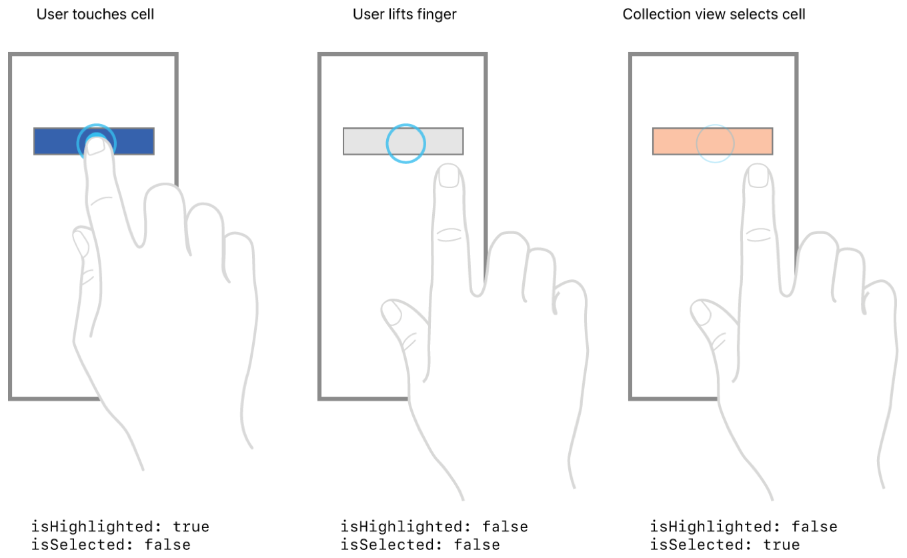

# 선택·하이라이트 셀 모양 바꾸기

> **면접 답변 한 줄 요약:** Collection View가 관리하는 `isHighlighted`·`isSelected` 상태에 맞춰 배경이나 configuration을 다시 계산해야 재사용되는 셀도 올바른 모양을 유지해요.

이 문서는 Apple 공식 샘플이 사용하는 `backgroundView`, `selectedBackgroundView`, delegate 방식부터 최신 configuration state 방식까지 차례대로 설명해요.

## 먼저 알아둘 용어

| 용어                | 쉬운 뜻                                                      |
| ------------------- | ------------------------------------------------------------ |
| Highlight           | 손가락이 닿아 있는 동안 제공하는 일시적인 시각 피드백이에요. |
| Selection           | 사용자가 item을 선택했다는 지속적인 상태예요.                |
| Configuration State | 셀 모양을 결정하는 선택·하이라이트 등의 상태 값이에요.       |

## 개요 (Overview)

이 샘플 앱은 Collection View Cell이 선택되지 않은 상태, 하이라이트된 상태, 선택된 상태 사이를 오갈 때 모양을 바꾸는 방법을 보여 줘요. 사용자가 셀을 탭하면 앱은 셀의 현재 상태를 확인하고, 상태가 전환되고 있다는 사실을 나타내도록 모양을 변경해요.

샘플의 Collection View는 Collection View의 기본값인 단일 item 선택을 지원해요. Collection View가 여러 item을 선택하도록 설정하거나 선택 자체를 비활성화할 수도 있어요.

### Cell 상태 확인하기 (Determine the state of a cell)

샘플의 Collection View는 자신의 영역 안에서 발생한 탭을 감지해 셀 상태를 결정해요. 그런 다음 현재 상태를 나타내도록 해당 셀의 `isSelected`와 `isHighlighted` 프로퍼티를 설정해요. `allowsSelection`이 `true`이므로 Collection View가 이 동작을 제공해요.

선택되지 않은 셀을 터치하면 최초 touch-down 이벤트로 셀의 `isHighlighted`가 `true`가 돼요. 마지막 touch-up 이벤트에서는 하이라이트 상태가 `false`로 돌아가요. 셀 안에서 손가락을 떼면 Collection View가 `isSelected`를 `true`로 설정하고, 셀 밖에서 떼면 선택 값은 바뀌지 않아요.

<!-- Apple DocC image: collection-view-selection_2x -->



### Cell의 시각적 모양 바꾸기 (Change the cell’s visual appearance)

셀의 `backgroundView`는 셀이 처음 표시될 때와 하이라이트되거나 선택되지 않았을 때 배경으로 사용할 뷰를 가리켜요. 셀이 하이라이트 또는 선택 상태로 바뀌면 Collection View는 새 상태를 나타내도록 셀의 상태 프로퍼티를 수정하지만, 셀의 시각적 모양까지 자동으로 바꾸지는 않아요. 다만 `selectedBackgroundView`에 뷰를 지정하면 이 배경 전환을 Collection View가 처리해요.

`selectedBackgroundView`를 지정하면 셀이 하이라이트되거나 선택될 때 기본 배경을 선택 배경으로 교체해요. 앱이 별도의 전환 코드를 실행하지 않아도 Collection View가 상태 변화에 맞춰 셀 모양을 자동으로 변경해요. 공식 샘플은 셀을 선택했을 때 배경색이 빨간색에서 파란색으로 바뀌도록 구성해요.

```swift
override func awakeFromNib() {
    super.awakeFromNib()

    let redView = UIView(frame: bounds)
    redView.backgroundColor = #colorLiteral(red: 1, green: 0, blue: 0, alpha: 1)
    self.backgroundView = redView

    let blueView = UIView(frame: bounds)
    blueView.backgroundColor = #colorLiteral(red: 0, green: 0, blue: 1, alpha: 1)
    self.selectedBackgroundView = blueView
}
```

### 상태 변화를 추가로 표시하기 (Provide additional visual indication of state changes)

선택 배경을 제공하는 방식은 셀 상태에 따라 모양을 바꾸는 간단한 방법이지만, 배경색 이외의 표시도 추가할 수 있어요. 예를 들어 선택된 셀에 체크 표시를 보여 주거나 하이라이트 상태와 선택 상태를 서로 다른 시각 요소로 구분할 수 있어요.

Collection View의 delegate 메서드는 선택과 하이라이트 모양을 조정할 여러 기회를 제공해요. 선택 상태를 직접 그리려면 `selectedBackgroundView`를 `nil`로 두고 `collectionView(_:didSelectItemAt:)`에서 셀 모양을 변경할 수 있어요. 공식 샘플은 선택 배경과 함께 이 메서드에서 별 아이콘을 표시하고, `collectionView(_:didDeselectItemAt:)`에서 별을 제거해요.

```swift
func collectionView(_ collectionView: UICollectionView, didSelectItemAt indexPath: IndexPath) {
    if let cell = collectionView.cellForItem(at: indexPath) as? CustomCollectionViewCell {
        cell.showIcon()
    }
}

func collectionView(_ collectionView: UICollectionView, didDeselectItemAt indexPath: IndexPath) {
    if let cell = collectionView.cellForItem(at: indexPath) as? CustomCollectionViewCell {
        cell.hideIcon()
    }
}
```

하이라이트 상태를 직접 그리려면 `collectionView(_:didHighlightItemAt:)`과 `collectionView(_:didUnhighlightItemAt:)`을 사용해요. 공식 샘플은 두 메서드에서 하이라이트 배경을 서로 다른 빨간색 음영으로 표시해요. 이 앱의 셀은 파란색 `selectedBackgroundView`도 사용하므로, delegate는 변경 사항이 보이도록 셀의 `contentView`에 하이라이트 색상을 적용해요.

```swift
func collectionView(_ collectionView: UICollectionView, didHighlightItemAt indexPath: IndexPath) {
    if let cell = collectionView.cellForItem(at: indexPath) {
        cell.contentView.backgroundColor = #colorLiteral(red: 1, green: 0.4932718873, blue: 0.4739984274, alpha: 1)
    }
}

func collectionView(_ collectionView: UICollectionView, didUnhighlightItemAt indexPath: IndexPath) {
    if let cell = collectionView.cellForItem(at: indexPath) {
        cell.contentView.backgroundColor = nil
    }
}
```

## Swift-KR 보충: Configuration State로 한곳에서 계산해요

iOS 14 이상에서는 `updateConfiguration(using:)`에서 모든 상태별 모양을 계산하면 초기화 누락을 줄일 수 있어요. 상태가 바뀔 때 UIKit이 이 메서드를 다시 호출해요.

```swift
final class PhotoCell: UICollectionViewCell {
  override func updateConfiguration(
    using state: UICellConfigurationState
  ) {
    var background = UIBackgroundConfiguration.listPlainCell()

    if state.isSelected {
      background.backgroundColor = .systemBlue
    } else if state.isHighlighted {
      background.backgroundColor = .systemBlue.withAlphaComponent(0.2)
    } else {
      background.backgroundColor = .secondarySystemBackground
    }

    backgroundConfiguration = background
  }
}
```

사용자 정의 상태가 바뀌면 `setNeedsUpdateConfiguration()`으로 재계산을 요청해요. 화면 갱신 뒤에도 선택을 유지해야 한다면 `IndexPath`가 아니라 item 식별자를 모델에 저장하고 새 위치를 찾아 다시 선택하세요.

## 참고 자료

- [Apple Developer Documentation — Changing the appearance of selected and highlighted cells](https://developer.apple.com/documentation/uikit/changing-the-appearance-of-selected-and-highlighted-cells)
- [UICollectionViewCell](./uicollectionviewcell)
- [선택 관리 학습 가이드](./selection)
