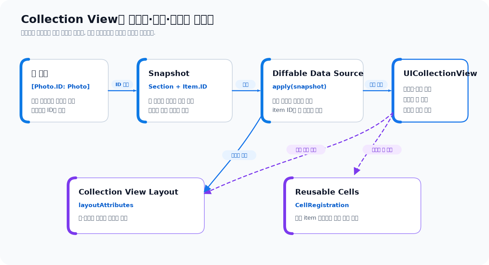

# UIKit Collection Views 한눈에 보기

> **면접 답변 한 줄 요약:** `UICollectionView`는 데이터를 셀로 재사용해 보여 주고, 데이터 소스가 무엇을 표시할지 결정하며 레이아웃 객체가 어디에 배치할지 결정하는 UIKit의 범용 목록 화면이에요.

사진 격자, 앱스토어처럼 가로로 넘기는 카드가 섞인 화면, 설정 목록은 겉모습이 서로 달라요. 하지만 모두 **반복되는 데이터를 화면 크기에 맞게 배치하고, 스크롤하면서 필요한 뷰만 만들어 쓰는 문제**를 풀어야 해요. UIKit의 Collection View는 이 문제를 데이터, 셀, 레이아웃이라는 역할로 나누어 해결해요.

이 문서는 Apple의 [Collection views](https://developer.apple.com/documentation/uikit/collection-views) 문서 계층을 따라가되, API 이름을 나열하는 대신 처음 화면을 만드는 순서대로 다시 구성했어요.

## 먼저 알아둘 UIKit 용어

| 용어                          | 쉬운 뜻                                                                                                                                                         |
| ----------------------------- | --------------------------------------------------------------------------------------------------------------------------------------------------------------- |
| UIKit                         | iPhone과 iPad 앱의 화면, 사용자 입력, 화면 전환을 구성하는 Apple 프레임워크예요. `UIView`, `UIViewController`, `UICollectionView`가 UIKit에 속해요.             |
| Collection View               | 여러 데이터를 셀이라는 반복 가능한 뷰로 보여 주는 스크롤 화면이에요. Swift 타입 이름은 `UICollectionView`예요.                                                  |
| item과 section                | item은 화면에 보여 줄 데이터 하나이고, section은 여러 item을 묶는 단위예요. 사진 한 장이 item, 날짜별 사진 묶음이 section이 될 수 있어요.                       |
| data source                   | section과 item이 무엇인지 알려 주고 필요한 셀을 제공하는 객체예요.                                                                                              |
| diffable data source          | 위치가 아니라 안정적인 식별자로 데이터를 관리하고, 이전 상태와 새 상태의 차이를 계산해 화면을 갱신하는 데이터 소스예요.                                         |
| layout                        | 셀과 헤더의 크기와 위치를 계산하는 객체예요. 데이터 내용이 아니라 화면의 배치를 책임져요.                                                                       |
| cell                          | item 하나를 화면에 표현하는 재사용 가능한 뷰예요. 보이는 범위를 벗어난 셀은 나중에 다른 item을 표시하는 데 다시 사용될 수 있어요.                               |
| supplementary·decoration view | supplementary view는 헤더처럼 데이터를 보조하고, decoration view는 section 배경처럼 레이아웃을 꾸며요.                                                          |
| delegate                      | 선택이나 스크롤처럼 Collection View에서 발생한 사건을 전달받는 객체예요. Swift의 Delegation 패턴은 [별도 문서](/guide/design-patterns/delegation)에서 설명해요. |

이 섹션에서는 다음 순서로 Collection Views를 배워요.

1. Collection View를 이루는 역할을 구분해요.
2. 작은 사진 격자를 화면에 띄워요.
3. diffable data source와 snapshot으로 데이터를 갱신해요.
4. 셀 재사용과 상태 구성을 이해해요.
5. compositional layout으로 배치를 확장해요.
6. 선택, 다중 선택, 드래그 앤 드롭을 연결해요.

## Collection View는 네 역할을 조합해요

Collection View 화면을 구성할 때 가장 먼저 아래 네 질문을 나눠야 해요.

| 질문                                    | 담당 객체·개념                              |
| --------------------------------------- | ------------------------------------------- |
| 어떤 section과 item을 보여 주나요?      | 데이터 모델, snapshot, data source          |
| item을 어떤 뷰로 표현하나요?            | cell registration, cell, supplementary view |
| 셀을 어디에 얼마나 크게 배치하나요?     | collection view layout                      |
| 사용자가 선택하거나 끌면 무엇을 하나요? | delegate, drag delegate, drop delegate      |



화살표를 한 방향으로만 읽을 필요는 없어요. 예를 들어 data source는 item 식별자를 받아 셀을 구성하고, Collection View는 layout이 계산한 위치에 그 셀을 표시해요. 중요한 점은 **데이터의 순서와 화면의 배치를 같은 객체가 모두 책임지지 않는다**는 것이에요.

## 가장 작은 사진 격자를 만들어요

예제에서는 사진을 아래처럼 표현해요. diffable data source의 item 식별자는 값이 바뀌지 않는 `id`만 사용해요.

```swift
import UIKit

struct Photo: Identifiable {
  let id: UUID
  var title: String
  var thumbnail: UIImage?
  var isFavorite = false
}
```

Collection View를 만들려면 최소한 layout이 필요해요. 두 열짜리 격자를 만드는 작은 compositional layout부터 시작해요.

```swift
private func makeGridLayout() -> UICollectionViewLayout {
  let itemSize = NSCollectionLayoutSize(
    widthDimension: .fractionalWidth(1),
    heightDimension: .fractionalHeight(1)
  )
  let item = NSCollectionLayoutItem(layoutSize: itemSize)
  item.contentInsets = NSDirectionalEdgeInsets(
    top: 4,
    leading: 4,
    bottom: 4,
    trailing: 4
  )

  let groupSize = NSCollectionLayoutSize(
    widthDimension: .fractionalWidth(1),
    heightDimension: .fractionalWidth(0.5)
  )
  let group = NSCollectionLayoutGroup.horizontal(
    layoutSize: groupSize,
    repeatingSubitem: item,
    count: 2
  )

  return UICollectionViewCompositionalLayout(
    section: NSCollectionLayoutSection(group: group)
  )
}
```

`fractionalWidth(1)`은 부모 너비 전체를 뜻해요. 그룹 안에 같은 item을 두 개 반복하므로 각 셀은 한 행을 절반씩 나눠 써요. item과 group, section의 관계는 [레이아웃 문서](./layouts)에서 그림과 함께 더 자세히 살펴봐요.

화면에서는 layout을 전달해 Collection View를 만들어요.

```swift
@MainActor
final class PhotoGridViewController: UIViewController {
  private lazy var collectionView = UICollectionView(
    frame: .zero,
    collectionViewLayout: makeGridLayout()
  )

  override func viewDidLoad() {
    super.viewDidLoad()

    collectionView.translatesAutoresizingMaskIntoConstraints = false
    view.addSubview(collectionView)

    NSLayoutConstraint.activate([
      collectionView.topAnchor.constraint(equalTo: view.safeAreaLayoutGuide.topAnchor),
      collectionView.leadingAnchor.constraint(equalTo: view.leadingAnchor),
      collectionView.trailingAnchor.constraint(equalTo: view.trailingAnchor),
      collectionView.bottomAnchor.constraint(equalTo: view.bottomAnchor),
    ])
  }
}
```

아직 빈 화면이에요. layout은 위치만 계산할 뿐, 어떤 데이터와 셀을 보여 줄지는 모르기 때문이에요.

## 데이터 소스가 item과 셀을 연결해요

현대적인 UIKit 코드에서는 `UICollectionViewDiffableDataSource`와 cell registration을 함께 사용하는 방식이 기본 출발점이에요.

```swift
private enum Section {
  case main
}

private var photosByID: [Photo.ID: Photo] = [:]
private var dataSource:
  UICollectionViewDiffableDataSource<Section, Photo.ID>!

private func configureDataSource() {
  let registration = UICollectionView.CellRegistration<
    UICollectionViewCell,
    Photo
  > { cell, _, photo in
    var content = UIListContentConfiguration.cell()
    content.text = photo.title
    content.image = photo.thumbnail
    cell.contentConfiguration = content
  }

  dataSource = UICollectionViewDiffableDataSource(
    collectionView: collectionView
  ) { [weak self] collectionView, indexPath, photoID in
    guard let photo = self?.photosByID[photoID] else {
      return nil
    }

    return collectionView.dequeueConfiguredReusableCell(
      using: registration,
      for: indexPath,
      item: photo
    )
  }
}
```

cell provider는 “이 위치의 식별자를 어떤 셀로 보여 줄까요?”라는 질문에 답해요. 등록 객체가 셀 타입과 구성 코드를 한곳에 묶고, Collection View는 재사용할 셀을 찾아 반환해요.

실제 화면 상태는 snapshot으로 전달해요.

```swift
private func show(_ photos: [Photo]) {
  photosByID = Dictionary(
    uniqueKeysWithValues: photos.map { ($0.id, $0) }
  )

  var snapshot = NSDiffableDataSourceSnapshot<Section, Photo.ID>()
  snapshot.appendSections([.main])
  snapshot.appendItems(photos.map(\.id), toSection: .main)

  dataSource.apply(snapshot, animatingDifferences: true)
}
```

snapshot은 특정 시점에 어떤 section과 item이 어떤 순서로 존재하는지 나타내요. 새 snapshot을 적용하면 diffable data source가 이전 상태와의 차이를 계산해 삽입, 삭제, 이동을 반영해요.

## IndexPath보다 식별자가 데이터의 정체성이에요

`IndexPath(item: 2, section: 0)`은 현재 세 번째 위치를 가리킬 뿐이에요. 앞에 item이 하나 삽입되면 같은 사진의 위치는 네 번째로 바뀌어요. 반면 `Photo.ID`는 사진이 이동해도 바뀌지 않아요.

| 값              | 답하는 질문                  | 데이터 변경 후에도 안정적인가요?          |
| --------------- | ---------------------------- | ----------------------------------------- |
| `IndexPath`     | 지금 화면에서 어디에 있나요? | 아니요. 삽입·삭제·이동에 따라 바뀌어요.   |
| item identifier | 이 데이터는 무엇인가요?      | 예. 같은 item이면 위치와 무관하게 같아요. |

선택한 사진을 저장하거나 비동기 이미지 요청을 관리할 때 `IndexPath`를 장기 보관하면 다른 item을 가리킬 수 있어요. 화면 위치가 꼭 필요한 순간에만 `IndexPath`를 사용하고, 모델 상태는 안정적인 식별자로 관리하는 편이 안전해요.

## 화면 갱신은 데이터를 먼저 바꾸고 snapshot을 적용해요

Collection View에서 자주 발생하는 오류는 화면만 먼저 움직이고 모델을 나중에 맞추려 할 때 생겨요. diffable data source에서는 다음 순서를 기준으로 삼아요.

1. 모델 저장소를 변경해요.
2. 변경된 모델의 section과 item 식별자로 snapshot을 만들어요.
3. snapshot을 data source에 적용해요.
4. cell provider가 최신 모델로 다시 셀을 구성해요.

기존 item의 내용만 바뀌었다면 전체 목록을 다시 만들 필요가 없어요.

```swift
private func renamePhoto(id: Photo.ID, title: String) {
  photosByID[id]?.title = title

  var snapshot = dataSource.snapshot()
  guard snapshot.indexOfItem(id) != nil else {
    return
  }

  snapshot.reconfigureItems([id])
  dataSource.apply(snapshot, animatingDifferences: true)
}
```

`reconfigureItems(_:)`는 item의 정체성과 셀 상태를 유지하면서 cell provider를 다시 호출해요. 데이터 관리 방식은 [데이터와 Diffable Data Source](./data)에서 단계적으로 다뤄요.

## 어떤 문서부터 읽어야 하나요

| 목표                                      | 다음 문서                                           |
| ----------------------------------------- | --------------------------------------------------- |
| `UICollectionView`와 컨트롤러의 역할 구분 | [화면과 역할](./views)                              |
| snapshot으로 안전하게 목록 갱신           | [데이터와 Diffable Data Source](./data)             |
| 셀 재사용과 상태 구성 이해                | [셀과 재사용 뷰](./cells-and-reusable-views)        |
| 격자·목록·가로 스크롤 배치                | [레이아웃](./layouts)                               |
| 선택과 하이라이트, 다중 선택              | [선택 상태](./selection)                            |
| 앱 안팎으로 item 이동                     | [드래그 앤 드롭](./drag-and-drop)                   |
| Apple 원문과 Swift-KR 문서 대응 확인      | [공식 문서 인벤토리](./official-document-inventory) |

처음이라면 위에서 아래 순서로 읽는 것이 좋아요. 기존 프로젝트의 특정 문제를 해결하는 중이라면 필요한 역할의 문서부터 읽어도 돼요.

## Collection View를 선택하지 않아도 되는 경우

Collection View가 모든 반복 화면의 정답은 아니에요.

- 세로 목록 하나이고 기존 코드가 `UITableView`로 안정적으로 동작한다면 억지로 바꿀 필요가 없어요.
- item 수가 매우 적고 반복·재사용이 필요 없는 고정 화면이면 일반 `UIStackView`가 더 단순할 수 있어요.
- 새 화면을 SwiftUI로 만들고 UIKit과 상호 운용할 이유가 없다면 `List`, `LazyVGrid`, `LazyHGrid`도 후보예요.
- 반대로 여러 section의 배치가 다르거나, 세밀한 재사용·선택·드래그 앤 드롭 제어가 필요하다면 Collection View가 잘 맞아요.

프레임워크나 컨트롤 이름보다 화면 변화, 성능 요구, 팀이 유지할 기존 코드라는 조건을 먼저 봐야 해요.

## 적용 순서를 정리해요

새 Collection View 화면을 만들 때 다음 순서를 권장해요.

1. section과 item의 안정적인 식별자를 정해요.
2. 가장 단순한 layout 하나로 Collection View를 띄워요.
3. cell registration과 diffable data source를 연결해요.
4. 초기 snapshot을 적용하고 삽입·삭제·내용 갱신을 각각 확인해요.
5. 셀 선택 상태와 비동기 작업이 재사용 후에도 올바른지 확인해요.
6. 필요한 배치만 compositional layout에 추가해요.
7. 실제 요구가 있을 때 prefetching, 다중 선택, drag and drop을 붙여요.

## 면접에서 이어질 수 있는 질문

### `UICollectionView`와 data source는 어떻게 다른가요?

`UICollectionView`는 스크롤, 셀 재사용, 선택과 실제 화면 표시를 관리하고 data source는 어떤 section과 item을 보여 줄지 제공해요. 두 역할을 분리해야 같은 데이터를 다른 레이아웃으로 보여 주거나 데이터 갱신 방식을 바꾸기 쉬워요.

### diffable data source가 기존 data source보다 항상 빠른가요?

목적은 무조건적인 속도 향상이 아니라 **식별자 기반 상태 표현과 안전한 차이 계산**이에요. 매우 큰 snapshot을 자주 새로 만들거나 식별자의 해시 구현이 무거우면 비용이 생길 수 있으므로, 갱신 단위와 모델 구조를 함께 살펴야 해요.

### 셀이 화면에서 사라지면 객체도 항상 없어지나요?

아니요. 화면 밖으로 나간 셀은 재사용 큐에서 유지되었다가 다른 item을 표현하는 데 사용될 수 있어요. 그래서 셀 객체에 item의 정체성이나 비동기 작업 상태를 영구 저장하면 안 되고, 재구성할 때 이전 상태를 덮어써야 해요.

### 레이아웃은 셀을 직접 만들거나 데이터를 읽나요?

일반적으로 레이아웃은 셀의 위치와 크기를 나타내는 layout attributes를 계산해요. 셀 생성과 데이터 구성은 Collection View와 data source가 담당하므로, 레이아웃에 모델 로직을 섞지 않는 편이 역할을 명확하게 유지해요.

## 참고 자료

- [Collection views](https://developer.apple.com/documentation/uikit/collection-views)
- [UICollectionView](https://developer.apple.com/documentation/uikit/uicollectionview)
- [Implementing modern collection views](https://developer.apple.com/documentation/uikit/implementing-modern-collection-views)
- [Updating collection views using diffable data sources](https://developer.apple.com/documentation/uikit/updating-collection-views-using-diffable-data-sources)
