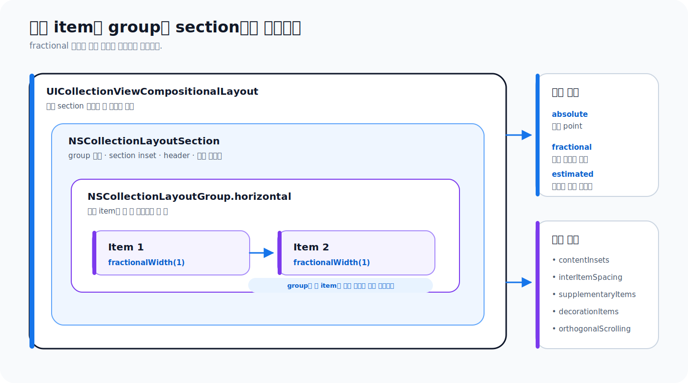

# Collection View 레이아웃

> **면접 답변 한 줄 요약:** Collection View layout은 데이터와 셀을 만들지 않고 각 요소의 크기와 위치를 계산하며, compositional layout은 item을 group에, group을 section에 조합해 복잡한 배치를 선언적으로 구성해요.

같은 사진 데이터도 세로 목록, 두 열 격자, 가로 카드, 모자이크로 보여 줄 수 있어요. 데이터를 바꾸지 않고 화면 배치를 바꿀 수 있는 이유는 Collection View가 **무엇을 보여 줄지**와 **어디에 보여 줄지**를 분리하기 때문이에요.

Apple의 [Layouts](https://developer.apple.com/documentation/uikit/layouts) 문서는 compositional layout부터 flow layout, 직접 만드는 layout까지 Collection View의 배치 API를 한 계층으로 정리해요.

## 먼저 알아둘 레이아웃 용어

| 용어                 | 쉬운 뜻                                                                                                                  |
| -------------------- | ------------------------------------------------------------------------------------------------------------------------ |
| layout attributes    | 셀이나 supplementary view의 frame, 중심, 투명도, 변환, 쌓임 순서처럼 화면 배치에 필요한 값이에요.                        |
| compositional layout | item, group, section을 작은 단위부터 조합해 배치를 만드는 `UICollectionViewCompositionalLayout`이에요.                   |
| flow layout          | 한 방향으로 item을 차례로 놓고 다음 줄로 넘기는 `UICollectionViewFlowLayout`이에요.                                      |
| fractional dimension | 부모 컨테이너 크기에 대한 비율로 정하는 너비나 높이예요.                                                                 |
| estimated dimension  | 실제 콘텐츠를 측정하기 전 예상한 크기예요. self-sizing 텍스트처럼 최종 크기가 콘텐츠에 따라 달라질 때 사용해요.          |
| invalidation         | 기존 배치 계산의 일부 또는 전체가 더 이상 유효하지 않다고 layout에 알리고 다시 계산하게 하는 과정이에요.                 |
| orthogonal scrolling | 전체 화면의 주 스크롤 방향과 수직인 방향으로 특정 section만 스크롤하는 방식이에요. 세로 화면 안의 가로 카드가 한 예예요. |

## Compositional Layout은 계층을 조합해요



계층은 바깥에서 안쪽으로 다음과 같아요.

1. `UICollectionViewCompositionalLayout`이 전체 화면의 section을 구성해요.
2. `NSCollectionLayoutSection`은 반복할 group과 section별 장식을 정해요.
3. `NSCollectionLayoutGroup`은 item 또는 다른 group을 가로·세로·커스텀 경로로 묶어요.
4. `NSCollectionLayoutItem`은 셀 하나가 차지할 가장 작은 배치 단위예요.
5. 각 item과 group은 `NSCollectionLayoutSize`로 너비와 높이를 가져요.

## 한 열 목록에서 두 열 격자로 확장해요

먼저 item 하나를 정의해요.

```swift
let itemSize = NSCollectionLayoutSize(
  widthDimension: .fractionalWidth(1),
  heightDimension: .fractionalHeight(1)
)
let item = NSCollectionLayoutItem(layoutSize: itemSize)
```

item의 비율은 자신이 들어 있는 group을 기준으로 해요. 이제 같은 item을 한 group에 두 번 반복해요.

```swift
let groupSize = NSCollectionLayoutSize(
  widthDimension: .fractionalWidth(1),
  heightDimension: .fractionalWidth(0.5)
)
let group = NSCollectionLayoutGroup.horizontal(
  layoutSize: groupSize,
  repeatingSubitem: item,
  count: 2
)
```

group은 Collection View 너비 전체를 차지하고 높이는 너비의 절반이에요. 두 item이 group의 가로 공간을 나눠 가져 정사각형에 가까운 두 열 격자가 돼요.

마지막으로 group을 section과 layout에 넣어요.

```swift
let section = NSCollectionLayoutSection(group: group)
section.contentInsets = NSDirectionalEdgeInsets(
  top: 8,
  leading: 8,
  bottom: 8,
  trailing: 8
)

let layout = UICollectionViewCompositionalLayout(section: section)
```

열 수가 하나라면 `count: 1`, 세 개라면 `count: 3`으로 바꿀 수 있어요. item의 데이터는 바뀌지 않아요.

## 크기 표현 네 가지를 구분해요

`NSCollectionLayoutDimension`은 한 축의 크기를 표현하고, `NSCollectionLayoutSize`는 너비와 높이 dimension을 묶어요.

| dimension                     | 기준                                 | 적합한 예                                           |
| ----------------------------- | ------------------------------------ | --------------------------------------------------- |
| `.absolute(80)`               | 80 point로 고정                      | 고정 높이 아이콘, 배지                              |
| `.fractionalWidth(0.5)`       | 부모 너비의 50%                      | 두 열 격자의 item 또는 group                        |
| `.fractionalHeight(1)`        | 부모 높이의 100%                     | group 높이를 가득 채우는 item                       |
| `.estimated(72)`              | 72 point로 시작해 콘텐츠로 최종 측정 | 여러 줄 텍스트가 있는 self-sizing 목록              |
| `.uniformAcrossSiblings(...)` | 형제 요소가 일관된 축 크기를 공유    | 지원 OS를 확인한 뒤 균일한 sibling 크기가 필요할 때 |

fractional 값은 화면 전체가 아니라 **직접 부모 컨테이너**를 기준으로 해요. item의 `.fractionalWidth(1)`은 Collection View 전체가 아니라 자신이 속한 group 너비 전체일 수 있어요.

estimated 크기를 사용하면서 셀 내부 Auto Layout 제약이 불완전하면 반복 측정과 흔들림이 생길 수 있어요. 콘텐츠가 위에서 아래, 왼쪽에서 오른쪽까지 크기를 결정할 수 있도록 제약을 완성해야 해요.

## 간격과 inset은 적용 위치가 달라요

| API                          | 적용 대상          | 의미                                            |
| ---------------------------- | ------------------ | ----------------------------------------------- |
| `item.contentInsets`         | item 내부 가장자리 | 셀 frame 안쪽을 줄여 셀 사이에 여백처럼 보여요. |
| `item.edgeSpacing`           | item 바깥 가장자리 | 주변 요소와의 고정·가변 간격을 표현해요.        |
| `group.interItemSpacing`     | group 안 형제 item | 같은 group의 item 사이 간격이에요.              |
| `section.interGroupSpacing`  | section 안 group   | 반복되는 group 사이 간격이에요.                 |
| `section.contentInsets`      | section 전체       | section 콘텐츠 바깥쪽 여백이에요.               |
| layout `interSectionSpacing` | section 사이       | 서로 다른 section 사이의 간격이에요.            |

고정 간격은 `.fixed(8)`, 여유 공간에 따라 늘어날 수 있는 간격은 `.flexible(8)`처럼 `NSCollectionLayoutSpacing`으로 표현해요. `NSCollectionLayoutEdgeSpacing`은 leading, top, trailing, bottom 네 방향에 각각 간격을 줄 수 있어요.

여백이 예상보다 커지면 item, group, section 여러 단계에 inset을 중복 적용하지 않았는지 먼저 확인하세요.

## 화면 너비에 따라 열 수를 바꿔요

section provider는 section index와 `NSCollectionLayoutEnvironment`를 받아 매번 맞는 section을 반환하는 closure예요.

```swift
let layout = UICollectionViewCompositionalLayout {
  _, environment -> NSCollectionLayoutSection? in

  let availableWidth =
    environment.container.effectiveContentSize.width
  let columnCount = availableWidth >= 700 ? 4 : 2

  let itemSize = NSCollectionLayoutSize(
    widthDimension: .fractionalWidth(1),
    heightDimension: .fractionalHeight(1)
  )
  let item = NSCollectionLayoutItem(layoutSize: itemSize)

  let groupSize = NSCollectionLayoutSize(
    widthDimension: .fractionalWidth(1),
    heightDimension: .fractionalWidth(1 / CGFloat(columnCount))
  )
  let group = NSCollectionLayoutGroup.horizontal(
    layoutSize: groupSize,
    repeatingSubitem: item,
    count: columnCount
  )

  return NSCollectionLayoutSection(group: group)
}
```

`NSCollectionLayoutEnvironment`는 container와 trait collection을 제공해요. `NSCollectionLayoutContainer`의 `effectiveContentSize`는 적용 가능한 inset을 반영한 실제 콘텐츠 크기를 알려 줘요. 기기 이름보다 현재 사용 가능한 너비를 기준으로 열 수를 정하면 split view와 회전에도 대응하기 쉬워요.

layout 전체 정책은 `UICollectionViewCompositionalLayoutConfiguration`으로 정할 수 있어요.

```swift
let configuration =
  UICollectionViewCompositionalLayoutConfiguration()
configuration.scrollDirection = .vertical
configuration.interSectionSpacing = 24
configuration.contentInsetsReference = .safeArea

let layout = UICollectionViewCompositionalLayout(
  sectionProvider: sectionProvider,
  configuration: configuration
)
```

configuration은 주 스크롤 방향, section 간격, 전체 boundary supplementary item과 content inset 기준을 제공해요.

## 한 화면에 서로 다른 section을 만들어요

App Store처럼 hero, 가로 카드, 세로 목록이 섞인 화면은 section마다 다른 layout을 반환해요.

```swift
private enum Section: Int, CaseIterable {
  case featured
  case recent
  case allPhotos
}

let layout = UICollectionViewCompositionalLayout {
  sectionIndex, environment in

  guard let section = Section(rawValue: sectionIndex) else {
    return nil
  }

  switch section {
  case .featured:
    return makeFeaturedSection(environment: environment)
  case .recent:
    return makeHorizontalCardSection()
  case .allPhotos:
    return makeGridSection(environment: environment)
  }
}
```

여기서 `sectionIndex`는 data source snapshot의 section 순서와 맞아야 해요. enum raw value에 무조건 의존하기보다, 섹션 종류가 동적으로 바뀐다면 현재 snapshot의 section identifier를 조회해 layout을 선택하는 방법도 고려하세요.

## 특정 section만 가로로 스크롤해요

세로 화면 안에서 최근 사진 section만 가로로 움직이게 할 수 있어요.

```swift
let section = NSCollectionLayoutSection(group: cardGroup)
section.orthogonalScrollingBehavior = .groupPagingCentered
```

`UICollectionLayoutSectionOrthogonalScrollingBehavior`의 대표 옵션은 다음과 같아요.

| 값                                | 동작                                             |
| --------------------------------- | ------------------------------------------------ |
| `.none`                           | 주 스크롤 축만 사용해요.                         |
| `.continuous`                     | 손가락 위치대로 연속 스크롤해요.                 |
| `.continuousGroupLeadingBoundary` | 멈출 때 group의 leading 경계에 맞춰요.           |
| `.paging`                         | Collection View의 보이는 너비 단위로 paging해요. |
| `.groupPaging`                    | group 단위로 paging해요.                         |
| `.groupPagingCentered`            | group 단위로 넘기고 group을 가운데에 맞춰요.     |

가로 스크롤 section 안에 또 복잡한 제스처가 있으면 사용자 입력이 충돌할 수 있어요. paging 방식과 카드 너비를 실제 기기에서 확인하세요.

## 헤더와 footer는 boundary supplementary item이에요

section 경계에 붙는 헤더를 layout에 정의해요.

```swift
let headerSize = NSCollectionLayoutSize(
  widthDimension: .fractionalWidth(1),
  heightDimension: .estimated(48)
)

let header = NSCollectionLayoutBoundarySupplementaryItem(
  layoutSize: headerSize,
  elementKind: UICollectionView.elementKindSectionHeader,
  alignment: .top
)
header.pinToVisibleBounds = true
header.zIndex = 2

section.boundarySupplementaryItems = [header]
```

`pinToVisibleBounds`를 켜면 section이 보이는 동안 헤더를 화면 경계에 고정할 수 있어요. 실제 헤더 뷰는 data source의 supplementary provider가 제공해요.

item 모서리에 badge를 붙이려면 `NSCollectionLayoutSupplementaryItem`과 `NSCollectionLayoutAnchor`를 사용해요.

```swift
let anchor = NSCollectionLayoutAnchor(
  edges: [.top, .trailing],
  fractionalOffset: CGPoint(x: 0.3, y: -0.3)
)

let badge = NSCollectionLayoutSupplementaryItem(
  layoutSize: NSCollectionLayoutSize(
    widthDimension: .absolute(20),
    heightDimension: .absolute(20)
  ),
  elementKind: "favorite-badge",
  containerAnchor: anchor
)
```

section 배경은 `NSCollectionLayoutDecorationItem`으로 구성해요.

```swift
let background =
  NSCollectionLayoutDecorationItem.background(
    elementKind: "section-background"
  )
background.contentInsets = NSDirectionalEdgeInsets(
  top: 4,
  leading: 4,
  bottom: 4,
  trailing: 4
)
section.decorationItems = [background]
```

decoration view 클래스는 compositional layout에 등록해야 해요.

```swift
layout.register(
  SectionBackgroundView.self,
  forDecorationViewOfKind: "section-background"
)
```

## group을 중첩하거나 직접 배치해요

큰 사진 하나 옆에 작은 사진 두 개를 배치하려면 group 안에 group을 넣어요.

```swift
let largeItem = NSCollectionLayoutItem(
  layoutSize: NSCollectionLayoutSize(
    widthDimension: .fractionalWidth(0.67),
    heightDimension: .fractionalHeight(1)
  )
)

let smallItem = NSCollectionLayoutItem(
  layoutSize: NSCollectionLayoutSize(
    widthDimension: .fractionalWidth(1),
    heightDimension: .fractionalHeight(0.5)
  )
)

let trailingGroup = NSCollectionLayoutGroup.vertical(
  layoutSize: NSCollectionLayoutSize(
    widthDimension: .fractionalWidth(0.33),
    heightDimension: .fractionalHeight(1)
  ),
  repeatingSubitem: smallItem,
  count: 2
)

let mosaicGroup = NSCollectionLayoutGroup.horizontal(
  layoutSize: NSCollectionLayoutSize(
    widthDimension: .fractionalWidth(1),
    heightDimension: .fractionalWidth(0.7)
  ),
  subitems: [largeItem, trailingGroup]
)
```

규칙적인 중첩으로 표현하기 어려우면 custom group의 item provider에서 `NSCollectionLayoutGroupCustomItem` frame을 반환할 수 있어요. custom 배치는 유연하지만 container 크기, item 개수, 접근성 글자 크기 변화에 맞는 frame 계산을 직접 책임져야 해요.

## 보이는 item을 마지막 순간에 조정해요

`visibleItemsInvalidationHandler`는 layout cycle 직전에 현재 보이는 `NSCollectionLayoutVisibleItem`을 조정해요. 가로 카드의 중심 거리로 scale이나 alpha를 바꾸는 효과를 만들 수 있어요.

```swift
section.visibleItemsInvalidationHandler = {
  items,
  contentOffset,
  environment in

  let centerX =
    contentOffset.x
    + environment.container.effectiveContentSize.width / 2

  for item in items {
    let distance = abs(item.center.x - centerX)
    let scale = max(0.9, 1 - distance / 1000)
    item.transform = CGAffineTransform(
      scaleX: scale,
      y: scale
    )
  }
}
```

이 closure는 스크롤 중 자주 호출돼요. 네트워크 요청이나 무거운 모델 계산을 넣지 말고 frame, transform, alpha처럼 빠른 시각 계산만 수행하세요.

## Flow Layout은 규칙적인 줄 배치에 적합해요

`UICollectionViewFlowLayout`은 item을 한 방향으로 나열하고 공간이 부족하면 다음 줄로 넘겨요.

```swift
let flowLayout = UICollectionViewFlowLayout()
flowLayout.scrollDirection = .vertical
flowLayout.itemSize = CGSize(width: 120, height: 120)
flowLayout.minimumInteritemSpacing = 8
flowLayout.minimumLineSpacing = 12
flowLayout.sectionInset = UIEdgeInsets(
  top: 16,
  left: 16,
  bottom: 16,
  right: 16
)
```

section마다 크기와 간격이 달라지면 `UICollectionViewDelegateFlowLayout`로 값을 제공할 수 있어요. 간단한 균일 격자에는 이해하기 쉽지만, 여러 종류의 section과 가로 스크롤을 조합하면 compositional layout이 구조를 더 잘 드러내요.

## 완전히 새로운 배치는 `UICollectionViewLayout`을 상속해요

Compositional Layout이나 Flow Layout으로 표현할 수 없는 그래프, 자유 배치, 특수 모자이크라면 `UICollectionViewLayout`을 상속할 수 있어요.

핵심 구현 지점은 다음과 같아요.

| API                                | 책임                                                        |
| ---------------------------------- | ----------------------------------------------------------- |
| `prepare()`                        | item과 supplementary view의 attributes를 계산하고 캐시해요. |
| `collectionViewContentSize`        | 전체 스크롤 콘텐츠 크기를 반환해요.                         |
| `layoutAttributesForElements(in:)` | 요청 영역과 겹치는 모든 attributes를 반환해요.              |
| `layoutAttributesForItem(at:)`     | 특정 item의 attributes를 반환해요.                          |
| `shouldInvalidateLayout(...)`      | bounds 변화 때 다시 계산할지 결정해요.                      |
| `invalidationContext(...)`         | 다시 계산할 구체적인 범위를 표현해요.                       |

`UICollectionViewLayoutAttributes`는 frame, center, transform, alpha, z-index와 요소 종류를 담아요. 모든 item을 매 스크롤마다 다시 계산하면 느릴 수 있으므로 `prepare()`에서 캐시하고 요청 rect와 겹치는 attributes만 빠르게 찾는 구조가 필요해요.

## invalidation은 다시 계산할 범위를 줄여요

화면 회전이나 셀 크기 변경으로 기존 layout 정보가 틀리면 invalidate해야 해요.

`UICollectionViewLayoutInvalidationContext`는 다음 정보를 표현해요.

- 전체 layout 또는 data source 개수를 다시 계산할지
- 어떤 item, supplementary view, decoration view만 무효화할지
- content offset과 content size를 얼마나 조정할지
- interactive movement 중 이전·목표 index path가 무엇인지

Flow Layout은 `UICollectionViewFlowLayoutInvalidationContext`에서 delegate metric과 attributes를 다시 계산할지 더 구체적으로 알려 줘요.

무조건 `invalidateLayout()` 전체 호출부터 사용하기보다 변경 범위를 좁힐 수 있는지 확인하세요. 반대로 잘못된 부분 invalidation은 오래된 attributes를 남길 수 있으므로 정확성이 먼저예요.

## layout 전환과 업데이트 객체를 이해해요

`UICollectionViewTransitionLayout`은 현재 layout과 다음 layout 사이의 전환 진행률과 커스텀 애니메이션 값을 관리해요. 제스처로 그리드에서 목록으로 변하는 interactive transition 같은 고급 동작에 사용해요.

Collection View가 삽입·삭제·이동을 처리할 때 custom layout에는 `UICollectionViewUpdateItem`이 전달될 수 있어요. 이 객체는 업데이트 전후 index path와 action을 알려 줘서 등장·퇴장 attributes를 계산하게 해요.

`UICollectionViewFocusUpdateContext`는 tvOS나 키보드·리모컨 포커스 이동에서 이전과 다음 focus index path를 제공해요. 터치만 고려한 iPhone 화면이라도 여러 Apple 플랫폼을 지원한다면 focus 상태를 별도 요구사항으로 봐야 해요.

## 레이아웃 API 전체 지도를 확인해요

Apple Layouts 하위 심볼을 역할별로 묶으면 다음과 같아요.

| 영역             | 포함 API                                                                                                                                                        |
| ---------------- | --------------------------------------------------------------------------------------------------------------------------------------------------------------- |
| 핵심             | `UICollectionViewCompositionalLayout`                                                                                                                           |
| 구성 요소        | `NSCollectionLayoutItem`, `NSCollectionLayoutGroup`, `NSCollectionLayoutSection`                                                                                |
| 크기·간격        | `NSCollectionLayoutDimension`, `NSCollectionLayoutSize`, `NSCollectionLayoutSpacing`, `NSCollectionLayoutEdgeSpacing`, `NSCollectionLayoutContainer`            |
| 환경·설정        | `UICollectionViewCompositionalLayoutConfiguration`, `UICollectionViewCompositionalLayoutSectionProvider`, `NSCollectionLayoutEnvironment`                       |
| 가로 스크롤      | `UICollectionLayoutSectionOrthogonalScrollingBehavior`                                                                                                          |
| 보조·장식 요소   | `NSCollectionLayoutAnchor`, `NSCollectionLayoutSupplementaryItem`, `NSCollectionLayoutBoundarySupplementaryItem`, `NSCollectionLayoutDecorationItem`            |
| 고급 group       | `NSCollectionLayoutGroupCustomItem`, `NSCollectionLayoutGroupCustomItemProvider`                                                                                |
| 표시·갱신        | `NSCollectionLayoutVisibleItem`, `NSCollectionLayoutSectionVisibleItemsInvalidationHandler`, `UICollectionViewUpdateItem`, `UICollectionViewFocusUpdateContext` |
| 수동 layout      | `UICollectionViewLayout`, `UICollectionViewFlowLayout`, `UICollectionViewTransitionLayout`, `UICollectionViewLayoutAttributes`                                  |
| 무효화           | `UICollectionViewLayoutInvalidationContext`, `UICollectionViewFlowLayoutInvalidationContext`                                                                    |
| 함께 쓰는 데이터 | `NSDiffableDataSourceSnapshot`                                                                                                                                  |

각 심볼의 Apple 원문 링크는 [공식 문서 인벤토리](./official-document-inventory)에 모두 정리했어요.

## 어떤 레이아웃을 선택해야 하나요

| 조건                                        | 먼저 검토할 선택지                           |
| ------------------------------------------- | -------------------------------------------- |
| 균일한 단일 목록·격자                       | Flow Layout 또는 간단한 Compositional Layout |
| section마다 배치가 다름                     | Compositional Layout section provider        |
| 세로 화면 안에 가로 카드가 있음             | Compositional Layout orthogonal scrolling    |
| header, badge, section 배경을 조합함        | Compositional supplementary·decoration item  |
| 규칙적인 중첩으로 모자이크를 표현할 수 있음 | 중첩 group 또는 custom group                 |
| 기존 layout API로 표현할 수 없는 기하 구조  | `UICollectionViewLayout` 직접 구현           |

가장 강력한 API부터 시작하지 마세요. 작은 layout에서 요구사항을 확인하고 필요한 계층만 추가해야 디버깅 범위가 줄어요.

## 적용 순서를 정리해요

1. 각 section이 목록, 격자, 가로 카드 중 어떤 배치인지 그려 봐요.
2. item의 실제 콘텐츠가 고정 크기인지 self-sizing인지 정해요.
3. 가장 작은 item, group, section부터 만들어요.
4. item·group·section inset이 중복되지 않는지 확인해요.
5. 화면 너비가 달라지면 environment 기준으로 열 수를 조정해요.
6. 실제 필요한 곳에만 supplementary, decoration, orthogonal scrolling을 추가해요.
7. custom layout이라면 attributes 캐시와 invalidation 범위를 성능 도구로 검증해요.

## 면접에서 이어질 수 있는 질문

### Compositional Layout의 item, group, section은 어떤 관계인가요?

item은 셀 하나의 배치 단위이고 group은 item이나 다른 group을 묶어 한 번 반복할 구조를 만들며 section은 group을 반복하고 section별 스크롤·헤더·배경을 정해요. 이 계층을 전체 layout이 조합해요.

### `.fractionalWidth(1)`은 항상 화면 전체 너비인가요?

아니요. 직접 부모 컨테이너 너비의 100%예요. item이면 group, group이면 더 바깥 group이나 section container가 기준이 될 수 있으므로 계층을 따라가야 해요.

### Flow Layout과 Compositional Layout은 어떻게 선택하나요?

균일한 한 방향 격자는 Flow Layout도 충분히 단순하고 명확해요. 서로 다른 section, 중첩 group, 가로 스크롤, 다양한 supplementary 요소를 조합한다면 Compositional Layout이 구조를 선언적으로 표현하기 쉬워요.

### layout invalidation은 왜 필요한가요?

화면 크기나 콘텐츠 크기가 바뀌면 이전에 계산한 attributes가 더 이상 맞지 않기 때문이에요. invalidation context로 다시 계산할 범위를 알려 정확성을 유지하면서 불필요한 전체 계산을 줄일 수 있어요.

## 참고 자료

- [Layouts](https://developer.apple.com/documentation/uikit/layouts)
- [Implementing modern collection views](https://developer.apple.com/documentation/uikit/implementing-modern-collection-views)
- [UICollectionViewCompositionalLayout](https://developer.apple.com/documentation/uikit/uicollectionviewcompositionallayout)
- [NSCollectionLayoutItem](https://developer.apple.com/documentation/uikit/nscollectionlayoutitem)
- [NSCollectionLayoutGroup](https://developer.apple.com/documentation/uikit/nscollectionlayoutgroup)
- [NSCollectionLayoutSection](https://developer.apple.com/documentation/uikit/nscollectionlayoutsection)
- [Customizing collection view layouts](https://developer.apple.com/documentation/uikit/customizing-collection-view-layouts)
- [UICollectionViewLayout](https://developer.apple.com/documentation/uikit/uicollectionviewlayout)
- [UICollectionViewFlowLayout](https://developer.apple.com/documentation/uikit/uicollectionviewflowlayout)
