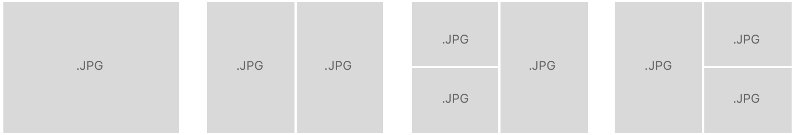

# Collection View Layout 사용자 정의하기

> **면접 답변 한 줄 요약:** 단순 grid는 `UICollectionViewFlowLayout`을 조정하고, 자유 배치는 `UICollectionViewLayout`을 상속해 attributes·콘텐츠 크기·무효화·업데이트를 직접 제공해요.

이 문서는 Apple의 **Customizing collection view layouts** 샘플이 다루는 두 레이아웃과 batch update 과정을 공식 순서대로 설명해요.

## 먼저 알아둘 용어

| 용어              | 쉬운 뜻                                                                         |
| ----------------- | ------------------------------------------------------------------------------- |
| Layout Attributes | 셀·보조 뷰·장식 뷰의 frame, 중심, 투명도, z-index 같은 배치 결과예요.           |
| Content Size      | Collection View가 스크롤할 수 있는 전체 콘텐츠 영역의 크기예요.                 |
| Invalidation      | 이전 계산이 더는 유효하지 않으니 필요한 layout 정보를 다시 계산하는 과정이에요. |
| Batch Update      | 여러 삽입·삭제·이동·reload를 하나의 일관된 애니메이션으로 적용하는 작업이에요.  |

## 개요

단순한 행·열 grid는 `UICollectionViewFlowLayout`을 바로 사용하거나 상속하면 돼요. 더 자유로운 배치가 필요하면 `UICollectionViewLayout`을 상속해 각 요소의 위치와 크기를 직접 계산해요.

공식 샘플은 두 구현을 비교해요.

- `ColumnFlowLayout`: 좁은 폭에서는 한 열 목록, 넓은 폭에서는 여러 열 grid가 되는 `UICollectionViewFlowLayout` 하위 클래스
- `MosaicLayout`: 크기와 비율이 다른 셀을 네 종류의 행으로 조합하는 `UICollectionViewLayout` 하위 클래스

샘플의 Friends 화면은 Column Flow Layout을, 사진 Feed 화면은 Mosaic Layout을 사용해요. 내비게이션 바의 update 버튼은 삽입·삭제·이동·reload를 batch animation으로 보여 주고, pull-to-refresh는 데이터를 초기화해요.

## 단순 Grid는 Cell 크기를 동적으로 계산해요

`ColumnFlowLayout`은 Collection View 폭에서 layout margin을 제외한 실제 사용 가능 폭을 계산해요. 최소 열 너비를 기준으로 들어갈 수 있는 최대 열 개수를 구한 뒤 실제 cell 폭을 나눠 가져요.

```swift
final class ColumnFlowLayout: UICollectionViewFlowLayout {
  let minColumnWidth: CGFloat = 160
  let cellHeight: CGFloat = 220

  override func prepare() {
    super.prepare()
    guard let collectionView else { return }

    let availableWidth = collectionView.bounds
      .inset(by: collectionView.layoutMargins)
      .width
    let columnCount = max(1, Int(availableWidth / minColumnWidth))
    let cellWidth =
      (availableWidth / CGFloat(columnCount)).rounded(.down)

    itemSize = CGSize(width: cellWidth, height: cellHeight)
    sectionInset = UIEdgeInsets(
      top: minimumInteritemSpacing,
      left: 0,
      bottom: 0,
      right: 0
    )
    sectionInsetReference = .fromSafeArea
  }
}
```

iPhone 세로처럼 좁은 화면에서는 한 열, 가로 모드나 iPad처럼 넓은 화면에서는 여러 열이 돼요. 열 개수가 0이 되지 않도록 `max(1, ...)`로 방어하세요.

## 복잡한 Grid는 Cell Frame을 직접 계산해요

Flow Layout으로 표현하기 어려운 Mosaic Layout은 모든 item의 attributes와 전체 content bounds를 직접 계산해 캐시해요.

공식 예제는 다음 네 가지 segment를 반복해요.

1. 전체 폭 셀 하나
2. 절반 폭 셀 두 개
3. 왼쪽 2/3 셀 하나 + 오른쪽 1/3 셀 두 개
4. 왼쪽 1/3 셀 두 개 + 오른쪽 2/3 셀 하나

<!-- Apple DocC image: CellLayouts -->



### `prepare()`에서 Attributes를 계산하고 캐시해요

layout이 무효화되면 `prepare()`가 호출돼요. 이전 캐시를 지우고 모든 item의 frame을 만든 뒤 `UICollectionViewLayoutAttributes`에 저장해요. 아래 코드는 공식 알고리즘의 핵심을 그대로 나눈 예예요.

```swift
final class MosaicLayout: UICollectionViewLayout {
  private var cachedAttributes: [UICollectionViewLayoutAttributes] = []
  private var contentBounds = CGRect.zero

  override func prepare() {
    super.prepare()
    guard let collectionView else { return }

    cachedAttributes.removeAll()
    contentBounds = CGRect(origin: .zero, size: collectionView.bounds.size)

    let itemCount = collectionView.numberOfItems(inSection: 0)
    let width = collectionView.bounds.width
    var currentIndex = 0
    var style: SegmentStyle = .fullWidth
    var lastFrame = CGRect.zero

    while currentIndex < itemCount {
      let segmentFrame = CGRect(
        x: 0,
        y: lastFrame.maxY + 1,
        width: width,
        height: 200
      )

      let frames = frames(for: style, in: segmentFrame)
      for frame in frames where currentIndex < itemCount {
        let indexPath = IndexPath(item: currentIndex, section: 0)
        let attributes =
          UICollectionViewLayoutAttributes(forCellWith: indexPath)
        attributes.frame = frame

        cachedAttributes.append(attributes)
        contentBounds = contentBounds.union(frame)
        currentIndex += 1
        lastFrame = frame
      }

      style = nextStyle(
        after: style,
        remainingItemCount: itemCount - currentIndex
      )
    }
  }
}
```

네 segment의 frame 계산을 별도 함수로 분리하면 `prepare()`의 책임을 읽기 쉬워요.

```swift
private func frames(
  for style: SegmentStyle,
  in frame: CGRect
) -> [CGRect] {
  switch style {
  case .fullWidth:
    return [frame]

  case .fiftyFifty:
    let parts = frame.dividedIntegral(
      fraction: 0.5,
      from: .minXEdge
    )
    return [parts.first, parts.second]

  case .twoThirdsOneThird:
    let columns = frame.dividedIntegral(
      fraction: 2 / 3,
      from: .minXEdge
    )
    let trailing = columns.second.dividedIntegral(
      fraction: 0.5,
      from: .minYEdge
    )
    return [columns.first, trailing.first, trailing.second]

  case .oneThirdTwoThirds:
    let columns = frame.dividedIntegral(
      fraction: 1 / 3,
      from: .minXEdge
    )
    let leading = columns.first.dividedIntegral(
      fraction: 0.5,
      from: .minYEdge
    )
    return [leading.first, leading.second, columns.second]
  }
}
```

### 전체 Content Size를 알려 줘요

Collection View는 layout의 `collectionViewContentSize`를 읽어 스크롤 범위를 결정해요.

```swift
override var collectionViewContentSize: CGSize {
  contentBounds.size
}
```

### 주어진 Rect와 겹치는 Attributes만 반환해요

`layoutAttributesForElements(in:)`는 스크롤 중 자주 호출돼요. 모든 attributes를 매번 선형 탐색하면 item 수가 많을 때 비용이 커져요. 공식 샘플은 y 순서로 저장된 캐시를 이진 탐색해 rect와 처음 겹치는 위치를 찾고, 그 주변만 순회해요.

```swift
override func layoutAttributesForElements(
  in rect: CGRect
) -> [UICollectionViewLayoutAttributes]? {
  guard
    let lastIndex = cachedAttributes.indices.last,
    let firstMatch = binarySearch(
      rect: rect,
      start: 0,
      end: lastIndex
    )
  else { return [] }

  var result: [UICollectionViewLayoutAttributes] = []

  for attributes in cachedAttributes[..<firstMatch].reversed() {
    guard attributes.frame.maxY >= rect.minY else { break }
    result.append(attributes)
  }

  for attributes in cachedAttributes[firstMatch...] {
    guard attributes.frame.minY <= rect.maxY else { break }
    result.append(attributes)
  }

  return result
}
```

특정 item 하나의 attributes도 제공해야 해요. 캐시 순서가 item 순서와 같다는 전제에서 상수 시간으로 반환할 수 있어요.

```swift
override func layoutAttributesForItem(
  at indexPath: IndexPath
) -> UICollectionViewLayoutAttributes? {
  guard cachedAttributes.indices.contains(indexPath.item) else {
    return nil
  }
  return cachedAttributes[indexPath.item]
}
```

### 크기가 바뀔 때만 Layout을 무효화해요

`shouldInvalidateLayout(forBoundsChange:)`는 스크롤처럼 origin만 바뀌어도 자주 호출돼요. 이 Mosaic Layout은 폭이나 높이가 달라질 때만 전체 frame을 다시 계산해요.

```swift
override func shouldInvalidateLayout(
  forBoundsChange newBounds: CGRect
) -> Bool {
  guard let collectionView else { return false }
  return newBounds.size != collectionView.bounds.size
}
```

스크롤 위치에 따라 parallax나 sticky 효과가 바뀌는 layout이라면 origin 변경에도 일부 attributes를 무효화해야 해요. 반대로 정적 frame만 사용하는데 매 스크롤마다 전체 캐시를 재계산하면 성능이 나빠져요.

## Batch Update를 수행해요

공식 샘플은 `PersonUpdate` 배열로 reload, delete, insert, move를 표현해요. reload는 셀 이동이 없으므로 애니메이션 없이 먼저 처리하고, 나머지는 한 `performBatchUpdates`에서 애니메이션해요.

```swift
UIView.performWithoutAnimation {
  collectionView.performBatchUpdates {
    for update in remoteUpdates {
      guard case let .reload(index) = update else { continue }
      people[index].isUpdated = true
      collectionView.reloadItems(
        at: [IndexPath(item: index, section: 0)]
      )
    }
  }
}
```

이후 이동이 있는 변경을 모아 적용해요. Collection View 명령과 최종 모델 배열의 결과가 정확히 일치해야 “Invalid update” 예외를 피할 수 있어요.

```swift
collectionView.performBatchUpdates {
  var deletedIndices: [Int] = []
  var insertions: [(person: Person, index: Int)] = []

  for update in remoteUpdates {
    switch update {
    case let .delete(index):
      collectionView.deleteItems(
        at: [IndexPath(item: index, section: 0)]
      )
      deletedIndices.append(index)

    case let .insert(person, index):
      collectionView.insertItems(
        at: [IndexPath(item: index, section: 0)]
      )
      insertions.append((person, index))

    case let .move(from, to):
      collectionView.moveItem(
        at: IndexPath(item: from, section: 0),
        to: IndexPath(item: to, section: 0)
      )
      deletedIndices.append(from)
      insertions.append((people[from], to))

    case .reload:
      break
    }
  }

  for index in deletedIndices.sorted(by: >) {
    people.remove(at: index)
  }
  for insertion in insertions.sorted(by: { $0.index < $1.index }) {
    people.insert(insertion.person, at: insertion.index)
  }
}
```

삭제는 높은 index부터, 삽입은 낮은 index부터 적용해야 앞선 변경이 뒤의 index를 흔들지 않아요. 새로운 구현에서는 같은 최종 상태를 식별자 snapshot으로 표현해 Diffable Data Source에 맡기는 방식도 우선 검토하세요.

## 어떤 방식을 선택할까요?

| 요구사항                                | 먼저 선택할 방식                      |
| --------------------------------------- | ------------------------------------- |
| 같은 크기의 단순 행·열 grid             | `UICollectionViewFlowLayout`          |
| item/group/section을 조합한 복합 화면   | `UICollectionViewCompositionalLayout` |
| 데이터에 따라 완전히 자유로운 frame     | `UICollectionViewLayout` 하위 클래스  |
| 수동 insert/delete/move의 일관성이 부담 | Diffable Data Source snapshot         |

## 참고 자료

- [Apple Developer Documentation — Customizing collection view layouts](https://developer.apple.com/documentation/uikit/customizing-collection-view-layouts)
- [UICollectionViewLayout](./uicollectionviewlayout)
- [UICollectionViewFlowLayout](./uicollectionviewflowlayout)
- [Layouts](./index)
