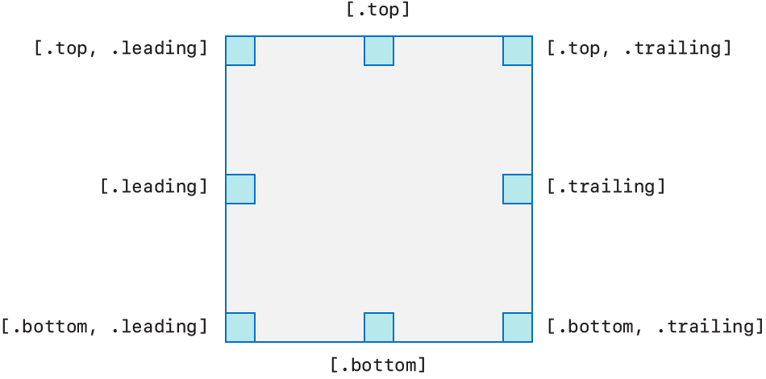

# NSCollectionLayoutAnchor

> **면접 답변 한 줄 요약:** `NSCollectionLayoutAnchor`는 badge 같은 보조 item을 컨테이너나 item의 어느 모서리에 어떤 offset으로 붙일지 정의해요.

Apple 공식 문서의 **Layouts — Appearance** 영역에 있는 클래스예요. 이 페이지는 공식 topic section 순서를 유지하면서 실제 코드에서 무엇을 선택해야 하는지 한국어로 설명해요.

## 먼저 알아둘 용어

| 용어    | 쉬운 뜻                                                        |
| ------- | -------------------------------------------------------------- |
| Item    | 셀 하나가 차지할 크기와 간격을 정의하는 레이아웃 단위예요.     |
| Group   | 여러 item을 가로·세로 또는 사용자 정의 방식으로 묶는 단위예요. |
| Section | group을 반복하고 헤더·배경·스크롤 동작을 설정하는 단위예요.    |

## 이 API가 맡는 역할

보조 item은 셀이나 section의 의미 있는 콘텐츠를, decoration item은 데이터와 무관한 section 배경을 표현해요.

NSCollectionLayoutAnchor는 badge 같은 보조 item을 컨테이너나 item의 어느 모서리에 어떤 offset으로 붙일지 정의해요.

<!-- Apple DocC image: media-3570665 -->



## 선언과 지원 범위를 확인해요

```swift
@MainActor class NSCollectionLayoutAnchor
```

**지원 플랫폼:** iOS 13.0+ · iPadOS 13.0+ · Mac Catalyst 13.1+ · tvOS 13.0+ · visionOS 1.0+

## 가장 작은 사용 예제

아래 예제에서는 이 API가 속한 역할이 전체 Collection View 구성에서 어디에 놓이는지 확인해요. 핵심 호출에 집중할 수 있도록 모델 선언과 주변 화면 구성은 생략했어요.

```swift
import UIKit

let badgeAnchor = NSCollectionLayoutAnchor(
  edges: [.top, .trailing],
  fractionalOffset: CGPoint(x: 0.5, y: -0.5)
)
let badge = NSCollectionLayoutSupplementaryItem(
  layoutSize: .init(
    widthDimension: .absolute(24),
    heightDimension: .absolute(24)
  ),
  elementKind: "badge",
  containerAnchor: badgeAnchor
)
```

## 공식 API 목차대로 살펴봐요

### anchor 만들기 (Creating an anchor)

`NSCollectionLayoutAnchor`를 만들거나 필요한 구성 요소를 연결하는 API예요.

| API                             | 하는 일                                                   |
| ------------------------------- | --------------------------------------------------------- |
| `init(edges:)`                  | 관련 값과 동작에 필요한 값을 받아 새 인스턴스를 만들어요. |
| `init(edges:absoluteOffset:)`   | 위치와 영역에 필요한 값을 받아 새 인스턴스를 만들어요.    |
| `init(edges:fractionalOffset:)` | 위치와 영역에 필요한 값을 받아 새 인스턴스를 만들어요.    |

### edges 확인하기 (Getting the edges)

현재 상태에서 필요한 값이나 위치를 안전하게 조회하는 API예요.

| API     | 하는 일                                                        |
| ------- | -------------------------------------------------------------- |
| `edges` | 관련 값과 동작의 현재 값이나 설정을 읽고 필요한 경우 변경해요. |

### offset 확인하기 (Getting the offset)

현재 상태에서 필요한 값이나 위치를 안전하게 조회하는 API예요.

| API                  | 하는 일                                                     |
| -------------------- | ----------------------------------------------------------- |
| `offset`             | 위치와 영역의 현재 값이나 설정을 읽고 필요한 경우 변경해요. |
| `isAbsoluteOffset`   | 위치와 영역의 활성화 여부나 현재 상태를 나타내요.           |
| `isFractionalOffset` | 위치와 영역의 활성화 여부나 현재 상태를 나타내요.           |

## 타입 관계를 확인해요

| 관계              | 타입                                                                                                                                       |
| ----------------- | ------------------------------------------------------------------------------------------------------------------------------------------ |
| 상속              | `NSObject`                                                                                                                                 |
| 준수하는 프로토콜 | `CVarArg`, `CustomDebugStringConvertible`, `CustomStringConvertible`, `Equatable`, `Hashable`, `NSCopying`, `NSObjectProtocol`, `Sendable` |

## 사용할 때 주의할 점

비율 크기는 바로 바깥 컨테이너를 기준으로 계산해요. 예상 크기를 사용한다면 셀이 Auto Layout으로 실제 높이를 계산할 수 있어야 하며, layout 객체와 데이터 상태의 책임을 섞지 않아요.

## 함께 읽으면 좋은 문서

- [Collection Views 한눈에 보기](./../index)
- [레이아웃 학습 가이드](../layout-guide)
- [공식 문서 인벤토리](./../official-document-inventory)

## 참고 자료

- [Apple Developer Documentation — NSCollectionLayoutAnchor](https://developer.apple.com/documentation/uikit/nscollectionlayoutanchor)
