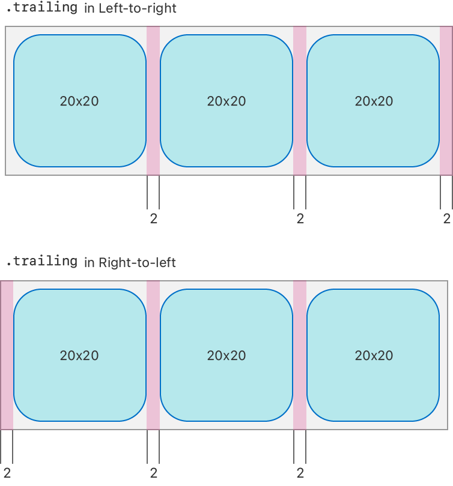

# NSCollectionLayoutEdgeSpacing

> **면접 답변 한 줄 요약:** `NSCollectionLayoutEdgeSpacing`은 레이아웃 요소의 leading·top·trailing·bottom 바깥 간격을 각각 지정해요.

Apple 공식 문서의 **Layouts — Size and spacing** 영역에 있는 클래스예요. 이 페이지는 공식 topic section 순서를 유지하면서 실제 코드에서 무엇을 선택해야 하는지 한국어로 설명해요.

## 먼저 알아둘 용어

| 용어    | 쉬운 뜻                                                        |
| ------- | -------------------------------------------------------------- |
| Item    | 셀 하나가 차지할 크기와 간격을 정의하는 레이아웃 단위예요.     |
| Group   | 여러 item을 가로·세로 또는 사용자 정의 방식으로 묶는 단위예요. |
| Section | group을 반복하고 헤더·배경·스크롤 동작을 설정하는 단위예요.    |

## 이 API가 맡는 역할

크기는 절대값·비율·예상값으로 표현하고, content inset은 요소 안쪽을 줄이며 edge spacing은 요소 바깥 간격을 예약해요.

NSCollectionLayoutEdgeSpacing은 레이아웃 요소의 leading·top·trailing·bottom 바깥 간격을 각각 지정해요.

## 개요 (Overview)

Edge spacing은 item의 가장자리 주위에 추가 간격을 만들어, 컨테이너와 다른 item에 대한 상대적인 위치를 조정할 때 사용해요.

`leading`과 `trailing` 간격이 놓이는 방향은 왼쪽에서 오른쪽으로 읽는 환경과 오른쪽에서 왼쪽으로 읽는 환경에서 달라요. LTR 환경에서는 leading이 왼쪽, trailing이 오른쪽이에요. RTL 환경에서는 leading이 오른쪽, trailing이 왼쪽이에요. 이 차이 덕분에 Collection View Layout이 오른쪽에서 왼쪽으로 읽는 언어에도 자연스럽게 대응해요.

다음 그림은 trailing edge spacing 2 point가 LTR과 RTL 환경에서 각각 어느 방향에 추가되는지 보여 줘요.

<!-- Apple DocC image: media-3570381 -->



## 선언과 지원 범위를 확인해요

```swift
@MainActor class NSCollectionLayoutEdgeSpacing
```

**지원 플랫폼:** iOS 13.0+ · iPadOS 13.0+ · Mac Catalyst 13.1+ · tvOS 13.0+ · visionOS 1.0+

## 가장 작은 사용 예제

아래 예제에서는 이 API가 속한 역할이 전체 Collection View 구성에서 어디에 놓이는지 확인해요. 핵심 호출에 집중할 수 있도록 모델 선언과 주변 화면 구성은 생략했어요.

```swift
import UIKit

let edgeSpacing = NSCollectionLayoutEdgeSpacing(
  leading: .fixed(8),
  top: .flexible(4),
  trailing: .fixed(8),
  bottom: .flexible(4)
)
item.edgeSpacing = edgeSpacing
```

## 공식 API 목차대로 살펴봐요

### edge spacing 만들기 (Creating edge spacing)

`NSCollectionLayoutEdgeSpacing`를 만들거나 필요한 구성 요소를 연결하는 API예요.

| API                                  | 하는 일                                        |
| ------------------------------------ | ---------------------------------------------- |
| `init(leading:top:trailing:bottom:)` | 네 directional edge의 spacing을 묶어 만들어요. |

### edge spacing 확인하기 (Getting the edge spacing)

현재 상태에서 필요한 값이나 위치를 안전하게 조회하는 API예요.

| API        | 하는 일                              |
| ---------- | ------------------------------------ |
| `leading`  | 읽기 방향 시작 edge의 spacing이에요. |
| `top`      | 위쪽 edge spacing이에요.             |
| `trailing` | 읽기 방향 끝 edge의 spacing이에요.   |
| `bottom`   | 아래쪽 edge spacing이에요.           |

### 초기화

`NSCollectionLayoutEdgeSpacing`를 만들거나 필요한 구성 요소를 연결하는 API예요.

| API                                     | 하는 일                                                      |
| --------------------------------------- | ------------------------------------------------------------ |
| `init(forLeading:top:trailing:bottom:)` | Objective-C에서 네 directional edge spacing을 묶어 만들어요. |

## 타입 관계를 확인해요

| 관계              | 타입                                                                                                                                       |
| ----------------- | ------------------------------------------------------------------------------------------------------------------------------------------ |
| 상속              | `NSObject`                                                                                                                                 |
| 준수하는 프로토콜 | `CVarArg`, `CustomDebugStringConvertible`, `CustomStringConvertible`, `Equatable`, `Hashable`, `NSCopying`, `NSObjectProtocol`, `Sendable` |

## 사용할 때 주의할 점

비율 크기는 바로 바깥 컨테이너를 기준으로 계산해요. 예상 크기를 사용한다면 셀이 Auto Layout으로 실제 높이를 계산할 수 있어야 하며, layout 객체와 데이터 상태의 책임을 섞지 않아요.

## 함께 읽으면 좋은 문서

- [Collection Views 한눈에 보기](./../index)
- [레이아웃 학습 가이드](../layout-guide)
- [공식 문서 인벤토리](./../official-document-inventory)

## 참고 자료

- [Apple Developer Documentation — NSCollectionLayoutEdgeSpacing](https://developer.apple.com/documentation/uikit/nscollectionlayoutedgespacing)
