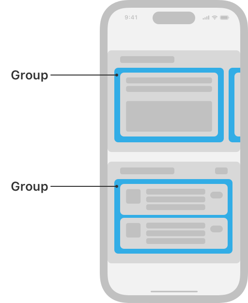
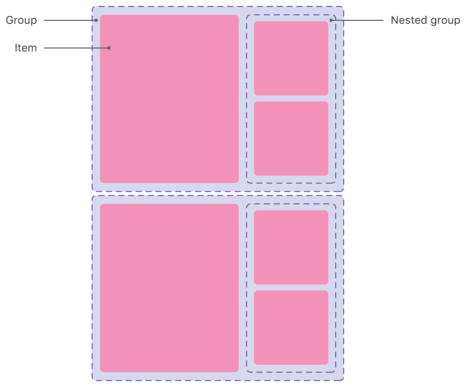

# NSCollectionLayoutGroup

> **면접 답변 한 줄 요약:** `NSCollectionLayoutGroup`은 하나 이상의 item을 가로·세로 또는 사용자 정의 위치로 배치하고 section에서 반복할 묶음을 만들어요.

Apple 공식 문서의 **Layouts — Components** 영역에 있는 클래스예요. 이 페이지는 공식 topic section 순서를 유지하면서 실제 코드에서 무엇을 선택해야 하는지 한국어로 설명해요.

## 먼저 알아둘 용어

| 용어    | 쉬운 뜻                                                        |
| ------- | -------------------------------------------------------------- |
| Item    | 셀 하나가 차지할 크기와 간격을 정의하는 레이아웃 단위예요.     |
| Group   | 여러 item을 가로·세로 또는 사용자 정의 방식으로 묶는 단위예요. |
| Section | group을 반복하고 헤더·배경·스크롤 동작을 설정하는 단위예요.    |

## 이 API가 맡는 역할

item은 셀 하나, group은 item 묶음, section은 group 반복 단위예요. 바깥 컨테이너의 크기가 안쪽 비율 계산 기준이 돼요.

## 개요 (Overview)

group은 Collection View의 item이 서로 어떤 관계로 배치되는지 결정해요. item을 가로 행, 세로 열 또는 사용자 정의 형태로 놓을 수 있어요. group은 item의 상대적인 배치 규칙만 정하며 자체 콘텐츠를 화면에 그리지는 않아요.

사진 앱에서는 사진 여러 장이 놓인 한 행이 group이 될 수 있어요. App Store에서는 여러 앱 셀을 세로로 배치한 한 열이 group이 될 수 있어요.

<!-- Apple DocC image: media-3568663 -->



각 group은 width dimension과 height dimension으로 자신의 크기를 정해요. dimension은 컨테이너에 대한 비율, 고정값, 또는 시스템 글자 크기 변경 등에 따라 실행 중 달라질 수 있는 예상값으로 표현할 수 있어요. 자세한 내용은 `NSCollectionLayoutDimension` 문서에서 확인할 수 있어요.

group은 `NSCollectionLayoutItem`의 하위 클래스이므로 item처럼 동작해요. 다른 item이나 group과 다시 조합해 더 복잡한 layout을 만들 수 있어요.

<!-- Apple DocC image: media-3568666 -->



group 구성이 끝나면 그 group을 사용해 Collection View Layout의 `NSCollectionLayoutSection`을 초기화해야 해요.

## 선언과 지원 범위를 확인해요

```swift
@MainActor class NSCollectionLayoutGroup
```

**지원 플랫폼:** iOS 13.0+ · iPadOS 13.0+ · Mac Catalyst 13.1+ · tvOS 13.0+ · visionOS 1.0+

## 가장 작은 사용 예제

아래 예제에서는 이 API가 속한 역할이 전체 Collection View 구성에서 어디에 놓이는지 확인해요. 핵심 호출에 집중할 수 있도록 모델 선언과 주변 화면 구성은 생략했어요.

```swift
import UIKit

let item = NSCollectionLayoutItem(
  layoutSize: .init(
    widthDimension: .fractionalWidth(1),
    heightDimension: .fractionalHeight(1)
  )
)
let group = NSCollectionLayoutGroup.horizontal(
  layoutSize: .init(
    widthDimension: .fractionalWidth(1),
    heightDimension: .absolute(180)
  ),
  repeatingSubitem: item,
  count: 2
)
let section = NSCollectionLayoutSection(group: group)
```

## 공식 API 목차대로 살펴봐요

### horizontal group 만들기 (Creating a horizontal group)

`NSCollectionLayoutGroup`를 만들거나 필요한 구성 요소를 연결하는 API예요.

| API                                              | 하는 일                                     |
| ------------------------------------------------ | ------------------------------------------- |
| `horizontal(layoutSize:subitems:)`               | subitem을 가로로 배치하는 group을 만들어요. |
| `horizontal(layoutSize:repeatingSubitem:count:)` | subitem을 가로로 배치하는 group을 만들어요. |

### vertical group 만들기 (Creating a vertical group)

`NSCollectionLayoutGroup`를 만들거나 필요한 구성 요소를 연결하는 API예요.

| API                                            | 하는 일                                     |
| ---------------------------------------------- | ------------------------------------------- |
| `vertical(layoutSize:subitems:)`               | subitem을 세로로 배치하는 group을 만들어요. |
| `vertical(layoutSize:repeatingSubitem:count:)` | subitem을 세로로 배치하는 group을 만들어요. |

### custom group 만들기 (Creating a custom group)

`NSCollectionLayoutGroup`를 만들거나 필요한 구성 요소를 연결하는 API예요.

| API                                | 하는 일                                |
| ---------------------------------- | -------------------------------------- |
| `custom(layoutSize:itemProvider:)` | 레이아웃을 만들어 반환하는 클로저예요. |

### group’s items 확인하기 (Getting the group’s items)

현재 상태에서 필요한 값이나 위치를 안전하게 조회하는 API예요.

| API                  | 하는 일                                              |
| -------------------- | ---------------------------------------------------- |
| `subitems`           | group에 직접 포함된 item 또는 하위 group 배열이에요. |
| `supplementaryItems` | item에 badge처럼 붙는 supplementary item 배열이에요. |

### group spacing 설정하기 (Configuring group spacing)

동작과 표시 방식을 요구사항에 맞게 설정하는 API예요.

| API                | 하는 일                               |
| ------------------ | ------------------------------------- |
| `interItemSpacing` | group 안의 형제 item 사이 간격이에요. |

### group layout 디버깅하기 (Debugging group layout)

`NSCollectionLayoutGroup`에서 Debugging group layout 책임을 담당하는 API예요.

| API                   | 하는 일                                                |
| --------------------- | ------------------------------------------------------ |
| `visualDescription()` | 현재 레이아웃 구조를 디버깅 가능한 문자열로 보여 줘요. |

### 더 이상 권장하지 않는 API

아래 API는 호환성을 위해 남아 있지만 새 코드에서는 대체 API를 선택해요.

| API                                             | 하는 일                                     |
| ----------------------------------------------- | ------------------------------------------- |
| `horizontal(layoutSize:subitem:count:)`         | subitem을 가로로 배치하는 group을 만들어요. |
| `horizontalGroup(with:repeatingSubitem:count:)` | subitem을 가로로 배치하는 group을 만들어요. |
| `vertical(layoutSize:subitem:count:)`           | subitem을 세로로 배치하는 group을 만들어요. |
| `verticalGroup(with:repeatingSubitem:count:)`   | subitem을 세로로 배치하는 group을 만들어요. |

## 타입 관계를 확인해요

| 관계              | 타입                                                                                                                                                           |
| ----------------- | -------------------------------------------------------------------------------------------------------------------------------------------------------------- |
| 상속              | `NSCollectionLayoutItem`                                                                                                                                       |
| 준수하는 프로토콜 | `CVarArg`, `CustomDebugStringConvertible`, `CustomStringConvertible`, `Equatable`, `Hashable`, `NSCopying`, `NSObjectProtocol`, `Sendable`, `SendableMetatype` |

## 사용할 때 주의할 점

비율 크기는 바로 바깥 컨테이너를 기준으로 계산해요. 예상 크기를 사용한다면 셀이 Auto Layout으로 실제 높이를 계산할 수 있어야 하며, layout 객체와 데이터 상태의 책임을 섞지 않아요.

## 함께 읽으면 좋은 문서

- [Collection Views 한눈에 보기](./../index)
- [레이아웃 학습 가이드](../layout-guide)
- [공식 문서 인벤토리](./../official-document-inventory)

## 참고 자료

- [Apple Developer Documentation — NSCollectionLayoutGroup](https://developer.apple.com/documentation/uikit/nscollectionlayoutgroup)
