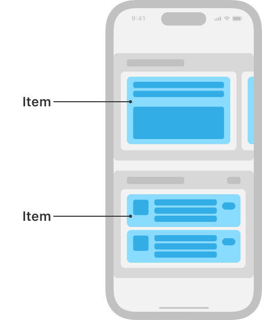

# NSCollectionLayoutItem

> **면접 답변 한 줄 요약:** `NSCollectionLayoutItem`은 Compositional Layout에서 셀 하나의 크기, content inset, edge spacing, 보조 item을 정의하는 최소 단위예요.

Apple 공식 문서의 **Layouts — Components** 영역에 있는 클래스예요. 이 페이지는 공식 topic section 순서를 유지하면서 실제 코드에서 무엇을 선택해야 하는지 한국어로 설명해요.

## 먼저 알아둘 용어

| 용어    | 쉬운 뜻                                                        |
| ------- | -------------------------------------------------------------- |
| Item    | 셀 하나가 차지할 크기와 간격을 정의하는 레이아웃 단위예요.     |
| Group   | 여러 item을 가로·세로 또는 사용자 정의 방식으로 묶는 단위예요. |
| Section | group을 반복하고 헤더·배경·스크롤 동작을 설정하는 단위예요.    |

## 이 API가 맡는 역할

item은 셀 하나, group은 item 묶음, section은 group 반복 단위예요. 바깥 컨테이너의 크기가 안쪽 비율 계산 기준이 돼요.

NSCollectionLayoutItem은 Compositional Layout에서 셀 하나의 크기, content inset, edge spacing, 보조 item을 정의하는 최소 단위예요.

<!-- Apple DocC image: media-3568665 -->



## 공식 설명에서 놓치면 안 되는 동작

item은 화면에 그려질 뷰 하나의 크기·간격·배치 청사진이에요. 보통 셀을 나타내지만 header·footer 같은 supplementary view 또는 다른 장식 요소를 나타낼 수도 있어요.

모든 item은 width와 height dimension으로 명시적인 `layoutSize`를 가져요. 각 dimension은 바깥 container에 대한 비율, 고정 point, 런타임에 측정할 estimated 값으로 표현할 수 있어요. item은 단독으로 section에 들어가지 않고 group에 포함되어 형제 item과의 상대 배치가 정해져요.

## 선언과 지원 범위를 확인해요

```swift
@MainActor class NSCollectionLayoutItem
```

**지원 플랫폼:** iOS 13.0+ · iPadOS 13.0+ · Mac Catalyst 13.1+ · tvOS 13.0+ · visionOS 1.0+

## 가장 작은 사용 예제

아래 예제에서는 이 API가 속한 역할이 전체 Collection View 구성에서 어디에 놓이는지 확인해요. 핵심 호출에 집중할 수 있도록 모델 선언과 주변 화면 구성은 생략했어요.

```swift
import UIKit

let item = NSCollectionLayoutItem(
  layoutSize: .init(
    widthDimension: .fractionalWidth(1),
    heightDimension: .fractionalHeight(1)
  )
)
let group = NSCollectionLayoutGroup.horizontal(
  layoutSize: .init(
    widthDimension: .fractionalWidth(1),
    heightDimension: .absolute(180)
  ),
  repeatingSubitem: item,
  count: 2
)
let section = NSCollectionLayoutSection(group: group)
```

## 공식 API 목차대로 살펴봐요

### item 만들기 (Creating an item)

`NSCollectionLayoutItem`를 만들거나 필요한 구성 요소를 연결하는 API예요.

| API                                    | 하는 일                                    |
| -------------------------------------- | ------------------------------------------ |
| `init(layoutSize:)`                    | 지정한 layout size로 구성 요소를 만들어요. |
| `init(layoutSize:supplementaryItems:)` | 지정한 layout size로 구성 요소를 만들어요. |

### an item’s size 확인하기 (Getting an item’s size)

현재 상태에서 필요한 값이나 위치를 안전하게 조회하는 API예요.

| API          | 하는 일                                          |
| ------------ | ------------------------------------------------ |
| `layoutSize` | width와 height dimension을 묶은 layout 크기예요. |

### supplementary items 확인하기 (Getting supplementary items)

현재 상태에서 필요한 값이나 위치를 안전하게 조회하는 API예요.

| API                  | 하는 일                                              |
| -------------------- | ---------------------------------------------------- |
| `supplementaryItems` | item에 badge처럼 붙는 supplementary item 배열이에요. |

### spacing and insets 설정하기 (Configuring spacing and insets)

동작과 표시 방식을 요구사항에 맞게 설정하는 API예요.

| API             | 하는 일                                   |
| --------------- | ----------------------------------------- |
| `edgeSpacing`   | item의 네 바깥 edge에 추가할 간격이에요.  |
| `contentInsets` | 요소 경계 안쪽의 directional inset이에요. |

## 타입 관계를 확인해요

| 관계              | 타입                                                                                                                                       |
| ----------------- | ------------------------------------------------------------------------------------------------------------------------------------------ |
| 상속              | `NSObject`                                                                                                                                 |
| 상속하는 타입     | `NSCollectionLayoutDecorationItem`, `NSCollectionLayoutGroup`, `NSCollectionLayoutSupplementaryItem`                                       |
| 준수하는 프로토콜 | `CVarArg`, `CustomDebugStringConvertible`, `CustomStringConvertible`, `Equatable`, `Hashable`, `NSCopying`, `NSObjectProtocol`, `Sendable` |

## 사용할 때 주의할 점

비율 크기는 바로 바깥 컨테이너를 기준으로 계산해요. 예상 크기를 사용한다면 셀이 Auto Layout으로 실제 높이를 계산할 수 있어야 하며, layout 객체와 데이터 상태의 책임을 섞지 않아요.

## 함께 읽으면 좋은 문서

- [Collection Views 한눈에 보기](./../index)
- [레이아웃 학습 가이드](../layout-guide)
- [공식 문서 인벤토리](./../official-document-inventory)

## 참고 자료

- [Apple Developer Documentation — NSCollectionLayoutItem](https://developer.apple.com/documentation/uikit/nscollectionlayoutitem)
