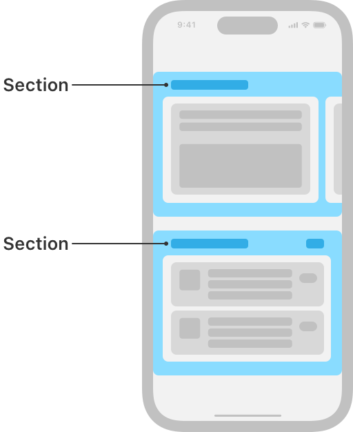

# NSCollectionLayoutSection

> **면접 답변 한 줄 요약:** `NSCollectionLayoutSection`은 group을 반복하는 한 section의 간격, inset, 헤더·푸터, 배경, 직교 스크롤 동작을 정의해요.

Apple 공식 문서의 **Layouts — Components** 영역에 있는 클래스예요. 이 페이지는 공식 topic section 순서를 유지하면서 실제 코드에서 무엇을 선택해야 하는지 한국어로 설명해요.

## 먼저 알아둘 용어

| 용어    | 쉬운 뜻                                                        |
| ------- | -------------------------------------------------------------- |
| Item    | 셀 하나가 차지할 크기와 간격을 정의하는 레이아웃 단위예요.     |
| Group   | 여러 item을 가로·세로 또는 사용자 정의 방식으로 묶는 단위예요. |
| Section | group을 반복하고 헤더·배경·스크롤 동작을 설정하는 단위예요.    |

## 이 API가 맡는 역할

item은 셀 하나, group은 item 묶음, section은 group 반복 단위예요. 바깥 컨테이너의 크기가 안쪽 비율 계산 기준이 돼요.

NSCollectionLayoutSection은 group을 반복하는 한 section의 간격, inset, 헤더·푸터, 배경, 직교 스크롤 동작을 정의해요.

<!-- Apple DocC image: media-3568661 -->



## 선언과 지원 범위를 확인해요

```swift
@MainActor class NSCollectionLayoutSection
```

**지원 플랫폼:** iOS 13.0+ · iPadOS 13.0+ · Mac Catalyst 13.1+ · tvOS 13.0+ · visionOS 1.0+

## 가장 작은 사용 예제

아래 예제에서는 이 API가 속한 역할이 전체 Collection View 구성에서 어디에 놓이는지 확인해요. 핵심 호출에 집중할 수 있도록 모델 선언과 주변 화면 구성은 생략했어요.

```swift
import UIKit

let item = NSCollectionLayoutItem(
  layoutSize: .init(
    widthDimension: .fractionalWidth(1),
    heightDimension: .fractionalHeight(1)
  )
)
let group = NSCollectionLayoutGroup.horizontal(
  layoutSize: .init(
    widthDimension: .fractionalWidth(1),
    heightDimension: .absolute(180)
  ),
  repeatingSubitem: item,
  count: 2
)
let section = NSCollectionLayoutSection(group: group)
```

## 공식 API 목차대로 살펴봐요

### section 만들기 (Creating a section)

`NSCollectionLayoutSection`를 만들거나 필요한 구성 요소를 연결하는 API예요.

| API                                      | 하는 일                                                  |
| ---------------------------------------- | -------------------------------------------------------- |
| `init(group:)`                           | section에 필요한 값을 받아 새 인스턴스를 만들어요.       |
| `list(using:layoutEnvironment:)`         | 레이아웃의 현재 값이나 설정을 읽고 필요한 경우 변경해요. |
| `orthogonalLayoutSectionForMediaItems()` | 레이아웃의 현재 값이나 설정을 읽고 필요한 경우 변경해요. |

### scrolling behavior 지정하기 (Specifying scrolling behavior)

동작과 표시 방식을 요구사항에 맞게 설정하는 API예요.

| API                                                      | 하는 일                                                        |
| -------------------------------------------------------- | -------------------------------------------------------------- |
| `orthogonalScrollingBehavior`                            | 관련 값과 동작의 현재 값이나 설정을 읽고 필요한 경우 변경해요. |
| `orthogonalScrollingProperties`                          | 관련 값과 동작의 현재 값이나 설정을 읽고 필요한 경우 변경해요. |
| `UICollectionLayoutSectionOrthogonalScrollingProperties` | 레이아웃의 현재 값이나 설정을 읽고 필요한 경우 변경해요.       |

### section spacing 설정하기 (Configuring section spacing)

동작과 표시 방식을 요구사항에 맞게 설정하는 API예요.

| API                                   | 하는 일                                                 |
| ------------------------------------- | ------------------------------------------------------- |
| `interGroupSpacing`                   | 간격의 현재 값이나 설정을 읽고 필요한 경우 변경해요.    |
| `contentInsets`                       | inset의 현재 값이나 설정을 읽고 필요한 경우 변경해요.   |
| `contentInsetsReference`              | inset의 현재 값이나 설정을 읽고 필요한 경우 변경해요.   |
| `supplementaryContentInsetsReference` | 보조 뷰의 현재 값이나 설정을 읽고 필요한 경우 변경해요. |
| `UIContentInsetsReference`            | inset의 현재 값이나 설정을 읽고 필요한 경우 변경해요.   |

### additional views 설정하기 (Configuring additional views)

동작과 표시 방식을 요구사항에 맞게 설정하는 API예요.

| API                          | 하는 일                                                 |
| ---------------------------- | ------------------------------------------------------- |
| `boundarySupplementaryItems` | 보조 뷰의 현재 값이나 설정을 읽고 필요한 경우 변경해요. |
| `decorationItems`            | 장식 뷰의 현재 값이나 설정을 읽고 필요한 경우 변경해요. |

### items 표시하기 (Rendering items)

`NSCollectionLayoutSection`에서 Rendering items 책임을 담당하는 API예요.

| API                               | 하는 일                                 |
| --------------------------------- | --------------------------------------- |
| `visibleItemsInvalidationHandler` | item 변화에 실행할 클로저나 처리기예요. |

### 더 이상 권장하지 않는 API

아래 API는 호환성을 위해 남아 있지만 새 코드에서는 대체 API를 선택해요.

| API                                  | 하는 일                                               |
| ------------------------------------ | ----------------------------------------------------- |
| `supplementariesFollowContentInsets` | inset의 현재 값이나 설정을 읽고 필요한 경우 변경해요. |

## 타입 관계를 확인해요

| 관계              | 타입                                                                                                                                       |
| ----------------- | ------------------------------------------------------------------------------------------------------------------------------------------ |
| 상속              | `NSObject`                                                                                                                                 |
| 준수하는 프로토콜 | `CVarArg`, `CustomDebugStringConvertible`, `CustomStringConvertible`, `Equatable`, `Hashable`, `NSCopying`, `NSObjectProtocol`, `Sendable` |

## 사용할 때 주의할 점

비율 크기는 바로 바깥 컨테이너를 기준으로 계산해요. 예상 크기를 사용한다면 셀이 Auto Layout으로 실제 높이를 계산할 수 있어야 하며, layout 객체와 데이터 상태의 책임을 섞지 않아요.

## 함께 읽으면 좋은 문서

- [Collection Views 한눈에 보기](./../index)
- [레이아웃 학습 가이드](../layout-guide)
- [공식 문서 인벤토리](./../official-document-inventory)

## 참고 자료

- [Apple Developer Documentation — NSCollectionLayoutSection](https://developer.apple.com/documentation/uikit/nscollectionlayoutsection)
