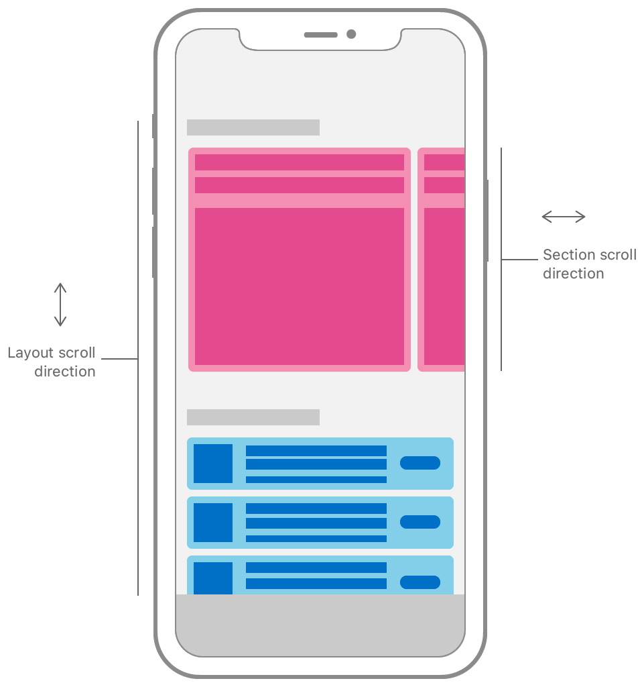

# UICollectionLayoutSectionOrthogonalScrollingBehavior

> **면접 답변 한 줄 요약:** `UICollectionLayoutSectionOrthogonalScrollingBehavior`는 section이 전체 스크롤 축과 직각 방향으로 움직일 때 연속·페이징·그룹 맞춤 방식을 정해요.

Apple 공식 문서의 **Layouts — Interaction** 영역에 있는 열거형예요. 이 페이지는 공식 topic section 순서를 유지하면서 실제 코드에서 무엇을 선택해야 하는지 한국어로 설명해요.

## 먼저 알아둘 용어

| 용어    | 쉬운 뜻                                                        |
| ------- | -------------------------------------------------------------- |
| Item    | 셀 하나가 차지할 크기와 간격을 정의하는 레이아웃 단위예요.     |
| Group   | 여러 item을 가로·세로 또는 사용자 정의 방식으로 묶는 단위예요. |
| Section | group을 반복하고 헤더·배경·스크롤 동작을 설정하는 단위예요.    |

## 이 API가 맡는 역할

직교 스크롤은 전체 세로 스크롤 안에서 특정 section만 가로로 움직이게 하고, 연속 이동과 여러 페이징 정렬 방식을 선택하게 해요.

UICollectionLayoutSectionOrthogonalScrollingBehavior는 section이 전체 스크롤 축과 직각 방향으로 움직일 때 연속·페이징·그룹 맞춤 방식을 정해요.

<!-- Apple DocC image: media-3570451 -->



## 선언과 지원 범위를 확인해요

```swift
enum UICollectionLayoutSectionOrthogonalScrollingBehavior
```

**지원 플랫폼:** iOS 13.0+ · iPadOS 13.0+ · Mac Catalyst 13.1+ · tvOS 13.0+ · visionOS 1.0+

## 가장 작은 사용 예제

아래 예제에서는 이 API가 속한 역할이 전체 Collection View 구성에서 어디에 놓이는지 확인해요. 핵심 호출에 집중할 수 있도록 모델 선언과 주변 화면 구성은 생략했어요.

```swift
import UIKit

let behavior: UICollectionLayoutSectionOrthogonalScrollingBehavior =
  .groupPagingCentered
section.orthogonalScrollingBehavior = behavior
```

## 공식 API 목차대로 살펴봐요

### 사용 가능한 값

`UICollectionLayoutSectionOrthogonalScrollingBehavior`에서 Constants 책임을 담당하는 API예요.

| API                                                                                   | 하는 일                                            |
| ------------------------------------------------------------------------------------- | -------------------------------------------------- |
| `UICollectionLayoutSectionOrthogonalScrollingBehavior.none`                           | 직교 스크롤을 사용하지 않아요.                     |
| `UICollectionLayoutSectionOrthogonalScrollingBehavior.continuous`                     | section을 연속으로 스크롤해요.                     |
| `UICollectionLayoutSectionOrthogonalScrollingBehavior.continuousGroupLeadingBoundary` | 연속 스크롤 뒤 group의 leading 경계에 맞춰 멈춰요. |
| `UICollectionLayoutSectionOrthogonalScrollingBehavior.paging`                         | 보이는 화면 폭을 기준으로 페이지를 넘겨요.         |
| `UICollectionLayoutSectionOrthogonalScrollingBehavior.groupPaging`                    | group 단위로 페이지를 넘겨요.                      |
| `UICollectionLayoutSectionOrthogonalScrollingBehavior.groupPagingCentered`            | group 단위로 넘기고 가운데에 맞춰요.               |

### 초기화

`UICollectionLayoutSectionOrthogonalScrollingBehavior`를 만들거나 필요한 구성 요소를 연결하는 API예요.

| API               | 하는 일                                           |
| ----------------- | ------------------------------------------------- |
| `init(rawValue:)` | raw value에 해당하는 직교 스크롤 동작을 만들어요. |

## 타입 관계를 확인해요

| 관계              | 타입                                                                                           |
| ----------------- | ---------------------------------------------------------------------------------------------- |
| 준수하는 프로토콜 | `BitwiseCopyable`, `Equatable`, `Hashable`, `RawRepresentable`, `Sendable`, `SendableMetatype` |

## 사용할 때 주의할 점

비율 크기는 바로 바깥 컨테이너를 기준으로 계산해요. 예상 크기를 사용한다면 셀이 Auto Layout으로 실제 높이를 계산할 수 있어야 하며, layout 객체와 데이터 상태의 책임을 섞지 않아요.

## 함께 읽으면 좋은 문서

- [Collection Views 한눈에 보기](./../index)
- [레이아웃 학습 가이드](../layout-guide)
- [공식 문서 인벤토리](./../official-document-inventory)

## 참고 자료

- [Apple Developer Documentation — UICollectionLayoutSectionOrthogonalScrollingBehavior](https://developer.apple.com/documentation/uikit/uicollectionlayoutsectionorthogonalscrollingbehavior)
