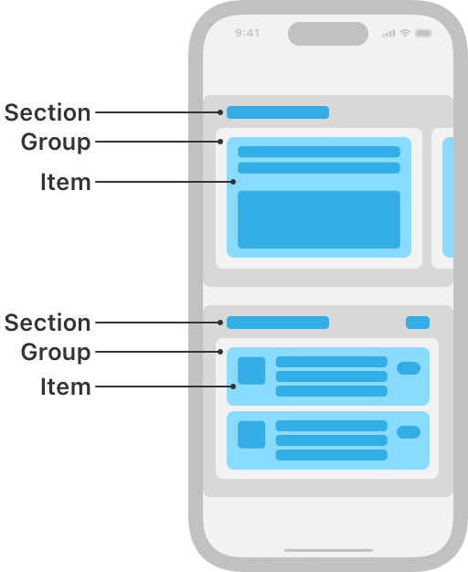

# UICollectionViewCompositionalLayout

> **면접 답변 한 줄 요약:** `UICollectionViewCompositionalLayout`은 item·group·section 계층을 조합해 서로 다른 목록, 격자, 가로 스크롤 영역을 한 화면에 배치해요.

Apple 공식 문서의 **Layouts — Essentials** 영역에 있는 클래스예요. 이 페이지는 공식 topic section 순서를 유지하면서 실제 코드에서 무엇을 선택해야 하는지 한국어로 설명해요.

## 먼저 알아둘 용어

| 용어    | 쉬운 뜻                                                        |
| ------- | -------------------------------------------------------------- |
| Item    | 셀 하나가 차지할 크기와 간격을 정의하는 레이아웃 단위예요.     |
| Group   | 여러 item을 가로·세로 또는 사용자 정의 방식으로 묶는 단위예요. |
| Section | group을 반복하고 헤더·배경·스크롤 동작을 설정하는 단위예요.    |

## 이 API가 맡는 역할

Compositional Layout은 item, group, section을 조립해 서로 다른 배치를 선언해요.

UICollectionViewCompositionalLayout은 item·group·section 계층을 조합해 서로 다른 목록, 격자, 가로 스크롤 영역을 한 화면에 배치해요.

<!-- Apple DocC image: media-3568664 -->



## 공식 설명에서 놓치면 안 되는 동작

Compositional Layout은 각 구성 요소의 역할을 분리해요.

- item은 셀 하나의 크기와 내부 여백을 정의해요.
- group은 item 또는 다른 group을 가로·세로·사용자 정의 방식으로 묶어요.
- section은 group 반복, content inset, header/footer, decoration, 직교 스크롤을 설정해요.
- configuration은 전체 scroll direction, section 간격, 전체 header/footer를 설정해요.

모든 section이 같으면 `init(section:)`을, section별 또는 환경별 배치가 다르면 section provider initializer를 사용해요. provider는 회전, Dynamic Type, iPad 멀티태스킹처럼 환경이 달라질 때 다시 호출될 수 있으므로 `NSCollectionLayoutEnvironment`의 실제 컨테이너 크기와 trait을 기준으로 결과를 만들어요.

List UI는 `UICollectionLayoutListConfiguration`을 `list(using:)`에 전달해 만들 수 있어요. 목록, grid, 가로 carousel을 한 화면에 섞을 때도 하나의 section provider에서 section별 구성을 반환하면 돼요.

## 선언과 지원 범위를 확인해요

```swift
@MainActor class UICollectionViewCompositionalLayout
```

**지원 플랫폼:** iOS 13.0+ · iPadOS 13.0+ · Mac Catalyst 13.1+ · tvOS 13.0+ · visionOS 1.0+

## 가장 작은 사용 예제

아래 예제에서는 이 API가 속한 역할이 전체 Collection View 구성에서 어디에 놓이는지 확인해요. 핵심 호출에 집중할 수 있도록 모델 선언과 주변 화면 구성은 생략했어요.

```swift
import UIKit

let layout = UICollectionViewCompositionalLayout { _, environment in
  let columns = environment.container.effectiveContentSize.width > 600 ? 4 : 2
  return makeGridSection(columnCount: columns)
}
```

## 공식 API 목차대로 살펴봐요

### layout 만들기 (Creating a layout)

`UICollectionViewCompositionalLayout`를 만들거나 필요한 구성 요소를 연결하는 API예요.

| API                                    | 하는 일                                                  |
| -------------------------------------- | -------------------------------------------------------- |
| `init(section:)`                       | 지정한 section 구성으로 Compositional Layout을 만들어요. |
| `init(section:configuration:)`         | 지정한 section 구성으로 Compositional Layout을 만들어요. |
| `init(sectionProvider:)`               | section provider로 Compositional Layout을 만들어요.      |
| `init(sectionProvider:configuration:)` | section provider로 Compositional Layout을 만들어요.      |

### list layout 만들기 (Creating a list layout)

`UICollectionViewCompositionalLayout`를 만들거나 필요한 구성 요소를 연결하는 API예요.

| API                                   | 하는 일                                                                |
| ------------------------------------- | ---------------------------------------------------------------------- |
| `list(using:)`                        | list configuration으로 list layout 또는 section을 만들어요.            |
| `UICollectionLayoutListConfiguration` | List section의 appearance·header·separator·swipe action 설정을 담아요. |

### layout 설정하기 (Configuring the layout)

동작과 표시 방식을 요구사항에 맞게 설정하는 API예요.

| API             | 하는 일                                 |
| --------------- | --------------------------------------- |
| `configuration` | 현재 layout의 전역 configuration이에요. |

## 타입 관계를 확인해요

| 관계              | 타입                                                                                                                                                          |
| ----------------- | ------------------------------------------------------------------------------------------------------------------------------------------------------------- |
| 상속              | `UICollectionViewLayout`                                                                                                                                      |
| 준수하는 프로토콜 | `CVarArg`, `CustomDebugStringConvertible`, `CustomStringConvertible`, `Equatable`, `Hashable`, `NSCoding`, `NSObjectProtocol`, `Sendable`, `SendableMetatype` |

## 사용할 때 주의할 점

비율 크기는 바로 바깥 컨테이너를 기준으로 계산해요. 예상 크기를 사용한다면 셀이 Auto Layout으로 실제 높이를 계산할 수 있어야 하며, layout 객체와 데이터 상태의 책임을 섞지 않아요.

## 함께 읽으면 좋은 문서

- [Collection Views 한눈에 보기](./../index)
- [레이아웃 학습 가이드](../layout-guide)
- [공식 문서 인벤토리](./../official-document-inventory)

## 참고 자료

- [Apple Developer Documentation — UICollectionViewCompositionalLayout](https://developer.apple.com/documentation/uikit/uicollectionviewcompositionallayout)
