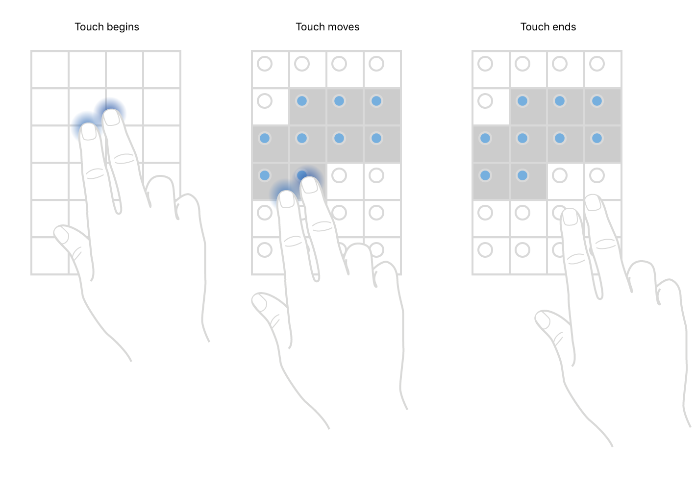

# 두 손가락 제스처로 여러 item 선택하기

> **면접 답변 한 줄 요약:** iOS 13 이상의 두 손가락 다중 선택은 delegate가 제스처 시작을 허용하고 편집 모드로 전환해 여러 item을 빠르게 선택·해제하게 해요.

## 먼저 알아둘 용어

| 용어             | 쉬운 뜻                                                      |
| ---------------- | ------------------------------------------------------------ |
| 다중 선택        | 한 화면에서 여러 row나 item을 동시에 선택하는 동작이에요.    |
| 편집 모드        | 선택 표시와 삭제·이동 같은 편집 동작을 제공하는 뷰 상태예요. |
| Constrained axis | 세로 스크롤 화면의 가로 방향처럼 스크롤하지 않는 축이에요.   |

## 개요

iOS 13 이상에서는 사용자가 두 손가락을 Table View나 Collection View의 여러 항목 위로 끌어 빠르게 선택할 수 있어요. 버튼을 먼저 누르지 않아도 제스처를 인식한 순간 앱이 편집 모드로 바꿀 수 있어요.

선택할 item이 서로 붙어 있을 필요는 없어요. 일부를 선택하고 스크롤한 뒤 다시 두 손가락으로 더 선택할 수 있고, 이미 선택된 item 위로 같은 제스처를 수행하면 선택을 해제할 수도 있어요. 공식 샘플은 iPad에서 Table View와 Collection View를 나란히, iPhone에서는 tab으로 전환해 두 구현을 모두 보여 줘요.

<!-- Apple DocC image: two-finger_multi-select_collection_2x -->



## Table View에서 여러 Row를 선택해요

공식 문서에 포함된 Table View 예제도 생략하지 않고 함께 살펴봐요. 먼저 delegate에서 제스처 시작을 허용해요.

```swift
override func tableView(
  _ tableView: UITableView,
  shouldBeginMultipleSelectionInteractionAt indexPath: IndexPath
) -> Bool {
  true
}
```

`true`를 반환하면 Table View가 시작 callback을 호출해요. 공식 샘플은 이때 편집 버튼을 완료 버튼으로 바꾸고 편집 모드에 들어가요.

```swift
override func tableView(
  _ tableView: UITableView,
  didBeginMultipleSelectionInteractionAt indexPath: IndexPath
) {
  setEditing(true, animated: true)
}
```

두 손가락을 떼면 종료 callback이 와요. 여기서 바로 편집 모드를 끝내지 않으면 사용자는 두 손가락 제스처나 선택 표시 영역의 한 손가락 drag로 item을 더 고를 수 있어요.

```swift
override func tableViewDidEndMultipleSelectionInteraction(
  _ tableView: UITableView
) {
  synchronizeSelectedRowIDs()
}
```

## Collection View에서 여러 Item을 선택해요

Collection View도 같은 세 단계로 구현해요.

```swift
func collectionView(
  _ collectionView: UICollectionView,
  shouldBeginMultipleSelectionInteractionAt indexPath: IndexPath
) -> Bool {
  !isSelectionLocked
}

func collectionView(
  _ collectionView: UICollectionView,
  didBeginMultipleSelectionInteractionAt indexPath: IndexPath
) {
  setEditing(true, animated: true)
}

func collectionViewDidEndMultipleSelectionInteraction(
  _ collectionView: UICollectionView
) {
  synchronizeSelectedPhotoIDs()
}
```

공식 샘플처럼 시작 허용 메서드에서 `true`를 반환하면 Collection View의 `isEditing`도 자동으로 `true`가 돼요. 앱은 완료 버튼을 눌렀을 때 다시 `false`로 바꿀 수 있어요.

세로 스크롤 Collection View라면 스크롤하지 않는 가로 축을 한 손가락으로 움직여 추가 item을 선택할 수도 있어요.

### 다중 선택 결과를 식별자로 보존해요

`indexPathsForSelectedItems`는 현재 위치이므로 snapshot 갱신 뒤 달라질 수 있어요. 삭제나 공유에 사용할 때는 곧바로 item 식별자로 바꿔 저장하세요.

```swift
private func synchronizeSelectedPhotoIDs() {
  selectedPhotoIDs = Set(
    (collectionView.indexPathsForSelectedItems ?? []).compactMap {
      dataSource.itemIdentifier(for: $0)
    }
  )
}
```

## 참고 자료

- [Apple Developer Documentation — Selecting multiple items with a two-finger pan gesture](https://developer.apple.com/documentation/uikit/selecting-multiple-items-with-a-two-finger-pan-gesture)
- [선택 관리 학습 가이드](./selection)
