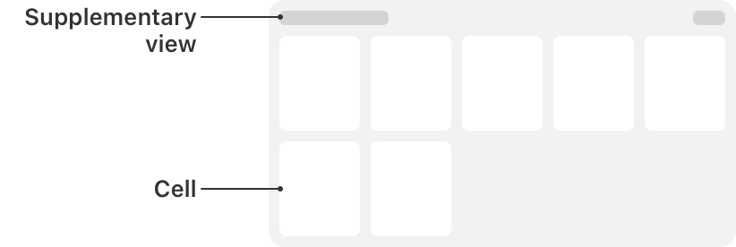

# UICollectionView

> **면접 답변 한 줄 요약:** `UICollectionView`는 section과 item으로 구성된 데이터를 재사용 가능한 셀에 표시하고, 별도의 레이아웃 객체로 위치를 계산하는 스크롤 뷰예요.

`UICollectionView`는 순서가 있는 데이터 item을 관리하고, 사용자 정의 가능한 layout으로 화면에 표시하는 객체예요.

원문: [Apple Developer Documentation — UICollectionView](https://developer.apple.com/documentation/uikit/uicollectionview)

## 선언과 지원 범위를 확인해요

```swift
@MainActor class UICollectionView
```

**지원 플랫폼:** iOS 6.0+ · iPadOS 6.0+ · Mac Catalyst 13.1+ · tvOS · visionOS 1.0+

## 개요 (Overview)

사용자 인터페이스에 Collection View를 추가하면 앱이 맡아야 할 가장 중요한 일은 그 Collection View에 연결할 데이터를 관리하는 것이에요. Collection View는 `dataSource` 프로퍼티에 저장된 data source 객체에서 데이터를 가져와요. 일반적으로 `UICollectionViewDiffableDataSource`를 사용하면 데이터와 화면 업데이트를 간단하고 효율적으로 관리할 수 있어요. 필요하다면 `UICollectionViewDataSource` 프로토콜을 채택한 사용자 정의 data source를 구현할 수도 있어요.

Collection View의 데이터는 개별 item으로 구성되며, 표시 목적에 따라 여러 section으로 묶을 수 있어요. item은 화면에 보여 줄 데이터의 가장 작은 단위예요. 사진 앱이라면 사진 한 장이 item 하나에 해당해요. Collection View는 data source가 구성해 제공한 `UICollectionViewCell` 인스턴스로 각 item을 화면에 표시해요.

<!-- Apple DocC image: uicollectionview-1 -->



셀 외에도 Collection View는 다른 종류의 뷰로 정보를 표시할 수 있어요. supplementary view는 개별 셀과 분리되어 있으면서도 section에 관한 정보를 전달하는 header나 footer 등에 사용해요. supplementary view 지원 여부와 배치 위치는 Collection View의 layout 객체가 정의해요.

화면에 `UICollectionView`를 배치한 뒤에는 Collection View의 메서드를 사용해 item의 화면상 순서가 data source의 데이터 순서와 일치하도록 유지해야 해요. `UICollectionViewDiffableDataSource`는 이 과정을 자동으로 관리해요. 사용자 정의 data source를 사용한다면 데이터가 추가·삭제·재배치될 때 대응하는 셀에도 같은 삽입·삭제·재배치 작업을 알려야 해요.

선택된 item의 상태도 Collection View가 관리해요. 다만 선택 허용 여부와 선택 전후의 동작은 연결된 `delegate` 객체와 협력해 처리해요.

### 레이아웃 (Layouts)

layout 객체는 Collection View 콘텐츠의 시각적인 배치를 정의해요. `UICollectionViewLayout`의 하위 클래스인 layout 객체는 Collection View 안에 있는 모든 셀과 supplementary view의 구성과 위치를 계산해요. 하지만 layout 객체가 해당 위치를 실제 뷰에 직접 적용하지는 않아요. 셀과 supplementary view를 만드는 과정에는 Collection View와 data source의 협력이 필요하므로, layout이 제공한 정보를 실제 뷰에 적용하는 일은 Collection View가 맡아요. data source가 item 데이터를 제공한다면 layout 객체는 시각적 정보를 제공하는 또 하나의 data source와 비슷한 역할을 해요.

일반적으로 Collection View를 만들 때 layout 객체를 지정하지만, 실행 중에 다른 layout으로 바꿀 수도 있어요. 현재 layout은 `collectionViewLayout` 프로퍼티에 저장돼요. 이 프로퍼티에 새 객체를 직접 대입하면 애니메이션 없이 즉시 layout이 바뀌어요. 변경 과정을 애니메이션으로 보여 주려면 `setCollectionViewLayout(_:animated:completion:)`을 호출해요.

제스처 인식기나 터치 이벤트가 진행률을 제어하는 대화형 전환을 만들려면 `startInteractiveTransition(to:completion:)`으로 layout 변경을 시작해요. 이 메서드는 전환 진행률을 추적할 중간 layout 객체를 설치해요. 이벤트 처리가 끝났다고 판단하면 `finishInteractiveTransition()` 또는 `cancelInteractiveTransition()`을 호출해 중간 layout을 제거하고 목표 layout이나 이전 layout을 적용해요.

layout 종류와 동작 방식은 [Layouts](./layouts/index) 문서에서 더 자세히 설명해요.

### 셀과 보조 뷰 (Cells and supplementary views)

Collection View의 data source는 item의 내용과 그 내용을 표시할 뷰를 함께 제공해요. Collection View가 처음 콘텐츠를 불러올 때는 현재 화면에 보이는 각 item의 뷰를 data source에 요청해요. Collection View는 data source가 재사용 가능하다고 표시한 뷰 객체를 queue나 목록으로 관리해요. 따라서 코드에서 매번 새 뷰를 직접 만드는 대신 재사용 queue에서 뷰를 꺼내야 해요.

요청받은 뷰의 종류에 따라 다음 두 메서드 중 하나를 사용해요.

- Collection View의 item을 표시할 셀은 `dequeueReusableCell(withReuseIdentifier:for:)`로 가져와요.
- layout 객체가 요청한 supplementary view는 `dequeueReusableSupplementaryView(ofKind:withReuseIdentifier:for:)`로 가져와요.

두 메서드 중 하나를 호출하기 전에, 재사용할 뷰가 없을 때 Collection View가 새 뷰를 어떻게 만들어야 하는지 등록해야 해요. 셀을 등록할 때는 class를 받는 `register(_:forCellWithReuseIdentifier:)` 또는 nib을 받는 같은 이름의 메서드를 사용해요. 등록 과정에서 뷰의 용도를 구분하는 reuse identifier를 지정하고, 나중에 dequeue할 때도 같은 문자열을 사용해요.

data source 메서드에서 적절한 뷰를 dequeue한 다음 콘텐츠를 구성하고 Collection View에 반환해요. Collection View는 layout 객체에서 받은 배치 정보를 그 뷰에 적용한 뒤 화면에 표시해요.

### 데이터 프리패칭 (Data prefetching)

Collection View는 화면 반응성을 높이기 위한 두 가지 prefetching 방식을 제공해요.

- **셀 prefetching**은 셀이 실제로 필요해지기 전에 미리 셀을 준비해요. Grid layout에서 새로운 한 줄의 셀이 한꺼번에 필요해지는 경우처럼 동시에 많은 셀을 요청해야 할 때, 표시 시점보다 앞서 셀을 준비해 렌더링 작업을 여러 layout pass에 분산해요. 그 결과 스크롤이 더 부드러워져요. 셀 prefetching은 기본적으로 활성화돼요.
- **데이터 prefetching**은 Collection View가 셀을 요청하기 전에 어떤 item의 데이터가 필요할지 알려 주는 방식이에요. 네트워크 요청처럼 비용이 큰 로딩 결과를 셀 콘텐츠로 사용할 때 유용해요. `UICollectionViewDataSourcePrefetching`을 채택한 객체를 `prefetchDataSource`에 지정하면 데이터를 미리 준비하고 취소해야 할 시점을 전달받을 수 있어요.

### 항목을 대화형으로 재정렬하기 (Reorder items interactively)

Collection View는 사용자 상호작용에 따라 item의 위치를 옮길 수 있어요. 기본적으로 item 순서는 data source가 정해요. 사용자 재정렬을 허용하려면 제스처 인식기로 특정 item에 대한 상호작용을 추적하고 그 item의 위치를 갱신하도록 구성해요.

item의 대화형 이동을 시작할 때는 `beginInteractiveMovementForItem(at:)`을 호출해요. 제스처 인식기가 터치 이벤트를 추적하는 동안 `updateInteractiveMovementTargetPosition(_:)`으로 현재 터치 위치를 계속 전달해요. 제스처 추적이 끝나면 `endInteractiveMovement()` 또는 `cancelInteractiveMovement()`을 호출해 상호작용을 종료하고 Collection View를 갱신해요.

상호작용 중에는 Collection View가 현재 item 위치를 반영하도록 layout을 동적으로 무효화해요. 별도로 처리하지 않아도 기본 layout 동작이 주변 item의 위치를 조정하지만, 필요하면 layout 애니메이션을 사용자 정의할 수 있어요. 상호작용이 끝나면 Collection View는 item의 새 위치를 data source 객체에 알려요.

`UICollectionViewController`는 자신이 관리하는 Collection View에서 item을 재배치할 수 있는 기본 제스처 인식기를 제공해요. 이 제스처를 설치하려면 Collection View Controller의 `installsStandardGestureForInteractiveMovement`를 `true`로 설정해요.

### Interface Builder 속성 (Interface Builder attributes)

Interface Builder에서는 Collection View에 다음 속성을 설정할 수 있어요.

| 속성     | 설명                                                                                                                                                                                                                                          |
| -------- | --------------------------------------------------------------------------------------------------------------------------------------------------------------------------------------------------------------------------------------------- |
| `Items`  | storyboard에서 구성할 prototype cell의 개수예요. Collection View에는 최소 한 개의 셀이 필요하고, 서로 다른 콘텐츠를 표시하거나 같은 콘텐츠를 다른 방식으로 보여 주기 위해 여러 prototype cell을 둘 수 있어요.                                 |
| `Layout` | 사용할 layout 객체를 선택해요. `UICollectionViewFlowLayout`과 사용자 정의 layout 중 하나를 선택할 수 있어요. Flow Layout에서는 스크롤 방향과 header·footer 사용 여부를 함께 설정하고, 사용자 정의 layout에서는 사용할 하위 클래스를 지정해요. |

Flow Layout을 선택하면 Size inspector에 layout metric을 조정하는 속성이 추가돼요. 여기에서 셀·header·footer의 크기, 셀 사이의 최소 간격, 각 section 주위의 여백을 설정할 수 있어요. 각 값의 의미는 `UICollectionViewFlowLayout` 문서에서 확인할 수 있어요.

### 국제화 (Internationalization)

Collection View 자체에는 직접 국제화할 콘텐츠가 없어요. 대신 Collection View가 표시하는 셀과 재사용 뷰의 문자열 및 표현을 국제화해야 해요. 자세한 원칙은 [Apple Localization](https://developer.apple.com/localization/)에서 확인할 수 있어요.

### 손쉬운 사용 (Accessibility)

Collection View 자체에도 별도로 접근성 정보를 붙일 콘텐츠는 없어요. 셀과 재사용 뷰 안에 `UILabel`, `UITextField` 같은 표준 UIKit control이 있다면 각 control이 VoiceOver 등 보조 기술에 올바른 정보를 제공하도록 구성해요. Collection View의 화면 layout이 바뀌면 UIKit은 `UIAccessibility.Notification.layoutChanged` 알림을 게시해요.

UIKit 화면의 일반적인 접근성 구성 방법은 Apple의 Accessibility for UIKit 문서를 참고하세요.

## 공식 API 목차대로 살펴봐요

### collection view 만들기 (Creating a collection view)

`UICollectionView`를 만들거나 필요한 구성 요소를 연결하는 API예요.

| API                                 | 하는 일                                                         |
| ----------------------------------- | --------------------------------------------------------------- |
| `init(frame:collectionViewLayout:)` | 지정한 layout을 사용하는 Collection View나 컨트롤러를 만들어요. |
| `init(coder:)`                      | NSCoder에 저장된 구성으로 인스턴스를 복원해요.                  |

### Collection View 데이터 제공하기 (Providing the collection view data)

표시할 section과 item, 셀을 제공할 데이터 소스를 연결해요. 기존 프로토콜 방식과 snapshot 기반 Diffable Data Source 중 화면 갱신 방식에 맞는 구현을 선택해요.

| API                                                    | 하는 일                                                                       |
| ------------------------------------------------------ | ----------------------------------------------------------------------------- |
| `dataSource`                                           | section·item 개수와 셀을 제공할 데이터 소스 객체예요.                         |
| `UICollectionViewDiffableDataSource`                   | 식별자 snapshot의 차이를 계산해 화면을 갱신하는 데이터 소스 구현체예요.       |
| `UICollectionViewDataSource`                           | section·item 개수와 셀 제공 규칙을 정의하는 기본 데이터 소스 프로토콜이에요.  |
| `Building high-performance lists and collection views` | prefetch와 이미지 준비로 목록 성능을 개선하는 Apple 샘플에 대응하는 문서예요. |

### 셀과 데이터를 미리 준비하기 (Prefetching collection view cells and data)

곧 화면에 나타날 가능성이 있는 item을 미리 알려 비동기 로딩을 시작하고, 필요 없어지면 취소할 수 있게 해요.

| API                                     | 하는 일                                                   |
| --------------------------------------- | --------------------------------------------------------- |
| `isPrefetchingEnabled`                  | Collection View가 셀·데이터 prefetch를 요청할지 결정해요. |
| `prefetchDataSource`                    | prefetch 시작과 취소 요청을 받을 객체예요.                |
| `UICollectionViewDataSourcePrefetching` | 데이터 준비와 취소 콜백을 정의하는 프로토콜이에요.        |

### collection view interactions 관리하기 (Managing collection view interactions)

동작과 표시 방식을 요구사항에 맞게 설정하는 API예요.

| API                        | 하는 일                                                    |
| -------------------------- | ---------------------------------------------------------- |
| `delegate`                 | Collection View 관련 판단과 이벤트 처리를 위임할 객체예요. |
| `UICollectionViewDelegate` | Collection View 관련 판단과 이벤트 처리를 위임할 객체예요. |

### cells 만들기 (Creating cells)

`UICollectionView`를 만들거나 필요한 구성 요소를 연결하는 API예요.

| API                                              | 하는 일                                                   |
| ------------------------------------------------ | --------------------------------------------------------- |
| `UICollectionView.CellRegistration`              | 셀 타입과 현재 item을 셀에 반영하는 구성 클로저를 묶어요. |
| `dequeueConfiguredReusableCell(using:for:item:)` | 등록·재사용 풀에서 item을 꺼내 구성해요.                  |
| `register(_:forCellWithReuseIdentifier:)`        | 재사용할 셀 클래스 또는 nib을 식별자와 연결해 등록해요.   |
| `register(_:forCellWithReuseIdentifier:)`        | 재사용할 셀 클래스 또는 nib을 식별자와 연결해 등록해요.   |
| `dequeueReusableCell(withReuseIdentifier:for:)`  | 지정한 IndexPath에서 사용할 재사용 셀을 반환해요.         |

### headers and footers 만들기 (Creating headers and footers)

`UICollectionView`를 만들거나 필요한 구성 요소를 연결하는 API예요.

| API                                                                 | 하는 일                                                    |
| ------------------------------------------------------------------- | ---------------------------------------------------------- |
| `UICollectionView.SupplementaryRegistration`                        | 보조 뷰 타입과 element kind, 구성 클로저를 묶어요.         |
| `dequeueConfiguredReusableSupplementary(using:for:)`                | registration으로 헤더·푸터 같은 보조 뷰를 구성해 반환해요. |
| `register(_:forSupplementaryViewOfKind:withReuseIdentifier:)`       | 재사용할 보조 뷰 타입이나 nib을 등록해요.                  |
| `register(_:forSupplementaryViewOfKind:withReuseIdentifier:)`       | 재사용할 보조 뷰 타입이나 nib을 등록해요.                  |
| `dequeueReusableSupplementaryView(ofKind:withReuseIdentifier:for:)` | 등록된 element kind와 식별자에 맞는 보조 뷰를 반환해요.    |

### background view 설정하기 (Configuring the background view)

동작과 표시 방식을 요구사항에 맞게 설정하는 API예요.

| API              | 하는 일                                                    |
| ---------------- | ---------------------------------------------------------- |
| `backgroundView` | item이 차지하지 않는 Collection View 배경에 표시할 뷰예요. |

### 레이아웃 변경하기 (Changing the layout)

현재 레이아웃을 조회하거나 다른 레이아웃으로 즉시·애니메이션·대화형 전환해요.

| API                                                      | 하는 일                                                       |
| -------------------------------------------------------- | ------------------------------------------------------------- |
| `collectionViewLayout`                                   | 현재 셀과 보조 뷰를 배치하는 레이아웃 객체예요.               |
| `setCollectionViewLayout(_:animated:)`                   | 레이아웃에 새 설정이나 상태를 적용해요.                       |
| `setCollectionViewLayout(_:animated:completion:)`        | 새 레이아웃을 적용하고 전환이 끝나면 completion을 호출해요.   |
| `startInteractiveTransition(to:completion:)`             | 제스처 진행률로 제어할 대화형 레이아웃 전환을 시작해요.       |
| `finishInteractiveTransition()`                          | 레이아웃을 완료해 최종 상태를 적용해요.                       |
| `cancelInteractiveTransition()`                          | 진행 중인 레이아웃을 취소하고 이전 상태로 돌아가요.           |
| `UICollectionView.LayoutInteractiveTransitionCompletion` | 대화형 전환이 끝난 뒤 결과와 완료 여부를 전달하는 클로저예요. |

### state of the collection view 확인하기 (Getting the state of the collection view)

현재 상태에서 필요한 값이나 위치를 안전하게 조회하는 API예요.

| API                         | 하는 일                                         |
| --------------------------- | ----------------------------------------------- |
| `numberOfSections`          | 현재 Collection View의 section 개수를 반환해요. |
| `numberOfItems(inSection:)` | 지정한 section의 item 개수를 반환해요.          |
| `visibleCells`              | 현재 화면에 보이는 셀 목록을 반환해요.          |

### Items 삽입·이동·삭제하기 (Inserting, moving, and deleting Items)

데이터 또는 화면 상태를 변경할 때 사용하는 API예요. 모델과 표시 상태의 순서를 함께 확인해요.

| API                | 하는 일                                    |
| ------------------ | ------------------------------------------ |
| `insertItems(at:)` | item을 지정한 위치의 앞이나 뒤에 삽입해요. |
| `moveItem(at:to:)` | 지정한 item의 순서를 옮겨요.               |
| `deleteItems(at:)` | 지정한 item을 제거해요.                    |

### sections 삽입·이동·삭제하기 (Inserting, moving, and deleting sections)

데이터 또는 화면 상태를 변경할 때 사용하는 API예요. 모델과 표시 상태의 순서를 함께 확인해요.

| API                         | 하는 일                                       |
| --------------------------- | --------------------------------------------- |
| `insertSections(_:)`        | section을 지정한 위치의 앞이나 뒤에 삽입해요. |
| `moveSection(_:toSection:)` | 지정한 section의 순서를 옮겨요.               |
| `deleteSections(_:)`        | 지정한 section을 제거해요.                    |

### items interactively 순서 바꾸기 (Reordering items interactively)

데이터 또는 화면 상태를 변경할 때 사용하는 API예요. 모델과 표시 상태의 순서를 함께 확인해요.

| API                                           | 하는 일                                             |
| --------------------------------------------- | --------------------------------------------------- |
| `beginInteractiveMovementForItem(at:)`        | 지정한 item의 대화형 이동을 시작해요.               |
| `updateInteractiveMovementTargetPosition(_:)` | 이동 중인 item이 따라갈 화면 좌표를 갱신해요.       |
| `endInteractiveMovement()`                    | 대화형 이동을 현재 목적 위치에서 완료해요.          |
| `cancelInteractiveMovement()`                 | 대화형 이동을 취소하고 item을 원래 위치로 되돌려요. |

### drag interactions 관리하기 (Managing drag interactions)

동작과 표시 방식을 요구사항에 맞게 설정하는 API예요.

| API                            | 하는 일                                                           |
| ------------------------------ | ----------------------------------------------------------------- |
| `dragDelegate`                 | 드래그 관련 판단과 이벤트 처리를 위임할 객체예요.                 |
| `UICollectionViewDragDelegate` | 드래그 관련 판단과 이벤트 처리를 위임할 객체예요.                 |
| `hasActiveDrag`                | Collection View 안에서 drag session이 진행 중인지 나타내요.       |
| `dragInteractionEnabled`       | iPhone에서 Collection View의 드래그 상호작용을 활성화할지 정해요. |

### drop interactions 관리하기 (Managing drop interactions)

동작과 표시 방식을 요구사항에 맞게 설정하는 API예요.

| API                                  | 하는 일                                                              |
| ------------------------------------ | -------------------------------------------------------------------- |
| `dropDelegate`                       | 드롭 관련 판단과 이벤트 처리를 위임할 객체예요.                      |
| `UICollectionViewDropDelegate`       | 드롭 관련 판단과 이벤트 처리를 위임할 객체예요.                      |
| `hasActiveDrop`                      | Collection View 안에서 drop session이 진행 중인지 나타내요.          |
| `reorderingCadence`                  | 드래그 item이 지나갈 때 기존 item을 얼마나 빠르게 재배치할지 정해요. |
| `UICollectionView.ReorderingCadence` | 즉시·빠르게·느리게 중 재배치 반응 속도를 나타내는 열거형이에요.      |

### 셀 선택하기 (Selecting cells)

선택 가능 여부를 설정하고 코드로 item을 선택·해제하거나 현재 선택 목록을 조회해요.

| API                                       | 하는 일                                                  |
| ----------------------------------------- | -------------------------------------------------------- |
| `indexPathsForSelectedItems`              | 현재 선택된 모든 item의 IndexPath를 반환해요.            |
| `selectItem(at:animated:scrollPosition:)` | 지정한 item을 선택하고 필요하면 해당 위치로 스크롤해요.  |
| `deselectItem(at:animated:)`              | 지정한 item의 선택을 해제해요.                           |
| `allowsSelection`                         | 사용자가 item 하나를 선택할 수 있는지 정해요.            |
| `allowsMultipleSelection`                 | 여러 item을 동시에 선택할 수 있는지 정해요.              |
| `allowsSelectionDuringEditing`            | 편집 모드에서 item 선택을 허용할지 정해요.               |
| `allowsMultipleSelectionDuringEditing`    | 편집 모드에서 여러 item 선택을 허용할지 정해요.          |
| `selectionFollowsFocus`                   | 포커스가 이동할 때 해당 item도 자동으로 선택할지 정해요. |

### 편집 모드 설정하기 (Putting the collection view into edit mode)

Collection View가 삭제·재배치 같은 편집 동작을 수행하는 상태인지 나타내요.

| API         | 하는 일                                                        |
| ----------- | -------------------------------------------------------------- |
| `isEditing` | Collection View가 현재 편집 모드인지 나타내고 상태를 변경해요. |

### items and views in the collection view 찾기 (Locating items and views in the collection view)

현재 상태에서 필요한 값이나 위치를 안전하게 조회하는 API예요.

| API                                                  | 하는 일                                                       |
| ---------------------------------------------------- | ------------------------------------------------------------- |
| `indexPathForItem(at:)`                              | Collection View 좌표에 있는 item의 IndexPath를 반환해요.      |
| `indexPathsForVisibleItems`                          | 현재 화면에 보이는 item의 IndexPath 목록을 반환해요.          |
| `indexPath(for:)`                                    | 지정한 셀이 현재 표현하는 item의 IndexPath를 반환해요.        |
| `cellForItem(at:)`                                   | 지정한 IndexPath의 셀이 현재 생성되어 있으면 반환해요.        |
| `indexPathsForVisibleSupplementaryElements(ofKind:)` | 현재 보이는 특정 element kind 보조 뷰의 IndexPath를 반환해요. |
| `supplementaryView(forElementKind:at:)`              | 특정 kind와 IndexPath의 보조 뷰가 생성되어 있으면 반환해요.   |
| `visibleSupplementaryViews(ofKind:)`                 | 현재 보이는 특정 element kind의 보조 뷰 목록을 반환해요.      |

### layout information 확인하기 (Getting layout information)

현재 상태에서 필요한 값이나 위치를 안전하게 조회하는 API예요.

| API                                                   | 하는 일                                         |
| ----------------------------------------------------- | ----------------------------------------------- |
| `layoutAttributesForItem(at:)`                        | 지정한 item의 현재 레이아웃 속성을 반환해요.    |
| `layoutAttributesForSupplementaryElement(ofKind:at:)` | 지정한 보조 뷰의 현재 레이아웃 속성을 반환해요. |

### item이 보이도록 스크롤하기 (Scrolling an item into view)

지정한 item을 화면의 위·가운데·아래 또는 leading·trailing에 맞춰 보이게 스크롤해요.

| API                                | 하는 일                                                  |
| ---------------------------------- | -------------------------------------------------------- |
| `scrollToItem(at:at:animated:)`    | 지정한 item이 요청한 위치에 오도록 스크롤해요.           |
| `UICollectionView.ScrollPosition`  | 스크롤 뒤 item을 맞출 가로·세로 위치 옵션이에요.         |
| `UICollectionView.ScrollDirection` | Collection View의 가로 또는 세로 스크롤 방향을 나타내요. |

### multiple changes to the collection view 애니메이션 처리하기 (Animating multiple changes to the collection view)

`UICollectionView`에서 Animating multiple changes to the collection view 책임을 담당하는 API예요.

| API                                  | 하는 일                                                    |
| ------------------------------------ | ---------------------------------------------------------- |
| `performBatchUpdates(_:completion:)` | 여러 삽입·삭제·이동을 하나의 애니메이션 묶음으로 실행해요. |

### content 다시 불러오기 (Reloading content)

데이터 또는 화면 상태를 변경할 때 사용하는 API예요. 모델과 표시 상태의 순서를 함께 확인해요.

| API                     | 하는 일                                                 |
| ----------------------- | ------------------------------------------------------- |
| `hasUncommittedUpdates` | 아직 화면 반영이 끝나지 않은 update가 있는지 나타내요.  |
| `reconfigureItems(at:)` | item의 정체성을 유지하면서 표시 구성을 다시 실행해요.   |
| `reloadData()`          | 데이터 소스 전체를 다시 읽고 모든 표시 내용을 갱신해요. |
| `reloadSections(_:)`    | section을 다시 불러오도록 표시해요.                     |
| `reloadItems(at:)`      | item을 다시 불러오도록 표시해요.                        |

### collection view elements 식별하기 (Identifying collection view elements)

현재 상태에서 필요한 값이나 위치를 안전하게 조회하는 API예요.

| API                                | 하는 일                                                  |
| ---------------------------------- | -------------------------------------------------------- |
| `UICollectionView.ElementCategory` | 요소가 셀·보조 뷰·장식 뷰 중 무엇인지 구분하는 값이에요. |
| `elementKindSectionFooter`         | 표준 section footer의 element kind 문자열이에요.         |
| `elementKindSectionHeader`         | 표준 section header의 element kind 문자열이에요.         |

### focus 다루기 (Working with focus)

`UICollectionView`에서 Working with focus 책임을 담당하는 API예요.

| API                             | 하는 일                                                   |
| ------------------------------- | --------------------------------------------------------- |
| `allowsFocus`                   | 키보드·리모컨 focus가 item으로 이동할 수 있는지 정해요.   |
| `allowsFocusDuringEditing`      | 편집 모드에서도 item focus 이동을 허용할지 정해요.        |
| `selectionFollowsFocus`         | 포커스를 받은 item을 자동으로 선택할지 정해요.            |
| `remembersLastFocusedIndexPath` | 다시 진입할 때 마지막 포커스 IndexPath를 복원할지 정해요. |

### context menus 관리하기 (Managing context menus)

동작과 표시 방식을 요구사항에 맞게 설정하는 API예요.

| API                      | 하는 일                                                     |
| ------------------------ | ----------------------------------------------------------- |
| `contextMenuInteraction` | Collection View가 관리하는 컨텍스트 메뉴 상호작용 객체예요. |

### Resizing self-sizing cells

`UICollectionView`에서 Resizing self-sizing cells 책임을 담당하는 API예요.

| API                                       | 하는 일                                                          |
| ----------------------------------------- | ---------------------------------------------------------------- |
| `selfSizingInvalidation`                  | self-sizing 셀의 실제 크기가 달라질 때 무효화하는 방식을 정해요. |
| `UICollectionView.SelfSizingInvalidation` | self-sizing 변화에 사용할 무효화 정책을 나타내요.                |

### 인스턴스 프로퍼티

`UICollectionView`에서 Instance Properties 책임을 담당하는 API예요.

| API                    | 하는 일                                                                     |
| ---------------------- | --------------------------------------------------------------------------- |
| `appIntentsDataSource` | App Intents가 Collection View의 item을 조회하도록 제공하는 데이터 소스예요. |

### 인스턴스 메서드

`UICollectionView`에서 Instance Methods 책임을 담당하는 API예요.

| API                                | 하는 일                                     |
| ---------------------------------- | ------------------------------------------- |
| `indexPath(forSupplementaryView:)` | 지정한 보조 뷰의 현재 IndexPath를 반환해요. |

## Swift-KR 보충: 가장 작은 사용 예제

공식 개요에서 설명한 역할을 실제 코드에 연결해 볼게요. `UICollectionView`를 만들 때는 반드시 layout 객체를 함께 전달해야 해요. 데이터와 셀 구성은 이후 data source가 담당해요.

```swift
import UIKit

@MainActor
final class PhotoGridViewController: UIViewController {
  private let collectionView = UICollectionView(
    frame: .zero,
    collectionViewLayout: UICollectionViewFlowLayout()
  )

  override func viewDidLoad() {
    super.viewDidLoad()

    collectionView.frame = view.bounds
    collectionView.autoresizingMask = [.flexibleWidth, .flexibleHeight]
    view.addSubview(collectionView)
  }
}
```

이 예제에서는 화면에 Collection View를 배치하는 부분만 보여 줘요. 실제 앱에서는 `dataSource` 또는 `UICollectionViewDiffableDataSource`를 연결하고, 셀 class·nib이나 `CellRegistration`을 등록해야 item이 표시돼요.

## 타입 관계를 확인해요

| 관계              | 타입                                                                                                                                                                                                                                                                                                                                                                                                                                                                                                                                                                                                                                                                                                                                                                                                                           |
| ----------------- | ------------------------------------------------------------------------------------------------------------------------------------------------------------------------------------------------------------------------------------------------------------------------------------------------------------------------------------------------------------------------------------------------------------------------------------------------------------------------------------------------------------------------------------------------------------------------------------------------------------------------------------------------------------------------------------------------------------------------------------------------------------------------------------------------------------------------------ |
| 상속              | `UIScrollView`                                                                                                                                                                                                                                                                                                                                                                                                                                                                                                                                                                                                                                                                                                                                                                                                                 |
| 준수하는 프로토콜 | `CALayerDelegate`, `CLBodyIdentifiable`, `CMBodyIdentifiable`, `CVarArg`, `Copyable`, `CustomDebugStringConvertible`, `CustomStringConvertible`, `Equatable`, `Escapable`, `Hashable`, `NSCoding`, `NSObjectProtocol`, `NSTouchBarProvider`, `Sendable`, `SendableMetatype`, `UIAccessibilityIdentification`, `UIActivityItemsConfigurationProviding`, `UIAppearance`, `UIAppearanceContainer`, `UICoordinateSpace`, `UIDataSourceTranslating`, `UIDynamicItem`, `UIFocusEnvironment`, `UIFocusItem`, `UIFocusItemContainer`, `UIFocusItemScrollableContainer`, `UILargeContentViewerItem`, `UIPasteConfigurationSupporting`, `UIPopoverPresentationControllerSourceItem`, `UIResponderStandardEditActions`, `UISpringLoadedInteractionSupporting`, `UITraitChangeObservable`, `UITraitEnvironment`, `UIUserActivityRestoring` |

## 사용할 때 주의할 점

Collection View를 만들 때 layout은 필수예요. 데이터 원본을 바꾼 뒤 화면 갱신 API를 호출하지 않거나, `IndexPath`를 데이터의 영구 식별자로 저장하면 삽입·삭제 뒤 잘못된 item을 가리킬 수 있어요.

## 함께 읽으면 좋은 문서

- [Collection Views 한눈에 보기](./index)
- [View 학습 가이드](./views)
- [공식 문서 인벤토리](./official-document-inventory)

## 참고 자료

- [Apple Developer Documentation — UICollectionView](https://developer.apple.com/documentation/uikit/uicollectionview)
