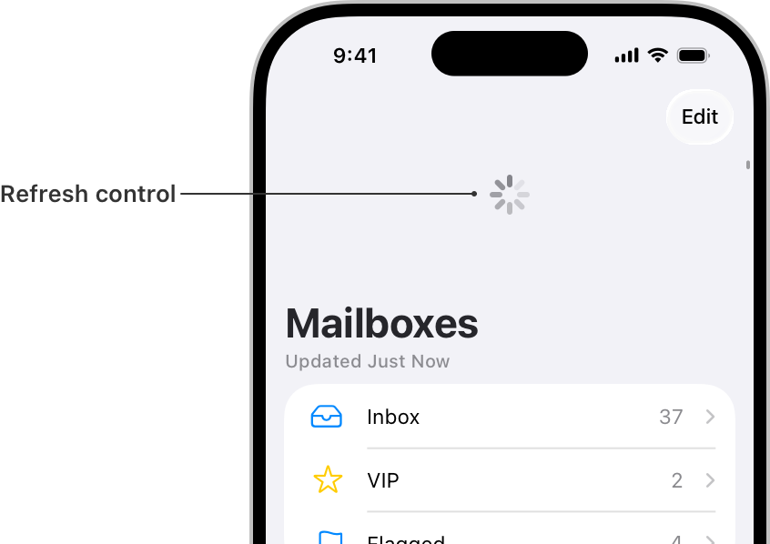

# UIRefreshControl

> **면접 답변 한 줄 요약:** `UIRefreshControl`은 사용자가 스크롤 뷰를 아래로 당기는 동작으로 데이터 새로고침을 요청할 수 있게 하는 표준 컨트롤이에요.

Apple 공식 문서의 **Collection Views — Data** 영역에 있는 클래스예요. 이 페이지는 공식 topic section 순서를 유지하면서 실제 코드에서 무엇을 선택해야 하는지 한국어로 설명해요.

## 먼저 알아둘 용어

| 용어     | 쉬운 뜻                                                        |
| -------- | -------------------------------------------------------------- |
| 식별자   | item이 이동해도 같은 데이터임을 구분하는 `Hashable` 값이에요.  |
| Snapshot | 특정 시점의 section과 item 순서를 표현한 값이에요.             |
| Prefetch | 화면에 나타나기 전에 필요한 데이터를 미리 준비하는 작업이에요. |

## 이 API가 맡는 역할

데이터 계층은 “무엇을 어떤 순서로 보여 줄지”를 책임져요. 현대적인 코드에서는 모델을 먼저 변경하고 식별자로 snapshot을 만든 다음 diffable data source에 적용하는 흐름을 기본으로 삼아요.

UIRefreshControl은 사용자가 스크롤 뷰를 아래로 당기는 동작으로 데이터 새로고침을 요청할 수 있게 하는 표준 컨트롤이에요.

<!-- Apple DocC image: ui-refresh-control -->



## 공식 설명에서 놓치면 안 되는 동작

`UIRefreshControl`은 `UIScrollView` 계열에 붙이는 표준 control이므로 Table View와 Collection View 모두에서 사용할 수 있어요. 사용자가 콘텐츠 맨 위를 아래로 당기면 control이 나타나고 `.valueChanged` target-action을 보내요.

```swift
let refreshControl = UIRefreshControl()
refreshControl.addTarget(
  self,
  action: #selector(refreshContent),
  for: .valueChanged
)
collectionView.refreshControl = refreshControl

@objc
private func refreshContent() {
  Task { @MainActor in
    defer { refreshControl.endRefreshing() }
    await reloadPhotos()
    applyCurrentSnapshot()
  }
}
```

새 데이터 적용이 끝난 뒤 `endRefreshing()`을 호출해야 진행 표시가 사라져요. 실패·취소 경로에서도 반드시 종료되도록 `defer`를 사용하면 안전해요.

## 선언과 지원 범위를 확인해요

```swift
@MainActor class UIRefreshControl
```

**지원 플랫폼:** iOS 6.0+ · iPadOS 6.0+ · Mac Catalyst 13.1+ · visionOS 1.0+

## 가장 작은 사용 예제

아래 예제에서는 이 API가 속한 역할이 전체 Collection View 구성에서 어디에 놓이는지 확인해요. 핵심 호출에 집중할 수 있도록 모델 선언과 주변 화면 구성은 생략했어요.

```swift
import UIKit

let refreshControl = UIRefreshControl()
refreshControl.attributedTitle = NSAttributedString(string: "새로고침")
refreshControl.addTarget(
  self,
  action: #selector(reloadPhotos),
  for: .valueChanged
)
collectionView.refreshControl = refreshControl

@objc private func reloadPhotos() {
  Task {
    await loadPhotos()
    refreshControl.endRefreshing()
  }
}
```

## 공식 API 목차대로 살펴봐요

### Initializing a refresh control

`UIRefreshControl`를 만들거나 필요한 구성 요소를 연결하는 API예요.

| API      | 하는 일                                               |
| -------- | ----------------------------------------------------- |
| `init()` | 기본 진행 표시를 사용하는 Refresh Control을 만들어요. |

### control attributes 접근하기 (Accessing the control attributes)

현재 상태에서 필요한 값이나 위치를 안전하게 조회하는 API예요.

| API               | 하는 일                                           |
| ----------------- | ------------------------------------------------- |
| `tintColor`       | Refresh Control 진행 표시의 tint 색상이에요.      |
| `attributedTitle` | Refresh Control에 표시할 서식 있는 안내 문구예요. |

### refresh status 관리하기 (Managing the refresh status)

동작과 표시 방식을 요구사항에 맞게 설정하는 API예요.

| API                 | 하는 일                                                 |
| ------------------- | ------------------------------------------------------- |
| `beginRefreshing()` | 새로고침을 시작해요.                                    |
| `endRefreshing()`   | 새로고침을 종료해요.                                    |
| `isRefreshing`      | Refresh Control이 현재 새로고침 진행 상태인지 나타내요. |

## 타입 관계를 확인해요

| 관계              | 타입                                                                                                                                                                                                                                                                                                                                                                                                                                                                                                                                                                                                                                                                                                                                  |
| ----------------- | ------------------------------------------------------------------------------------------------------------------------------------------------------------------------------------------------------------------------------------------------------------------------------------------------------------------------------------------------------------------------------------------------------------------------------------------------------------------------------------------------------------------------------------------------------------------------------------------------------------------------------------------------------------------------------------------------------------------------------------- |
| 상속              | `UIControl`                                                                                                                                                                                                                                                                                                                                                                                                                                                                                                                                                                                                                                                                                                                           |
| 준수하는 프로토콜 | `CALayerDelegate`, `CLBodyIdentifiable`, `CMBodyIdentifiable`, `CVarArg`, `CustomDebugStringConvertible`, `CustomStringConvertible`, `Equatable`, `Hashable`, `NSCoding`, `NSObjectProtocol`, `NSTouchBarProvider`, `Sendable`, `SendableMetatype`, `UIAccessibilityIdentification`, `UIActivityItemsConfigurationProviding`, `UIAppearance`, `UIAppearanceContainer`, `UIContextMenuInteractionDelegate`, `UICoordinateSpace`, `UIDynamicItem`, `UIFocusEnvironment`, `UIFocusItem`, `UIFocusItemContainer`, `UILargeContentViewerItem`, `UIPasteConfigurationSupporting`, `UIPopoverPresentationControllerSourceItem`, `UIResponderStandardEditActions`, `UITraitChangeObservable`, `UITraitEnvironment`, `UIUserActivityRestoring` |

## 사용할 때 주의할 점

식별자의 `Hashable` 값은 item의 내용이 바뀌어도 안정적이어야 해요. 같은 식별자를 snapshot에 두 번 넣지 말고, UI 갱신과 모델 갱신의 순서를 섞지 않으며, prefetch 작업은 취소할 수 있게 관리해요.

## 함께 읽으면 좋은 문서

- [Collection Views 한눈에 보기](./index)
- [Data 학습 가이드](./data)
- [공식 문서 인벤토리](./official-document-inventory)

## 참고 자료

- [Apple Developer Documentation — UIRefreshControl](https://developer.apple.com/documentation/uikit/uirefreshcontrol)
